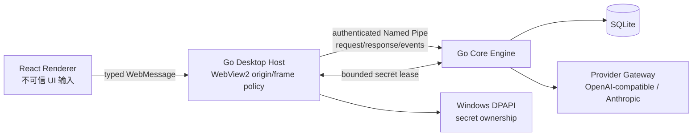

# Lunitide（月汐）完整开发工作交接报告

> 交接日期：2026-08-10  
> 面向对象：后续开发负责人、代码审查者、发布负责人及新的 AI/开发平台  
> 仓库路径：`E:\Trae-Work-Projects\lunitide`  
> 当前分支：`main`  
> 当前 HEAD：`0bd6a14`（`harden-P2-session-slice`）  
> 当前原生版本：`0.3.0`（以 `VERSION` 为准）  
> 报告性质：事实快照与续作 Runbook，不代表正式发布完成

---

## 0. 接手者必须先读的结论

1. **不要执行 `git reset --hard`、`git clean`、切换分支或用新 clone 覆盖当前目录。** 当前 Message append/list 纵向切片尚未提交，代码、迁移、契约、UI、测试和长上下文 ADR 都在工作树中。
2. 当前正式生产架构只能是：

   ```text
   React/TypeScript Renderer
   → frame-aware Windows WebView2 Host（Go）
   → authenticated Windows Named Pipe
   → Go Core Engine
   → SQLite / Windows DPAPI
   ```

   Electron、Node 主进程和 Python Engine 仅是旧版功能原型、回归基线和迁移输入，**不得承载任何新增生产能力**。
3. P0/P1 的核心代码和本地生产门禁已条件关闭，但仍不是正式发布：缺 Authenticode 正式证书/可信时间戳、Win10/Win11 干净机生命周期、WebView2 Runtime present/absent 矩阵、最终提交的远程 Windows CGO race、真实外部旧数据迁移验收及最终 release tag。
4. P2 中 Project create/list 和 Session create/list 已提交；Message append/list 已基本实现，但仍未提交、仍有两个 Renderer 测试失败，因此不能称为完成。
5. 用户新增硬性要求：单个 Session 必须支持至少约 **1M token 级逻辑历史**，支持准确、可追溯、版本化的上下文压缩及跨窗口 handoff。当前仅完成了不可变消息存储与安全分页地基；token ledger、prompt assembly、checkpoint、自动压缩和 handoff 均未实现。
6. P3/P4 尚未代码完成。禁止把 P0/P1 本机绿色、unsigned installer、Message 地基或 ADR 文档表述成 P0–P4 全部完成。

---

## 1. 当前 Git 与工作树快照

### 1.1 已提交基线

```text
0bd6a14 (HEAD -> main) harden-P2-session-slice
8fea0d5 implement-P2-session-create-list-slice
53c73eb implement-P2-project-create-list-slice
1b3fd1d harden-final-release-acceptance
5828a5e harden-ipc-stream-lifecycle
b202723 harden-P0-P1-release-gates
3f9e6c6 fix-native-profile-upgrade-recovery
fea7f7a release:p0-p1-0.3.0-baseline
4bd8f6a (tag: m1-pre-audit) Initial commit
```

仓库当前只有历史 tag：

```text
m1-pre-audit
```

**不存在 `v0.3.0` 正式发布 tag。**

### 1.2 远端状态

交接时运行 `git remote -v` 无输出，即当前本地仓库没有配置可用 Git remote。不能假设 GitHub/GitLab 上已有这份最新代码或未提交工作树。

### 1.3 当前未提交 Message 切片

交接前 `git status --short --branch` 显示 `main` 上存在以下已跟踪修改：

```text
api/bridge/v1/envelope.schema.json
api/bridge/v1/public.dto.schema.json
cmd/engine/main.go
internal/app/engine.go
internal/bridge/schema_generated.go
internal/contract/schema_generated_test.go
internal/storage/sqlite/store.go
internal/storage/sqlite/uow.go
web/scripts/generate-bridge.mjs
web/src/App.tsx
web/src/bridge/client.ts
web/src/generated/bridge.ts
web/src/session/SessionPage.tsx
web/src/styles.css
```

新增、尚未跟踪的文件/目录：

```text
api/bridge/v1/message.append.schema.json
api/bridge/v1/message.list.schema.json
docs/P2-MESSAGE-DESIGN.md
docs/adr/ADR-005-long-context-compaction-and-handoff.md
internal/app/message_handlers.go
internal/domain/message/
internal/messageapp/
internal/storage/sqlite/message_migration_test.go
internal/storage/sqlite/message_pagination_integration_test.go
migrations/0009_message.sql
web/src/bridge/message.client.test.ts
web/src/session/MessageRenderer.test.tsx
```

本交接报告本身也将作为新增文件出现：

```text
docs/DEVELOPMENT-HANDOFF-2026-08-10.md
```

已跟踪部分约为 403 行新增、21 行删除；这不包含上述 untracked 新文件。`git diff --check` 在交接时通过，但 Git 多次提示工作区将来可能发生 LF→CRLF 转换。迁移 checksum 对字节敏感，**不要批量改换行符**。

### 1.4 转移到新平台时的保全要求

由于没有 remote 且关键实现未提交，最安全的转移方式是：

1. 关闭可能修改仓库的 IDE、formatter、watcher 和开发服务器；
2. 完整复制整个 `lunitide` 目录，包括 `.git` 和所有 untracked 文件；
3. 在源目录和目标目录分别保存并比较：

   ```powershell
   git status --short --branch
   git diff --stat
   git diff --check
   git rev-parse HEAD
   ```

4. 在目标平台确认 HEAD 仍为 `0bd6a14`，并逐项确认本节列出的 untracked 文件都存在；
5. 在完成验证并形成原子提交之前，不要清理工作树。

如采用 patch 传输，注意普通 `git diff` **不包含 untracked 文件**；必须另行打包新增文件。不要只发送一个 `git diff` 就认为 Message 切片已完整转移。

---

## 2. 权威资料与文档优先级

发生冲突时按以下优先级判断：

1. 用户明确的新要求；
2. 产品全链路详设；
3. Accepted ADR；
4. 当前切片冻结设计；
5. 实现与测试；
6. 历史聊天、旧 README 或旧原型行为。

关键文档：

| 文档 | 位置 | 作用 |
|---|---|---|
| 产品全链路统一详设 v1.0 | `E:\Trae-Work-Projects\6a768c3beaed96963da7660d\Lunitide-全链路统一产品与系统设计-v1.0.md` | P0–P4 产品与系统设计权威来源；当前不在 `lunitide` 仓库内，迁移平台时必须一起保全 |
| 生产架构 ADR | `docs/adr/ADR-001-production-architecture.md` | Go + WebView2 + React 生产边界 |
| IPC 安全 ADR | `docs/adr/ADR-002-ipc-security.md` | bootstrap、Named Pipe、PID、进程生命周期 |
| 本地存储威胁边界 | `docs/adr/ADR-003-local-storage-threat-boundary.md` | Known Folder、DACL、reparse/hardlink 和边界声明 |
| Secret/lease ADR | `docs/adr/ADR-004-host-secrets-and-engine-leases.md` | Host-only secret 与 Engine lease |
| 长上下文 ADR | `docs/adr/ADR-005-long-context-compaction-and-handoff.md` | 1M token、压缩、checkpoint、handoff、P2/P4 边界；当前未提交 |
| P0/P1 状态 | `docs/implementation/P0-P1-status.md` | 验收矩阵、命令和完成规则 |
| P0/P1 条件关闭 | `docs/P0-P1-CLOSEOUT.md` | 外部阻塞和最终发布顺序 |
| Project 切片设计 | `docs/P2-DOMAIN-DESIGN.md` | 已提交 Project create/list 边界 |
| Session 切片设计 | `docs/P2-SESSION-DESIGN.md` | 已提交 Session create/list 边界 |
| Message 切片设计 | `docs/P2-MESSAGE-DESIGN.md` | 当前未提交 Message append/list 冻结设计 |
| 发布安全策略 | `release/README.md` | 原生布局、签名、安装/卸载规则 |

应尽快把仓库外的产品详设复制到受版本控制且明确授权的位置，或者在新的文档系统中建立不可变引用；在完成此动作前不要丢失原路径文件。

---

## 3. 正式生产架构与不可破坏边界

### 3.1 进程和信任边界



核心原则：

- Renderer 只使用生成的 typed Bridge 方法，不获得 SQL、文件系统、shell、任意 URL 或 generic invoke 权限；
- Host 固定将 exe 相邻 `web/dist` 映射到 `https://app.lunitide.local`；
- Host 区分顶层 Core WebMessage 与子 frame WebMessage，只允许可信顶层来源进入安全网关；
- 禁止通过 Bind、host object、`ExecuteScript` 或命令行传递秘密；
- Engine bootstrap 凭据通过受限继承句柄传递，不进入命令行，单次消费并做 replay/PID 校验；
- SQLite 和 durable domain logic 位于 Engine；DPAPI 明文 secret 只在 Host 的最小 lease callback 生命周期内存在；
- WebView2 必需安全接口、Loader、Runtime 或 origin/frame 条件不满足时 fail closed；
- WebView2 用户数据目录使用受保护的 `%LOCALAPPDATA%\Lunitide\WebView2`，不能放安装目录；
- 安装目录不保存用户数据；默认卸载保留 `%LOCALAPPDATA%\Lunitide`，只有显式 `/PURGE` 才删除。

### 3.2 旧 Electron/Python 的地位

根 `package.json` 中的 Electron 0.2.1、`src`/`engine` 等旧实现只是：

- 功能回归参考；
- Electron `safeStorage` 真实迁移来源；
- P1 外部迁移验收前必须暂时保留的兼容输入。

禁止事项：

- 不得在 Electron 主进程或 Python Engine 增加新的生产功能；
- 不得让正式原生安装包携带 Electron、Node Runtime、Python、FastAPI 或 PyInstaller payload；
- 在真实外部迁移矩阵验收完成之前不得删除旧迁移来源；
- 删除旧来源后必须在最终树重跑全部本地和远程门禁，再创建 tag。

---

## 4. P0/P1 状态：代码闭环但未正式发布

### 4.1 已实现并有本地证据的能力

- Go Desktop Host / Go Engine 双进程；
- 受认证 Named Pipe、单次 bootstrap、双向 PID 校验、关闭/超时清理；
- SQLite migration checksum、schema fingerprint、WAL、事务、CAS、幂等、audit/outbox；
- 固定 Known Folder、DACL、reparse/hardlink/file identity 防护；
- Provider/Model CRUD、模型同步、诊断；
- OpenAI-compatible 与 Anthropic Gateway、TLS/SSRF 策略；
- 流式 Chat 和取消，response-before-event、sequence、first-terminal-wins、synthetic failure 等生命周期加固；
- Host-only DPAPI、secret lease、凭据提交/adoption/recovery/replay 防护；
- 真实 Electron Chromium `safeStorage`：Local State DPAPI master key → v10/v11 AES-GCM → 新 DPAPI → SQLite adoption；
- WebView2 frame/origin/navigation/popup/download/permission 和 privileged surface 加固；
- 原生 WebView2 布局、PE/manifest/version 校验和 NSIS staging/backup/restore；
- 正式构建默认要求 Authenticode；unsigned 只能显式作为不可发布 development candidate。

权威状态见 `docs/implementation/P0-P1-status.md` 和 `docs/P0-P1-CLOSEOUT.md`。

### 4.2 尚未关闭的外部门禁

| 阻塞项 | 必须取得的证据 |
|---|---|
| Authenticode | 批准的发布者证书，对 `Lunitide.exe`、`lunitide-engine.exe`、`purge-user-data.exe` 和 installer 签名；发布者 thumbprint 精确匹配；存在可信时间戳；`signtool verify /pa /all /v` 成功 |
| Win10/Win11 生命周期 | disposable Windows 10/11 x64 上安装、启动、升级并保留数据、重装、默认卸载保留数据、`/PURGE` 删除数据，无 staging/backup/子进程残留 |
| WebView2 Runtime 矩阵 | Evergreen Runtime 已安装与缺失两种环境；缺失时采用经批准的获取策略或受控失败 UX，并验证清理 |
| Windows CGO race | 在最终候选提交上以受控 CGO 工具链运行 `go test -race ./...`，并包括真实 Electron safeStorage adoption |
| 外部迁移 | disposable 外部 Windows profile、真实旧数据、支持的 schema 变体、损坏数据/凭据、中断/重复迁移、保留/删除选择、源字节不变和 fail-closed |
| 最终基线/tag | 所有证据绑定同一不可变 commit 与 artifact digest，随后创建匹配 `VERSION` 的 `v0.3.0` tag |

### 4.3 当前安装包不能作为正式发布

状态文档曾记录 unsigned candidate：

```text
release/out/Lunitide-Setup-0.3.0-x64.exe
SHA-256 f7bd26f95bf06bf9700c5cf15805e3d91b0e167ff8a67b4c4cff6edcd5967a6c
```

但交接时当前 `release/out/SHA256SUMS.txt` 为：

```text
2e07443c13d2ffbef31ca0aec11146ab6913c4f2c77a74805c9313f4f7d0f4ef  Lunitide-Setup-0.3.0-x64.exe
63b7212c0db10ef7de0c8587096a72a71695dfcab5336c52aa44fa9571345036  Lunitide-0.3.0-x64/SHA256SUMS.txt
```

说明当前磁盘产物与旧状态文档证据不一致，至少发生过重建/替换。旧验收证据不能自动继承给当前摘要。现存产物只能视为待重新验证的候选，不能称为正式发布包。

---

## 5. P2 已提交部分

### 5.1 Project create/list

提交：

```text
53c73eb implement-P2-project-create-list-slice
```

能力：

- SQLite、domain、application、Engine handler、Bridge schema/generated type、React UI 全链路；
- create 幂等、audit 原子事务；
- 最多 100 个 Project；
- 稳定排序和状态过滤；
- Renderer stale response、retry 和严格 DTO 防护。

设计：`docs/P2-DOMAIN-DESIGN.md`。

### 5.2 Session create/list

提交：

```text
8fea0d5 implement-P2-session-create-list-slice
0bd6a14 harden-P2-session-slice
```

能力：

- Session 必须属于现有 Project；
- 初始状态固定 `active`；
- 每 Project 最多 100 个 Session；
- 幂等、audit、父级隔离和稳定排序；
- 切换 Project 时防止旧 list/create 响应污染新页面；
- SQLite 启动 invariants 和 `rows.Err()` 等加固。

设计：`docs/P2-SESSION-DESIGN.md`。

---

## 6. 当前未提交 Message append/list 切片

### 6.1 已实现范围

冻结范围仅为：

```text
message.append   // user + completed + 一个 text part
message.list     // cursor pagination
```

明确不包含 assistant streaming durable write、公开 parts API、attachment、usage、edit/delete、compaction 或 retention。

主要规则：

| 规则 | 当前值 |
|---|---:|
| Message ID / Session ID | canonical uppercase ULID |
| Role / Status | 固定 `user` / `completed` |
| Sequence | 每 Session 从 1 连续递增，最大 `9007199254740991` |
| 单条文本 | 1–2048 Unicode code points，最多 8192 UTF-8 bytes |
| 换行 | CRLF 和 CR 规范化为 LF；不 trim、不做其他 Unicode 规范化 |
| Session 总消息条数 | **无低数量上限；256 只是单页最大条数** |
| Project 文本配额 | 64 MiB |
| Workspace 文本配额 | 256 MiB |
| list 默认/最大条数 | 64 / 256 |
| list byte budget | 16,384–245,760，默认 131,072 |

### 6.2 数据模型

`migrations/0009_message.sql` 新增：

- `messages`：身份、Session FK、role、status、sequence、created_at；
- `message_parts`：每个 Message 恰好一个 ordinal=1 的 text part；
- `message_session_state`：last sequence、message count、text bytes；
- `message_project_usage`：Project 配额计数；
- `message_workspace_usage`：Workspace 单例计数；
- 扩展 idempotency operation：`message.append`；
- 扩展 audit action：`message.appended`。

原始 Message/part 是不可变历史源。压缩以后也不得删除、覆盖或伪造成新原始 Message。

### 6.3 Append 数据流

```text
SessionPage mutation attempt
→ message.append generated Bridge request
→ strict Engine handler validation
→ messageapp.Service.Append
→ SQLite BEGIN IMMEDIATE
→ idempotency check/replay
→ Session existence/tail verification
→ Project/Workspace quota reservation
→ Session sequence/state reservation
→ messages + message_parts insert
→ sanitized audit + idempotency response
→ atomic commit or full rollback
```

特点：

- retry 复用 idempotency key，但 request/trace ID 可更新；
- 同 key 同请求严格回放，同 key 异请求报冲突；
- counter、message、part、audit、idempotency 同事务；
- concurrent append 借助 `BEGIN IMMEDIATE` 和唯一约束避免 sequence/quota race；
- counter 丢失、超配额或历史不连续时 fail closed。

### 6.4 List 数据流

```text
message.list(session, direction, cursor, limit, byteBudget)
→ HMAC cursor validation
→ snapshot high-water binding
→ SQLite sequence keyset query (limit + 1)
→ part/count/continuity invariant validation
→ complete Bridge success envelope byte measurement
→ shrink page if necessary
→ next opaque cursor or terminal page
→ Renderer strict DTO/snapshot/sequence validation
```

Cursor：

- HMAC-SHA-256；
- key 从 Engine launch bootstrap secret 做 `lunitide/message-cursor/v1` 域分离；
- 绑定 Session、方向、snapshot 和 boundary；
- Engine 重启后旧 UI cursor 故意失效，客户端应重新从第一页读取；
- 后续 append 不会进入已开始的 snapshot traversal；
- 页面同时受 item count 和**完整编码后 success envelope** byte budget 限制，远低于 4 MiB RPC frame。

### 6.5 UI 当前行为

- 进入 Session 后从 backward 最新页加载；
- “加载更早”继续 backward cursor；
- 多页去重后按 sequence 升序展示；
- append 成功后重新加载最新页；
- invalid cursor 后可从最新页恢复；
- Session 切换使用 generation/mounted 防 stale list/append 污染；
- React 以 inert text 渲染消息，`white-space: pre-wrap`；
- 客户端再次验证 DTO 精确字段、parent Session、role/status、safe sequence、文本、时间、页连续性和 snapshot。

### 6.6 已有测试

- `internal/domain/message/message_test.go`：CR/CRLF、NUL、rune/byte 边界；
- `internal/messageapp/service_test.go`：typed-nil、cursor 方向/篡改/wrong key/预算；
- `internal/storage/sqlite/message_migration_test.go`：migration backfill 和 quota CHECK；
- `internal/storage/sqlite/message_pagination_integration_test.go`：258 条跨 256 边界、双向分页、snapshot、并发 sequence、幂等、quota rollback、损坏 counter/history fail-closed；
- `web/src/bridge/message.client.test.ts`：请求/响应契约和分页 binding；
- `web/src/session/MessageRenderer.test.tsx`：分页合并、append refresh、stale response、防 XSS 和边界 UI。

### 6.7 当前明确缺口

1. **缺少与 Project/Session 对等的 Engine Bridge→Message service→SQLite 端到端集成测试。** 建议新增 `internal/app/message_bridge_integration_test.go`，覆盖严格 payload、append/list、公开错误码、幂等重放和持久结果。
2. 当前只支持用户原始消息；assistant/tool/stream result 尚未 durable 绑定到 Session。
3. 现有 `chat.start` 仍由 Renderer 直接提供最多 32 条 Messages，不会从 durable Session history 组装 prompt。
4. 全量 Renderer 测试当前有 2 个失败，见下一节。
5. 当前工作树未形成 Message 原子提交。

---

## 7. 交接时刻验证结果

交接环境：

```text
Windows amd64
Go: go1.26.5 windows/amd64
Node: v24.16.0
```

### 7.1 当前工作树通过

```powershell
git diff --check
go test ./...
go vet ./...
go build ./...
npm run verify:bridge
npm --prefix web run typecheck
npm --prefix web run build
```

结果：均通过。

此外，之前运行的 Message 专项 Go 测试通过：

```powershell
go test ./internal/messageapp ./internal/storage/sqlite ./internal/app ./internal/bridge
```

### 7.2 当前工作树失败

```powershell
npm --prefix web test -- --run
```

结果：8 个 test files 中 2 个失败；79 项测试中 77 项通过、2 项失败。

#### 失败 1：非法日历日期未被 Bridge guard 拒绝

```text
src/bridge/message.client.test.ts
message bridge rejects malformed MessageDTO: invalid time
createdAt = 2025-02-30T00:00:00Z
期望：INVALID_BRIDGE_RESULT
实际：Promise resolved
```

原因入口：`web/src/bridge/client.ts` 的 `isTime` 使用正则 + `Date.parse`。JavaScript 会把部分不存在的日期自动归一化，因此 `Date.parse` 非 NaN 不能证明输入是一个真实、严格的 RFC3339 日历时间。

修复方向：实现严格日期时间解析/round-trip 验证，同时保留 offset 和 fractional seconds 允许范围；评估该公共 `isTime` 被 Project、Session、Provider 和 Message 共用后的回归影响，补充闰年、月末、时区 offset、fractional seconds 测试。

#### 失败 2：Unicode 边界 UI 测试超时

```text
src/session/MessageRenderer.test.tsx
Message Renderer accepts exact flat Unicode boundaries and rejects rune/byte overflow and NUL
Test timed out in 5000ms
```

测试在 `user.type` 中逐字符输入 2048 ASCII 和 2048 emoji，可能是测试性能/交互模拟问题，也可能隐藏表单状态或 append 后刷新等待问题。不要只盲目把 timeout 调大；先单独运行并确认停在哪一步：

```powershell
npm --prefix web test -- src/session/MessageRenderer.test.tsx --run
```

建议优先尝试 paste/fireEvent/change 方式一次性输入长字符串，同时保留真实用户短输入的 `user.type` 测试；确认两次合法 append 后输入框、刷新和空状态均符合预期，再决定是否调整 timeout。

### 7.3 尚未在当前 Message 工作树重跑的重型门禁

以下在 P0/P1 历史基线上有通过记录，但交接时没有针对当前未提交 Message 工作树重新执行：

```powershell
npm run test:electron-adoption:e2e
./release/Build-Release.ps1 -SkipInstaller
./release/Build-Release.ps1 -AllowUnsignedDevelopment
./release/Build-Release.ps1   # 需要正式签名环境
release/Test-Install.ps1      # 只能在 disposable Windows account/VM
Windows CGO go test -race ./...
```

必须先修复 Renderer 两项失败并补齐 Message Bridge E2E，再运行全部门禁。

---

## 8. 1M token 长上下文、压缩与跨窗口 handoff

### 8.1 用户硬性要求

- 单会话至少约 1M token 级**逻辑历史**；
- 完整原始历史长期持久化；
- 不能一次性将 1M token 塞入 Bridge、UI 或模型请求；
- 接近模型上下文预算时支持自动/手动压缩，必要时支持 mid-turn compaction；
- 新窗口能通过 handoff capsule 准确继续工作；
- 摘要必须保留并可追溯：决策、约束、TODO、文件/符号、错误与验证证据、当前工作状态、精确 ID/值及不确定项；
- 摘要必须版本化并绑定原始 Message range/digest；
- 压缩不得删除或覆盖原始消息；
- 256 只能是分页/批次上限，绝不能成为 Session 总消息上限。

### 8.2 三层架构

1. **不可变完整历史层**  
   `messages/message_parts` 是 truth；可远超单模型窗口；压缩不删源。

2. **分页传输层**  
   cursor + item limit + encoded byte budget；前后向 keyset；每帧严格低于 IPC 上限。

3. **模型上下文层**  
   按 provider/model/tokenizer 的真实预算选择最新原文、accepted checkpoint、系统规则、工具 schema、workspace state 和相关旧证据。

当前 Message 切片基本完成第 1、2 层的最小地基；第 3 层尚未实现。

### 8.3 ADR-005 后续实现顺序

#### 第 1 步：关闭当前 Message 切片

- 修复 2 个 Renderer 测试；
- 新增 Message Engine Bridge E2E；
- 全量 Go/Bridge/Renderer 门禁通过；
- 审查 migration checksum 与 LF 字节；
- 原子提交完整切片。

#### 第 2 步：provider-aware token ledger

每个 Message/part/tool result/summary/injected instruction 保存或缓存：

- provider/model/tokenizer identity；
- tokenizer revision；
- exact token count 或 conservative estimate；
- estimation method；
- UTF-8 bytes；
- computed timestamp。

Token count 是可失效缓存，不是 Message truth。切换模型/tokenizer 时必须失效或懒重算。

#### 第 3 步：deterministic prompt assembly

有效输入预算：

```text
min(provider context window, configured safety ceiling)
- reserved output
- system/developer policy
- tool schemas and fixed workspace context
- safety margin
```

装配优先级：

1. authoritative system/security/product instructions（永不被摘要替代）；
2. 当前 workspace/world/active task state；
3. 最新 accepted checkpoint；
4. 有 provenance 的 pinned facts/decisions；
5. 最近完整原始 turns/tool boundaries；
6. 单独预留的 latest user turn；
7. 预算允许时检索的相关旧证据。

不得拆开 assistant tool call 和 tool result，不得产生 provider-invalid 消息序列。

#### 第 4 步：versioned compaction checkpoint + 手动压缩

Checkpoint 至少包含：

- ID、Session、单调 version；
- source start/end Message ID + sequence；
- source range digest、previous checkpoint ID/digest；
- summary schema/prompt template version；
- provider/model/token metadata；
- trigger（automatic/manual/handoff）、reason；
- pending/running/succeeded/failed/superseded 状态；
- structured summary + human-readable rendering；
- created/completed time、sanitized failure code。

模型生成的 summary 是不可信数据。只有通过 source bounds、digest、schema/size、protected facts、identifier 和 contradiction 验证后才能 accepted；失败时旧 accepted checkpoint 继续有效。

#### 第 5 步：自动压缩与恢复

- 默认约 80% high watermark 触发；
- 压缩后 reusable conversational context 目标低于约 60%；
- 支持 pre-turn、manual、mid-turn；
- 支持 restart/cancel/retry/concurrent compaction/idempotency；
- 重复压缩基于前一 accepted checkpoint + 下一段原始来源，不递归压缩无 provenance 的自由文本。

#### 第 6 步：handoff capsule

- source Session/window 与 destination Session/window binding；
- accepted structured summary；
- active task/TODO；
- 有界的最近原始 turns；
- checkpoint/message-range digest；
- expiration/revocation；
- Engine 校验和激活，Renderer 只展示；
- 用户可以查看压缩状态并跳回 source Messages。

如果目标是新 Session，capsule 只能作为 provenance-linked immutable input，不能伪造成目标 Session 的原始历史。

### 8.4 可借鉴但不引入运行时依赖的项目

ADR 已记录：Codex CLI、LangMem/LangGraph、Letta/MemGPT、OpenAI Agents SDK、Mem0、Zep/Graphiti。采用其算法/数据模型思想时在 Go 中原生实现；不引入 Python、Node、Rust 或额外服务作为正式运行时。复制源码前必须固定 upstream commit、保留许可证通知并完成依赖/许可证审查。

---

## 9. P2 后续、P3、P4 路线

推荐依赖顺序：

```text
关闭 Message append/list
→ Token Ledger
→ Deterministic Context Assembly
→ Durable Session-bound Streaming Chat
→ Manual/Automatic Compaction + Handoff
→ Stage / StageRun / Artifact / Snapshot
→ Template / Backup / Restore
→ P3 Plan DAG / Budget / Checkpoint / Policy / Review / Approval / Restricted Worker
→ P4 Four-layer Memory / Recall / Ontology / Skill Registry / Signing / Permissions / Matching / Sandbox
```

### 9.1 Durable Chat

当前 `chat.start` 最多接收 Renderer 直接给出的 32 条消息。后续必须：

- 绑定 Session；
- user append、assistant delta/final、usage、tool call/result 形成 durable state machine；
- 流式终态与存储提交语义明确；
- context assembler 而不是 Renderer 决定模型输入；
- 继续遵守现有 first-terminal-wins、sequence、cancel、synthetic failure 和跨导航防泄漏规则。

### 9.2 Stage/Artifact/Snapshot/Backup

不要在设计冻结前直接加表。至少先决定：

- Stage/StageRun 状态机和 retry/idempotency；
- Artifact 内容寻址、大小、MIME、安全展示和生命周期；
- Snapshot 的一致性点、WAL、hash、恢复语义；
- Backup 加密、密钥恢复、调度、保留、RPO/RTO、失败回滚和 UX。

### 9.3 P3

预期能力：Plan DAG、预算、checkpoint、policy、review、防重放审批、受限 worker。安全重点：

- Renderer/模型不能绕过 Engine policy；
- approval 必须绑定精确 action/input/state digest，并防 replay；
- worker 权限按 task 最小化，文件、网络、shell 和 secret 分离；
- crash/restart 后 checkpoint 与 side-effect 一致。

### 9.4 P4

四层 Memory、Recall、Ontology、Skill Registry、签名/权限、匹配和 sandbox 尚未实现。P4 retrieval 只能提供有 provenance 的候选上下文，不能替代 P2 原始 Message，也不能把检索结果提升为 system/user authority。

---

## 10. 接手后的建议执行计划

### Phase A：保护和复现（第一优先级）

1. 完整复制仓库、`.git`、untracked 文件和仓库外产品详设；
2. 记录 `git status`、HEAD、工具版本；
3. 不运行 formatter/clean/reset；
4. 单独复现两个 Renderer 失败；
5. 确认 migration 文件仍为 LF，checksum 未漂移。

### Phase B：关闭 Message append/list

1. 修复严格 RFC3339/日历时间验证；
2. 修复/优化 Unicode 边界 UI 测试，不削弱产品边界；
3. 新增 Engine Bridge→SQLite E2E；
4. 审查 append atomicity、startup invariants、quota 和 cursor HMAC；
5. 跑全部 Go/Bridge/Renderer 门禁；
6. 跑 Electron adoption 和 native stage 构建，确认 P0/P1 无回归；
7. 将 Message 设计、ADR、migration、backend、generated contract、UI、测试作为一个原子提交。

建议提交信息：

```text
implement-P2-message-append-list-slice
```

在测试仍红时不要提交为“完成”；如必须保存中间状态，明确使用 WIP 分支/提交并保留失败说明。

### Phase C：长上下文

依次冻结小设计并垂直实现：token ledger → prompt assembler → checkpoint/manual compaction → automatic compaction/recovery → handoff。每一切片都应包含 schema、migration、Engine API、Renderer 最小 UI、invariants、property/golden/adversarial tests 和 restart/retry 测试。

### Phase D：继续 P2/P3/P4

先完成 Session-bound durable Chat，再进入 Stage/Artifact/Snapshot/Backup；之后按详设推进 P3、P4。不要平行铺开大量表和 API，以免在状态机与权限边界未冻结时产生不可逆 migration。

### Phase E：正式发布

1. 在不可变候选 commit 上取得四类外部证据；
2. 外部迁移验收后删除旧 Electron/Python 可执行源；
3. 在删除后的最终树重跑全门禁；
4. 正式签名、可信时间戳、Win10/11 生命周期、Runtime 矩阵、race 全绿；
5. 记录 commit、tag、证书 thumbprint、CI run、installer hash、stage manifest hash；
6. 最后创建匹配 `VERSION` 的 release tag。

---

## 11. 常用验证命令

### 11.1 日常代码门禁

```powershell
go test ./...
go vet ./...
go build ./...
npm run verify:bridge
npm --prefix web run typecheck
npm --prefix web test -- --run
npm --prefix web run build
```

### 11.2 Message 专项

```powershell
go test ./internal/domain/message ./internal/messageapp ./internal/storage/sqlite ./internal/app
npm --prefix web test -- src/bridge/message.client.test.ts --run
npm --prefix web test -- src/session/MessageRenderer.test.tsx --run
```

### 11.3 真实 Electron 迁移

```powershell
npm run test:electron-adoption:e2e
```

### 11.4 原生构建/启动

```powershell
go build -o bin/lunitide-engine.exe ./cmd/engine
go build -o bin/lunitide-desktop.exe ./cmd/desktop
New-Item -ItemType Directory -Force bin/web | Out-Null
Copy-Item -Recurse -Force web/dist bin/web/dist
bin/lunitide-desktop.exe -engine bin/lunitide-engine.exe
```

### 11.5 发布

```powershell
# 只构建 staging，不发布 installer
./release/Build-Release.ps1 -SkipInstaller

# 显式未签名开发候选；不可发布
./release/Build-Release.ps1 -AllowUnsignedDevelopment

# 正式构建；没有正确签名/验证环境就应失败
./release/Build-Release.ps1
```

`release/Test-Install.ps1` 会操作真实 HKCU、开始菜单、固定安装目录和 `%LOCALAPPDATA%\Lunitide`。它会拒绝已有安装/数据的当前账户，必须在 disposable Windows account 或 clean VM 中运行，禁止为了制造绿色结果破坏现有用户安装。

---

## 12. 关键代码索引

| 子系统 | 关键位置 |
|---|---|
| Desktop Host | `cmd/desktop/`, `internal/webviewhost/`, `internal/hostbridge/` |
| Engine | `cmd/engine/main.go`, `internal/app/engine.go` |
| IPC | `internal/ipc/`, `internal/engineclient/` |
| Bridge contracts | `api/bridge/v1/`, `internal/bridge/schema_generated.go`, `web/src/generated/bridge.ts` |
| Provider | `internal/domain/provider/`, `internal/providerapp/`, SQLite store/UoW, `web/src/provider/` |
| Secret | `internal/secret/`, `internal/secretlease/`, `internal/credentialsubmission/` |
| Gateway/Chat | `internal/gateway/`, `internal/app/chat.go` |
| Migration | `internal/electronsafestorage/`, `test/electron-safe-storage/` |
| SQLite | `internal/storage/sqlite/`, `migrations/` |
| Project | `internal/domain/project/`, `internal/projectapp/`, `web/src/project/` |
| Session | `internal/domain/session/`, `internal/sessionapp/`, `web/src/session/SessionPage.tsx` |
| Message | `internal/domain/message/`, `internal/messageapp/`, `internal/app/message_handlers.go`, `migrations/0009_message.sql` |
| Renderer Bridge | `web/src/bridge/client.ts` |
| Release | `release/`, `.github/workflows/quality.yml`, `.github/workflows/release-candidate.yml` |

---

## 13. 高风险规则与常见误区

1. **不要把 page limit 当 Session 总量。** 256 是单页上限；长期历史必须可持续追加，受存储配额而非低数量 cap 控制。
2. **不要一次传输全部历史。** Bridge/IPC 有帧预算；模型也有上下文预算。
3. **不要删除原始消息来“压缩”。** Summary/checkpoint 是独立、版本化、有 source range/digest 的派生物。
4. **不要相信模型生成的 summary。** 必须做 deterministic validation、protected facts 和 provenance 校验。
5. **不要让 Renderer 决定权威 prompt 或策略。** Context assembly、capsule activation、policy 都应在 Engine。
6. **不要让秘密进入通用 mutation clone/replay、日志、SQLite 或 Renderer。**
7. **不要放宽 WebView2 frame/origin/privileged surface 策略来解决开发便利问题。**
8. **不要编辑 generated Bridge 文件而不改 schema/generator。** 使用生成和 drift gate。
9. **不要修改已应用 migration。** 新变化使用下一 migration；checksum 和 LF 字节必须稳定。
10. **不要把本机测试、unsigned candidate 或 workflow 文件的存在当成外部验收证据。**
11. **不要提前删除旧 Electron/Python 迁移来源。** 必须先有外部迁移验收。
12. **不要创建 `v0.3.0` tag。** 目前没有满足正式发布条件。
13. **不要信任当前 `release/out` 的旧验收继承。** 当前 hash 与状态文档记录不一致。
14. **不要只复制 Git tracked 文件。** 当前 Message 核心文件大量 untracked。

---

## 14. 完成定义

### 14.1 Message append/list 完成

只有满足以下全部条件才可称该切片完成：

- 冻结设计、ADR、migration、domain、service、Engine、Bridge、UI 和测试均进入同一可审查提交；
- 当前两个 Renderer 失败修复；
- Message Engine Bridge E2E 存在；
- Go test/vet/build、Bridge drift、Renderer typecheck/test/build 全绿；
- Electron migration 与 native stage 无回归；
- 无 Session 低消息数量 cap；
- 页面完整 envelope 严格满足 byte budget；
- append 原子性、幂等、quota、sequence 和启动 invariants 有测试证据。

### 14.2 长上下文完成

不仅是有 ADR 或 summary 文本，而是：

- provider-aware token ledger；
- deterministic prompt assembly；
- latest user reserve 和完整 turn/tool boundary；
- versioned checkpoint state machine 与 source digest；
- manual/automatic/mid-turn compaction；
- restart/retry/cancel/concurrency/idempotency；
- protected facts/decisions/TODO/evidence accuracy gates；
- 1M logical-history test 且无 oversized RPC；
- handoff round-trip、provenance、inspection 和 Engine activation；
- 原始历史不删不改。

### 14.3 P0/P1 正式完成

只有外部签名、可信时间戳、Win10/11 lifecycle、Runtime present/absent、最终提交 race、真实外部迁移、删除旧运行实现后的全量复验、最终 commit/tag/hash 绑定全部完成，才可宣布正式完成或发布。

### 14.4 P0–P4 全部完成

当前远未达到。P3/P4 尚未进入代码完成阶段，不得做此声明。

---

## 15. 当前准确的一句话状态

> P0/P1 的 Go/WebView2 生产代码和本地门禁已条件闭环，但正式外部发布证据仍缺；P2 Project/Session 已提交，Message append/list 的不可变存储与安全分页地基已在未提交工作树中基本实现，但当前有两个 Renderer 测试失败且尚缺 Engine Bridge E2E；1M token 的 token ledger、上下文装配、版本化压缩和跨窗口 handoff 尚未实现；P3/P4 尚未完成。
