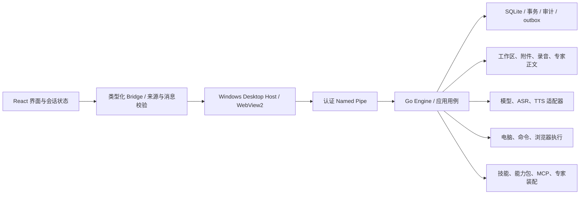

# Lunitide 全系统升级改造 PRD 与现状评估

版本：PRD 1.5 · 2026-09-06（代码交付、最终证据与验收分工定稿）  
代码基线：v0.4.67 · `09978597dc026bfa40ab8d690d64f9bcaef476f3`  
状态：**本次约定的代码升级交付已完成，工程交付评定 4.9/5；真实环境与签名发布验收由用户继续完成。** 当前实现以 `implementation/phase2-*.md` 和最终验证汇总为准；基线与第一阶段分数、日志保留为历史。  
适用范围：当前 Windows 本地优先桌面产品，不扩张成新的云平台。

## 1. 决策结论

**最终工程交付：4.9/5。** 24 模块、五维及原权重见 [最终评分明细](implementation/scorecard-phase2-final.csv) 与 [评分评审说明](implementation/phase2-final-score.md)。原 40 项任务中适用的代码整改和自动化交付已关闭；56 组场景中的用户实机项目保持待验。最终六组门禁在相同 2,758 项源码输入上通过：Go 4,766 个测试/子测试通过，全库 race 4,758 个通过，前端 1,668 项通过，Go 语句覆盖率 53.2%。Go 普通及 race 各有 28 项环境相关测试跳过，未计入通过数。完整开发候选已构建并独立校验，详见 [最终验证报告](implementation/phase2-verification.md)。这一分数是第1.1节约定的工程交付等级，不是实机成功率或线上稳定性分数。

剩余用户工作集中于真实设备、真实服务与数据库、业务质量、签名安装和长期观察，按 [用户验收移交](implementation/user-acceptance-handoff.md) 执行；没有把未完成的代码改记为用户任务。六组门禁绑定源码摘要 `e578444c4485345e8aa55dcc2b71e551e2abda0d07627e23cc149e62d50fef17`，发布候选与源码快照可按摘要核对。

**整改前基线综合评分：2.7 / 5。** 这是按产品模块、异常恢复和权限/数据证据给出的工程评价，不是线上成功率，也不是“代码只有 54% 正确”。现有系统拥有较完整的桌面分层、生成式契约、SQLite 迁移、凭据保护和大量测试；关键薄弱点是跨模块状态与实际执行不一致，以及失败、重复请求、并发、撤权之后的链路。

**第一阶段历史工程暂评：3.6 / 5（原公式计算 3.5594），不代表第二阶段最终评分。** 使用同样的 24 模块、五维和权重重新检查，详见 [当前逐项暂评分](implementation/scorecard-current-provisional.csv)。这是已有代码与隔离回归支持的保守评价，真实供应商、设备、安装和长期观察仍未完成；不能视为发布认证。初版 PRD 本身评审为 3.8/5，发现的事实和执行缺口已在本轮修订，不能与产品分数混用。

本次新增 **36 个隔离故障/边界复现场景**，覆盖五个根审计场景、九个对话/会议场景、十三个电脑/项目/资产场景、九个扩展/专家场景。它们证明整改前存在具体缺陷，不代表 36 起生产事故，不代表覆盖了所有可能故障。部分探针断言正确行为，因此基线运行 FAIL；另一些刻意断言缺陷存在，因此基线运行 PASS。审计证据不与原有测试通过率混算。

原计划的实施顺序为：**先恢复权限与数据安全 → 修通重点业务链路 → 统一状态/恢复机制 → 完成真机与长时验收 → 小范围观察后复评分。** 保留 Go Host/Engine + WebView2 + React + SQLite。没有证据支持推倒重写、迁移微服务、更换全部模型或引入另一套工作流引擎。

初版交付为审计与可执行 PRD；用户随后授权实施，本版已包含产品修复。以下第2—3节保留整改前基线口径；第4节按最终实现更新，当前代码与测试结果以 implementation/ 中的记录为准；真实设备、供应商、数据库、安装与长期测试仍须完成验收。绝对“无报错、无闪退、永不宕机”无法由一次检查保证，本方案把它转换成可测量、可阻断发布的可靠性要求。

## 1.1 本次接受的交付分工与评分口径

用户最新指令将真机等非代码验收交由用户，代码、自动化检查、升级改造、PRD准确性和可执行工具全部由实施方完成。本版据此将两个验收状态分开，不能用其中一个冒充另一个：

| 验收对象 | 责任 | 完成条件 |
|---|---|---|
| 代码升级交付 | 实施方 | 40项台账中适用的实现关闭；反例有正式正确性回归；全量Go/前端、全库race、迁移、契约、静态、类型、构建、依赖扫描与发布工具门禁通过；源码摘要和日志可复查。 |
| 真实环境与发布使用 | 用户 | 真实供应商/数据库、三语音设备、现场同事/桌面操作、签名与安装矩阵、72h/14天业务观察，按已有脚本和表单补证据。 |

**工程交付4.9/5**仅可在上一行适用项全部完成、没有已知未关闭的权限/数据/核心流程阻断后确认。**系统实机评分**仍沿用第3节原量表和第10—11节门槛，不能预填4.9；没有测试过的结果保留pending。用户承担真机验证，不表示任何尚未实现的代码可以改记为真机任务。

工程评价沿用24模块、功能闭环/数据一致性/权限边界/失败恢复/可维护与验证五维及原权重。4.9是本次约定的工程交付等级：须逐模块、逐维确认适用代码整改、异常回归、统一质量门禁和候选交付全部完成，且无已知未关闭的权限、数据或核心流程阻断，才可评定。需求映射、实际实现、反例、正式测试和追溯记录是准入证据，不各计1分，也不由测试数量、通过率或覆盖率换算分数。不得以平均分抵消单点失败；系统实机评分独立留空，等待用户的真实环境验收。最终评分CSV与原基线CSV并存，原数据不改写。

实施偏差需落入原任务ID并更新用例，不引入额外模型平台、通用任意代码插件或第二套任务引擎。架构决策和依赖门禁见 [架构实施记录](implementation/phase2-architecture.md)。完整候选可以在未签名开发模式构建核验；该产物不自动获得签名发布资格。

## 2. 整改前事实基线与验证范围

### 2.1 项目规模与实际架构

- 1255 个受版本管理的 Go 文件，其中 500 个 Go 测试文件；前端 202 个测试文件。
- 467 个 Bridge schema 文件，123 个数据库迁移。数量来自当前仓库，不代表 467 条都是真机验收通过的功能。
- 本机 Go 1.26.6、Node 24.16.0；CI Node 22。发布复验必须固定工具链，补齐该差异。
- 最长热点包括 CompanionStage.tsx 2731 行、store.go 1926 行、bridge/client.ts 1787 行、chat.go 1460 行。部分 store.go 是迁移/指纹静态数据，不能以行数直接判定业务复杂度；真正需要拆的是状态所有权与执行职责。

当前核心不一致处：DB 与文件存在多个提交边界；MCP 设置、市场操作、聊天注册表各自维护状态；插件卡片开关没有完整接入实际工具执行；会议和部分计划更新没有版本约束；命令、终端、持久任务有不同执行实现。

### 2.2 已执行检查

| 检查 | 本次结果 | 结论边界 |
|---|---|---|
| 原有 Go 全量测试 | 136 个包返回通过；2 个包返回无测试；3357 个测试/子测试通过，2648 个顶层测试；22 项 skip；0 失败 | 已从最终日志排除 1 个审计包、4 个缺陷复现测试；包PASS不代表每包都有独立Test事件 |
| Go 语句覆盖率 | 全库 51.0%；SQLite 包 35.1% | 覆盖率不等于正确率，业务组合与故障语义需要额外验收 |
| 前端测试 | 202 文件、1553 项通过，0 失败/跳过 | 使用 jsdom，不能替代 WebView2/音频/真实桌面 |
| Bridge 漂移、TS 类型检查 | 通过 | 不证明人工拼接调用或按钮输入一定符合真实服务语义 |
| Go vet / build / golangci-lint | 通过 | 静态质量基础有效；不能识别所有业务边界缺陷 |
| 前端生产构建 | 通过；主 JS 约 1797 kB、gzip 540 kB，有大包提示 | 未量测真实首屏与内存，不把体积告警写成已发生崩溃 |
| 选择性 Go race | 8 包、315 测试/子测试通过；7 skip | ipc、voice及子包、meetings、people、ccapp、mcp6、engineclient；不是整库 race |
| Go govulncheck | 退出 0，未报告可达受影响符号 | 输出有模块级公告记录，不能说依赖完全无漏洞 |
| npm audit | 9 个受影响包条目：2 high、7 moderate | 需区分开发工具、运行时和实际可达性；未自动升级依赖 |
| 额外缺陷复现 | 36 场景确认 | 使用临时 SQLite、Fake Host、假 provider/transport、合成音频；无真实外部动作 |

完整命令、原始输出、跳过用例和工具版本在 `evidence/`。首个 coverage 命令的 PowerShell 参数解析错误已通过引用参数重跑修正，不是系统 bug。会议审计 Go 文件现有 `auditprobe` 构建标签，默认测试不再收集。

### 2.3 未完成的真实环境验收

本次没有真实麦克风/loopback 录音、三链路付费/在线供应商调用、真实同事消息发送、生产数据库连接、Win32/UIA 键鼠动作、ConPTY 全生命周期真机操作、WebView2 全界面逐按钮操作、睡眠/断网/热拔插、断电/磁盘满整机实验、72 小时运行、Win10/Win11 干净安装与签名发布。相关 skip 和后续任务必须保持可见。

因此，本报告是**整库自动化检查 + 重点链路源码复核 + 隔离故障复现**，不能标成“所有功能真机全链路验收完成”。自动化、MRO、组织和个人记忆的检查深度低于用户重点模块，分数也明确降低置信度。

## 3. 整改前统一评分卡（历史基线）

### 3.1 评分方法

每个维度满分 5：功能闭环、数据一致性、权限边界、失败恢复、可维护与验证。模块均分为五维等权平均。用户指定的 11 个重点模块权重为 2，其余权重为 1，总权重 35；可选 realtime 单独计 1，不掩盖默认火山链的表现。综合未舍入值为 **2.7331**，对外报告 **2.7**。可复算数据在 `scorecard.csv`。

刻度：1=关键承诺失效；2=已有实现但核心边界明显断链；3=正常路径基本可用、异常/闭环不足；4=主要真实路径与故障恢复有证据；4.9=本 PRD 所有硬门槛、每模块验收与观察期通过；5=约定支持范围内全部验收通过且无已知缺口。评分是带判断的工程量表，不伪装成精密测量。

置信度“高”表示有源码和隔离反例支持本次评价，不等于已做真机认证；“低”表示该模块只完成基础路径与原套件复核。低置信模块不能直接认定具备发布资格。

| 模块 | 功能 | 数据 | 权限 | 恢复 | 维护/验证 | 整改前 /5 | 权重 | 置信度 |
|---|---:|---:|---:|---:|---:|---:|---:|---|
| 打字对话 | 3.8 | 3.0 | 3.8 | 3.0 | 3.4 | **3.4** | 2 | 高 |
| 云端语音 cloud | 3.8 | 3.2 | 3.5 | 3.1 | 3.4 | **3.4** | 2 | 中 |
| 本地语音 local | 3.0 | 2.8 | 3.5 | 2.3 | 2.4 | **2.8** | 2 | 高 |
| 火山语音 volc 默认级联 | 3.7 | 3.1 | 3.4 | 3.0 | 3.3 | **3.3** | 2 | 中 |
| 可选 realtime 子链 | 2.7 | 1.6 | 3.0 | 1.8 | 2.4 | **2.3** | 1 | 高 |
| 会议纪要 | 3.4 | 1.8 | 3.3 | 1.9 | 2.6 | **2.6** | 2 | 高 |
| 同事聊天 | 3.4 | 2.8 | 2.0 | 2.4 | 3.4 | **2.8** | 1 | 高 |
| 电脑控制 | 3.8 | 2.8 | 1.5 | 2.0 | 3.2 | **2.7** | 2 | 高 |
| 项目管理 | 3.2 | 1.5 | 2.6 | 1.8 | 2.6 | **2.3** | 2 | 高 |
| 计划与工作流 | 3.0 | 1.4 | 2.8 | 1.5 | 2.6 | **2.3** | 1 | 高 |
| 技能中心 | 2.5 | 2.5 | 3.0 | 3.0 | 3.0 | **2.8** | 2 | 高 |
| 插件与能力包中心 | 2.0 | 1.5 | 1.0 | 2.0 | 2.5 | **1.8** | 2 | 高 |
| MCP | 2.5 | 1.5 | 1.5 | 2.5 | 3.0 | **2.2** | 2 | 高 |
| 专家中心 | 3.0 | 2.0 | 2.5 | 2.0 | 3.0 | **2.5** | 2 | 高 |
| 资产管理 | 3.5 | 1.7 | 3.0 | 2.0 | 2.6 | **2.6** | 1 | 高 |
| 后台设置与模型配置 | 4.0 | 3.0 | 2.5 | 3.3 | 3.7 | **3.3** | 1 | 中 |
| 外部数据库连接 | 3.5 | 3.0 | 1.5 | 3.0 | 3.0 | **2.8** | 1 | 高 |
| 专家知识与资料查新 | 2.5 | 1.5 | 2.0 | 2.0 | 2.5 | **2.1** | 1 | 高 |
| 个人记忆与召回 | 3.5 | 3.2 | 3.3 | 2.8 | 3.2 | **3.2** | 1 | 低 |
| 命令与人工终端 | 3.8 | 2.8 | 3.0 | 2.0 | 2.9 | **2.9** | 1 | 中 |
| 浏览器工作区 | 3.8 | 3.0 | 3.0 | 2.7 | 3.2 | **3.1** | 1 | 低 |
| 自动化与消息连接器 | 3.4 | 3.0 | 3.0 | 2.5 | 3.1 | **3.0** | 1 | 低 |
| 组织与协作隔离 | 3.2 | 2.7 | 1.8 | 2.6 | 2.7 | **2.6** | 1 | 低 |
| MRO 关联工作台 | 3.5 | 3.0 | 3.0 | 2.8 | 3.2 | **3.1** | 1 | 低 |

### 3.2 横向工程评价（不重复加权进模块总分）

| 检查点 | 整改前 /5 | 判断依据 |
|---|---:|---|
| 系统架构与分层 | 3.8 | Host/Engine 分离和适配器较清楚；多套状态与执行入口没有统一所有权 |
| 系统引擎与任务生命周期 | 3.0 | 有持久 run/恢复扫描；控制取消、checkpoint、任务聚合仍有缺陷 |
| 核心 SQLite 连接与迁移 | 3.5 | 受控目录、迁移/校验/事务基础好；panic 后连接恢复缺陷 |
| 数据更新一致性 | 2.2 | 项目审计 ID、会议旧快照、专家文件双写和资产重试已有反例 |
| 数据查新与引用真实性 | 2.1 | KB 旧版仍可检索、虚假引用可通过、没有统一新鲜度语义 |
| 权限、撤权与审计完整性 | 2.0 | 底层安全基础存在；插件/MCP/CC/数据库工具的上层执行边界有缺口 |
| 代码清晰度与复用 | 3.2 | 多数领域服务可复用；超大界面与多套执行/状态分支加大验证成本 |
| 测试与发布证据成熟度 | 3.3 | 原有套件规模与工具门禁较好；真实设备、全库 race、长时与发布证据欠缺 |
| 可观测性与故障恢复 | 2.8 | 有日志/错误码/watchdog；readiness、备份恢复入口、业务失败持久状态不完整 |

**准入规则优先于分数**：存在未关闭的撤权绕过、不可恢复数据丢失或核心流程阻断时，不允许用平均分宣布 4.9。整改后要求每个模块≥4.9、每个维度≥4.9，不能通过提高低风险界面分抵消权限或数据问题。

## 4. 本轮整改范围与禁止漂移项

本轮必须交付：文字与三条默认语音的完整会话；可靠会议录音/转写/纪要；可停止、可审计的电脑操作；可重复修改且有门禁的项目流程；可导入/更新/调用的技能；状态真实的能力包；可认证、可撤权、可回收的 MCP；正文/知识/装备一致的专家；可靠资产与数据源；统一数据更新和运行证据。

范围冻结：

1. 语音默认三条是 cloud/local/volc。旧 omni/flm 迁移不是新增第四主链。realtime 是现有可选子链，保持独立准入；本地链的 ASR/TTS 本地，不自动保证 LLM 离线。
2. 插件当前主要是能力包与已注册内置能力。通用 npm/Cordis/TS 可执行插件尚未有完整生产适配器。本轮先让现有范围真实可用；通用插件平台需另行需求变更和 ADR，不能为了评分悄悄扩大执行权限。
3. 计划运行已接既有 agentrun，只有真实 run 及工作区文件/摘要回执验证后才可完成。未配置执行器时拒绝启动或明确仅记录；旧 automation.dispatch 仍是预检投影，返回 executionStarted:false，实际定时执行由 automation.job 路径承担。不得混淆这两个接口。
4. 不替换生产架构/数据库，不同时新增另一套权限、MCP、会话或计划服务；优先复用当前成熟的 UoW、outbox、agentrun 回执和 bounded worker。
5. 不把“更换模型、加长提示词、吞掉错误、放宽校验、自动切完全访问、关掉测试”当作修复。
6. 已有迁移文件和 checksum 不改写；追加迁移。保留用户数据与旧入口兼容，迁移完成前不删除恢复副本。
7. 模块“更多功能”不自动进入本轮。每项改动必须绑定本文任务 ID、证据 ID、验收用例与回滚说明。

## 5. 最高优先级问题清单

本节保留整改前发现及原任务归属，用于核对修复来源。各项当前实现与最终验收状态以实施台账和第二阶段证据为准，不把下列历史问题直接作为当前未关闭问题。

| 证据 ID | 可观察问题 | 处理顺序 |
|---|---|---|
| EXT-01 / EXT-02 | 能力停用仍能执行；MCP 页面删除后同进程仍能调用 | 第一批，发布阻断 |
| CPA-10/11/12 | 取消/急停后动作仍下发；命名窗口绕过阻止列表；成功动作可无审计 | 第一批，发布阻断 |
| SYS-02/03/04 | PostgreSQL 地址误授权写；手动审批模式执行数据库写；同事发送者/群范围未绑定 | 第一批，发布阻断 |
| SYS-01 / CVM-01 | 事务异常后写连接失效；未落盘回答被下一轮恢复文件覆盖 | 第一批，数据保护 |
| CPA-01/02/03/07/08/09 | 项目第二次修改失败、幂等不绑定内容、跳步上线、计划根节点失败、暂停失效、失败变完成 | 第二批，核心功能闭环 |
| CVM-02/03/04/05/06/07/10 | 本地音频超限、停止设备延迟、会议状态回退/覆盖人工稿/重音/漏段 | 第二批，核心功能闭环 |
| EXT-03/04/05/06/07/08/09 | 技能导入传假扫描材料且失败；版本忽略；MCP假健康/漂移/认证断链；包共享引用/专家正文双写 | 第二、三批 |
| EXT-10/11/12 / CPA-04/05/06 | 旧资料仍命中、引用验证空通过、解析失败记录丢失；模板重试改变文件或重复创建 | 第二、三批 |
| SYS-06 / CPA-13 / EXT-13/16 | 已知依赖告警、命令输出无界、MCP 池超过上限、大文件读取无前置预算 | 第一批建立止损，第三批统一机制 |

严重性分级用于安排发布门禁，不外推为全部可远程利用。专项笔记保留了每项触发条件、代码行号、测试类型与影响边界。

## 6. 目标架构与统一工程规则

### 6.1 收口到现有 Engine 内的领域服务

不拆微服务。Engine 负责装配、路由、租约和观测；业务状态机在对应领域服务，SQLite adapter 负责事务与数据约束，Host 只负责明确授权的本机能力。React 页面只表达用户意图、展示真实状态与冲突，不能维护唯一安装账本或在页面内串多个业务提交。

建议职责映射：

| 统一职责 | 复用基础 | 本次要消除的不一致 |
|---|---|---|
| ActionContext / CapabilityPolicy | 现有 toolruntime、policy、approval、org | 插件开关、MCP、数据库、CC、无人值守/语音绕开同一判定 |
| TurnStore / Run 生命周期 | messageapp、agentrun、chat persist | 单 session checkpoint 覆盖、realtime 只存内存 |
| MediaCaptureLease / PCM transport | local/volc ASR、录音、TTS player | 分片上限不同、退出漏清理、先等保存才停麦 |
| MeetingService | 现有 meetings+SQLite | 整行快照覆盖、片段重试不幂等、缺口判断仅看尾水位 |
| ExtensionLifecycle | m7 设置、mc 生命周期、mcp6 registry、pool | 配置 ready 与实际 ready、删除与撤权、凭据映射不一致 |
| ProjectStageService / Plan aggregation | projectapp、planningapp、workflow、agentrun | 前端三步提交、跳过门禁、failed 被覆盖 completed |
| AssetIngestJob / KnowledgeSource | 现有 attachment、template、KB、expert | 文件/DB 双写、前端账本、历史资料和引用真实性 |
| CommandExecutor adapter | commandworker、terminalruntime、toolruntime | 无界输出、重复取消/进程树/超时语义 |

这些是职责目标，不要求一次性新建所有同名包。先加适配器和回归用例，再逐入口切换、删除重复路径。

### 6.2 每个写操作的最小契约

使用现有 Bridge v1 做兼容增量。所有真实副作用必须经过同一套语义，具体 DTO 由契约生成：

- 命令身份：requestId、idempotencyKey、actor/来源、org/project/session/run/turn 的适用范围。
- 版本身份：expectedVersion、完整规范化 payloadDigest；相同 key 同载荷返回原结果，异载荷返回冲突。
- 授权身份：capability、资源范围、approvalDigest、permissionEpoch、expiry；执行前重新验证，撤权后旧队列/旧快照不可执行。
- 结果：accepted/committed、resultVersion、eventCursor、artifactDigest；“请求被接收”不能等同“外部副作用已完成”。
- 故障：errorCode、retryable、retryAfter、operationId、outcome。外部副作用可能已发生但回执缺失时为 outcome_unknown，禁止自动重做。
- 日志/审计：traceId 贯通 Bridge → Engine → worker/provider → DB/文件；不得输出密钥、DSN、完整录音或不必要原始正文。

数据库事务中完成：状态变化、版本检查、成功审计、幂等结果、outbox。同一逻辑 operation 的重复请求不新增资产/消息/审计。网络、文档解析和模型推理不长时间占用 SQLite 写事务。

### 6.3 事件与数据更新

每种数据只定义一个权威状态源：

| 数据 | 权威来源 | 界面更新规则 |
|---|---|---|
| 会话/项目/会议/专家/技能 | 服务端持久版本 | mutation 回执携带 revision；事件通知失效；按 revision 重读 |
| MCP ready/工具列表 | 已真实握手的运行时+持久 desired state | 配置存在只显示 configured；成功探测后 ready；携带 generation/checkedAt |
| 包安装/依赖 | 服务端 pack job 与引用图 | localStorage 仅缓存布局，不决定拥有关系 |
| 音频/附件/模板 | 分片 manifest + 内容 hash | sample/byte ACK 后显示已保存；缺口和待提交可见 |
| 外部数据库资料 | 查询结果+来源时间+连接策略 | fetchedAt 不等于原数据更新时间；无法知道时标 unknown |
| 资料检索 | current version + 可见性/有效期 | FTS/向量/缓存/引用使用同一过滤视图 |

界面切项目、专家、组织或会话时提升 generation；迟到响应不得写入新页面。事件带单调 cursor，断桥/重载通过 cursor+快照补齐；缓存跨用户/组织失效。手动刷新要给出真实结果和时间，不得只重新展示旧缓存。

## 7. 模块产品需求与验收

### 7.1 打字对话

**用户结果**：发送、流式阅读、停止、工具审批、重试、切换会话、重启恢复的内容一致；看到“已保存”的回答不会因下一轮丢失。

要求：

- 以 turnId 持久管理 queued/running/awaiting_approval/cancelling/completed/failed/persist_pending/cancelled，终态不可被晚到事件改回。
- 多个未保存 turn 各有独立恢复条目；消息 DB 提交成功后才能清理对应 checkpoint。
- 流 chunk 可容忍网络断开，终态有可查询回执；取消保留已生成部分、停止新工具动作，外部效果不明时单独对账。
- 附件选择、视觉预览、项目上下文、技能/专家装备均记录输入版本，模型路由失败有明确降级和原因。
- 修 Mermaid 依赖风险并保留纯文本降级；图形异常不能锁住整段聊天或主界面。

验收：100 轮连续对话；同时进行两个不同会话；每一持久阶段注入失败；多轮 persist_pending 跨重启不丢；重复 request 不重发用户消息、不重复计费记账；拒绝审批不产生动作；断桥后显示可恢复状态。

### 7.2 三条默认语音与可选 realtime

| 路径 | 当前真实组成 | 整改重点 |
|---|---|---|
| cloud | Web Speech 系统/在线 ASR → 通用 chat → Edge TTS | 设备/网络失败可解释、打断/回声隔离、会话落盘；系统 ASR不可用时明确不支持 |
| local | Sherpa streaming+refiner → 所选 LLM → ONNX Kokoro 默认 TTS；SoVITS为可选 | 统一≤1秒 PCM 分片；冷启缓存切片；资源安装校验；文案与实际默认一致 |
| volc | seed-asr → 通用 chat → seed-tts；部分配置可选 Edge | 凭据/资源权限/限流、断连与重试、同 turn TTS 互斥、供应商错误映射 |
| realtime 可选 | realtime WS/VAD → 双向音频/文本 → 必要时 handoff通用 chat | 补历史持久化、远端 ended 资源清理、与默认级联互斥 |

统一要求：

- CaptureLease 是麦克风/设备与释放责任的唯一所有者；page unmount、切链、异常、EOF、远端 ended、取消均 exactly-once stop。
- 点击停止先停止采集/播放，再后台保存已有缓冲；界面同时展示“麦克风已关闭”和“正在保存录音”，不能把两者混为一体。
- PCM transport 共用采样率/声道/最大帧/序号规范，有界缓冲、尾音确认和明确缺口；超载不静默丢片。
- 播放回声不生成新用户 turn；用户打断停止当前播放/生成，旧代事件不能污染新 turn。
- 资源下载不阻塞主界面；本地模型不存在/损坏或硬件不支持时有修复入口。不得把本地 ASR/TTS描述成整个模型推理离线。

验收：三链各 100 轮；中英混说、短句、长停顿、改口、背景噪声、扬声器回声和手动打断分别至少 50 条；5s 延迟启动、网络限速、尾帧、热拔插、睡眠恢复、关闭窗口再开；设备释放目标≤500ms，重开无双麦/重音。realtime 另做 20 轮历史+重连+handoff测试，未过前继续默认关闭。

### 7.3 会议纪要

**用户结果**：录音来源、保存完整性、转写缺口、人工修订和纪要引用可追溯；停止后麦克风马上关闭；识别失败不会破坏已有原稿。

要求：

1. 分开 recording/capture、upload/save、transcription、summary 四种状态，使用 revision 和条件 UPDATE。heartbeat 只更新心跳字段，不回写整行旧快照。
2. 录音每片有 captureSessionId、chunkSeq、sampleStart/end、hash、ACK、状态；服务端对重复片重放回执，异内容冲突。WAV轮换与逻辑片段不是同一层。
3. 原始音频与 live segments 不可变；补转写生成新版本，逐区间记录 pending/succeeded/failed，不先 DeleteSegments。
4. 完整率由成功覆盖区间计算；首段/中段失败可独立重试；有缺口时纪要标 partial，显示缺失区间，不能伪称完整转写。
5. summary job 绑定 transcriptRevision，完成只更新同版本生成字段；人工改稿后保留旧结果供参考并提示重新生成，不覆盖新稿。
6. 同一事务提交摘要状态和导出版本；导出带来源修订、生成时间、未解决缺口。摘要待办不得自动变成已经执行的项目动作。
7. “切到其他页面是否继续录音”明确为后台录音能力的独立契约：推荐后台继续、有全局录音指示和停止入口；只有真正实现并验证后开放。

验收：三种 ASR各2小时会议；麦克风/系统音频分开与混合；600 次分片重放/乱序/故障；1000 组 heartbeat/append/stop/summary/edit 交错；任何失败后原稿hash不变；重启继续未完成保存与补转写；所有摘要可找到准确输入版本。

### 7.4 电脑控制、命令、浏览器和终端

电脑控制必须满足“授权目标就是实际操作目标”。DesktopActionContext包含 session/run、目标 HWND/进程身份、permissionEpoch、deadline、cancel token。解析目标后、切焦点后和每个输入副作用前复核；目标被阻止、身份变化、查询失败时拒绝。急停必须撤销队列并对在途动作给出停止确认，不能仅更新配置。

高影响动作先写 prepared intent，执行后写 receipt；审计不可用时不开始新动作。已执行但回执失败显示待对账，不能报告完全成功或自动重复。已经完成的 OS 动作不承诺可以撤销。

命令执行共用 bounded sink、截断后继续排空、deadline、进程树回收和输出事件协议；不要继续用无界 bytes.Buffer。持久命令、模型命令和人工终端可保留不同交互方式，但复用进程管理与资源预算。终端的“人工输入直接执行”必须与模型审批文案区分。

浏览器分别验收初始导航、重定向、子资源、DNS变化、已登录上下文、CDP生命周期；不能只检查初始 URL。工作区与文件工具分别验证路径穿越、junction/reparse、符号链接、hardlink、目录替换竞态和文件身份，使用已经打开的受控句柄约束实际读写；CPA-21/23属于待验证边界，先验证、发现偏差再修复，不预先声称已发生越界。终端绑定 owner/session/generation，可靠保存终态，关闭页面释放 resize listener和ConPTY。

验收：Fake Host 先覆盖所有取消/急停窗口，再在隔离Windows机做记事本/计算器/资源管理器白名单场景；不同DPI/多屏/输入法/焦点抢占；拒绝目标零动作；急停确认后零新动作。输出洪泛、256KiB以上单行、子孙进程、Job Object失败、关机/重启、100次终端开关都有有界结果。

### 7.5 项目管理与计划/工作流

- 修审计事件ID：每次独立成功mutation唯一，幂等记录负责回放。内容完整进入请求摘要。
- project.finishStage事务内校验当前状态、前置阶段、必需交付物/证据版本、权限，统一冻结交付物、完成stage、推进project、审计、outbox。旧advanceStatus只做兼容适配，不能接受任意phase跳转。
- 创建阶段工作计划为服务端ensure用例：plan+root(sequence>0)+stage稳定绑定一起提交；只读页面不写数据。
- 节点开始要求plan active且依赖满足；pause/cancel阻止新动作；聚合完成需要全部必需节点成功，failed不能因另一个节点完成而变completed。
- 计划执行接现有agentrun/worker而非另造引擎：每个node映射真实run及产物/验证回执。未配置worker的记录型计划明确标“计划记录”。
- 明确活跃项目容量与归档策略；资产/历史列表支持分页，不能靠固定前100条代表全集。

验收：项目连续100次保存、全部阶段顺序推进、20次close/reopen；跳阶段/空证据/旧版本零写入；暂停与启动竞态；失败/取消/重试所有终态组合；>100节点；页面重载、切项目、只读场景；工作流真正执行后才显示执行完成。

### 7.6 技能、插件、能力包与 MCP

技能导入由后端以固定commit获取、计算hash、读取manifest/许可证、执行真实扫描并生成记录；UI不得传mock-scan/mock-eval或虚构clean。扫描未完成标unknown/pending。发现→检查→审批→安装→运行目录可见→实际调用是一条验收链。编辑删除必须使用客户端读取时的rev，不能固定expectedVersion=1后由服务忽略。

能力包的期望依赖、解析依赖、用户预存资源、谁创建、谁引用、安装游标和失败补偿存后端；删除A不能移除B仍依赖的资源。开关经同一CapabilityPolicy作用于所有执行入口。

MCP设置/市场/运行时统一Lifecycle。configured与ready分开；真实initialize+tools/list成功才ready。删除/禁用先阻断新执行、递增epoch、取消适用在途调用、驱逐连接/子进程，返回后旧toolId不能使用。所有连接忙时也不能超过pool硬上限。

MCP认证支持明确类型；secretref贯通配置→短租约→目标进程env/HTTP头，轮换撤销驱逐旧连接。schema/描述/权限与服务身份pin变化进入待确认，不自动把新的schema当成旧授权。预置包锁version+integrity，下载和启用分开，离线主界面可用。

验收：一次真实受控技能导入到调用；坏manifest/哈希/许可证/路径拒绝；A/B旧rev冲突；带假认证服务的401/轮换/撤销；删除后旧缓存零调用；A/B包共享依赖；清UI缓存/中断/重启恢复；9+端点并发不超过上限。通用插件不支持类型在安装前准确解释。

### 7.7 专家、个人记忆、知识与查新

专家正文、版本指针和技能绑定要么同库事务，要么采用有校验的文件prepare/commit；找不到正文显示损坏，不退回{}假成功。推荐将小型六段正文作为不可变blob放SQLite，引用文件保持兼容迁移。

专家装备由一个resolver按当前状态/版本/skills/MCP解析，在普通聊天、同事、语音、会议和项目中返回可见快照。停用/归档不能从某个入口静默复活。个人记忆、专家KB和MCP Memory分开标识数据源，建立关系前不声称同步。

知识文档记录稳定来源身份、文档版本、内容摘要、适用期、状态及实际查新信息。默认全文检索与引用只使用当前可用版本；来源版本历史通过显式分页查询，asOf用于当前资料适用期过滤，不代表可检索已替代版本。失败解析提交failed记录和审计，成功块可见之前不得标ready。

引用由后端联表核对expert/document/version/chunk/hash/quote范围；locator缺chunkId不能判验证成功。自动查新只检测来源变化，不能把checkedAt改新就算资料更新；新版本经完整导入后切换current。源不可达时标stale/unknown，保留旧证据并说明过期，不静默伪装最新。

验收：正文磁盘/事务/绑定故障；同文档v1→v2后默认搜索不命中v1专有词；历史能查v1；跨专家/不存在/失效引用拒绝；同源重复导入幂等；失败解析重启后可重试；大文件拒绝/取消不阻塞聊天；知识质量集与软件正确性分别评分。

### 7.8 资产、后台设置、数据库和其余模块

资产上传统一uploadId/index/offset/hash/expectedTotal，接收完成前不可消费；创建返回稳定templateId/fileRef，重试只回放一个结果；文件与DB有恢复协议和GC。列表分页/检索；项目引用中的模板版本不可随全局更新无提示漂移。

设置显示“已保存”和“实际生效”的区分，返回appliedRevision；敏感变更必须走服务端验证；模型能力路由检查ASR/TTS/vision/embedding用途匹配。数据源连接状态、读写权限、范围和最近探测时间来自真实后端。数据库Query与Mutate分开，错误脱敏、行/列/字节/超时都有上限；只限制1000行不足以控制大列/BLOB。

同事聊天补认证主体/群范围，并加入每收件人outbox与持久ACK；本地保存、已发送、已送达、已读分别展示。断网后可重试且接收端去重，不默默丢弃网络失败。

自动化覆盖时区、重复tick、重启补跑、停用及在途任务；消息连接器验证专用测试身份/外部回执。组织隔离明确本机个人与组织资源；AuthContext失败不能退回全部项目。MRO各入口的资料、库存和项目状态通过当前证据版本关联，不能把建议或待办显示为业务已放行。

验收覆盖附件/模板重放与101+列表、设置两窗口编辑和重启、MySQL/PostgreSQL专用只读与受管写库、消息离线恢复、跨组织已知ID读写、自动化重复触发、MRO来源失效展示。

## 8. 数据模型与迁移要求

下表是目标增量模型，落地时先核对现有表能否扩展，避免平行建表。编号从现有123后分配，不能预先承诺多个并行PR都用同一迁移号。

| 对象 | 必要增量 | 一致性约束 |
|---|---|---|
| operation/幂等回执 | scope、payloadDigest、result、state、outcome、expectedVersion | 相同身份键唯一；完整载荷冲突检测 |
| turn恢复 | sessionId+turnId、持久草稿、lastSeq、persistState | 每turn独立；DB ACK后才清理 |
| meeting | revision、captureState、transcriptRevision、summarySourceRevision | 条件状态转移；心跳局部更新；一个活跃录音策略由DB补强 |
| audio manifest/span | session、seq、sample range、hash、ack、attempt/status | 同seq同hash回放；区间缺口显式 |
| project/phase完成 | projectVersion、stageVersion、evidenceDigest | 冻结/阶段/项目/审计一起提交 |
| skill/expert版本 | 客户端rev、正文hash/blob、装备版本 | 指针只能指向完整正文与合法绑定 |
| MCP/capability | desiredState、runtimeGeneration、permissionEpoch、authRefs、schemaPin | ready来自真实探测；旧代执行被拒 |
| pack依赖 | instance→resource引用、createdBy、jobStep/result | 共享依赖保留；卸载失败可恢复 |
| KB document/version | sourceKey、current指针、index/effective状态、hash | current唯一；统一检索视图；失败记录可见 |
| 资产上传/文件对象 | seq/offset/hash、ready、operationId、fileRef、GC状态 | 未ready不能消费；文件/DB可对账 |
| 同事delivery | messageId+recipient、attempt、ack、deliveryState | 每收件人唯一；sender取认证主体 |
| 审计/恢复 | intent/receipt、链checkpoint、外部效果未知状态 | 不吞成功动作审计失败；保留历史兼容 |

迁移步骤固定为：停写或建立一致快照→备份DB与引用文件manifest→旧数据扫描dry-run→追加迁移→对账行数/引用/hash/外键→运行新旧数据夹具→切读→观察→清理旧副本。不能在迁移失败时覆盖原库或直接删除孤儿判定未完成的文件。

回滚优先回滚应用与开关，保持追加兼容表；不可逆数据变更必须恢复完整快照并定义停写窗口，不能简单换回旧exe读取新schema。DPAPI与账号绑定凭据不得以明文备份“解决跨机恢复”。

## 9. 可执行任务清单与依赖

角色：BE=Go/数据工程，FE=前端/媒体工程，QA=自动化与Windows验证，SEC=安全审查，TL=技术负责人。均为角色，不代表已经指定真人或批准外部操作。

表中依赖是合并/退出依赖；夹具、接口设计和CI框架建设可从B00后并行。每任务拆为1–3个可审查PR，PR应独立回滚；同一迁移文件不多人同时编辑。为避免模糊的“核心修复完成”，定义两个可展开集合：G-fixes = B01–B07、C01–C06、P01–P05、E01–E09、S01–S07；G-core = G-fixes + S08。S08只依赖G-fixes，不包含自身；Q01/02的退出分别检查这一完整集合。

| ID | 交付范围 | 证据映射 | 依赖 | 责任 | 退出条件 |
|---|---|---|---|---|---|
| B00 | 冻结支持矩阵、原套件与36反例基线 | 全部 | 无 | TL/QA | 正确性回归红灯可复现、未验项登记 |
| B01 | UoW panic/rollback与健康降级 | SYS-01/07 | B00 | BE | 事务异常后连接恢复或明确隔离 |
| B02 | 全入口能力判定与撤权epoch | EXT-01；SYS-03 | B00 | BE/SEC | 停用后所有适用入口零执行 |
| B03 | CC目标绑定、取消、急停与intent/receipt | CPA-10/11/12 | B01/B02 | BE/QA | 四个探针转绿，真机急停门槛满足 |
| B04 | DSN规范化、显式数据库写权限/幂等 | SYS-02/03/09 | B01/B02 | BE/SEC | 地址覆盖/手动审批写零绕过 |
| B05 | 同事发送者/群/文件帧范围校验 | SYS-04 | B00 | BE/SEC | 两个探针转绿，跨成员矩阵通过 |
| B06 | 依赖告警修复与前端渲染预算 | SYS-06 | B00 | FE/QA | 锁文件扫描审查、图形恶意输入受控 |
| B07 | 移除假成功/假扫描；准确能力文案 | EXT-03/05/14；CVM-11 | B00 | FE/BE | 生产无mock扫描，界面状态有依据 |
| C01 | 多turn持久恢复、旧checkpoint导入 | CVM-01 | B01 | BE/FE | 多轮落盘失败跨重启不丢 |
| C02 | PCM分片/有界队列/尾帧契约共享 | CVM-02 | B00 | FE/BE | 所有默认链帧契约一致 |
| C03 | 捕获/播放租约、立即停止与终态清理 | CVM-03/09 | C02 | FE | 所有结束路径设备释放目标达成 |
| C04 | 会议revision/局部更新/摘要源版本 | CVM-04/06 | B01 | BE/FE | 交错写不回退、不覆盖人工稿 |
| C05 | 录音manifest、补转写区间、保留源段 | CVM-05/07/10 | C02/C03/C04 | BE/FE | 600故障用例完整或标明缺口 |
| C06 | realtime历史与handoff幂等 | CVM-08 | C01/C03 | BE/FE | 20轮重连/退出历史一致 |
| P01 | 项目唯一审计ID和完整payload幂等 | CPA-01/02 | B01 | BE | 100次更新与重放符合契约 |
| P02 | 原子阶段完成与交付物门禁 | CPA-03 | P01/B02 | BE/FE | 跳步拒绝；故障零部分推进 |
| P03 | 原子阶段计划、节点/父计划状态机 | CPA-07/08/09/20 | P01 | BE/FE | 根节点/暂停/失败聚合/跨阶段正确 |
| P04 | 计划到现有agentrun执行及证据回执 | CPA-19 | P02/P03/E09 | BE/QA | 有真实run/产物验证才标执行完成 |
| P05 | 资产分片ACK、完成态、创建幂等/GC/分页 | CPA-04/05/06/17/18 | B01 | BE/FE | 一逻辑上传/创建仅一份成品 |
| E01 | MCP生命周期/真实健康/撤权/硬池容量 | EXT-02/05/13 | B02 | BE | 删除立即不可调用；池上限硬约束 |
| E02 | MCP认证租约、schema身份pin、版本锁 | EXT-06/07/15 | E01 | BE/SEC | 漂移/401/轮换/撤销矩阵通过 |
| E03 | 后端真实技能导入与统一运行目录 | EXT-03 | B07/B01 | BE/FE | 导入到实际invoke贯通 |
| E04 | 技能客户端rev、删除冲突与版本展示 | EXT-04 | B01 | BE/FE | A/B旧版本编辑/删除均冲突 |
| E05 | 能力包服务端引用图与可恢复安装卸载 | EXT-08/14 | E01/E03/E04 | BE/FE | 共享依赖保留；清缓存/重启可恢复 |
| E06 | 专家正文/版本/装备一致提交与解析 | EXT-09 | B01/E04 | BE/FE | 任意写失败不推进损坏版本 |
| E07 | 知识current/source身份/有效期与查新 | EXT-10 | E06 | BE | 新版替代后旧版默认零命中 |
| E08 | 严格引用验证、解析job、大小预算 | EXT-11/12/16 | E07 | BE/FE | 假引用拒绝；失败文档可查可重试 |
| E09 | 复用命令/终端执行资源；验证浏览器网络与文件路径边界并修复实证偏差 | CPA-13/14/15/21/22/23 | B02 | BE/QA | 输出/取消有界；网络和文件拒绝零越界副作用 |
| S01 | 设置appliedRevision与前后端状态真值 | SYS-09；跨模块 | B04/E01 | FE/BE | 保存/生效/失败状态准确 |
| S02 | 统一缓存失效/cursor/generation与当前版本 | 跨模块；EXT-10 | C04/E07/P02 | FE/BE | 切上下文与迟到回包零污染 |
| S03 | 分能力readiness、trace与审计自检 | SYS-07/08 | B01/E01 | BE/QA | 故障能定位模块与operation |
| S04 | DB+引用文件备份/恢复与启动对账 | SYS-08 | C05/P05/E06 | BE/QA | 旧库/损坏/中断恢复演练通过 |
| S05 | 同事可靠delivery/outbox与离线重试 | SYS-05 | B05/B01 | BE/FE | 每收件人ACK/重试不丢不重 |
| S06 | 组织scope与个人数据隔离 | CPA-16 | B02/P02 | BE/SEC | 解析失败不全量；已知ID越界拒绝 |
| S07 | 自动化/连接器/记忆/MRO补齐深度与场景 | 低置信模块 | S02/S03/S06 | QA/BE | 真值/重复触发/来源失效矩阵通过 |
| S08 | 热点职责拆分、移除重复路径与文档更新 | 架构指标；SYS-10 | G-fixes | TL/FE/BE | 不改变已验收行为，依赖方向与接口清晰 |
| Q01 | 全故障/契约/迁移/全库race持续门禁 | 全部 | B00后建设；G-core后退出 | QA/BE | 未解决反例0，所有必需门禁通过 |
| Q02 | 三语音/会议/桌面/DB/扩展及网络/文件边界真机矩阵 | 全部；CPA-21/23 | G-core/Q01 | QA | 支持范围每条关键链有真实证据 |
| Q03 | 性能、72h稳定性与14天观察 | 可靠性 | Q01/Q02/Q04 | QA/TL | 第10节指标逐项达标；M6完成逐模块复评分 |
| Q04 | 单一候选发布流水线、签名与安装生命周期 | SYS-10 | Q01/Q02/S04 | TL/QA | 候选构建同commit安装与签名证据齐全，交Q03观察 |

任务总数为40，按当前发现冻结。额外疑点在专项笔记中单独列出；先复现再转入任务，不将疑点写成已确认生产故障。

## 10. 达到 4.9 的硬验收门槛

以下是**整改后的目标**，当前未测到这些数字。性能指标先在B00登记参考机/数据集/网络；如因产品支持范围需调整，必须留下变更原因和新验收，不得在测试失败后静默放宽。

| 类别 | 必须达到的目标 | 采样与证据 |
|---|---|---|
| 核心正确性 | 开放P0/P1=0；已确认反例全部转为正确性回归通过；核心状态/副作用 invariants零违反 | 36场景+各入口适用矩阵；不能删除失败测试 |
| 数据完整性 | 已确认提交的数据RPO=0；音频已ACK样本不丢不重；未知结果不自动重复外部动作 | ≥1000次持久故障/重放/崩溃点组合，hash/版本/回执对账 |
| 权限与撤权 | 拒绝/撤销/过期/跨scope测试零副作用；CC急停确认后零新动作 | fake计数+隔离Windows OS证据；按入口与风险类别完整覆盖 |
| 设备释放 | 停止/错误/远端结束后采集track关闭≤500ms目标，资源引用归零 | 三链路和会议，普通/阻塞保存/拔插场景，P95与最大值均记录 |
| 操作交互 | 发送/取消/切页的本地反馈P95≤200ms；普通本地列表P95≤500ms | 参考机、固定数据量，外部推理等待单独计 |
| 启动与恢复 | 已安装资源条件下冷启动到可交互P95≤5s；故障可见≤2s；可恢复Engine重连/恢复P95≤10s | 至少100次冷/热/异常启动；不可恢复数据损坏进入恢复页 |
| 对话/语音可靠性 | 三默认语音各≥100轮连续；全部主要链路≥1000有效操作，软件原因成功率≥99.9% | 人工取消、外部限流、权限拒绝分别分类，保留总失败率不可隐去 |
| 语音端到端体验 | 首轮实测记录ASR final/模型首字/TTS首音P50/P95；建议句末到首音P95≤3s（热资源/声明网络下） | 每链分开，不将提示音计作有效回答；冷启动单独公布 |
| 转写/纪要质量 | 声明语料与噪声条件下中文CER建议≤10%；人工标注的决定/待办召回≥95%；责任人/日期无无依据编造 | ≥200句ASR基准、≥30场标注会议；引用/缺口错误零伪验证 |
| 长会 | 每ASR路线2小时×3场；连续采样manifest与WAV一致；不存在未标注的缺段/重段 | 录音/转写/导出hash、人工抽核、重启恢复报告 |
| 资源上限 | MCP活进程≤配置；所有队列/文件/输出/解析任务有硬上限；过载返回可解释busy/partial | 超限并发、长行、稀疏大文件、坏包、取消/关机 |
| 泄漏与稳定性 | 72h混合负载0观测崩溃/挂死；100次开关功能后句柄/线程/设备回到稳定带；热身后内存增长斜率≤1MiB/h目标 | 原始资源曲线和峰值；缓存要可解释、可回收；不等于永久不崩溃 |
| 代码门禁 | 契约/类型/build/lint全过；全库race在固定CI工具链通过；全库覆盖率不低于51%，修改的核心状态/授权分支有正反例 | 不以单一覆盖率取代场景；非关键样式不堆形式化测试 |
| 依赖与发布 | 无未处理的运行时可达high/critical；moderate有修复/隔离结论；同commit安装/升级/保留/恢复/签名证据 | Win10/Win11；WebView2存在/缺失；非管理员/中文路径/锁文件 |
| 观察与评分 | 14天受控观察≥3000个核心有效操作，无新增P0/P1，用户可见失败均能定位；24模块各≥4.9 | 每条评分附证据链接、样本与未验项；样本不足继续观察 |

99.9%是观测门槛，不是对所有机器/供应商的无限保证；若要统计推断，需要报告样本量与置信区间。支持矩阵外的环境清楚说明，不能在界面“假成功”。5.0只在约定支持范围与验收全部闭合时作为评审结果，不能预先承诺。

## 11. 测试矩阵与必须补做的全链路

每个重点场景都有入口、操作、持久结果、真实副作用/设备结果、退出状态和trace。不仅检查按钮或mock返回值。

| 场景族 | 正常链 | 故障/边界 |
|---|---|---|
| 对话 | 创建会话→附件/专家/技能→流回复→审批工具→历史→重启 | 断桥、取消、重复send、落库失败、长上下文、恶意图形 |
| cloud/local/volc | 授权麦克风→ASR→chat→TTS→下一轮→停止 | 启动慢、帧积压、回声、插话、拔插、网络/凭据失败 |
| realtime | start→双方final→handoff→历史→重连 | remote ended、EOF、取消、晚事件、重复final |
| 会议 | 开始→双音源→实时字幕→停止→补转写→人工改稿→纪要→导出 | ACK丢失、部分片段失败、生成中编辑、重启、磁盘满 |
| CC/命令/终端 | 授权→目标验证→prepared→动作→回执→审计 | 急停各时刻、焦点变、黑名单、输出洪泛、进程树残留 |
| 项目/计划 | 创建→多次更新→计划节点→交付证据→完成阶段→关闭重开 | 跳步、旧rev、重复key异payload、暂停竞态、失败节点 |
| 技能/包/MCP | 固定源安装→真实验证→启用→调用→更新→禁用/卸载 | 假扫描、旧版本、共享依赖、schema变、401、进程池满 |
| 专家/知识 | 正文+装备→文件导入→索引→查新→引用→对话 | 磁盘失败、无path文件、旧资料、假quote、解析失败 |
| 资产/数据源 | 上传完成→创建→项目引用；连接→探测→受控查询/写 | 重片/缺片/重复创建、跨库权限、BLOB超限、事务超时 |
| 同事/组织/调度 | 配对→私聊/群聊→文件确认→离线恢复；切组织；定时触发 | 冒充、非成员、撤权、重复ACK、跨组织ID、重复tick |
| 安装/恢复 | 签名安装→升级→保留资料→备份→还原→卸载 | WebView2缺失、锁文件、无权限、路径中文、安装中断、旧库迁移 |

数据库真机用专用MySQL/PostgreSQL夹具，远程只读和本机受管写分别授权；文件/录音用合成资料；外部消息用测试群/测试身份。安装、断电、低磁盘等实验在一次性Windows环境中执行，不对用户日常工作环境做破坏性实验。

## 12. 排期、里程碑与回滚

下面的8–12周及人日是初版团队资源估算，保留以解释原执行依赖，不是当前仍需投入的工作量。本次代码实施进展以台账为准；真实设备、签名发布与观察期按用户接受的分工执行。

这是以**3名开发（至少2名熟悉Go/数据与1名熟悉前端媒体）+1名QA+TL/SEC部分投入**为假设的实施估算：约150–230人日，8–12周工程迭代，另安排14天受控观察；存在重叠空间，但不承诺固定自然日。真实资源/供应商接入、桌面矩阵和当前待验疑点可能改变估算，B00后重新估算一次并留版本。

| 里程碑 | 建议窗口 | 内容与完成门槛 |
|---|---|---|
| M0 基线冻结 | 第1周前半 | B00、环境/样本/支持矩阵、复现归档、备份方案；不引入新功能 |
| M1 安全与数据止损 | 第1–2周 | B01–B07、P01、C01优先；撤权/急停/数据库/主体绕过反例关闭 |
| M2 重点基础业务闭环 | 第3–4周 | C02–C05、P02/P03/P05；项目、音频、会议、资产的重复/失败语义稳定 |
| M3 扩展与知识一致性 | 第4–7周 | E01–E08、S01/S02/S05；安装/卸载真值、专家版本与查新闭合 |
| M4 执行与系统收口 | 第6–9周 | E09/P04/C06、S03/S04/S06/S07/S08；恢复/作用域/真实执行一致 |
| M5 候选验收 | 第9–12周 | 完成Q01/Q02/Q04；对同一签名候选做Q03性能与72h部分，达到观察准入后进入M6；此时不宣称Q03已全部完成 |
| M6 受控观察与终审 | 候选稳定后14天 | 完成Q03的14天与≥3000操作；无新增P0/P1；TL/QA逐模块复评分≥4.9后决定正式发布 |

先决条件未满足时，后继只可做独立设计/夹具，不得合并依赖未闭合的执行路径。每阶段交付：可运行构建、变更记录、DB迁移/兼容检查、失败/成功证据、开放风险和回滚操作。

回滚原则：

- 状态/权限修复不能回滚成“重新开放已撤销能力”；若新实现出错，保持禁用并给可解释错误。
- 每个数据迁移前备份与验证；失败保留原始库和源文件，禁止修复脚本直接覆盖唯一副本。
- 新服务通过入口适配逐步切换；回滚时保留新旧数据兼容或使用完整快照，不强行降级读取不兼容schema。
- 包/MCP升级保留旧version+integrity与配置，恢复前重新校验授权；不能恢复已撤销凭据。
- 降级/回滚后重新跑相关缺陷矩阵；不能仅以“窗口能打开”结束故障处理。

## 13. 防漂移执行纪律与变更验收

每个PR必须回答：对应任务/证据ID、用户触发、改变了哪个权威状态/接口、失败与重复语义、迁移和权限影响、测试结果、回滚方法。没有这七项的核心改动不进入主线。

1. 先把审计反例转换为“正确行为应通过”的回归用例，再修实现，再验真实副作用。不能保留“缺陷还存在就PASS”作为整改后质量门禁。
2. 修复只触及任务内模块及明确共享契约；发现公共根因时先更新任务依赖/ADR，不顺便重写所有页面。
3. 每种业务状态只指定一个owner；前端缓存、DB、运行时投影之间的同步由outbox/版本回执承担。
4. schema、DTO、domain、SQL约束同步更改并验证生成漂移。写入必须检查expectedVersion/幂等和审计，不能靠防双击替代。
5. 异常必须解释真实状态：failed、partial、cancelled、outcome_unknown、persist_pending各有恢复路径；禁止吞掉真实失败后显示成功。
6. 需求变更表记录原因、证据、范围、影响人日、依赖、验收差异。未经纳入PRD版本的新功能不与本轮修复打包。
7. 每周复核任务完成和证据，不按代码行数/新增测试数量算进度。关闭问题需要复现→修复→回归→真实验收适用项→对账。
8. 本报告的代码行号只适用于该commit；变更后用函数/测试ID定位并更新证据，不把旧行号当新版本验收。

## 14. 交付索引与复核方法

- `scorecard.csv`：整改前24模块、五维、权重与基线分，可复算；第二阶段工程交付评分另存，避免改写历史。
- `system-data-security.md`：架构、数据库、同事聊天、依赖/发布、根审计5个探针。
- `conversation-voice-meetings.md`：打字、三语音和realtime、会议的11项确定问题与9个探针。
- `computer-projects-assets.md`：电脑/执行、项目/计划、资产的13个探针、代码问题和待验项。
- `extensions-experts.md`：技能、插件/包、MCP、专家/知识的16项确定问题与9个探针。
- `evidence/test-summary.json`、`evidence/inventory.json`：统计与基线。
- `evidence/` 与 `conversation-probes/`：日志、覆盖率、依赖扫描、复现源码、overlay及命令。部分日志默认被仓库ignore；移交时打包整个审计目录，不能只传主Markdown。
- `test-plan.csv`：全链路验收登记表，未执行真机项保持待验证；不是伪造的通过报告。
- `implementation-backlog.csv`：40项任务的阶段/依赖/责任/退出条件，与第9节一致。

当前执行按原任务收口，二次复核发现的遗漏均归入原工作包，并以正确行为回归验证。**2.7是整改前基线，3.6是第一阶段历史暂评；第二阶段工程交付分以最终台账和门禁为准，真实环境评分保持待验。**

第二阶段补充入口：[PRD逐项校准](implementation/phase2-prd-calibration.md)、[支持矩阵](implementation/support-matrix.csv)、[最终门禁与交付记录](implementation/phase2-verification.md)、[持久队列](implementation/phase2-queue.md)、[WebView关闭复核](implementation/phase2-webview-close.md)。
