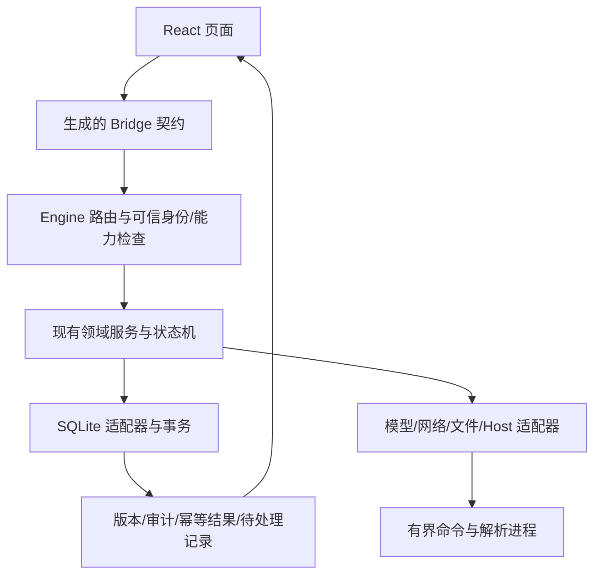

# 第二阶段架构决策与维护边界

本记录对应 S08。基线仍为 `09978597dc026bfa40ab8d690d64f9bcaef476f3`；交付对象是其上的完整工作区变更，最终源文件摘要单独记录。这里解释已经采用的职责划分，不提出另一套引擎。

## ADR-01：保留桌面 Host、Engine 与领域服务

Engine 负责装配、入口身份与能力租约，不把 SQLite 表结构暴露给页面。领域服务通过接口访问存储，SQLite 实现业务需要的原子操作。状态由后端提交结果决定，页面仅保存草稿和可重放的请求标识。Host 负责原生确认、设备和窗口能力；普通浏览器与自动化浏览器分别拥有自己的隔离环境和网络策略，不能借此接管用户原有浏览器。

落实点：`bootstrap/wire.go` 启动恢复完成后开放入口；通用能力 epoch 与组织作用域贯穿执行；计划复用 agentrun；能力包安装账本从页面迁到服务端；解析复用 commandworker，不为知识库另建常驻调度引擎。

## ADR-02：长工作和短提交分开

文档解析、模型生成、握手及外部执行不占用 SQLite 写事务。需要描述未决操作时先持久保存意图，再执行；结束后按观察到的版本提交。知识索引按两阶段 CAS 发布，来源刷新按完整分组原子切换。过期计算结果不能覆盖新版本。

SQLite 事务负责需要共同成立的数据、审计、请求去重和 outbox。外部动作发生后无法确认回执时，记录 unknown，停止自动重放。电脑控制、数据库显式写入、项目执行、自动化任务分别保留本领域的结果语义，不将“已接收”统一改成“已完成”。

落实点：`m8app/kb.go` 的准备/投影/提交；`scheduler/store.go`、`execution_store.go`、`job_revision.go` 分别负责文件账本、未决恢复和配置 CAS；`app/headless_stream.go` 等待真实流终态；`storage/sqlite/m10_queue.go` 在一个写事务内准入/去重/限额和消费精确批次。排队输入已移除应用层对 SQLite 错误类型的反向依赖，错误契约归属 `domain/queueinput`。

## ADR-03：共享资源执行基础，明确限额

`commandworker` 统一绝对执行路径、明确参数、有限输出、时限、整个子进程树回收及 Windows Job 内存限制。Job 提供资源约束，不是防止同用户代码读文件的权限沙箱。

`doctext` 的真实 Engine 路径使用独立子进程，启动解析模式时不打开凭据、数据库或公共管道。输入和解析器临时目录位于受保护数据根；结束后清理，旧崩溃快照在启动时回收。库测试保留直接解析入口。`browsernetwork` 统一网络地址/代理策略，原生环境验证实际浏览器参数，不能仅凭配置字符串宣称代理生效。

## ADR-04：生成契约和架构回归约束后续修改

修改公开字段时更新 schema、客户端使用与正式测试，并运行生成/漂移检查。此次版本字段覆盖会议、技能、专家装备、模板、角色、命令/钩子策略、浏览器和电脑控制设置、自动化任务、记忆设置等实际写入口。未配置、已保存、生效中、生效失败和真实可用分别展示。

新增 `internal/architecture/architecture_test.go`，扫描所有平台构建变体的生产 Go 文件：领域模型只依赖领域模型；`*app` 应用服务不得依赖 Engine/装配器/SQLite；命令、文档、浏览器网络执行基础不得导入凭据服务或业务数据库。现有编译器继续检查 import 环；Bridge 契约测试检查真实注册路由、公开 DTO 和生成漂移。这些检查自动进入全库测试，防止后续重新引入反向依赖。

## 改动与回退纪律

本次按已发现的故障拆分职责，保留现有包和产品入口。没有为了减少单文件行数搬运无关业务或批量改名；大页面的进一步视觉拆分可以另行进行，不把文件变短当作稳定性证明。新迁移追加在旧迁移之后，校验和、完整 schema 对照和历史升级 fixture 共同验证。数据库升级后不能直接用旧二进制打开新库；需要回退时，使用退出运行后验证过的完整目录备份。

最终准入以全量普通测试、全库 race、迁移、契约、类型、静态检查、构建、依赖扫描和发布工具验证为准；本说明本身不替代通过日志。

会话补充的端到端状态：0140持久交付批次负责claim/prepare/start/terminal，消息写入复用原MessageService永久幂等，模型推理位于事务外，checkpoint在注入前保存；详情见[交付账本](phase2-queue.md)。原子消费本身不再被视为交付完成。
