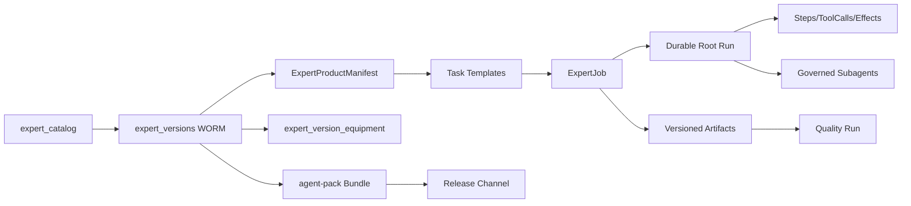

# Lunitide「专家产品化」PRD

- **文档类型**：产品需求文档（PRD）+ 工程落地规格
- **状态**：提案，待批准
- **版本**：v1.0
- **日期**：2026-09-06
- **目标版本建议**：0.5.x–0.7.x，按门禁逐批交付
- **适用代码基线**：Lunitide 0.4.68，Go Core Engine + Windows WebView2 Host + React/TypeScript Renderer + SQLite
- **目标读者**：产品负责人、架构师、Go/React 工程师、测试、安全、运营
- **核心裁决**：每个专家成为独立的“产品体验与能力合同”，但不复制 Core Engine、SQLite 或常驻进程。高风险/长耗时任务按需启动受治理 Worker/子 Agent。

---

## 0. 执行摘要

Lunitide 已经具备专家目录、六段说明书、追加式版本链、技能/MCP/大脑绑定、专家知识库、成长路径、场景卡、项目阶段挂载、会商、可靠 Run、子 Agent、审计和专家市场雏形。当前不足不是“没有 Agent”，而是专家仍主要表现为**一张卡片 + 一段对话人设 + 一组工具**：

1. 除机务类外，多数专家没有自己的任务首页和领域工作台；
2. 工具能力粒度偏通用，PPT/Excel 等生成器无法支撑专业产品级深度；
3. 缺少结构化任务合同、可恢复工作流、版本化交付物和质量门；
4. 缺少专家级评测、运行分析、发布通道、依赖兼容和供应链闭环；
5. “独立产品”的身份、入口、数据域、权限域和生命周期尚未形成统一合同。

本 PRD 提出 **Expert Product Platform（EPP，专家产品平台）**：

- 用户看到的是各自独立、可收藏、可直接开工的专家产品；
- 产品内部复用同一可靠、安全、可审计的 Lunitide 内核；
- 每个专家由版本化的 `ExpertProductManifest` 定义身份、工作台、任务模板、能力、知识、交付物、质量门和治理规则；
- 每个任务形成 durable `ExpertJob`，有输入快照、计划、步骤、检查点、制品、评测、审批和恢复；
- PPT、Excel、开发专家作为第一批旗舰产品，先证明方法，再迁移其余专家。

**产品目标不是“看起来像三个 App”，而是让用户能稳定得到三个专业产品应交付的结果。**

### 0.1 目标评分

“满分 5 分”不能由 PRD 本身保证。达到 **4.9/5.0** 必须同时满足：

- 评分卡总分 ≥ 98/100；
- 所有 P0 阻断门禁通过；
- 三个旗舰专家各自黄金任务集通过率 ≥ 95%；
- 危险越权、无证据成功声明、不可恢复数据损坏均为 0；
- 至少 20 名目标用户、每位 ≥ 3 个真实任务的验收样本满足成功指标；
- 无法获得真实用户样本时，最高只能声明“实验室 4.5/5”，不得宣称 4.9。

---

## 1. 背景与事实基线

### 1.1 当前已有能力（应复用）

| 能力 | 当前证据 | 产品化价值 |
|---|---|---|
| 专家目录与生命周期 | `migrations/0068_m8_expert.sql` | 专家实体、启停、归档 |
| 追加式专家版本 | `expert_versions` WORM 触发器 | 可追溯升级与回滚选择 |
| 专家技能绑定 | `0104_expert_skill_bindings.sql` | 能力装配基础 |
| 版本装备快照 | `0135_expert_equipment_snapshots.sql` | 可重现某版本运行环境 |
| 专家知识与 FTS | `0114_expert_foundation.sql` | 专属知识域 |
| 场景卡 | `expert_scenario_cards` | 任务模板雏形 |
| 项目阶段挂载 | `project_phase_expert_mounting` | 与九阶段项目协作 |
| 专家市场雏形 | `ExpertCenterPage` + embed catalog | 发现和安装入口 |
| agent-pack 供应链 | `0067_m8_plugin.sql` | 签名、权限、安装、隔离可复用 |
| durable Run | `internal/domain/agentrun` | 可恢复执行基础 |
| 受治理子 Agent | `internal/app/chat_subagent.go` | 并行研究/执行基础 |
| Office 生成器 | `excel.gen`、`pptx.gen`、`docx.gen` | 最小制品输出能力 |
| 安全与审计 | DPAPI、权限门、审计哈希链 | 专家产品可信底座 |

### 1.2 当前核心缺口

| 维度 | 现状 | 与专业产品的差距 |
|---|---|---|
| 产品入口 | 专家中心列表，点击后主要进入聊天 | 缺少专家主页、最近任务、模板和一键继续 |
| 任务模型 | 以 chat turn 为主 | 缺少领域任务状态机、检查点、失败恢复 |
| 专家差异 | 六段人设 + 绑定工具 | 缺少领域 schema、工作流、验证器和专属 UI |
| PPT 能力 | 3 类布局、标题、项目符号、备注 | 缺母版、视觉资产、图表/表格、逐页编辑、渲染 QA |
| Excel 能力 | rows + 可选单图表；parse 为 bounded preview | 缺公式、样式、透视/多图、数据清洗、血缘和质量校验 |
| 开发能力 | 文件读写、命令、技能、子 Agent | 缺 repo onboarding、变更集、测试矩阵、review/patch/rollback 产品界面 |
| 交付验收 | 文件生成成功即基本完成 | 缺专家级质量规则、可视预览、验收报告 |
| 发布 | embed 市场为主 | 缺 manifest、兼容解析、评测门、渠道、升级/回退 |
| 运营 | 专家总量与使用入口 | 缺任务成功率、返工率、成本、失败分布和版本对比 |

### 1.3 不可违反的现有约束

1. 正式架构保持 Go Core Engine + WebView2 + React + SQLite；不引入 Electron/Python 第二内核。
2. 普通聊天与项目导航/领域保持分离；专家产品可以从两者被调用，但不得把普通聊天强制转成项目。
3. 原始消息和执行证据不可因摘要或升级而删除。
4. 历史 migration 不得修改；只新增连续 migration。
5. Renderer 不可信；权限、工具、版本、路径和结果验证均由 Engine 决定。
6. 子 Agent 不通过提示词扩权，必须继承父任务模式并经过能力门。
7. 专家产品不得默认成为独立常驻进程；插件也不是第二执行器。
8. 现有 1M token 逻辑上下文、压缩和 handoff 约束继续适用。

---

## 2. 产品定义与边界

### 2.1 什么是“专家产品”

一个专家只有同时拥有以下八项，才被标记为 `productized`：

1. **明确岗位承诺**：适用用户、能解决的问题和拒绝边界；
2. **独立产品入口**：专家主页、任务模板、最近任务和继续入口；
3. **领域输入合同**：结构化输入 schema、附件类型、前置条件；
4. **可恢复工作流**：阶段、步骤、检查点、重试和取消；
5. **版本化能力包**：技能、工具、MCP、模型策略和知识依赖；
6. **专属交付物合同**：产物种类、结构、版本、预览和导出；
7. **专业质量门**：自动检查、证据、人工确认和验收报告；
8. **生命周期**：安装、试用、升级、回退、停用、数据保留与审计。

### 2.2 独立程度分级

| 级别 | 定义 | 使用场景 | 本 PRD |
|---|---|---|---|
| L0 人设卡 | 提示词/六段说明书 | 轻量对话 | 已有，非目标 |
| L1 装备专家 | 人设 + skills/tools/KB | 专项聊天 | 已有，需兼容 |
| L2 专家产品 | 独立主页 + durable job + 领域工作流 + 质量门 | 本地专业生产力 | **本期目标** |
| L3 隔离专家 | L2 + 按需隔离 Worker/沙箱 | 开发命令执行、高风险工具、长任务 | **涉及不可信代码执行时强制；其余选择性启用** |
| L4 独立发行 App | 独立安装包、账号、内核 | 品牌拆分/外部销售 | 非目标；未来仅商业验证后评估 |

### 2.3 为什么不做“一专家一进程/一数据库/一安装包”

- 会复制 Provider、凭据、审计、更新、模型上下文和恢复机制；
- 让跨专家协作产生数据同步和权限穿透；
- 显著提高签名、更新、崩溃恢复和兼容成本；
- 不能自然提升 PPT/Excel/开发结果质量；
- 与现有插件“不是第二执行器”和 SQLite 单内核裁决冲突。

正确做法是：**体验和合同独立，内核和治理统一，执行隔离按风险分配。**

### 2.4 范围

**P0/P1 范围**：

- Expert Product Manifest；
- 专家主页和产品工作台壳；
- durable ExpertJob；
- 任务模板、输入 schema、交付合同、质量门；
- PPT、Excel、开发三个旗舰专家；
- 产品化发布/升级/回退和本地分析；
- 从现有专家无损迁移；
- 与普通聊天、项目、会商、知识、技能、MCP 集成。

**非目标**：

- 为每个专家复制桌面安装包；
- 新建 Python/LangGraph 服务；
- 首期建设开放式收费市场；
- 让第三方代码绕过插件供应链直接执行；
- 自动批准支付、发版、删除生产数据、提交远程代码等高风险动作；
- 用统一万能工作台取代领域工作台。

---

## 3. 用户、JTBD 与核心场景

### 3.1 目标用户

1. **业务创作者**：希望快速得到可演示、可编辑的 PPT，而非文本大纲；
2. **数据办公用户**：希望从杂乱表格得到可靠分析、公式和可审计工作簿；
3. **软件开发者/团队负责人**：希望 Agent 理解仓库、计划变更、实施、验证并给出证据；
4. **专家管理员**：装配、评测、发布、升级专家产品；
5. **组织管理员（后续）**：分发专家、控制能力和查看合规状态。

### 3.2 用户故事

- US-01：作为用户，我从侧栏或专家中心进入 PPT 专家，能直接选择“路演/汇报/培训”等任务，不必先学习提示词。
- US-02：我关闭应用或任务中断后，能在专家主页继续，且不会重复外部副作用。
- US-03：我能在执行前看到输入、计划、预计产物和需要确认的权限。
- US-04：我能逐页/逐表/逐文件审阅中间结果，并只重做失败部分。
- US-05：专家必须交付真实文件、检查报告和证据，不能只说“已完成”。
- US-06：我能把专家任务升级为项目，也能保持为普通独立任务。
- US-07：专家升级后，历史任务仍绑定旧版本；必要时可对新任务回退版本。
- US-08：专家可以调用其他专家，但必须显示委派关系、预算、状态和来源。
- US-09：管理员可以看到某版本在黄金任务集上的质量，不凭描述判断是否发布。
- US-10：当质量门失败、能力降级或外部动作结果未知时，我能看到影响并选择补依赖、接受草稿、核对后重试或取消，而不是被卡在模糊错误中。
- US-11：试用专家前，我能看到期限、能力限制和数据保留；试用结束后可导出或单独删除其任务数据，不与卸载混为一谈。

---

## 4. 产品原则

1. **结果优先于人格**：产品质量主要由工作流、工具、验证器和知识决定，不靠更长 system prompt。
2. **渐进式交互**：简单任务一句话开始；复杂配置按需展开。
3. **先计划、再执行、再验证**：复杂任务必须可审查；简单任务可走快速模式。
4. **结构化状态是事实源**：聊天是交互表面，不是唯一任务状态。
5. **每个成功声明都要有证据**：制品、收据、检查或用户确认至少一项。
6. **领域差异真实存在**：PPT 页、Excel 工作簿、代码变更不能共用同一编辑模型。
7. **默认本地、安全最小化**：凭据、私有文档、工作区和审计遵守现有安全基线。
8. **可退化但不伪装**：能力缺失时明确降级，不生成看似专业的虚假结果。

---

## 5. 信息架构与关键页面

### 5.1 导航裁决

保持用户已确认的低干扰侧栏：不为每个专家永久增加一级入口。

- 侧栏保留“专家中心”；
- 用户可将最多 5 个专家设为“常用”，显示在专家中心展开区或首页快捷区；
- 专家产品入口不挤占“新对话/最近会话/项目/搜索/设置”的核心层级；
- 项目内通过“当前阶段专家”打开；普通会话通过 `@专家` 或“使用专家”调用；
- 专家主页与普通聊天/项目在领域上分离，但可显式转换。

### 5.2 专家中心 2.0

卡片展示：

- 图标、名称、产品化等级（人设/装备/产品）；
- 3 个主任务模板；
- 当前版本、状态、最近成功率；
- “打开产品”“在当前会话使用”“挂载项目”；
- 能力缺口或不兼容提示；
- 试用/已安装/有更新/已隔离状态。

详情页 Tab：

1. 概览；
2. 任务模板；
3. 能力与权限；
4. 知识；
5. 交付物；
6. 质量与评测；
7. 版本与更新；
8. 管理（仅有权限时）。

### 5.3 专家主页（每个产品共享壳、内容可配置）

- 顶部：专家身份、当前版本、运行状态、能力健康；
- 主要区：任务模板卡 + 自由目标输入；
- 最近任务：进行中/待确认/失败可恢复/已完成；
- 最近交付物：预览、打开、另存、版本对比；
- 专属工作台入口；
- “继续上次任务”“从模板开始”“带文件开始”。

### 5.4 任务工作台通用骨架

四栏/四区，不强制同时展开：

1. **目标与输入**：目标、附件、约束、输出位置；
2. **计划与活动**：步骤 DAG、当前状态、子 Agent、预算；
3. **领域画布**：PPT 页面树/Excel 工作簿/代码变更集；
4. **检查与交付**：质量门、风险、待确认、产物和导出。

移动窗口或窄屏降级为 Tab，不出现横向不可用布局。

---

## 6. 核心领域模型

### 6.1 ExpertProductManifest

```json
{
  "schemaVersion": 1,
  "productKey": "ppt-expert",
  "displayName": "PPT专家",
  "productLevel": "productized",
  "expertVersionId": "<ULID>",
  "minEngineVersion": "0.5.0",
  "entry": {
    "home": "expert-home",
    "workbench": "slides",
    "quickActions": ["pitch-deck", "work-report", "training"]
  },
  "taskTypes": ["presentation.create", "presentation.revise"],
  "capabilities": {
    "skills": ["slide-builder", "web-researcher"],
    "tools": ["web.search", "pptx.gen.v2", "pptx.render", "pptx.inspect"],
    "mcp": [],
    "knowledgeScopes": ["expert:self", "task:attachments"]
  },
  "deliverables": ["presentation.spec", "pptx", "rendered-preview", "qa-report"],
  "qualityProfile": "ppt-business-v1",
  "permissionProfile": "office-authoring",
  "modelPolicy": "balanced",
  "upgradePolicy": "manual-major-auto-patch"
}
```

Manifest 必须 canonical JSON + SHA-256；随专家版本形成不可变快照。`productKey` 不依赖显示名称判断。

Manifest 演进规则：Engine 必须读取所有仍受支持的历史 `schemaVersion`；新增可选字段保持向后兼容，破坏性变化使用显式迁移器或新 major schema。迁移只产生新的 manifest/专家版本，不改写旧 digest；不受支持的 schema 必须失败关闭并允许用户回到兼容 Engine，不能静默猜测字段。

### 6.2 ExpertJob

```text
Draft → Ready → Planning → AwaitingApproval → Running
      → Verifying → AwaitingAcceptance → Completed
                   ↘ FailedRecoverable → Running
                   ↘ FailedTerminal
任意非终态 → Canceling → Canceled
```

关键不变量：

- 任务固定 `expert_version_id + manifest_digest + equipment_digest`；
- 每次执行固定输入快照摘要；
- 外部副作用有 effect journal、幂等键和结果未知状态；
- Completed 必须至少有一个已验证交付物；
- 失败后恢复从最近有效 checkpoint 开始，不重放已确认副作用；
- 专家更新不改变运行中或历史任务的行为；
- 转项目生成显式映射，不改变原任务 ID 和证据。

### 6.3 建议新增表（名称可在详设阶段调整）

1. `expert_product_manifests`
   - `manifest_id`, `expert_version_id`, `schema_version`, `product_key`, `manifest_json`, `manifest_digest`, `created_at`
   - append-only；一版本一个 manifest。
2. `expert_task_templates`
   - `template_id`, `expert_version_id`, `task_type`, `title`, `input_schema_json`, `default_plan_json`, `output_contract_json`, `state`
3. `expert_jobs`
   - `job_id`, `subject_id`, `expert_id`, `expert_version_id`, `manifest_digest`, `session_id?`, `project_id?`, `task_type`, `goal`, `state`, `rev`, `created_at`, `updated_at`
4. `expert_job_inputs`
   - `input_id`, `job_id`, `kind`, `ref`, `digest`, `metadata_json`, `created_at`
5. `expert_job_run_bindings`
   - `job_id`, `root_run_id`, `plan_execution_id?`, `binding_kind`, `created_at`
   - 只建立产品任务到现有运行时的引用；Step、ToolCall、Effect、attempt、checkpoint 和 `outcome_unknown` 继续以 `agentrun` 为唯一事实源，不在专家域复制状态机。
6. `expert_job_artifacts`
   - `artifact_id`, `job_id`, `step_id`, `kind`, `path_ref`, `content_digest`, `version`, `validation_state`, `metadata_json`, `created_at`
7. `expert_quality_runs`
   - `quality_run_id`, `job_id`, `profile`, `ruleset_digest`, `score`, `state`, `report_json`, `created_at`
8. `expert_eval_suites` / `expert_eval_cases` / `expert_eval_runs`
   - 专家版本发布前回归数据，不保存不必要的敏感正文。
9. `expert_product_releases`
   - 绑定 `plugin_bundles(kind='agent-pack')`，记录 channel、兼容范围和发布门状态。
10. `expert_usage_daily`
   - 本地聚合，不记录完整 prompt/文档正文。

`expert_task_templates` 是 `expert_scenario_cards` 的产品化投影/后继，不与其长期双重维护：未发布场景卡可导入为模板草稿；模板发布后以 template 为任务合同事实源。`expert_task_claims` 继续只解决同事线程中的“一个任务键一个负责人”，不承担 ExpertJob 生命周期。制品评论复用现有 artifact review；发布晋级复用现有 release promotion 和 plugin install/capability binding，不再造平行机制。

不新建第二 Run 内核。`expert_jobs` 只保存用户可见的产品任务状态与固定版本；实际 Step/ToolCall/Effect/checkpoint 关联现有 durable Root Run、subagent 和 effect journal。现有 `PlanExecution` 只覆盖项目任务；Phase 1 必须新增“非项目 ExpertJob → Root Run”的合法绑定合同，不能伪造项目或假设 `PlanExecution` 可为空项目复用。Job 状态是现有 Run/Effect 状态的确定性投影；跨表提交不能原子完成时必须由 outbox/reconciler 恢复，禁止双重权威状态机。

### 6.4 权威关系



---

## 7. 通用功能需求

### 7.1 产品发现与启动

- **FR-EP-001**：产品化专家必须有稳定 `productKey`，禁止以中文名称决定运行行为。
- **FR-EP-002**：专家中心可筛选“专家产品/装备专家/人设卡”。
- **FR-EP-003**：产品卡展示能力健康，缺硬依赖时禁止开始并给出修复动作。
- **FR-EP-004**：用户可从模板、自由目标、附件、现有会话、项目阶段五种入口启动。
- **FR-EP-005**：简单任务允许快速开始；复杂/高风险任务必须先显示计划。
- **FR-EP-006**：复杂度与风险由冻结规则判定：涉及多文件/多交付物、外部副作用、不可信代码执行、凭据、发布、删除或不可逆动作时不得走无计划快速模式。

### 7.2 任务与恢复

- **FR-JOB-001**：每次任务创建 durable ExpertJob，不允许仅以内存状态运行。
- **FR-JOB-002**：支持暂停、继续、取消、从失败步骤重试和克隆任务。
- **FR-JOB-003**：应用/Engine 崩溃后重启扫描并归类：可恢复、结果待核对、终止。
- **FR-JOB-004**：步骤显示输入、输出、耗时、工具、证据和错误，不显示密钥。
- **FR-JOB-005**：运行中切换专家版本只影响新任务。
- **FR-JOB-006**：普通任务可显式“转为项目”；转换需预览、确认和可恢复事务。
- **FR-JOB-007**：外部副作用进入“结果待核对”时，工作台必须显示目标、请求摘要、最后证据和“已在外部确认成功/确认未发生后重试/放弃并保留记录”三类裁决；未经用户或受控 reconcile 证明，不得自动重放。

### 7.3 能力与委派

- **FR-CAP-001**：有效能力 = manifest 声明 ∩ 已安装能力 ∩ 用户/组织授权 ∩ 当前执行模式。
- **FR-CAP-002**：能力缺失时允许受控降级，但交付合同的硬依赖不可降级。
- **FR-CAP-003**：专家委派使用现有受治理 subagent，记录父子关系、预算、版本、目的和摘要证据。
- **FR-CAP-004**：写能力不可由子 Agent 自行申请；继承父任务上限并按工具审批。
- **FR-CAP-005**：电脑控制、支付、登录、发布、删除、外部发送不得由产品 manifest 预批准。
- **FR-CAP-006**：任务运行中需要新增权限时必须暂停并展示原因、精确工具/参数范围、持续时间和风险；拒绝后允许降级或取消，批准不得超过父任务和组织策略上限。
- **FR-CAP-007**：跨专家 contribution 一律作为不可信数据而非指令；Synthesizer 必须保留来源/不确定性并再次执行输出策略检查。

### 7.4 交付物与审阅

- **FR-ART-001**：交付物进入版本链，每次修改生成新版本，不覆盖历史证据。
- **FR-ART-002**：每种交付物必须有结构 schema、文件验证器和预览适配器。
- **FR-ART-003**：用户可评论、接受、要求修改或回退到历史版本。
- **FR-ART-004**：完成摘要必须引用真实 artifact ID/path/digest 与质量报告。
- **FR-ART-005**：导出到桌面/外部目录是显式副作用，记录 receipt；结果未知时不得自动重试。

### 7.5 版本、安装和供应链

- **FR-REL-001**：产品化专家以 `agent-pack` 分发，复用 plugin bundle 的签名、SBOM、权限、隔离和安装状态机。
- **FR-REL-002**：安装前展示权限增量、依赖和数据访问范围。
- **FR-REL-003**：Patch 可按策略自动更新；Minor/Major 默认人工确认。
- **FR-REL-004**：升级前运行兼容检查与最小评测；失败不切换 current version。
- **FR-REL-005**：回退仅影响新任务；历史任务继续绑定原版本。
- **FR-REL-006**：卸载专家产品不删除用户任务、产物、消息和审计；仅撤销能力绑定。
- **FR-REL-007**：发布渠道固定为 `dev → beta → stable`；最小评测 = 该专家黄金集的风险分层确定性子集（至少覆盖每类阻断条件）且必须 100% 通过，完整黄金集用于 beta→stable。Engine 版本不满足 manifest 兼容范围时禁止升级/回退。
- **FR-REL-008**：kill switch 触发时，新任务停止创建；未产生副作用的运行中任务暂停为可恢复态；已有副作用或结果未知的任务进入核对流程，不能直接取消或切换版本。

### 7.6 质量与运营

- **FR-QA-001**：每个产品版本必须绑定质量 profile 和黄金任务集。
- **FR-QA-002**：发布门输出分项得分、失败样例、基线差异和是否阻断。
- **FR-QA-003**：本地质量看板展示成功率、首轮通过率、返工次数、恢复率、成本和耗时。
- **FR-QA-004**：默认不上传文档正文、代码、prompt 或凭据；遥测必须显式选择加入。
- **FR-QA-005**：用户评分与“真实接受交付物”分开统计，避免只优化点赞。

---

## 8. 旗舰产品 A：PPT 专家

### 8.1 产品承诺

把目标、资料和品牌约束转化为**可编辑、可演示、视觉一致、引用可追溯**的 PPTX，并支持逐页审阅和局部重做。

### 8.2 首批任务模板

1. 商业路演 Deck；
2. 工作汇报/项目复盘；
3. 培训课件；
4. 产品发布/方案宣讲；
5. 现有 PPT 改版（P1）。

### 8.3 工作流

```text
目标澄清 → 资料摄入/研究 → 受众与叙事策略 → 大纲确认
→ 逐页内容规格 → 视觉方向/母版 → 资产生成或选取
→ PPTX 构建 → 渲染预览 → 逐页 QA → 用户验收 → 导出
```

### 8.4 必须升级的能力

现有 `pptx.gen` 保留为兼容 V1，新建 V2 合同，不原地破坏：

- `pptx.import`：解析现有 PPTX 的页、文本、图片、备注、主题；
- `pptx.gen.v2`：支持母版、主题色/字体、网格、文本框、图片、表格、图表、形状、页码、来源脚注、备注；
- `pptx.patch`：按 slide ID 局部增删改，不重建无关页；
- `pptx.render`：渲染逐页 PNG/PDF 预览。发布为 L2 PPT 专家前必须至少确定并交付一个受支持 renderer adapter；本机不可用时可降级生成结构合法文件，但任务标记 `visual_qa_incomplete`，不得计入 PPT VTSR、黄金集通过或 4.9 评分；
- `pptx.inspect`：溢出、遮挡、低对比度、空页、字体、图片清晰度、引用和备注检查；
- `asset.search/generate`：受版权/来源约束的视觉资产；
- `presentation.spec`：先生成结构化中间表示，再构建 PPTX。

### 8.5 专属工作台

- 左：页面树、章节、拖拽排序；
- 中：当前页渲染预览；
- 右：内容、布局、主题、备注、来源、QA；
- 顶部：大纲/设计/预览/交付模式；
- 支持“仅重做本页”“锁定此页”“沿用此风格”；
- 首期不做完整 PowerPoint 编辑器，复杂手工编辑交给 PowerPoint/WPS。

### 8.6 PPT 质量门

- 文件可被目标 Office/WPS 打开；
- 每页有稳定 ID，页面数和大纲一致；
- 文本无溢出/严重遮挡；
- 对比度和最小字号达标（模板可配置）；
- 视觉重复度、信息密度在阈值内；
- 所有外部事实页有来源；
- 图片来源/生成标记可追踪；
- 演讲备注按模板要求存在；
- 禁止只有项目符号堆砌却标记“设计完成”。

QA 分两层：结构 QA 基于 `presentation.spec` 和 PPTX 包完成；像素 QA 基于受支持 renderer 检查裁切、遮挡、对比度和实际字体回退。像素 QA 未运行时只能以“可编辑草稿”交付。字体必须记录期望字体与实际可用性；首期不承诺嵌入所有商业字体。视觉资产必须记录来源 URL/许可证或生成模型/时间，不明版权资产不得进入可商用模板。

### 8.7 PPT 黄金集

至少 60 例：中文路演 15、周报/复盘 15、培训 10、产品方案 10、资料不足/冲突/无网络等异常 10。人工盲评维度：叙事、内容准确、视觉、可编辑性、演讲可用性。

---

## 9. 旗舰产品 B：Excel 专家

### 9.1 产品承诺

把 CSV/XLSX/结构化资料转化为**计算正确、可审计、可复用、可解释**的工作簿和分析结论，不把“生成一张表”冒充数据分析。

### 9.2 首批任务模板

1. 经营分析与月报；
2. 预算/实际/差异分析；
3. 数据清洗与合并；
4. BOM/采购/库存表；
5. 模板化台账；
6. 现有工作簿检查与修复。

### 9.3 工作流

```text
导入 → 数据画像 → 字段/口径确认 → 清洗计划 → 只读预览
→ 转换/计算 → 对账与异常检测 → 工作簿设计
→ 公式/图表/格式生成 → 重算或验证 → 数据血缘报告 → 用户验收
```

### 9.4 必须升级的能力

现有 `excel.gen` 作为 V1；新增：

- `excel.inspect`：sheet、used range、类型、公式、名称、合并、隐藏、错误值和外链；
- `excel.transform`：声明式清洗/映射/连接/聚合，禁止直接执行任意脚本；
- `excel.gen.v2`：公式、格式、条件格式、冻结窗格、筛选、表格、数据验证、多图表、命名区域；Pivot 首期仅支持解析/保留，不承诺新建，UI 必须明确显示该限制；
- `excel.patch`：按 sheet/range/table ID 局部修改；
- `excel.calculate`：优先使用受支持的确定性公式求值；不支持公式需标明 `not_calculated`。任何 COM/Office/LibreOffice 重算只能在隔离适配器中运行，禁用宏、外链更新和网络；
- `excel.validate`：行数、唯一性、范围、勾稽、公式错误、总计、抽样对账；
- `data-lineage.json`：输入摘要 → 转换 → 输出单元格/表。

不得默认通过 Excel COM 作为生成路径；如未来用于真机重算，必须是可选、显式、受控适配器。

### 9.5 专属工作台

- 数据源区：文件、sheet、字段、类型、质量；
- 转换步骤区：可读步骤和前后样本；
- 工作簿区：sheet/表/图表导航；
- 质量区：错误、异常、口径和对账；
- 支持“撤销此转换”“修正字段类型”“锁定口径”“只刷新数据不改模板”。

### 9.6 Excel 质量门

- 文件结构合法、可打开；
- 输入/输出行数及过滤差异可解释；
- 关键公式不存在 `#REF!/#VALUE!/#DIV/0!`；
- 总计/小计/关键勾稽通过；
- 数字、日期、百分比类型正确；
- 单位、币种、口径和时间范围可见；
- 图表引用范围有效；
- 数据血缘完整；
- 隐藏 sheet/列、外部链接和宏必须明确披露；
- 对无法重算的公式不得声明“计算正确”。

### 9.7 Excel 黄金集

至少 80 例：清洗 20、汇总 20、预算差异 15、BOM/库存 10、公式审计 10、异常/恶意文件 5。数值正确性优先。关键单元格指用于最终结论、总计/小计、勾稽、对外提交或由模板显式标记的单元格；它们必须落入可重算白名单且确定性断言 100% 通过，否则任务只能以 `calculation_incomplete` 草稿结束，不能标记 Completed。

---

## 10. 旗舰产品 C：开发专家

### 10.1 产品承诺

在用户授权的仓库中完成**可审查、最小范围、经验证、可恢复**的开发任务；不能用“代码看起来合理”替代测试和证据。

### 10.2 首批任务模板

1. 修复明确 Bug；
2. 实现局部功能；
3. 代码审查与修复建议；
4. 补测试/提升覆盖；
5. 依赖升级（受限）；
6. 仓库理解与技术方案。

### 10.3 工作流

```text
仓库接入/规则发现 → 目标与边界 → 搜索定位 → 基线与风险分类
→ 可审查计划 → 恢复点 → 垂直切片实施 → 每次补丁读回
→ 定向测试 → 扩展验证 → 独立 review → 变更摘要/证据 → 用户验收
```

### 10.4 能力要求

- `repo.inspect`：技术栈、入口、规则、dirty tree、分支和构建命令；
- `code.search/read/graph`：搜索优先、窄读、符号关系；
- `changeset.apply`：原子补丁、路径约束、读回验证；
- `test.run`：命令策略、超时、输出截断、结果收据；执行仓库脚本属于不可信代码执行，强制进入 L3 隔离边界，使用 workspace lease、环境变量白名单、默认禁出站网络和资源上限；
- `review.run`：bug/security/compatibility 独立只读审查；
- `checkpoint.create/restore`：复用现有 change set/恢复机制；
- `artifact.report`：变更文件、验证、残留、提交/发布状态分离；
- 子 Agent 首期只允许并行调查和只读审查。代码写入只由 Root Run 串行执行并受工作区 lease、审批和 change set 约束；未来若开放写入子 Agent，必须先以新 ADR、新 capability 合同和迁移解除现有只读边界，不能沿用提示词扩权。

### 10.5 专属工作台

- 仓库概览：分支、dirty、规则、技术栈、权限；
- 计划：依赖、风险、状态、并行分支；
- 变更集：文件/patch/原因/验证关联；
- 终端与测试：受控命令、实时状态、失败聚类；
- Review：问题严重度、定位、处理状态；
- 交付：完成/未完成/未验证/残留、是否提交/签名/发布。

### 10.6 开发质量门

- 修改前读取适用规则；
- dirty tree 的未知变更不得覆盖；
- 每次 patch 成功落点读回；
- 至少运行最窄相关验证；
- 失败、跳过、警告不能汇总为“通过”；
- 数据迁移只新增，不改历史；
- 高风险任务有恢复点与独立审查；
- 不泄露环境变量、凭据、私有代码；
- 不把本地通过说成 CI 通过，不把 build 说成已发布；
- 未形成实际 diff/产物时，不得声明“已实现”。

### 10.7 开发黄金集

至少 100 例：Go/TS 主要栈各 25，Bug 修复 20，测试 10，迁移/并发/安全 10，dirty tree/失败恢复/权限拒绝 10。采用隐藏测试 + diff review + 安全用例；“破坏现有功能但新增测试通过”计失败。

---

## 11. 跨专家协作

### 11.1 协作模型

- **Lead Expert**：拥有最终任务与交付合同；
- **Contributor Expert**：提交结构化 contribution；
- **Reviewer Expert**：只读检查，不直接改最终结果；
- **Synthesizer**：仅按合同合并，不得抹掉来源和领域结论。

### 11.2 协作合同

```json
{
  "contributionId": "<ULID>",
  "parentJobId": "<ULID>",
  "expertId": "<ULID>",
  "expertVersionId": "<ULID>",
  "role": "contributor",
  "requestedOutputSchema": "research-evidence-v1",
  "evidenceRefs": [],
  "artifactRefs": [],
  "summary": "",
  "limitations": []
}
```

- 最多并行数沿用受治理配额，不因专家产品化扩大；
- 跨专家写入同一文件必须串行或通过结构化合并；
- 领域强约束（如机务引用）不可被 PPT 专家改写；
- Lead 不得将 Contributor 的不确定结论改成确定事实。

---

## 12. API / Bridge 设计建议

新增 schema 后继续走：schema → bridge generator → Go handler → service → SQLite → typed client。

### 12.1 产品与模板

- `expert.product.get({expertId|productKey})`
- `expert.product.health({expertId})`
- `expert.template.list({expertId})`
- `expert.template.get({templateId})`

### 12.2 任务

- `expert.job.create`
- `expert.job.get`
- `expert.job.list`
- `expert.job.plan`
- `expert.job.approve`
- `expert.job.start`
- `expert.job.pause`
- `expert.job.resume`
- `expert.job.retryStep`
- `expert.job.cancel`
- `expert.job.convertToProject`
- `expert.job.subscribe`（流事件）
- `expert.job.resolveUnknownEffect`
- `expert.job.requestCapability` / `expert.job.decideCapability`

所有 mutation 使用 idempotency key / mutation attempt；状态更新使用 `expectedRev`。

### 12.3 交付物与质量

- `expert.artifact.list/get/preview`
- 复用现有 `workspace.artifactReview.append`，仅在 payload/查询中增加可选 `expertJobId` 关联，不另建平行评论系统
- `expert.artifact.accept`
- `expert.quality.run/get`
- `expert.eval.run/get/compare`

### 12.4 发布

- `expert.pack.build/inspect/install/upgrade/rollback`
- `expert.release.promote`

发布、升级、回退是高风险变更，必须有确认 token、权限摘要和审计事件。

### 12.5 错误语义

错误至少区分：

- 合同/输入错误；
- 能力缺失；
- 权限拒绝；
- 依赖不兼容；
- 可恢复执行失败；
- 外部副作用结果未知；
- 质量门失败；
- 版本漂移/OCC 冲突；
- 供应链隔离。

禁止把所有错误压成“生成失败”。

---

## 13. 安全、隐私与治理

### 13.1 权限

权限分层：

1. Read：专家知识、任务附件、受控工作区；
2. Create：在任务工作区生成新制品；
3. Edit：修改已有文件；
4. Execute：运行命令/工具；
5. External：网络、发送、远程系统；
6. Privileged：凭据、发布、删除、支付、系统控制。

Manifest 只能声明需求，不能授予权限。最终能力由 Engine 计算。

### 13.2 数据隔离

- 专家知识 scope、任务 workspace、项目 workspace 分开；
- 用户显式挂载才能跨 scope 使用；
- 本地专家记忆 key 必须含 expert/product/job 范围；
- 任务结束不自动沉淀长期记忆；继续沿用提名/确认机制；
- 卸载不删用户数据，提供独立“删除数据”流程和保留说明。

### 13.3 审计动作

新增建议动作：

- `expert.product.install/upgrade/rollback/uninstall`
- `expert.job.created/approved/canceled/recovered/completed`
- `expert.job.external_effect`
- `expert.artifact.accepted/exported`
- `expert.quality.overridden`
- `expert.release.promoted`

高价值动作进入 tamper-evident audit chain；禁止 update/delete。

### 13.4 不可信输入

- Office、压缩包、网页、仓库文档均视为不可信；
- 解析器限大小、页数、解压比和嵌套深度；
- 文档中的“指令”不能改变 system policy；
- 宏、外链、嵌入对象默认不执行；
- 市场包执行前必须签名/SBOM/权限审查，不通过进入 quarantine。

### 13.5 命令、渲染与网络隔离

- 开发专家执行仓库命令必须使用 L3 隔离：限定 workspace lease、`commandEnv()` 环境白名单、CPU/内存/时长/进程数上限，默认禁止网络；命令不得读取 lease 外文件或继承用户密钥。
- Office/LibreOffice/COM 适配器只能在隔离进程中打开不可信文件，禁宏、禁外链刷新、禁网络、使用临时副本；适配器失败不得污染原文件。
- `web.search`、`web.fetch`、资产搜索和 MCP 出站执行现有 URL/端点策略，并补充拒绝私网/环回/云元数据地址、重定向复验、域名策略和出站审计；用户私有正文不得自动拼入查询。
- 跨专家输出、网页摘要和工具结果都按不可信数据处理，不得改变权限、system policy 或审批状态。

---

## 14. 非功能需求

- **NFR-001 可恢复性**：未终结任务 ≤1000 时，Engine 崩溃后 30 秒内完成状态扫描；超过时分批扫描，并在 5 秒内恢复首屏和标出“仍在核对”的任务。不代表 30 秒内完成业务任务。
- **NFR-002 一致性**：Job 状态、Run 状态、effect receipt 的关键转换必须同事务或有可证明的恢复协议。
- **NFR-003 性能**：专家主页本地数据首屏 p95 < 800ms；1000 个任务列表分页首屏 p95 < 1s（基准机需冻结）。
- **NFR-004 大任务**：流事件必须有背压/有界缓存；列表均分页，分页上限不是总量上限。
- **NFR-005 可访问性**：键盘完成任务启动、审批、审阅和导出；状态不只依赖颜色。
- **NFR-006 兼容性**：Win10/Win11 与既定 WebView2 支持矩阵；Office 文件至少通过结构验证，并在真机矩阵抽验。
- **NFR-007 国际化**：manifest 使用稳定 key；显示文本可本地化，不以显示文本驱动逻辑。
- **NFR-008 可观测性**：每个 Job/Run/Step/Artifact/QualityRun 有关联 ID；日志不含 secret 和不必要正文。
- **NFR-009 成本**：显示预计/实际 token、工具次数和耗时；支持任务预算上限。
- **NFR-010 向后兼容**：L0/L1 专家继续可用；用户不被强制迁移。

Phase 0 必须冻结性能基准机（CPU、内存、磁盘、Windows/WebView2 版本）和测量脚本。“任务启动时间”固定为点击模板/提交目标到首个可执行计划展示，不包含用户填写表单时间。视觉信息密度等领域阈值由质量 profile 版本化，未冻结默认值前不得进入 stable 门禁。

---

## 15. 成功指标与 5 分评分卡

### 15.1 北极星指标

**Verified Task Success Rate（VTSR）**：在任务模板承诺的 SLA 内，产出通过该模板全部硬质量门并被用户接受的专家任务占比。计时从用户点击“开始执行”到首次出现“可接受”版本；等待用户补充信息/审批的时长单独记录并从执行 SLA 中扣除。

### 15.2 指标

| 指标 | 4.0 门槛 | 4.9 门槛 |
|---|---:|---:|
| VTSR | ≥ 80% | ≥ 92% |
| 首轮交付接受率 | ≥ 60% | ≥ 80% |
| 黄金集通过率 | ≥ 85% | ≥ 95% |
| 崩溃后可恢复任务成功率 | ≥ 95% | ≥ 99% |
| 成功声明有证据率 | 100% | 100% |
| 高风险越权 | 0 | 0 |
| 结果未知自动重放 | 0 | 0 |
| 用户任务启动中位时间 | < 90 秒 | < 30 秒 |
| 注入的重大回归用例检出率 | 100% | 100% |

### 15.3 100 分评分卡与计算规则

每个维度先冻结一组可观察子指标。连续指标按 `min(1, 实际值/目标值)`（越低越好的指标用 `min(1, 目标值/实际值)`）换算；布尔门按通过率换算；维度分 = 子指标加权均值 × 维度权重。盲评采用 5 分量表、至少 3 名评审者，报告 Krippendorff's alpha；`alpha < 0.67` 时该轮盲评无效，需校准后重评。最终总分保留一位小数，不得人工补分。

| 维度 | 权重 | 冻结子指标 |
|---|---:|---|
| 专业结果质量 | 25 | 各专家黄金集通过率 60%；盲评均分 40% |
| 任务完成与恢复 | 15 | VTSR 50%；恢复/取消/未知结果故障集 50% |
| 易用性 | 15 | 首轮接受率 50%；启动耗时 25%；无提示词任务完成率 25% |
| 领域工作台 | 10 | 局部修改正确率 40%；预览/审阅完成率 30%；可访问任务完成率 30% |
| 安全与隐私 | 15 | **阻断维度**：权限、隔离、审计、供应链、数据外泄负例通过率 |
| 可追溯性 | 8 | 版本/输入/步骤/产物/QA 关联完整率 |
| 性能稳定性 | 5 | NFR 基准与 8 小时稳定性用例通过率 |
| 可扩展与发布 | 5 | manifest 兼容、agent-pack、升级/回退矩阵通过率 |
| 可访问性与文案 | 2 | WCAG/键盘任务与错误可理解性用例通过率 |

分档：4.0 = 80.0–89.9；4.5 = 90.0–97.9；4.9 = 98.0–99.4；5.0 = 99.5–100。4.9/5.0 还要求全部阻断项为 0、三个专家黄金集均 ≥95%，不能用一位专家超额抵消另一位失败。5.0 仅在连续两个正式版本和真实用户样本均达标后授予。

统计口径分开：黄金集用于确定性发布门；真实用户样本用于 VTSR/易用性，不与黄金集混算。首轮 20 人×3 任务只作为探索样本；4.9 正式判定要求每个旗舰专家至少 100 个合格真实任务，报告 95% 置信区间。恢复可靠性另用至少 200 次故障注入且不可恢复失败为 0；样本不足时该项标记“证据不足”，不得按 99% 达标。

---

## 16. 模拟真实使用效果

### 16.1 PPT 专家：融资路演

**输入**：用户拖入产品介绍、财务 Excel、品牌 Logo，选择“12 页融资路演”，要求中文、15 分钟。

**系统表现**：

1. 自动识别资料和敏感财务范围；
2. 提出最多 3 个真正阻断的问题：受众、融资轮次、可公开口径；
3. 生成叙事大纲，用户锁定 3/7/12 页；
4. 研究子 Agent 补市场证据，Excel 专家提供财务图表数据；
5. PPT 专家生成结构化 presentation spec 与 PPTX；
6. 渲染逐页预览，QA 发现第 8 页标签拥挤，只重做该页；
7. 输出 `路演_v3.pptx`、逐页预览、来源清单、QA 报告。

**理想效果**：不是“返回一个蓝绿色项目符号文件”，而是用户能在工作台看到大纲、页面、来源、问题和版本，只修改局部。

**失败降级**：渲染器不可用时仍生成结构合法 PPTX，但明确显示“未完成像素级 QA”，任务不能获得满质量分。

### 16.2 Excel 专家：经营月报

**输入**：12 个门店 CSV + 去年模板.xlsx；字段名称不统一、部分日期错误。

**系统表现**：

1. 数据画像发现 3 种日期格式、2 个重复门店 ID、缺失币种；
2. 用户确认口径后冻结转换规则；
3. 生成清洗预览与受影响行数；
4. 合并数据，生成经营汇总、门店明细、异常清单和趋势图；
5. 运行行数/总额/同比/环比勾稽；
6. 对不支持重算的模板公式显示 `not_calculated`，不虚称正确；
7. 输出月报.xlsx、lineage.json、质量报告。

**理想效果**：用户能回答“这个数字从哪里来、改了什么、哪些没验证”。

### 16.3 开发专家：修复 Lunitide Bug

**输入**：“修复某流式会话取消后仍出现完成提示”，指定仓库。

**系统表现**：

1. 读取规则、git 状态和相关符号，识别用户已有未提交修改；
2. 建立最小恢复点，不 stash/覆盖未知修改；
3. 给出 4 步计划并标记涉及 chat run state；
4. 探索 Agent 查取消链路，测试 Agent定位现有测试；
5. 主 Agent 原子补丁，读回后运行定向测试；
6. Bug reviewer 独立检查竞态和错误提示；
7. 输出 diff、通过/失败测试、残留风险；明确“未提交、未发布”。

**理想效果**：用户获得的是可信变更集，不是“我已经修好了”的聊天文本。

### 16.4 跨专家：季度复盘

产品经理专家为 Lead，Excel 专家计算数据，报告专家写正文，PPT 专家形成汇报。每个 contribution 带版本和证据；PPT 不得修改 Excel 已确认数字，Lead 对冲突发起用户确认。最终任务交付 XLSX、DOCX、PPTX 与统一证据索引。

---

## 17. 分期实施

### Phase 0：裁决与基线（1–2 周）

- 批准本 PRD、术语和非目标；
- 冻结三个专家的黄金任务集 v1；
- 建立当前 0.4.68 基线：成功率、耗时、制品能力；
- ADR：Expert Product 不新增第二执行内核；
- 威胁模型和数据保留评审。

**出口**：需求追踪矩阵、评测数据、ADR、无未决架构冲突。

### Phase 1：平台最小闭环（3–5 周）

- manifest、template、job、artifact、quality schema；
- 专家主页、最近任务、通用任务工作台；
- Job → durable Run 适配；
- 新增非项目 ExpertJob → Root Run 绑定；项目任务才复用 PlanExecution；
- 建立 `product_key → expert_id/catalog_item_id` 映射，并分阶段把 `ComposeForExpertNames` 等名称驱动路径迁移为稳定 key；显示名称只用于 UI；
- 暂停/恢复/取消/失败重试；
- 质量报告与证据式完成；
- 现有专家兼容适配。

**出口**：一个内部 Demo 专家可完成创建→执行→恢复→QA→接受全链路。

### Phase 2：PPT 产品化（4–7 周）

- presentation spec；
- pptx V2、patch、render、inspect；
- 至少一个受支持 renderer adapter 在隔离模式通过安全与真机验证；否则不得发布 L2 PPT 产品标签；
- 页面树与逐页 QA；
- 60 例黄金集；
- 真机 Office/WPS 抽验。

### Phase 3：Excel 产品化（4–7 周，可与 Phase 2 后半并行）

- inspect/transform/gen V2/patch/validate；
- 确定公式白名单与隔离重算策略；关键公式不可验证时不得 Completed；
- 血缘与口径确认；
- 80 例黄金集；
- 恶意/异常工作簿安全测试。

### Phase 4：开发专家产品化（5–8 周）

- repo onboarding、plan、change set、test/review 工作台；
- 子 Agent 角色合同；
- dirty tree、恢复、迁移、安全门；
- 100 例黄金集。

### Phase 5：发布与规模化（3–5 周）

- agent-pack manifest 绑定、签名、SBOM、权限增量；
- install/upgrade/rollback；
- 评测门和发布 channel；
- 本地分析看板；
- 其余专家迁移工具。

### Phase 6：4.9 验收（至少 4 周真实试用）

- ≥20 目标用户、≥60 个真实任务；
- 修复前三类失败；
- 连续两轮回归；
- 评分卡与残留风险评审；
- 达标后才允许对外声明 4.9。

> 人周需要在 Phase 0 根据团队人数、Office 渲染策略和现有代码债重新估算；本文不提供伪精确工期承诺。

---

## 18. 迁移方案

### 18.1 无损升级

- 现有 `expert_catalog`/`expert_versions` 保留；
- 新表通过 `expert_version_id` 扩展，不修改 WORM 历史；
- 现有专家默认 `productLevel='equipped'`；
- PPT/Excel/开发专家新版本追加 manifest 后升级为 `productized`；
- 旧任务继续使用旧专家行为；
- 显示名称映射逐步移除，改为 `catalog_item_id/product_key`；
- 现有 `pptx.gen/excel.gen` 不删，V2 并存并设兼容期限。

### 18.2 数据回填

- 6.2 的版本/digest 强不变量只适用于新建 L2 ExpertJob。当前版本能确定装备时 `known=1`；历史未知继续 `known=0`，manifest/equipment digest 可空并标记 `legacy_unverifiable`，不得猜测，也不得计入可复现性或 4.9 指标；
- 场景卡可迁移为 task template 草稿，必须人工/测试批准后发布；
- 本地路径型 KB 来源跨机安装标记 missing/stale，不打包用户私有文件；
- embed catalog 继续作为内建发行源，远程市场后续单独建设。
- 存量专家聊天不伪造 ExpertJob；在专家主页以只读 `pre-job history` 展示并可“基于此对话创建新任务”。

### 18.3 回退

- DB 采用前向修复，不删除已应用 migration；
- 功能通过 rollout flag/kill switch 关闭；
- manifest 解析失败回退 L1 专家聊天，不执行 L2 Job；
- 专家产品版本回退只切换新任务默认版本；
- 已创建 Job 始终按固定版本继续或显式克隆迁移。

---

## 19. 测试与验收

### 19.1 测试层级

1. Manifest/schema/canonical digest 单测；
2. Job 状态机、OCC、幂等和恢复属性测试；
3. Bridge schema 生成一致性；
4. SQLite migration/指纹/触发器测试；
5. 工具权限和越权负例；
6. 各专家制品结构验证；
7. 黄金任务集；
8. 崩溃注入、取消、超时、结果未知；
9. Win10/Win11 + Office/WPS/WebView2 真机矩阵；
10. 可访问性、窄屏和性能基准；
11. 安全审查与恶意文档/仓库输入；
12. 真实用户任务验收。

### 19.2 P0 阻断条件

以下任一存在不得发布产品化标签：

- Job 可丢失或重复外部副作用；
- 运行时专家版本漂移；
- Renderer 可绕过权限；
- 未验证制品被标为完成；
- 历史任务或审计被升级/卸载破坏；
- PPT/Excel 文件结构损坏；
- Excel 关键数值错误；
- 开发专家覆盖未知用户改动；
- agent-pack 签名/权限增量绕过；
- 黄金集低于各阶段阈值。

### 19.3 需求追踪模板

```text
FR-ID → PRD 场景 → Manifest/Schema → Handler/Service → Migration
→ Unit/Integration/E2E/Eval Case → Evidence → Release Gate
```

每个 Phase 在开工前建立矩阵，不允许只有 UI 截图而无状态机/数据/验证证据。

---

## 20. 风险与缓解

| 风险 | 后果 | 缓解 |
|---|---|---|
| 只做独立页面，不升级能力 | 体验更漂亮但结果仍浅 | 能力深度和黄金集作为硬门 |
| 建三套特例代码 | 后续专家无法扩展 | 80% 通用平台 + 20% 领域适配器 |
| 通用 manifest 过度抽象 | 首期迟迟无法交付 | 以三旗舰反向校验，schemaVersion 演进 |
| Office 渲染依赖不稳定 | PPT QA 无法可信 | renderer adapter + 明确降级 + 真机矩阵 |
| Excel 公式不能重算 | 错误结果 | 支持集白名单，未知公式 `not_calculated` |
| 开发 Agent 权限过大 | 数据/代码风险 | workspace lease、父模式继承、审批、恢复点 |
| 市场包供应链攻击 | 任意能力注入 | 复用签名/SBOM/隔离/权限增量门 |
| 专家升级破坏历史 | 不可复现 | Job 固定版本+manifest/equipment digest |
| 指标被“点赞”误导 | 质量虚高 | VTSR + 真实接受 + 确定性测试组合 |
| UI 侧栏膨胀 | 破坏低干扰体验 | 不为每专家加永久一级入口 |
| 运行时继续巨型化 | 维护风险 | Job orchestration 独立服务，不继续堆入 `runStream` |

---

## 21. 竞品/模式对比与吸收原则

| 模式 | 可吸收 | 不照搬 |
|---|---|---|
| Custom GPT/轻量自定义 Agent | 低门槛创建、指令+知识+动作 | 不能停留在提示词卡片 |
| Microsoft Copilot Studio | Agent + workflow、连接器、测试、发布、分析、治理 | 不引入云端低代码内核替代本地架构 |
| Claude Skills/技能模式 | 可组合、渐进加载、能力复用 | Skill 不等于完整专家产品 |
| Gamma/演示产品 | 任务优先、视觉预览、快速改稿 | 不把不可编辑图片当 PPT |
| Microsoft 365 Copilot | 文档上下文和 Office 内工作流 | 不绑定单一办公套件/云租户 |
| Codex/Claude Code 类开发 Agent | 仓库理解、计划、工具、验证、委派 | 不允许无恢复和无权限边界的自治 |
| Lunitide 现有机务工作台 | 专家卡 + 领域工作台 + KB + 引用门 | 不为每个专家复制业务数据库和页面代码 |

Lunitide 的差异化应是：**本地优先、可恢复、可审计、跨专家协作、交付物可验证，而不是专家数量最多。**

---

## 22. 待批准产品决策

默认建议如下，若批准 PRD 即按默认项推进：

1. **独立定义**：采用 L2 专家产品 + 风险驱动 L3 隔离，不做一专家一安装包；
2. **首批顺序**：平台 → PPT → Excel → 开发；
3. **市场策略**：首期内建与本地 agent-pack，不做付费市场；
4. **导航**：保持一个专家中心，常用专家可快捷固定，不扩张一级侧栏；
5. **Office 策略**：纯 Go 文件构建为主，渲染/真机重算做可选适配器；
6. **评分声明**：真实用户验收前不宣称 4.9。

---

## 23. 开工 Definition of Ready

- [ ] PRD 状态由“提案”改为“已批准”；
- [ ] ADR 通过：统一内核 + 专家产品聚合 + Worker 风险隔离；
- [ ] 三旗舰黄金集、评分器和基线完成；
- [ ] manifest v1 和 Job 状态机详设完成；
- [ ] 数据保留、权限、审计和威胁模型完成；
- [ ] Office 渲染/重算技术 spike 给出实测结论；
- [ ] Bridge/API、迁移、UI 原型评审完成；
- [ ] Phase 1 需求追踪矩阵完成；
- [ ] 回退开关、恢复测试和发布门定义完成。

## 24. 完成 Definition of Done

- [ ] 三旗舰均达到 L2 八项定义；
- [ ] 所有 P0 阻断条件关闭；
- [ ] 黄金集与真机矩阵通过；
- [ ] 崩溃/取消/结果未知/升级/回退演练通过；
- [ ] 安全和供应链评审通过；
- [ ] 普通聊天、项目和旧专家无回归；
- [ ] 文档、迁移、Bridge、测试和发布证据可追踪；
- [ ] 真实用户指标达到声明等级；
- [ ] 未完成项、跳过项和残留风险明确披露。

---

## 25. 参考证据

### 仓库内

- `README.md`
- `docs/P2-DURABLE-CHAT-DESIGN.md`
- `docs/superpowers/specs/2026-09-03-mro-expert-and-expert-foundation-design.md`
- `docs/system-analysis-report-2026-09-06.md`
- `migrations/0067_m8_plugin.sql`
- `migrations/0068_m8_expert.sql`
- `migrations/0104_expert_skill_bindings.sql`
- `migrations/0114_expert_foundation.sql`
- `migrations/0135_expert_equipment_snapshots.sql`
- `internal/m8app/bootstrap.go`
- `internal/app/chat_subagent.go`
- `internal/app/chat_expert_tools.go`
- `internal/app/chat_tool_defs.go`
- `web/src/expert/ExpertCenterPage.tsx`

### 外部模式参考

- Microsoft Copilot Studio Overview：Agent、Workflow、连接器、评测、分析和治理的一体化模式。  
  https://learn.microsoft.com/en-us/microsoft-copilot-studio/authoring-fundamentals
- OpenAI GPT 创建模式（指令、知识、能力、Actions）作为轻量 Agent 产品参考；正式实施前应再次核对可访问的官方最新文档。
- Anthropic Skills / Agent 工具模式作为能力组合参考；本次抓取受区域页面限制，正式详设不得把不可核验页面内容作为硬事实。

---

**最终产品判断**：Lunitide 不应把“PPT专家、Excel专家、开发专家”拆成三套重复软件；应把它们升级成同一可信内核上的三个真正产品。用户获得独立入口、专属工作台、可恢复任务、专业交付物和质量保障；平台获得统一版本、安全、审计、协作和分发能力。只有能力深度、任务闭环和真实评测同时达标，才有资格接近 4.9/5。