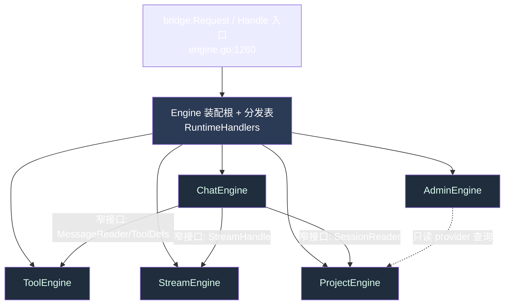

# F-06 · `app.Engine` God-Object 拆分设计文档

> **文档性质：设计文档（Design Doc），非实施。** 本文只描述目标结构、依赖方向与迁移策略。
> **实施归属：阶段四 A-01。** 本轮不改任何 `.go`、不动 `store.go`/迁移、不移动任何方法。
> **验收目标：** PRD F-06「将 `app.Engine` 拆为 ≤5 个子系统（ChatEngine/ProjectEngine/ToolEngine/AdminEngine/StreamEngine），先出设计文档」，评分 3.0 → 4.0。

---

## 1. 现状（真实证据）

调查对象：`internal/app/`（Go 后端 bridge 层），核心文件 `internal/app/engine.go`。统计用 PowerShell（`Select-String` 计数），非人工估算。

### 1.1 规模证据

| 指标 | 实测值 | 采集方式 |
|------|--------|----------|
| `engine.go` 行数 | **1383** | `(Get-Content engine.go).Count` |
| `Engine` struct 字段数（tab 缩进声明行，含分组注释后的字段） | **约 114** | 对 `engine.go:123..309` 计 `^\t[a-zA-Z]` 行 |
| `func (e *Engine)` 方法总数（全 `internal/app`，排除 `_test.go`） | **345** | 全目录 `Select-String 'func \(e \*Engine\)'` 求和 |
| 其中定义在 `engine.go` 内的 `func (e *Engine)` | **90** | 对 `engine.go` 单文件计数 |
| 自由函数 `func handleXxx(e *Engine, ...)`（bridge handler） | **458** | 全目录 `^func handle[A-Za-z0-9_]*\(e \*Engine'` 求和 |
| bridge 分发表条目（`RuntimeHandlers` map） | 见 `handlers_registry.go:13` 起（474 行） | `handlers_registry.go` |

`Engine` 是一个持有 **约 114 个字段** 的单体：既包含领域服务指针（`providers`/`projects`/`sessions`/`messages`/`stages` 见 `engine.go:125-129`），也包含运行时可变状态（`streamsMu`/`streams`/`maxStreams` 见 `engine.go:154-156`，`adapterCacheMu`/`adapterCache` 见 `engine.go:147-148`，`browserLastURL`/`lastBrowserSnap`/`browserMutated` 见 `engine.go:149-151`），还内联了 M6–M10 各波次的服务字段（`engine.go:166-309`）。所有 458 个 bridge handler 与 345 个方法都以 `*Engine` 为唯一接收者/首参，形成典型 god-object。

### 1.2 按域聚类（真实文件 + 方法计数）

用文件名前缀分组统计「`func (e *Engine)` + `func handle*(e *Engine`」之和：

| 目标域 | 代表文件（真实存在） | 该组 Engine 函数数（实测） | 代表方法/handler（真实符号） |
|--------|----------------------|-----------------------------|------------------------------|
| **Chat** | `chat.go`、`chat_turn.go`、`chat_turn_runtime.go`、`chat_run_stream.go`、`chat_memory.go`、`chat_subagent.go`、`chat_expert_council.go`、`chat_plan.go`、`chat_mcp_tools.go`、`chat_tool_defs.go` | **116**（`chat_*.go`） | `chat_memory.go` 18 个方法、`chat.go` 8 个、`chat_turn.go` 8 个、`chat_expert_council.go` 8 个 |
| **Project** | `project_handlers.go`、`project_attachment_handlers.go`、`session_handlers.go`、`session_artifacts.go`、`session_metadata.go` | project 组 **14** + session 组 **12** | `handleProviderList`（`engine.go:1319`）风格；`SessionService`/`ProjectService` 接口 `engine.go:71-100` |
| **Tool** | `tools_policy_handlers.go`、`tools_hooks_handlers.go`、`mcp_bridge.go`、`browser_automation.go`（9 方法）、`chat_skill_tools.go`（8）、`chat_tool_defs.go`（8） | tool/mcp/browser 合计 | `SetToolRuntime`（`engine.go:415`）、`e.tools *toolruntime.Runtime`（`engine.go:157`） |
| **Admin** | `provider_handlers.go`、`provider_diagnostics.go`（6）、`m6_handlers.go`、`m7_handlers.go`、`m8_*_handlers.go`、`m9_org_handlers.go`、`m10_*_handlers.go`、`capability_roles.go`（4） | m6 **21** / m7 **40** / m8 **31** / m9 **19** / m10 **46** / provider **12** | `SetM6Services`（`engine.go:1036`）、`SetM7WorkflowServices`（`engine.go:1067`）、`SetM8MemoryServices`（`engine.go:1114`） |
| **Stream** | `chat_run_stream.go`、`engine.go`（流生命周期）、`gui_fallback.go`（3） | 流生命周期集中在 `engine.go` | `CancelAllStreams`（`engine.go:943`）、`cancelStream`（`engine.go:965`）、`claimStreamFinalization`（`engine.go:987`）、`selectTerminal`（`engine.go:997`）、`finishTerminal`（`engine.go:1010`）；`streamState` 类型 `engine.go:316-333` |

> 结论：现状已经**按文件在物理上做了分域**（`chat_*` / `m6_*` / `m7_*` / `provider_*` / `session_*` 前缀清晰），但所有分域都共享同一个 `*Engine` 接收者与同一份可变状态字段，逻辑上仍是单体。拆分是把「文件分域」提升为「类型/子系统分域」。

---

## 2. 目标：五子系统职责边界

在 `≤5` 约束下，按 PRD 指定的五域划分。每个子系统是一个独立结构体，只持有本域所需字段；`Engine` 退化为**装配根 + bridge 分发入口**（保留 `Handle`，见 `engine.go:1260`）。

| 子系统 | 职责边界 | 迁入的现状字段（`engine.go` 行号） | 迁入的现状方法 |
|--------|----------|-------------------------------------|----------------|
| **ChatEngine** | 一次对话回合的编排：意图、上下文装配、compaction、记忆注入、专家/子代理、工具定义拼装 | `messages`、`messageReader`、`tokenRepo`、`compactionTrigger`/`compactionExecutor`/`summaryReader`（137-139）、`handoffService`（140）、`attachmentService`（141）、`preferredChat`（153） | `chat_*.go` 全部（116）、compaction 系列（`TriggerManualCompaction` 461、`TriggerPreTurnCompaction` 657、`ContextStatus` 511）、handoff 系列（`CreateHandoffCapsule` 725 等）、attachment 系列（`IngestAttachment` 832 等） |
| **ProjectEngine** | 项目/会话/阶段/附件的 CRUD 与元数据 | `projects`（126）、`sessions`（127）、`stages`（129）、`conversations`（158）、`assets`/`deliverables`/`projectAttachments`（304-309） | `project_*`、`session_*`、`stage_*`、`asset_*` handler 组（project 14 + session 12） |
| **ToolEngine** | 工具运行时、MCP、终端、浏览器自动化、能力/技能目录 | `tools`（157）、`terminals`/`terminalsMu`/`terminalOwners`（159-161）、`adapterCache`/`adapterCacheMu`（147-148）、`browserLastURL`/`lastBrowserSnap`/`browserMutated`（149-151）、`mcp6Registry`（167） | `tools_*`、`mcp_bridge.go`、`browser_automation.go`（9）、`chat_skill_tools.go`（8）、`terminal_handlers.go`（2） |
| **AdminEngine** | 供应商/凭据、治理（M6–M10 各波次）、org-admin、能力角色、诊断 | `providers`（125）、`leases`/`network`/`gateway`（143-146）、全部 `m6*`/`m7*`/`m8*`/`m9*`/`m10*` 服务字段（166-301）、`capabilityRoles`（279）、`govFlags`（205） | `provider_*`、`m6_*`（21）、`m7_*`（40）、`m8_*`（31）、`m9_*`（19）、`m10_*`（46）、`capability_roles.go`（4）、`Set*` 装配方法（`SetM6Services` 1036 起一批） |
| **StreamEngine** | 流生命周期状态机：注册、取消、finalize/terminal 竞态线性化 | `streamsMu`/`streams`/`maxStreams`（154-156） | `CancelAllStreams`（943）、`cancelTtsStreams`（954）、`cancelStream`（965）、`cancelStreamSpoken`（969）、`claimStreamFinalization`（987）、`selectTerminal`（997）、`finishTerminal`（1010）；`streamState`/`streamLifecycle` 类型（316-344） |

> 语音/伴随（`m9tts`/`voice`/`omni`/`talk*`/`meetings`）与 IM（`imChannels`/`inbound*`）在现状里也很重。为守 `≤5` 约束，它们分别并入 **ChatEngine**（伴随对话属于对话回合的一种）与 **AdminEngine**（IM 通道属渠道治理）。这一取舍在实施 A-01 时可再评估是否需要内部子包，但对外仍只暴露 5 个子系统。

---

## 3. 依赖方向（避免环）

核心原则：**单向依赖、无环**。`Engine`（装配根）持有全部子系统；子系统之间不互相持有指针，跨域协作通过**窄接口**注入。

依赖规则：
1. **只有 ChatEngine 向下依赖** Tool/Stream/Project，且仅通过接口（如 `type streamController interface{ Register/Cancel/ClaimFinalization }`、`type toolProvider interface{ Defs/Exec }`）。
2. **Stream/Tool/Project 不反向依赖 Chat**——它们是被调用方。
3. **Admin 与 Chat 不互相持有**：治理开关经 `govFlags`（`engine.go:205`，已是 nil-safe，见 `governanceFlags()` `engine.go:1126`）读取，Chat 通过注入的只读快照消费，避免 Admin→Chat→Admin 环。
4. 共享可变状态（stream map、adapter cache）**只归属一个子系统**，其它域通过接口访问，杜绝多处持锁。

---

## 4. 迁移策略（分步，每步可编译可测）

关键不变量：**bridge handler 签名 `func(*Engine, context.Context, bridge.Request) bridge.Response` 不变，`RuntimeHandlers` 表（`handlers_registry.go:13`）不变**，因此对渲染进程与契约测试（`section8_contract_test.go` 等）零影响。子系统在 `Engine` 内部作为字段存在，handler 只是把工作转发给对应子系统。

| 步骤 | 内容 | 可编译/可测保证 |
|------|------|------------------|
| **A-01.1 抽 StreamEngine** | 把 `streamsMu`/`streams`/`maxStreams` 与 7 个流方法搬进 `type streamEngine struct`，`Engine` 内嵌 `stream streamEngine`；现有方法改为 `func (e *Engine) cancelStream(...) { return e.stream.cancel(...) }` 薄转发 | 最独立、无外部依赖，先做；`stream_state_test.go`/`chat_stream_failure_test.go` 保持绿 |
| **A-01.2 抽 ToolEngine** | 迁移 `tools`/`terminals`/`adapterCache`/浏览器状态与 `tools_*`/`mcp_bridge`/`browser_automation` 方法；Chat 侧改经 `toolProvider` 接口取工具定义 | `browser_automation_test.go`/`mcp_bridge_test.go`/`terminal_handlers_test.go` 保持绿 |
| **A-01.3 抽 ProjectEngine** | 迁移 `projects`/`sessions`/`stages`/`conversations`/资产字段与对应 handler | `project_bridge_integration_test.go`/`session_bridge_integration_test.go`/`stage_bridge_integration_test.go` 保持绿 |
| **A-01.4 抽 AdminEngine** | 迁移 `providers`/治理服务字段与全部 `Set*` 装配方法、`m6_*`~`m10_*`/`provider_*` handler | `m6_*`/`m7_*`/`m8_*`/`m9_org_handlers_test.go` 保持绿；`provider_bridge_integration_test.go` 保持绿 |
| **A-01.5 抽 ChatEngine** | 剩余 `chat_*`、compaction、handoff、attachment、伴随语音方法迁入；`Engine` 收敛为装配根 | `chat_turn_test.go`/`companion_parity_test.go`/`message_bridge_integration_test.go` 保持绿 |

每步收尾：`go build ./... && go test ./internal/app/...` 全绿方可合并。薄转发方法在全部 handler 迁移完成后可择机删除（可选清理步 A-01.6）。

---

## 5. 风险

| 风险 | 说明 | 缓解 |
|------|------|------|
| **共享可变状态** | `streamsMu`+`streams`（`engine.go:154`）、`adapterCacheMu`+`adapterCache`（147）、多个 `sync.Map`（`browserLastURL` 149、`inboundRoutes` 282、`mcpPresetByEP` 286）跨 handler 读写 | 每份 mutex+map 只归一个子系统；跨域仅经接口读，禁止第二处持有锁 |
| **初始化顺序** | 现状用一串 `NewEngineWithXxx`（`engine.go:364-413`）+ 大量 `SetXxx`（`engine.go:415` 起）渐进装配，子系统间有隐式先后（如 `SetM8SliceServices` 内回调 `e.embedKBTexts` `engine.go:1170`） | 保留 `NewEngineWithXxx`/`SetXxx` 签名不变，仅内部改为委托给子系统 setter；回调用函数值注入而非结构体指针，切断编译期环 |
| **测试影响** | `engine_test.go` 及大量 `*_test.go` 直接 `func (e *Engine)` 或构造 `Engine{}` | 因 handler 签名与 `Engine` 门面不变，测试无需改动；仅内部实现迁移 |
| **nil-service 分支** | 大量方法以 `if e.xxx == nil { return ErrNotConfigured }` 开头（如 `engine.go:462`、`587`、`726`） | 语义随字段一起迁入子系统，逐字保留 |
| **单 PR 过大** | 一次性拆 345 方法风险高 | 严格按 §4 五步分 PR，每步独立可回滚 |

---

## 6. 验收勾稽（映射回 PRD F-06）

| PRD F-06 要求 | 本文对应 |
|----------------|----------|
| 拆为 ≤5 个子系统 ChatEngine/ProjectEngine/ToolEngine/AdminEngine/StreamEngine | §2 五子系统表，恰好 5 个，命名一致 |
| 先出设计文档（非立即拆分） | 本文即设计文档，§0 标注实施属阶段四 A-01 |
| 职责边界清晰 | §2 每子系统的边界 + 迁入字段/方法明细 |
| 依赖方向无环 | §3 mermaid + 单向依赖规则 |
| 保持 bridge handler 接口不变 | §4 不变量：`RuntimeHandlers`/handler 签名冻结 |
| 每步可编译可测 | §4 五步 + 每步保持对应测试绿 |

**实施归属：阶段四 A-01。本文不含任何代码变更。**