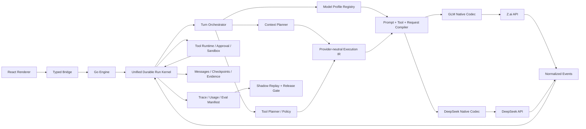

# Lunitide × GLM / DeepSeek 原生级 Harness 深度适配 PRD v1.0

- 状态：Proposed（可实施基线）
- 日期：2026-09-08
- 产品负责人：Lunitide
- 目标版本：M5 增强切片，复用 M4 Reliable Single-Agent Runtime；M6/M7 能力按现有治理边界接入
- 首发模型：`glm-5.3`；第二模型族：DeepSeek V4 Pro / Flash（以发布时已验证的不可变版本为准）
- 适用架构：Go Core Engine + Windows WebView2 Host + React/TypeScript Renderer + SQLite
- 证据等级：E2 设计交付；本文未执行真实厂商 API、真实模型 A/B 或后训练

---

## 0. 决策摘要

### 0.1 结论

可行，但目标不能定义为“兼容 GLM 和 DeepSeek API”，而必须定义为：

> Lunitide 为 GLM 与 DeepSeek 各维护一套可版本化、可评测、可回滚的模型执行画像，使提示编译、上下文装配、工具协议、推理控制、错误恢复、缓存布局、任务路由和发布门禁都针对该模型的真实行为协同优化；模型升级等同于编译器升级，必须经过回放、金丝雀与晋级，不允许 SaaS 别名静默改变生产行为。

项目目标为 **L2 原生级融合**：

| 等级 | 定义 | 是否满足目标 |
|---|---|---|
| L0 协议接通 | 能发送 OpenAI-compatible 请求并显示回答 | 否 |
| L1 产品级可靠 | 流式、工具、上下文、错误、预算和恢复可靠 | 必须具备，但仍不够 |
| L2 模型共设计级 | 模型 Profile、Prompt/Tool Compiler、任务策略、评测数据与发布闭环共同演进 | **本 PRD 目标** |

### 0.2 首发策略

1. **GLM-5.3 作为第一条原生适配主线**：官方公开 1M 上下文、128K 最大输出、强制思考、`low/high/max` 推理强度、流式工具参数与缓存用量，和 Lunitide 的 1M 逻辑历史目标天然匹配。
2. **DeepSeek 作为第二条独立原生适配主线**：不作为“另一个 OpenAI Base URL”。它的思考+工具续轮要求保存并完整回传 `reasoning_content`，且 strict tool schema、缓存统计与 V4 模型族均有独立合同。
3. **只保留一套 Run、Context、Tool、Approval、MCP、Memory 与 Plan 内核**。新增的是 Provider-native codec/compiler/profile，不新建第二套 Agent 框架。
4. **先 Harness 共设计，后训练后置**。先通过真实任务评测证明 Prompt/Tool/Context/Recovery 的增益；只有用户明确同意、完成脱敏与授权后，才沉淀轨迹数据并开展厂商联合 SFT/DPO/RL 或可控开源权重训练。
5. **不承诺“达到 Codex 同等绝对能力”**。Codex 的底模训练、私有数据与基础设施不可复制；本项目验收的是相对当前通用适配的、可重复测量的任务完成率和可靠性提升。

### 0.3 当前最关键的架构缺口

- `internal/llmadapter.Request` 只有一个请求级 `DisableReasoning`，无法表达强制思考、推理强度、tool streaming、strict schema 等模型合同。
- 通用 OpenAI codec 能读取 `reasoning_content`，但 `llmadapter.Message` 不保存它；DeepSeek 思考+工具续轮因此不能无损回传。
- `Provider.Model` 目前只有目录、上下文与视觉标志等基础元数据，没有工具、推理、最大输出、缓存、协议状态等执行能力画像。
- GLM/DeepSeek 都走 `ProtocolOpenAICompatible`；关键字段依赖 400 后剥离或 schema 降级，而不是编译前能力校验。
- 日常 Chat 工具循环与 durable `agentrun` 仍有脱节，真实模型调用/工具步骤没有全部进入统一 Run/Turn/Step/Effect 证据链。
- Chat 可见工具 schema 与 M4 capability registry、`toolruntime` 实际解析合同不同源，存在模型所见合同漂移风险。
- 有 token ledger、checkpoint、usage/cache 地基，但还缺模型专属 tokenizer/profile revision 和 1M 真实注意力质量门。
- 已有大量评测/反馈/审计表，但缺专用 trajectory manifest、脱敏导出、离线 shadow replay、experiment assignment 与结果归因。

---

## 1. 背景与问题

Lunitide 当前已经不是一个简单聊天壳：它具备 Provider/Model CRUD、DPAPI 凭据租约、OpenAI/Anthropic 协议网关、SSE、工具调用、durable message、token ledger、分层上下文、压缩 checkpoint、handoff、审批、沙箱、effect journal、Plan DAG、子代理和可验证审计链。

但“能力很多”不等于“模型会稳定地使用这些能力”。当前通用适配存在四类损耗：

1. **协议损耗**：厂商特有状态被中立 DTO 丢失或只能通过兼容字段猜测。
2. **语义损耗**：相同系统提示、工具描述、错误 observation 对不同模型并非同等有效。
3. **控制损耗**：推理预算、上下文水位、工具数量、继续策略和恢复策略没有按模型实测校准。
4. **演进损耗**：模型别名升级后，行为可能变化，但产品没有 profile pin、shadow replay 和逐级晋升机制。

### 1.1 用户问题

作为 Lunitide 用户，我希望：

- 接入 GLM 或 DeepSeek 后，模型能自然理解 Lunitide 的项目、文件、命令、浏览器、Office、Skill、MCP、Plan、审批和交付规则；
- 长任务中模型能持续探索、编辑、验证、纠错和交付，而不是频繁停下、重复读取、乱调工具或丢失上下文；
- 切换思考强度时，产品按任务风险和成本给出可解释行为；
- 模型升级不会突然破坏工具调用或任务质量；
- 我能知道任务为什么成功/失败，而不是只看到“上游错误”。

### 1.2 产品问题

作为产品团队，我们需要把“模型效果”从不可控玄学变成版本化工程资产：

- 哪个模型 profile 处理哪类任务；
- 使用哪版 prompt/tool/context compiler；
- 在哪些 eval suite 上通过；
- 相对基线提升或回退多少；
- 哪些协议能力经过 live probe，哪些只是厂商声明；
- 失败后可以回滚到哪个 profile，而无需回滚整个应用。

---

## 2. 目标、非目标与成功标准

### 2.1 产品目标

G1. GLM-5.3 和 DeepSeek 各具备独立的原生 adapter/codec，而非共享一组不可解释的兼容开关。

G2. 所有模型请求均由统一的 **Model Execution Profile** 编译，执行时可追溯到 profile、prompt、tool catalog、context policy、codec 和 eval release 版本。

G3. 日常聊天、项目任务、Plan、自动化和子代理共享同一个可靠 Run 证据模型；模型续轮不会脱离 durable state。

G4. 对编码、仓库理解、办公交付、浏览器研究、复杂本地执行五类核心任务，模型能形成“读取→计划→执行→验证→修复→交付”的闭环。

G5. 模型版本和 profile 升级必须经过 `dev → beta → stable`，支持 shadow replay、金丝雀、自动阻断和一键回滚。

G6. 在不删除原始消息、不突破权限边界的前提下，支持单会话至少 1M token 逻辑历史，并按模型真实窗口和注意力质量装配。

### 2.2 非目标

- 不训练新的基础模型，不承诺复制 OpenAI/Anthropic 私有训练体系。
- v1 不默认上传用户对话、代码、文件或工具输出用于训练。
- 不引入 Python/Node/Rust 或额外服务作为生产 Agent Runtime。
- 不新建第二套对话、Run、工具、审批、MCP、Memory、Plan 或权限系统。
- 不默认跨供应商自动切换模型；有副作用或上下文语义不等价时禁止透明 fallback。
- 不向 Renderer 或日志暴露 API Key，也不把完整私有思维链当业务真相、审计依据或用户可依赖合同。
- 不把厂商宣称的 1M 上下文等同于“每次都应发送 1M”。

### 2.3 北极星指标

**Qualified Task Success Rate（QTSR）**：在固定环境、固定任务、固定预算下，同时满足：

1. 结果验证器通过；
2. 无越权/未审批副作用；
3. 无 silent degradation；
4. 产物可用且来源可追溯；
5. Run 终态与实际副作用一致。

### 2.4 发布指标与阻断线

所有百分比均相对“当前通用 OpenAI-compatible 路径 + 同一模型 + 同一任务集”的基线，先建立基线再计算：

| 指标 | Beta 准入 | Stable 准入 | 阻断条件 |
|---|---:|---:|---|
| 核心任务 QTSR | 不低于基线，目标 +8pp | 目标 +15pp | 任一高风险用例回退 |
| 工具参数 schema-valid rate | ≥99.0% | ≥99.5% | 破坏性工具 <100% 本地校验 |
| 工具选择有效率 | ≥95% | ≥97% | 出现未声明工具执行 |
| 长任务无进展/循环率 | 比基线下降 ≥20% | ≥35% | 无限循环或预算失效 |
| 已开始流式后的重复副作用 | 0 | 0 | 任一实例 |
| 上下文 protected-fact recall | ≥99.0% | ≥99.5% | 权限/否定/精确 ID 丢失 |
| 1M 逻辑历史完整性（设计不变量） | 100% | 100% | 删除/改写源消息或超帧 |
| Profile 回滚恢复时间 | ≤10 分钟 | ≤5 分钟 | 无法独立回滚 |
| 严重权限逃逸 | 0 | 0 | 任一实例 |

说明：目标值是产品门槛，不是已证实结果；必须由真实基线和重复运行验证。

指标测量合同：

- `tool selection validity` 必须同时满足：工具在本轮已声明目录内、适合完成该子目标、未发生未声明执行；由确定性规则先判定，歧义样本双人盲审。
- `protected-fact recall` 使用至少 200 个固定探针，均衡覆盖 8 个位置桶、否定、反转决策、精确 ID、权限和未完成事项；安全/权限事实必须 100%，其余按表中阈值。
- QTSR 的样本量在 Phase 0 按基线率、最小可检测差异 8pp、双侧 95% 置信区间和 80% power 预注册；若 120 任务不足则增加环境变体/重复次数。
- API 不支持 seed 时使用独立重复运行并报告方差，不伪造确定性；配对比较使用同一环境快照和预算。
- Browser/Research 的阻断子集使用冻结网页快照和录制响应；真实 Web 只作为独立时效性/鲁棒性指标，不直接进入确定性 QTSR 门。

---

## 3. 设计原则

1. **模型能力必须声明且被探测**：厂商文档是候选真相，live probe 是运行真相；冲突时失败关闭。
2. **通用 IR，专属编译器**：上层保持统一 Run/Context/Tool IR，下层由 GLMCompiler 与 DeepSeekCompiler 输出 wire contract。
3. **版本优先于别名**：记录实际响应 model/fingerprint；别名变化触发隔离，不自动晋升。
4. **模型不拥有权限**：模型只提出 Tool Intent；Policy/Approval/Sandbox/Effect Journal 决定是否执行。
5. **思维链不是权威状态**：可为协议续轮暂存/密封，但 Plan、决策、验证和审计必须使用结构化显式状态。
6. **错误必须可行动**：工具 observation 返回稳定 code、retryability、side-effect certainty、next action，不把堆栈/密钥/路径泄给模型。
7. **长上下文按质量而非容量炫技**：保留源历史，使用 checkpoint、相关证据和近期原文；以 recall/needle/任务成功率决定水位。
8. **所有优化可回滚**：profile、prompt、tool schema、context policy、router 和 codec 可独立回退。
9. **不靠线上用户承担评测**：先 shadow/offline，再 opt-in beta，再 stable。

---

## 4. 目标架构



### 4.1 核心分层

#### A. Model Profile Registry

每个 profile 是模型执行合同，不只是模型元数据。建议新增包：

- `internal/modelprofile/`
- `internal/modelprofile/builtin/glm_5_3.go`
- `internal/modelprofile/builtin/deepseek_v4_pro.go`
- `internal/modelprofile/builtin/deepseek_v4_flash.go`

核心对象：

```go
type ExecutionProfile struct {
    ID, Family, WireModel, PinnedRevision string
    Protocol, EndpointMode string
    ContextWindow, MaxOutputTokens int64
    Modalities []string
    Thinking ThinkingPolicy
    Tooling ToolPolicy
    Cache CachePolicy
    Tokenizer TokenizerPolicy
    Limits RuntimeLimits
    PromptBundleVersion, ToolCatalogVersion string
    ContextPolicyVersion, ErrorMapVersion string
    EvalReleaseID, Status string
}
```

`ReasoningEffort` 的可选值不是跨厂商硬编码枚举；`low/high/max` 只是 Lunitide 的产品意图。每个 profile 必须声明可接受的 wire 枚举和映射，编译器在 live probe 未确认前不得发送。`EndpointMode` 是 profile identity 的一部分；Chat Completion、Responses 与 Anthropic-compatible 的 probe/cache/tool 结论不得跨端点复用。

Profile 来源按优先级合并：

1. 产品内置已签名 profile；
2. 厂商发现接口/响应 fingerprint；
3. 受控 live probe；
4. 管理员覆盖（只能收紧安全和预算，不能伪造已验证能力）。

#### B. Provider-neutral Execution IR

扩展 `llmadapter` 时不能把 GLM/DeepSeek 字段散入 Chat：

```go
type ThinkingMode string // required | enabled | disabled | unsupported
type ReasoningEffort string // low | high | max
type ToolChoice string // auto | required | none | named

type RequestPolicy struct {
    ThinkingMode ThinkingMode
    ReasoningEffort ReasoningEffort
    StreamToolArguments bool
    StrictToolSchema bool
    ParallelToolCalls bool
    OutputContract string
}
```

`Message` 增加 provider state 引用，而不是把所有私有字段当普通文本：

```go
type ProviderStateRef struct {
    Kind string
    BlobID string
    Digest string
    CodecVersion string
    RequiredForContinuation bool
}
```

对于 DeepSeek 思考+工具续轮，必须保存可无损回传的 assistant wire state。默认策略：

- 生命周期仅限当前 Run/Turn 与必要恢复窗口；
- 本地密封存储，正文不进入通用 audit、FTS、memory 或训练集；
- 用户界面只显示“思考中/阶段摘要”，不依赖私有 CoT；
- provider 不要求续传时立即丢弃；
- profile 定义 retention 与 continuation 规则。

若必需 continuation state 在续轮前缺失、损坏、过期或无法解密，Run 必须进入 `provider_state_unavailable`：只允许从最近一个未产生外部副作用、具有完整 request manifest 的 model step 重新请求；否则安全终止该 turn，生成带来源的 handoff/checkpoint 并要求用户确认。禁止猜测或用摘要伪造 `reasoning_content`。

#### C. Native Compiler / Codec

新增建议：

- `internal/llmadapter/glm/`
- `internal/llmadapter/deepseek/`
- `internal/modelcompiler/`

职责严格分离：

- **Prompt compiler**：稳定静态规则、动态状态、任务合同、错误恢复语言。
- **Tool compiler**：从 canonical tool contract 编译厂商 schema、名称、strict 能力和工具分组。
- **Context compiler**：按 profile token/window/cache 策略排序，不改变 authority。
- **Wire codec**：序列化字段、SSE 解析、provider state 续传、finish reason、usage 与错误码。

`openai.go` 保留为通用兼容 adapter；GLM 与 DeepSeek 不再通过在其中持续堆 `if model == ...` 实现。

#### D. Unified Durable Turn Orchestrator

将 `chat_run_stream.go` 的真实模型/工具循环接入已有 `agentrun`：

- 每个普通对话 turn 也创建/绑定 durable Run；
- 每次模型请求写 `model step`；
- 每个 Tool Intent 写 `tool_call`；
- 副作用工具在执行前写 prepared effect，执行后写 receipt；
- 流式断开后的 unknown 由 reconciler 决定，不盲重试；
- `plan.run.*` 仍只是协调元数据；受控子代理仍只走 M7 `subagent.*`。

不删除现有 Chat 生命周期；通过 adapter/bridge 逐步把事件投影到 Run，完成后再移除重复内存状态。

---

## 5. 模型专属适配合同

## 5.1 GLM-5.3 Profile

截至 2026-09-08 的智谱官方文档声明：文本输入、1M context、最大输出 128K；思考强制开启；`reasoning_effort=low|high|max`；支持 Function Calling、缓存、结构化输出、流式 `reasoning_content/content`，并支持 `tool_stream=true` 流式构建工具参数。上述值在 profile 中首先标记为 `declared`；只有 Phase 0 live probe 通过后才成为 `effective`，否则相应模式 fail closed。

### GLM 必须实现

1. 请求始终编译为 `thinking.type=enabled`；月伴/低延迟模式不能发送 disabled，而应映射到 `reasoning_effort=low`。
2. Coding/复杂本地执行默认 `max`；普通分析默认 `high`；简单问答/语音默认 `low`。最终映射由评测决定，不由关键词硬编码。
3. 当 `stream=true` 且有工具时，启用 `tool_stream=true`，按 index 拼接 name/arguments；完成前不得执行半截参数。
4. 解析并记录 `usage.prompt_tokens_details.cached_tokens`，但缓存命中不从实际 inputTokens 中扣除。
5. `tool_choice` 仅使用官方支持值；当前公开文档显示默认且仅支持 `auto`，所以“必须调用工具”由 orchestration 做结构化二次决策，不能发送未经支持的 required。
6. 1M 窗口不是默认输入预算：首发 safety ceiling 建议从 256K 起，通过 256K/512K/1M 长上下文评测逐级解封。
7. API 端点区分 Chat Completion、Responses、Anthropic compatible；v1 首发固定 Chat Completion，其他协议独立试验，不在同 profile 内自动切换。
8. Coding Plan 与标准 API 配额/端点合同分开，不允许共用 profile 假定。

月伴语音例外：`low` 仍可能产生显著 reasoning-first 延迟，不能把它等同于 no-thinking。GLM profile 只有在真实 TTFT 门通过时才可用于月伴；否则该 turn 必须明确切到用户已配置且支持 non-thinking 的已验证模型，或提示该模型不适合实时语音。不得为了维持 GLM 选择而静默牺牲现有语音 TTFT。月伴 stable 门：P95 首个可播报文本延迟不得比当前 stable 基线回退超过 20% 或 300ms（取更严格者）。

### GLM Prompt Bundle

采用四段稳定结构并保持前缀字节稳定：

1. `Lunitide Constitution`：权限、审批、证据、未知结果、完成定义；
2. `Tool Operating Manual`：何时读、何时搜、何时改、何时验证；
3. `Workspace Contract`：根目录、规则文件、当前任务与限制；
4. `Turn Objective`：本轮用户目标、验收条件、动态状态。

GLM 专属行为校准重点：长程任务持续性、工具参数完整性、不要在获得部分结果后过早总结、必须执行验证后再声称完成。

## 5.2 DeepSeek V4 Profile

截至 2026-09-08，DeepSeek 官方文档列出 `deepseek-v4-pro`、`deepseek-v4-flash` 及实验视觉型号；思考支持 `thinking.type` 与 `reasoning_effort`；思考模式不支持 temperature/top_p/presence/frequency 参数；带 tools 时，活动工具调用链中的 assistant `reasoning_content` 必须完整回传，否则会形成非法请求；strict tool schema 位于 Beta 合同；缓存默认开启并返回 hit/miss token。与 GLM 相同，这些能力先为 `declared`，live probe 后才可成为 `effective`。

### DeepSeek 必须实现

1. 明确区分 thinking 与 non-thinking profile；未来若引入 temperature/top_p 等采样参数，thinking profile 禁止无效透传或在 UI 中伪称已生效。
2. 带 tools 的续轮，保存并按原始顺序回传活动工具调用链内 assistant 的 `content + reasoning_content + tool_calls`；任何必需字段缺失时在本地阻断，不向上游发送已知非法序列。工具链被用户新 turn 正式关闭且 provider 不再要求后，应按 retention policy 清除该私有 state。
3. non-tool 多轮不默认持久化/回传 reasoning state，减少隐私面与上下文成本。
4. strict mode 作为独立 beta profile；Tool Schema Compiler 必须把所有 object 属性加入 required，并设置 `additionalProperties:false`，且只输出支持的 JSON Schema 子集。
5. strict beta 不得直接覆盖 stable profile；只有 schema conformance 与真实工具成功率均提升才晋级。
6. 解析 `prompt_cache_hit_tokens` 和 `prompt_cache_miss_tokens`；缓存为 best-effort，不承诺命中率。
7. V4 Pro 用于复杂/高风险规划，Flash 用于低风险读取、分类、摘要候选或子任务；任何路由都受任务风险和模型 eval release 约束。
8. 若 DeepSeek Harness developer preview 提供正式专用协议，以单独 codec/profile 接入；在拿到完整官方合同前，不猜测字段。

v1 多模态明确不在本 PRD 主模型范围：`glm-5.3` 按文本模型适配，GLM-5.3-Flash 和 DeepSeek 实验视觉型号必须另建 vision profile 与评测集，不能因模型名相近继承文本 profile 的结论。

### DeepSeek Prompt Bundle

重点优化：

- 用简洁、结构化、可验证的目标替代重复鼓励性文本；
- 工具错误给稳定 code + 可行动修复，不反复灌入长堆栈；
- 每轮显式给出 remaining budget、completed evidence、open TODO；
- 把“继续工作”表达为结构化 continuation state，不依赖自由文本 nudge；
- 避免在动态区前插入内容，保持缓存前缀稳定。

---

## 6. Canonical Tool Contract

### 6.1 单一事实源

建立 `internal/toolcatalog` 作为以下三者的唯一来源：

1. 模型可见工具定义；
2. `toolruntime` 参数解码与本地校验；
3. capability registry/digest 与文档生成。

每个工具版本包含：

```text
Tool ID / semantic version / description
Input JSON Schema / Output Schema
risk class / side-effect class / idempotency class
required capability / approval scope / sandbox scope
max input/output bytes / timeout
retry policy / outcome-unknown policy
provider schema compatibility annotations
examples: positive / negative / repair
```

禁止模型 schema 与执行匿名 struct 各自维护。

### 6.2 工具设计规则

- 优先窄工具，禁止 `shell(command:string)` 这类无边界万能接口进入默认目录。
- 参数名使用稳定英语机器标识，description 可按模型/语言编译。
- 读工具返回 `result + provenance + continuation cursor + truncation`。
- 写工具返回 `effect_id + before_digest + after_digest + receipt + verification_hint`。
- 错误 envelope：

```json
{
  "ok": false,
  "code": "PATH_OUTSIDE_WORKSPACE",
  "retryable": false,
  "sideEffect": "none|committed|unknown",
  "message": "sanitized short reason",
  "nextAction": "request_workspace_grant"
}
```

- 工具结果超长时不可静默截断；返回 continuation token 和完整性 digest。
- 高风险工具 100% 本地 schema 校验、权限校验和审批绑定；模型“确信”不能越过门禁。

### 6.3 工具目录选择

不把全部约 50 个工具无差别塞进每轮：

1. 始终注入 6–10 个核心导航/读取/计划工具；
2. 根据任务类型加载工具包（coding、office、browser、automation、skill）；
3. 模型需要目录外能力时调用 `capability.search`；
4. 目录选择结果、版本和 digest 写入 Run；
5. 不能因省 token 隐藏用户明确要求的能力。

---

## 7. Context、Memory 与 1M 长任务

### 7.1 继承 ADR-005

- `messages/message_parts` 是不可变真相；压缩不删除源消息。
- 分页上限不是会话总上限。
- system/security/product 指令每轮重新注入，不能被摘要提升为权威。
- checkpoint 必须有 source range/digest/version/protected-fact validation。
- assistant tool call 与 tool result 永不拆分。

### 7.2 模型专属 Context Policy

每个 profile 定义：

- exact/conservative tokenizer revision；
- effective context ceiling；
- reserved output/reasoning/tool schema/safety tokens；
- high/low compaction watermark；
- recent user reserve；
- provider-state continuation reserve；
- cache-stable prefix layout；
- retrieval quota 和证据多样性上限。

精确厂商 tokenizer 未确认时，使用可版本化的 conservative estimator，并以真实 provider usage 反校；任何估算不确定性都转化为额外 safety margin。预算超限必须在本地失败或提前压缩，不能把 1M 历史完整性与 1M 单请求可发送性混为一谈。

### 7.3 渐进式 1M 解封

| 阶段 | 最大物理请求 | 条件 |
|---|---:|---|
| A | 128K/256K | 协议、预算、工具链稳定 |
| B | 512K | 长上下文 recall 与 latency/cost 门通过 |
| C | 1M | 端到端任务收益显著，且无关键事实/尾部指令劣化 |

评测至少覆盖：needle position、反转决策、精确 ID、否定约束、跨文件符号、工具链配对、恶意历史注入、checkpoint 多代滚动和模型切换。

Profile 的 `effectiveContextCeiling` 必须在请求装配入口硬性 clamp，优先级高于当前 `contextWindow * 0.9375` 默认算法。没有对应已晋级 release 时一律停留在 Stage A；仅修改 Provider 表中的 `context_window` 不得静默解封 512K/1M。该 clamp 同时覆盖 Chat、Plan、自动化、压缩和子代理调用。

### 7.4 Memory 边界

- P4/M8 memory 只提供有 provenance 的候选事实，不替代原始 Message。
- 模型不能自行把 reasoning 内容晋升为长期记忆。
- 训练数据候选与用户长期记忆完全分域、分别授权。

---

## 8. Orchestration 与任务策略

### 8.1 从 nudge 循环升级为结构化 Turn State

新增内部 `TurnState`：

```text
objective / acceptance criteria / risk class
phase: understand|plan|execute|verify|repair|deliver
completed evidence / open todos / blockers
remaining model turns / tool calls / tokens / wall clock / cost
last progress digest / no-progress count
side-effect certainty / required approval
```

模型每轮不必输出完整 plan JSON；Orchestrator 根据 tool intent、receipt 和验证器更新权威状态。自由文本只作为建议，不作为 Run 真相。

### 8.2 任务分级与推理路由

| Tier | 典型任务 | GLM | DeepSeek | 默认执行 |
|---|---|---|---|---|
| T0 | 简单问答/格式化 | low | Flash non-thinking/low | 无工具或只读 |
| T1 | 单文件/单工具 | high | Flash thinking | 单代理 |
| T2 | 多文件/多步骤 | max | Pro high/max | 计划化单代理 |
| T3 | 权限/迁移/生产/不可逆 | max | Pro max | 强制计划+审批+验证；必要时只读子代理 |

路由基于风险、任务类别、上下文规模、工具需求和 eval 适用性；不能仅按 prompt 长度判断。

### 8.3 停止与自修复

- 以 `progress_digest` 判断重复动作，不只计轮数。
- schema-invalid：允许模型修复一次；第二次使用 deterministic repair 或切换经过验证的 tool profile；不得盲循环。
- provider 400：只执行 profile 声明的兼容降级；禁止通用“删字段直到成功”。
- provider continuation state 缺失：按 §4.1.B 的确定性分支重放安全 model step 或终止并 handoff；禁止伪造私有状态。
- 有副作用且结果 unknown：暂停并 reconcile，不重发。
- 达到预算：生成可追溯 handoff/checkpoint，不能伪称完成。
- 最终回答前，T1+ 至少检查 acceptance criteria；T2+ 必须绑定验证 evidence。

### 8.4 模型 fallback

允许：

- 请求发送前、没有副作用、上下文可被目标 profile 无损编译；
- 或只读任务在明确策略内切换。

禁止透明 fallback：

- 流式已开始；
- 已执行非幂等工具；
- provider-specific continuation state 无法迁移；
- 目标模型没有相同权限/工具/上下文合同。

发生切换时必须写 Run event 并告知用户，不把两个模型的输出伪装成同一连续推理。

---

## 9. 数据、评测与模型飞轮

### 9.1 评测金字塔

1. **Codec Contract Tests**：请求 JSON、SSE 分片、reasoning/tool 拼接、finish reason、usage/error。
2. **Tool Conformance Tests**：schema valid、名称映射、并行调用、错误修复、审批绑定。
3. **Deterministic Scenario Tests**：fake provider + fake tools，验证 Run 状态、重试和恢复。
4. **Recorded Provider Replay**：脱敏 wire fixtures，防供应商协议回归。
5. **Live Smoke**：真实 GLM/DeepSeek，小规模固定样本，验证文档与 live 行为。
6. **Task Bench**：真实 repo/office/browser sandbox，使用 deterministic verifier。
7. **Long-horizon Bench**：1–6 小时、重启、压缩、handoff、unknown effect。
8. **Red Team**：prompt injection、工具越权、secret exfiltration、reward hacking。

### 9.2 Lunitide Native Bench v1

至少 120 个任务，分层：

- 40 个编码：bugfix、跨文件重构、测试修复、依赖/构建；
- 20 个本地工作区：Git、artifact、搜索、规则遵循；
- 20 个 Office：DOCX/XLSX/PPTX/PDF 创建、编辑、验证；
- 15 个 Browser/Research：检索、网页读取、引用与动态事实；
- 15 个长上下文：checkpoint、handoff、模型切换；
- 10 个安全恢复：审批、断流、重启、outcome_unknown。

每个任务含：环境镜像 digest、初始状态、用户目标、不可违反约束、预算、验证器、允许副作用、预期 evidence，不保存唯一“标准思维链”。

### 9.3 对照实验

每次 profile 变更至少对比：

- Control：当前 stable profile；
- Candidate：新 profile；
- 相同模型 pinned revision；
- 相同 task/environment/tool catalog/budget；
- 按 §2.4 预注册的样本量和置信区间执行；有 seed 时固定 seed，无 seed 时独立重复并报告方差；
- 先比 QTSR 与安全，再比成本/时延/token。

统计必须分开：任务通过、用户评分、交付物接受、工具成功、缓存、成本；不能用“喜欢回答”替代真实任务成功。

### 9.4 Trajectory 数据合同

新增/扩展的数据对象建议：

- `model_profiles`
- `model_profile_releases`
- `model_capability_probes`
- `prompt_bundles`
- `tool_catalog_releases`
- `model_request_manifests`
- 既有 `evaluation_baselines / gate_evaluations / trace_edges` 的 model-profile 关联，以及必要的 case/run/result 明细表
- `experiment_assignments`
- `trajectory_candidates / trajectory_exports`

`model_request_manifest` 只保存可重放元数据和 digest：

```text
run/turn/step IDs
profile + pinned model revision
prompt/tool/context compiler versions and digests
source message/checkpoint ranges and digests
request/response/usage/error/latency digests
cache usage, finish reason, tool/effect IDs
privacy classification and retention class
```

原始正文仍归 messages/provider-state secure store，不复制到 metrics/audit。

这里不新建第二个 eval runner：suite/case 只定义输入与 verifier，执行继续绑定现有 durable Root Run/subagent/effect journal；release 结果外键关联既有 `evaluation_baselines` 和 `gate_evaluations`。若新增明细表，只保存现有 gate 无法表达的 `profile_release_id + case_id + run_id + result`，不得形成另一套晋级状态机。

### 9.5 隐私与训练授权

默认：`telemetry=local`, `training_export=off`。

训练导出必须满足：

1. 用户/组织显式 opt-in，说明范围、用途、保留期和撤回边界；
2. secret/path/identity/source-code policy 分类与脱敏；
3. legal hold 与组织隔离检查；
4. 许可证扫描，第三方代码不可因用户同意就自动获得训练授权；
5. 导出前后 digest、审计链、人工抽检；
6. 只导出任务必要片段，不导出通用私有 CoT；
7. 训练集、验证集、隐藏测试集按项目/仓库去污染分割。

### 9.6 后训练路线

**Stage A：不改权重**——完成 profile/compiler/eval，建立可靠基线。

**Stage B：厂商协同**——把失败聚类与匿名指标反馈给厂商，争取 dedicated endpoint、模型 revision pin 和 Harness 协议支持。

**Stage C：SFT/DPO**——仅对可合法训练的模型/端点，训练工具选择、参数修复、错误恢复、完成定义；不训练执行权限绕过。

**Stage D：RL with Verifiable Rewards**——奖励来自测试、schema、artifact validator、effect receipt、任务门禁；必须防 reward hacking，并用隐藏环境验证。

当前公开资料未证明 GLM-5.3 或 DeepSeek V4 提供可直接使用的托管微调能力，因此 C/D 是条件里程碑，不进入 v1 完成定义。

若厂商不提供 dedicated endpoint、revision pin 或训练合作，项目必须仍以 Stage A 的 Harness 增益完成 Phase 0–5；Stage B 失败不得反向阻断 profile/compiler/eval 的独立产品价值，也不得以不可控别名冒充 pinned revision。

---

## 10. 功能需求

### P0 — 上线阻断级

**FR-P0-001 Profile Registry**  
系统必须按模型族与 pinned revision 解析 profile；无法确认关键能力时拒绝执行对应模式。

**FR-P0-002 Native Codec**  
GLM/DeepSeek 必须有独立 codec，完整支持其请求、SSE、tool、reasoning、usage、finish 与 error 合同。

**FR-P0-003 Reasoning Continuation Integrity**  
DeepSeek 带 tools 的续轮必须完整保留并回传 provider-required assistant state；缺失时本地失败，不能发畸形请求。

**FR-P0-004 GLM Forced Thinking Mapping**  
GLM-5.3 按已 probe 的 forced-thinking 合同禁止发送 disabled；普通低延迟需求映射 low 并显示实际生效档位。月伴语音必须额外满足 TTFT 门，否则显式选择已验证 non-thinking profile 或拒绝该组合。

**FR-P0-005 Canonical Tool Catalog**  
模型 schema、本地解析与 capability digest 必须同源；CI 检测漂移。

**FR-P0-006 Unified Durable Turn**  
生产 Chat 每次模型与工具步骤必须绑定 durable Run/Turn/Step；副作用进入 effect journal。

**FR-P0-007 Side-effect Safety**  
流式开始后不得跨凭据/模型自动重试副作用；unknown 进入 reconcile。

**FR-P0-008 Profile Pin & Quarantine**  
响应实际 model/fingerprint 与 stable release 不符时隔离并阻断自动晋升。

**FR-P0-009 Eval Release Gate**  
最小黄金集风险分层确定性子集必须 100% 通过；完整集用于 beta→stable。

**FR-P0-010 Independent Rollback**  
无需升级/回滚应用即可切回上一个 stable profile；回滚写审计事件。

### P1 — 原生体验级

**FR-P1-001 Prompt Bundle Compiler**：静态规则、工具手册、动态任务分块且版本化。  
**FR-P1-002 Task-aware Reasoning**：按 tier/profile 路由 effort，记录原因与实际生效值。  
**FR-P1-003 Tool Catalog Retrieval**：按需加载工具包且不隐藏明确需求能力。  
**FR-P1-004 Structured Continuation**：用 TurnState 替换主要中文 nudge，检测无进展。  
**FR-P1-005 Provider Error Taxonomy**：余额、限流、上下文、schema、安全、服务不可用、能力不支持分别映射。  
**FR-P1-006 Cache-aware Layout**：复用现有 `Usage.CachedInputTokens/CacheUsageReported` 与 DeepSeek cache 字段映射，新增 GLM `prompt_tokens_details.cached_tokens` 映射；稳定前缀与动态后缀分离。  
**FR-P1-007 Long-context Profiles**：256K→512K→1M 逐级解封；无 release 时 profile clamp 必须覆盖旧 93.75% 算法并停留 Stage A。  
**FR-P1-008 Shadow Replay**：候选 profile 可在无副作用模式重放并比较。  
**FR-P1-009 Model Diagnostics**：设置页显示 declared/probed/effective 能力和最后验证时间。  
**FR-P1-010 Quality Dashboard**：仅展示满足隐私聚合门槛的数据，不允许 per-user/prompt/session 下钻。

### P2 — 数据飞轮级

**FR-P2-001 Trajectory Candidate**：基于任务成功、用户接受、无安全异常自动提名，本地隔离。  
**FR-P2-002 Consent & Export**：显式授权、脱敏、许可证和 legal hold 门。  
**FR-P2-003 Dataset Lineage**：样本可追溯到 digest、profile、环境和 verifier，不复制秘密。  
**FR-P2-004 Experiment Assignment**：稳定随机分桶、variant pin、outcome 归因和 kill switch。  
**FR-P2-005 Conditional Post-training**：只有模型权利、接口与数据门通过才启用。

---

## 11. 数据模型与迁移建议

所有变更使用新增 migration，不改写历史 migration。

### 11.1 `model_profiles`

关键字段：`id, family, wire_model, pinned_revision, protocol, profile_json, profile_digest, source, status, created_at`。

约束：profile immutable；修改产生新 release；`stable` 每个 family 最多一个 active。

### 11.2 `model_capability_probes`

`profile_id, probe_suite_version, endpoint_fingerprint, declared_json, observed_json, result, sanitized_error_code, latency_ms, probed_at, expires_at`。

Probe 不执行写工具，只使用合成 schema、最小 token 与 canary；凭据不落表。

### 11.3 `model_request_manifests`

Append-only。保存 compiler/profile/context/tool digests、request/response digest、usage、latency、finish/error、run linkage。不得保存 API key 或默认复制 raw prompt。

### 11.4 `provider_state_blobs`

用于必须续传的 provider wire state：`id, run_id, turn_id, model_step_id, codec_version, ciphertext_ref, digest, expires_at, continuation_required, state, deleted_at`。正文进入新建的短生命周期 Sensitive Runtime State Store，不进通用 SQLite 明文字段，也不复用 API credential blob/lease。

密钥由 Host 的 DPAPI CurrentUser 保护独立 master key，按用途域分离并支持版本化轮换；Engine 只通过绑定 `run_id + turn_id + model_step_id + provider + model + codec_version + expiry` 的短租约读取。引用元数据可持久化，明文仅在续轮内存中存在；GC 前先检查 active Run、legal hold 和 `continuation_required`。启动恢复时先验证引用、digest、expiry 与 codec；失败执行 §4.1.B 的 `provider_state_unavailable` 路径，绝不降级为缺字段请求。

### 11.5 `eval_*` 与 `experiment_assignments`

复用现有 evaluation baseline/gate/trace 能力；新表只补模型 profile 维度和 case result，不建立第二评测引擎。所有 release gate 结果 append-only。

---

## 12. API / Bridge / UI

### 12.1 Engine 内部接口

```go
type ProfileResolver interface {
  Resolve(provider, model, taskClass string) (ExecutionProfile, error)
}

type Compiler interface {
  Compile(ExecutionIR, ExecutionProfile) (WireRequest, Manifest, error)
}

type Codec interface {
  Stream(context.Context, []byte, WireRequest, func(NormalizedEvent) error) (WireResponse, error)
}
```

首个实施切片保留现有 `Adapter` 的 `[]byte` 短租约调用合同和受注入 `Connector`，避免创建第二条凭据通道；`WireRequest/WireResponse/NormalizedEvent/Manifest` 是 compiler/codec 内部类型。只有新的 Sensitive Runtime State Store 使用独立、强绑定的 state lease，不能把 API secret 包装和 reasoning blob 存储混为一体。

### 12.2 建议 Bridge

- `model.profile.list/get`
- `model.profile.activate/rollback`
- `model.capability.probe/get`
- `model.eval.run/get/compare`
- `model.experiment.list/stop`

Renderer 只展示状态和发起受限动作；不能提交“probe 已通过”“eval 已通过”之类自报字段。

### 12.3 UI

在现有设置→供应商中增加“深度适配”卡片：

- 当前模型族、wire model、pinned revision、profile release；
- 能力矩阵：思考、effort、tool stream、strict schema、context、max output、cache；
- 状态：Declared / Probed / Effective / Degraded；
- 最后 probe 和 eval 时间；
- stable/beta channel；
- 一键回滚与诊断导出。

对话页只增加低干扰控件：

- “快速 / 深度 / 自动”映射后的实际 profile/effort；
- 思考阶段状态而非依赖完整私有 CoT；
- 模型切换、能力降级、上下文压缩和 outcome_unknown 的明确提示。

不改变已确认的黑色星空、月亮 Logo 与对话优先信息架构。

---

## 13. 安全、隐私与合规

1. 继续遵守 DPAPI credential ownership 与短租约；Profile/Probe 不得读取或回显密钥。
2. 模型输出、reasoning、工具参数均为不可信输入；本地 schema/policy/approval 是权威。
3. command 环境继续走 `commandEnv()` 白名单；模型不能请求继承任意进程环境。
4. Provider state 不进入 FTS、Memory、通用日志、UI 默认正文或训练导出。
5. Trajectory analytics 遵守 k≥5、24h 窗口和禁止 `user:/prompt:/file:/session:` 下钻。
6. legal hold 激活时阻断相关 TTL 清理/训练导出；导出走可验证审计链和单次授权。
7. 安全/权限/生产副作用评测任一失败均阻断 profile 晋级，平均分不能抵消。
8. 厂商错误正文先分类和脱敏再给模型；不把 URL、路径、余额账户信息或请求正文直接回流。
9. GLM-5.3 网络安全能力更强不意味着扩大默认权限；高风险安全任务仍受 hardline、workspace、审批和网络策略约束。

---

## 14. 实施计划

### Phase 0：基线与冻结（1 周）

- 冻结现有 stable 请求/工具/context 行为和 golden traces；
- 建 120 任务集的首批 30 个阻断用例；
- 真实 GLM/DeepSeek 只读 live probe；
- 输出现状 QTSR、tool-valid、latency、cost 基线。

**Exit**：同模型通用适配基线可重复；关键字段与文档差异已记录。

### Phase 1：Profile + Native Codec（2–3 周）

- 建 modelprofile registry 和签名 release；
- 实现 GLM codec、DeepSeek codec；
- 扩展 IR、reasoning state、effort、tool stream、usage/error；
- 加协议 fixture、分片/断流/非法序列测试。

**Exit**：P0-001~004、008 通过；无 400 删除字段试错作为主路径。

### Phase 2：Canonical Tool Contract（2–3 周）

- 收敛 chat schema、toolruntime decoder、capability registry；
- 编译 GLM auto schema 与 DeepSeek strict beta schema；
- 加错误 envelope、continuation、effect certainty；
- 完成核心 coding/office/browser 工具集。

**Exit**：P0-005、007；schema-valid ≥99%，破坏性工具本地校验 100%。

### Phase 3：Unified Durable Turn（3–4 周）

- 普通 Chat 绑定 durable Run；
- 模型/tool/effect/receipt 进入统一链；
- 结构化 TurnState、progress digest、预算、reconcile；
- 保持 `plan.run` 与 `subagent.*` 冻结边界。

本阶段先做 1 周 critical-path spike：只投影只读 Chat 的 model/tool steps，验证双写 digest 对账、重启和回滚；未通过则不得扩展到副作用工具。迁移期间旧 Chat journal 是响应恢复权威、agentrun 是并行证据投影；每轮结束比较 terminal state、tool/effect 数与 digest，不一致即阻断扩大灰度。切换权威来源必须有独立 ADR/迁移门，禁止长期双主。

**Exit**：P0-006；双写对账零漂移，重启/取消/断流/unknown effect 故障注入通过；若 3–4 周窗口不足，以安全 spike 结论交付，不压缩恢复门禁。

### Phase 4：Context 与模型行为校准（2–4 周）

- profile tokenizer/context/cache policy；
- GLM/DeepSeek prompt bundle A/B；
- 256K/512K/1M 逐级解封；
- effort/router、工具目录、停止策略校准。

**Exit**：protected-fact recall 和长任务门通过；无 silent truncation。

### Phase 5：Eval Release 与灰度（2 周）

- shadow replay、experiment assignment、dashboard；
- `dev→beta→stable`；
- 5%→20%→50%→100% opt-in 灰度；
- 自动 kill switch 与 profile rollback。

**Exit**：完整黄金集通过；目标 QTSR 增益成立；残留风险披露。

进度取舍：质量 Dashboard 与 512K/1M 全量解封可从首个 stable 候选后移，但 native codec、canonical tool contract、durable effect safety、profile release/rollback 和最小黄金集不得后移。

### Phase 6：数据飞轮/后训练（条件阶段，4–12+ 周）

- consent、脱敏、许可证、trajectory export；
- 与厂商确认 dedicated model/revision/训练权利；
- SFT/DPO/RL 小规模试验与隐藏集验证。

**Exit**：只有对 stable QTSR 有统计显著收益且安全不回退才替换 profile；否则终止。

### 建议团队

- 1 名 Runtime/Go owner
- 1 名 Provider protocol/LLM engineer
- 1 名 Eval/data engineer
- 1 名 QA/安全工程师
- 0.5–1 名前端/产品
- 厂商技术接口人各 1 名（强烈建议）

不建议单人同时开发 codec、评测集和判断模型胜负，避免自证偏差。

---

## 15. 验证矩阵

| 需求 | 自动测试 | Live/人工证据 |
|---|---|---|
| GLM 强制思考 | request golden、invalid disabled | low/high/max 各 10 例 |
| GLM tool stream | 任意 SSE 分片 property test | 20 个多参数工具 |
| DeepSeek reasoning 续传 | round-trip golden、缺字段阻断 | 多轮 thinking+tools、跨重启 state lease、过期/损坏恢复 |
| Strict schema | compiler conformance/fuzz | beta endpoint probe |
| Durable Run | 状态机/事务/CAS/restart | 强杀进程恢复 |
| Effect unknown | 网络断开/回执丢失 | 非幂等工具演练 |
| 长上下文 | 1M 逻辑历史/超帧保护/profile clamp | 256K/512K/1M bench、无 release 不解封 |
| Profile pin | fingerprint drift test | 厂商别名变更演练 |
| Rollback | release CAS/审计 | 5 分钟回滚演练 |
| 隐私导出 | secret/path/license fixtures | 抽样双人复核 |
| QTSR | deterministic verifier | 真实 repo/office sandbox |

### 必测反例

- GLM-5.3 收到 disabled；
- DeepSeek 带 tools 续轮缺 `reasoning_content`；
- tool arguments 分片恰好切在 UTF-8/JSON escape 中间；
- 上游 200 但无 choices/finish/usage；
- 同名工具映射冲突；
- profile 宣称 strict 但 endpoint 不支持；
- 已有副作用后 429/断流；
- 1M 历史中旧指令注入与新用户要求冲突；
- provider alias 静默换 revision；
- checkpoint 摘要丢失否定词、精确 ID 或未完成 TODO；
- 用户撤回训练授权或对象被 legal hold。

---

## 16. 发布与运维

### 16.1 Profile 发布对象

每个 release 必须绑定：

```text
profile digest
wire model + observed revision/fingerprint
codec version
prompt bundle version
canonical tool catalog version
context policy/tokenizer version
router version
minimum app schema/version
eval suite/run IDs
known limitations
rollback target
```

### 16.2 自动阻断/降级

触发任一项立即停止 candidate 流量：

- 高风险 eval 失败；
- schema-invalid 或 400 比 stable 高 2pp；
- QTSR 置信区间显示明显回退；
- 权限逃逸、重复副作用、secret 暴露；
- 实际模型 revision 未知；
- provider state continuation 失败率超过阈值。

降级优先级：candidate profile→前一 stable profile→同模型已验证低能力模式→明确报错。不得在用户无感时换供应商完成有副作用任务。

### 16.3 运行手册

- 厂商 API 变更：冻结晋级→live probe→shadow replay→更新 profile→beta；stable profile 至少每 14 天及每次官方 changelog/model alias 变化后重验。
- 工具错误激增：按 tool/profile 分桶，回滚 tool catalog 或 codec，不先改总系统提示。
- 长上下文成本激增：降低物理 ceiling，不删除历史；保留 checkpoint。
- reasoning 泄漏：停用 UI 展示/导出，清理非 active provider state TTL；active Run 的必需 state 按安全恢复流程处理，不影响结构化 Run evidence。
- provider state 不可用：只重放无副作用且 manifest 完整的最近 model step，否则安全终止并生成 handoff，禁止缺字段续传。
- 结果 unknown：停止自动重试，进入 reconcile/用户确认。

---

## 17. 风险与缓解

| 风险 | 影响 | 缓解 |
|---|---|---|
| 厂商别名静默升级 | 行为回归 | fingerprint quarantine + release pin |
| API 文档与真实行为不一致 | 400/数据丢失 | live probe + local preflight |
| 过度模型特化 | 维护成本/锁定 | 中立 IR + 独立 compiler，核心 Runtime 单一 |
| 私有 reasoning 数据扩大 | 隐私风险 | 最短保留、密封、禁止 FTS/memory/export |
| 评测集污染/过拟合 | 虚假提升 | hidden set、repo 分割、任务轮换 |
| Reward hacking | 测试过但任务错 | 多验证器、人工抽检、负例与 oracle/no-op 检查 |
| 1M 上下文延迟和注意力劣化 | 成本高/质量降 | 分级解封、checkpoint、质量优先 |
| Prompt 越堆越长 | 缓存差/指令冲突 | bundle lint、权威分层、每段有 owner/版本 |
| Chat 与 agentrun 迁移双写 | 状态漂移 | 单向投影、digest 对账、逐切片替换 |
| 后训练权利不可用 | 路线阻断 | 后训练设为条件阶段，Harness 独立产生价值 |

---

## 18. 需求追踪与代码落点

| 工作包 | 当前复用 | 主要新增/修改落点 |
|---|---|---|
| Profile | `domain/provider` | `internal/modelprofile`, 新 migration/Bridge |
| GLM codec | `llmadapter/openai.go` 的 SSE/wire 基础 | `internal/llmadapter/glm` |
| DeepSeek codec | reasoning/cache 解析基础 | `internal/llmadapter/deepseek`, provider state |
| Tool catalog | `chat_tool_defs.go`, `toolruntime`, agentrun registry | `internal/toolcatalog` + 生成/漂移测试 |
| Durable Chat Run | `chat_run_stream.go`, `agentrunapp` | Turn adapter、effect receipt/reconcile |
| Context | `contextapp`, `compactionapp`, `handoffapp`, token ledger | profile-aware policy/tokenizer |
| Eval | M7 evidence/baseline/gate、feedback | eval profile tables、runner、shadow mode |
| Experiment | m6 routing/call log | assignment/outcome linkage |
| Privacy export | audit org chain、handoff redaction、legal hold | trajectory candidate/export service |
| UI | Provider settings、SessionPage | 深度适配卡片、effort/status/rollback |

---

## 19. 完成定义（Definition of Done）

本项目只有同时满足以下条件，才能称为“GLM/DeepSeek 原生级深度适配完成”：

1. 两家均有独立 native codec/profile，不依赖通用 400 试错作为正常能力发现；
2. DeepSeek thinking+tools provider state 无损续传，GLM forced thinking/tool stream 正确；
3. Canonical Tool Contract 同时驱动模型 schema 和本地执行校验；
4. 普通 Chat 的模型/工具/副作用进入 durable Run/effect 证据链；
5. 1M 逻辑历史不删源，物理窗口通过逐级质量门；
6. 120 任务 Lunitide Native Bench 建立，同模型对照显示 stable 达到发布指标；
7. 高风险、安全、权限、重复副作用阻断用例 100% 通过；
8. profile 可独立 dev→beta→stable 晋级、自动阻断并在 5 分钟内回滚；
9. UI 可解释当前实际 profile/effort/能力/降级，不伪报生效参数；
10. 训练数据默认关闭；任何导出均有 consent、脱敏、许可证、legal hold 与审计证据；
11. 所有适用 Go/Bridge/Renderer/迁移/真实 provider 门通过；
12. 代码完成、测试通过、已提交、已签名、已发布分别报告，不混为一谈。

---

## 20. 当前事实基线与来源

### 20.1 仓库证据

- `internal/llmadapter/types.go`：当前 Adapter/Request/Message/Usage 合同。
- `internal/llmadapter/openai.go`：通用 OpenAI-compatible request/SSE/tool/reasoning 路径。
- `internal/app/chat_run_stream.go`：当前真实模型工具循环与 continuation nudge。
- `internal/domain/agentrun`、`internal/agentrunapp`：durable Run/Effect/Recovery 地基。
- `internal/contextapp`、`internal/compactionapp`、`internal/handoffapp`：上下文、压缩和 handoff。
- `internal/toolruntime`：工具执行、审批、沙箱、hooks 与 audit。
- `docs/adr/ADR-005-long-context-compaction-and-handoff.md`：1M 逻辑历史权威合同。
- `docs/adr/ADR-018-scope-seal-final-form.md`：M4 Scope Seal 与 M7 subagent 唯一执行入口。
- `docs/design/PRD-token-efficiency-v1.md`：token/cache/质量边界。

### 20.2 厂商公开资料（访问于 2026-09-08）

- Z.ai：GLM-5.3 模型页  
  https://docs.bigmodel.cn/cn/guide/models/text/glm-5.3
- Z.ai：迁移至 GLM-5.3  
  https://docs.bigmodel.cn/cn/guide/start/migrate-to-glm-new.md
- Z.ai：工具调用 / 深度思考 / 上下文缓存 / 模型微调  
  https://docs.bigmodel.cn/cn/guide/capabilities/function-calling  
  https://docs.bigmodel.cn/cn/guide/capabilities/thinking.md  
  https://docs.bigmodel.cn/cn/guide/capabilities/cache.md  
  https://docs.bigmodel.cn/cn/guide/tools/fine-tuning.md
- DeepSeek：Quick Start / Thinking Mode / Tool Calls / Context Caching  
  https://api-docs.deepseek.com/  
  https://api-docs.deepseek.com/guides/thinking_mode  
  https://api-docs.deepseek.com/guides/tool_calls  
  https://api-docs.deepseek.com/guides/kv_cache/

### 20.3 未知与上线前必须确认

- DeepSeek Harness developer preview 的完整正式合同与可用资格；
- 两家是否提供不可变 revision pin、响应 fingerprint 或企业专属模型版本；
- GLM-5.3/DeepSeek V4 的真实 tokenizer 获取方式及精确 token API；
- GLM-5.3 是否开放适用于本产品的工具/思考后训练或企业定制；
- DeepSeek V4 的托管微调/权重授权与训练数据条款；
- 两家在国内数据驻留、日志保留、零数据保留和企业 DPA 上的真实合同；
- 真实速率限制、上下文上限、并发、价格和缓存 TTL。
- 智谱声明的 GLM-5.3 forced thinking、`low/high/max`、128K 最大输出、`tool_stream`、`tool_choice=auto` 在目标账号/目标端点的 live probe 结果；
- DeepSeek strict Beta 与 Harness preview 在目标账号/区域的资格、schema 子集和变更策略。

这些未知不阻断 Phase 0–5 的 Harness 建设，但阻断任何“已完成后训练”“固定成本收益”或“企业合规已满足”的声明。
