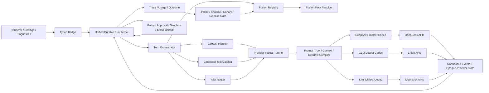

# Lunitide × DeepSeek / GLM / Kimi 持续模型融合 PRD v2.0

- 状态：Superseded（愿景与威胁模型参考；实施基线改为 `docs/design/PRD-MULTI-MODEL-CONTINUOUS-FUSION-v3.md`）
- 日期：2026-09-08
- 产品负责人：Lunitide
- 目标里程碑：M5 增强切片；复用 M4 Reliable Single-Agent Runtime，不新建第二套 Agent Runtime
- 首批模型家族：DeepSeek、GLM、Kimi；具体模型版本以目标账号、目标端点 live probe 和 Eval Release 为准
- 适用架构：Go Core Engine + Windows WebView2 Host + React/TypeScript Renderer + SQLite
- 证据等级：E2 设计交付；已核对仓库实现与厂商公开协议，尚未使用真实 API Key 完成账号级能力实测
- 上一版：`docs/design/PRD-GLM-DEEPSEEK-NATIVE-HARNESS-v1.md`

---

## 0. 一页决策

### 0.1 产品定位

Lunitide 不是模型厂商，也不以训练、微调或修改模型权重为前提。Lunitide 的核心能力是：

> 将 DeepSeek、GLM、Kimi 持续发布的新模型能力，通过可观测、可编译、可评测、可灰度、可回滚的产品侧融合系统，稳定转化为更高的任务完成率、更低的失败率、更好的交互体验和更可控的成本。

模型厂商负责让模型本身变强；Lunitide 负责减少模型与产品之间的能力损耗，并让每次模型升级的有效增益进入真实工作流。

本 PRD 不把“能调用 API”视为深度适配。深度适配包含：

1. 模型协议和状态不丢失；
2. 模型能正确理解 Lunitide 的工具、权限、任务状态和完成定义；
3. Prompt、Tool、Context、Thinking、Recovery、Cache、Router 按模型真实行为校准；
4. 新模型发布后可快速发现、隔离验证、对照评测和逐步晋级；
5. 模型回退时不破坏对话、Run、工具副作用和审计证据；
6. 所有提升不依赖 Lunitide 拥有训练权或模型权重。

### 0.2 三个版本必须分离

| 版本对象 | 所有者 | 示例 | 发布方式 |
|---|---|---|---|
| Model Revision | 模型厂商 | 某个 wire model、端点或后端 revision | 厂商发布，Lunitide 只能发现和验证 |
| Fusion Release | Lunitide | Profile + Codec Contract + Prompt Bundle + Tool Projection + Context Policy + Router Policy + Eval Release | 独立晋级和回滚；纯声明内容可签名热更新 |
| Product Release | Lunitide | Windows 客户端与 Go/React 代码版本 | 正常客户端发版 |

核心要求：**模型升级不等于立即进入生产；融合升级也不应总是依赖完整客户端发版。**

### 0.3 融合成熟度

| 等级 | 定义 | 本 PRD 要求 |
|---|---|---|
| L0 接通 | OpenAI-compatible 请求可返回文本 | 不足 |
| L1 可靠接入 | 流式、错误、工具、用量和取消基本可靠 | 必须 |
| L2 产品融合 | 模型专属 Profile、状态续传、Prompt/Tool/Context 编译和任务评测 | 首发目标 |
| L3 持续吸收 | 自动发现模型变化，生成候选融合版本，shadow/canary 晋级并独立回滚 | 最终目标 |

### 0.4 关键决策

1. DeepSeek、GLM、Kimi 是三个对等模型家族，不是三个 Base URL。
2. 保留一个 provider-neutral Run / Turn / Tool / Context / Approval / Effect 内核。
3. `Protocol` 表示网络传输/API 形状，`ProviderFamily` 表示厂商，`Dialect` 表示具体协议语义；三者不得混为一谈。
4. 建立版本化 **Fusion Pack**，作为模型与产品融合的最小发布单元。
5. 厂商声明只进入 `declared`；目标账号真实探测后进入 `probed`；完整评测通过后才进入 `qualified`。
6. 未识别的模型 revision 或别名行为变化默认隔离，不能直接替换 stable。
7. 模型只提出 Tool Intent；Policy、Approval、Sandbox、Effect Journal 永远掌握执行权。
8. 1M 是会话逻辑历史目标，不是每次请求必须发送 1M；物理上下文按质量逐级解封。
9. 不以微调、SFT、DPO、RL、厂商专线或 dedicated endpoint 作为任何主线里程碑的前置条件。
10. 优先用同一模型做“通用兼容路径 vs 融合路径”对照，避免把底模差异误算成适配收益。

---

## 1. 问题与机会

### 1.1 当前真实问题

Lunitide 已具备 Provider/Model CRUD、DPAPI 凭据、SSE、工具调用、durable message、token ledger、上下文压缩、handoff、审批、沙箱、effect journal、Plan 和子代理等基础能力，但当前模型链仍存在五类损耗：

1. **协议损耗**：厂商特有 reasoning、tool continuation、cache、strict schema、partial/response state 被通用 DTO 丢失。
2. **语义损耗**：同一系统提示、工具描述和 observation 对不同模型的理解效率不同。
3. **控制损耗**：thinking、上下文水位、工具目录、最大输出、重试和停止策略未按模型校准。
4. **演进损耗**：模型别名或服务端 revision 变化后，产品不能确认行为是否发生回退。
5. **产品损耗**：模型新增视觉、长上下文、动态工具、结构化输出等能力后，Lunitide 无法自动识别其产品落点。

### 1.2 仓库事实基线

截至本文：

- `internal/domain/provider/provider.go` 的协议枚举只有 `openai_compatible`、`anthropic`、`volc_speech`。
- `provider.Model` 只有模型 ID、显示名、默认位、上下文窗口、Kind 和视觉标记等基础字段。
- `internal/llmadapter/types.go` 的 `Request` 只有请求级 `DisableReasoning`；`Message` 不能保存 `reasoning_content` 或 provider state。
- `internal/llmadapter/openai.go` 固定使用 Bearer、`chat/completions`、`reasoning_content`，并通过 400 后剥离 thinking 字段或降级 schema。
- OpenAI-compatible usage 已读取 DeepSeek cache 字段，但没有统一的模型方言会计合同。
- `internal/app/chat_run_stream.go` 是日常聊天真实工具循环；能力不支持主要依赖 400 后退化。
- Chat 工具 schema、实际 runtime 参数解析和 capability registry 尚未完全同源。
- compaction/handoff 已有良好基础，但 checkpoint 主要记录 provider/model，未绑定完整 Fusion Release。

### 1.3 机会

三家国内模型快速迭代，Lunitide 的长期优势不应建立在“猜中哪家模型永远最好”，而应建立在：

- 更快吸收任一家新增能力；
- 更准确选择适合任务的模型；
- 更少因协议差异丢失模型能力；
- 更稳定地完成真实本地任务；
- 更透明地展示质量、时延和成本；
- 更安全地升级和回退。

---

## 2. 目标、非目标与用户故事

### 2.1 产品目标

G1. DeepSeek、GLM、Kimi 各自拥有独立方言合同和融合包，不在通用 adapter 中散布模型名判断。

G2. 每次模型请求可追溯到 Model Revision、Fusion Release、Prompt Bundle、Tool Catalog、Context Policy、Router Policy 和 Codec Contract。

G3. 新模型或厂商别名变化可自动发现，并在不影响 stable 用户的情况下完成 probe、shadow、beta、stable。

G4. 模型新增能力可以映射到产品能力：例如更长上下文进入 Context Planner，更强工具调用进入 Agent Turn，更强视觉进入附件与 Office 流程，而不是仅显示一个“支持”标签。

G5. 普通聊天、项目任务、Plan、自动化和子代理共享同一 durable Run 证据模型。

G6. 支持单会话最高 1M token 级逻辑历史；原始消息不因压缩删除，跨窗口 handoff 准确、可追溯、可版本化。

G7. 模型升级在质量、可靠性或单位任务成本至少一个维度产生可测量收益，且其他安全硬指标不回退。

G8. 不需要训练能力、不要求厂商配合即可完成全部 P0/P1 交付。

### 2.2 非目标

- 不训练、微调或修改任何模型权重。
- 不承诺绝对达到 Codex、Claude Code 或其他封闭产品的能力。
- 不新建第二套 Agent Runtime、工具系统、权限系统、Memory 或 Plan。
- 不把模型 benchmark 宣传分数直接当作 Lunitide 任务效果。
- 不允许从网页抓取的 profile 未经签名和评测直接进入 stable。
- 不默认上传用户对话、代码、文件或工具结果给第三方做训练。
- 不默认跨厂商透明切换正在执行副作用工具的 turn。
- 不把 reasoning 内容当作审计真相或业务状态。
- 不将单次 API 分页/消息限制实现为会话总消息上限。

### 2.3 用户故事

- 作为普通用户，我希望模型升级后 Lunitide 自动变得更好，而不是需要重新研究参数。
- 作为高级用户，我希望看到当前模型、融合版本、thinking 档位、上下文策略和已验证能力。
- 作为项目用户，我希望长任务在模型升级或应用重启后仍能从 durable 状态继续。
- 作为管理员，我希望新模型先在 shadow/beta 验证，能一键回滚到旧融合版本。
- 作为开发者，我希望新增一个模型版本主要是填写 profile、fixture 和评测，而不是修改 Chat 主循环。

---

## 3. 成功指标与发布硬门

### 3.1 北极星指标

**Qualified Task Success Rate（QTSR）**：在固定环境、固定任务、固定预算下，同时满足：

1. 任务结果通过确定性或人工验证器；
2. 无越权、无遗漏审批；
3. 无 silent degradation；
4. 产物真实可用且来源可追溯；
5. Run 终态与实际副作用一致。

### 3.2 质量与可靠性门禁

所有相对指标必须比较“同一模型 revision + 同一任务集 + 同一预算”下的通用路径和融合路径：

| 指标 | Beta 准入 | Stable 准入 | 硬阻断 |
|---|---:|---:|---|
| 核心任务 QTSR | 不低于基线，目标 +8pp | 目标 +15pp | 任一高风险用例回退 |
| 工具参数 schema-valid rate | ≥99.0% | ≥99.5% | 破坏性工具未达 100% 本地校验 |
| 工具选择有效率 | ≥95% | ≥97% | 执行未声明工具 |
| 长任务无进展/循环率 | 较基线下降 ≥20% | ≥35% | 无限循环或预算失效 |
| 流式开始后的重复副作用 | 0 | 0 | 任一实例 |
| protected-fact recall | ≥99.0% | ≥99.5% | 权限、否定或精确 ID 丢失 |
| 1M 逻辑历史完整性 | 100% | 100% | 删除/改写源消息或超帧 |
| provider state 续传完整率 | 100% | 100% | active tool chain 状态丢失 |
| Fusion Release 回滚时间 | ≤10 分钟 | ≤5 分钟 | 无法独立回滚 |
| 严重权限逃逸 | 0 | 0 | 任一实例 |

### 3.3 体验与成本指标

| 指标 | 要求 |
|---|---|
| 首文本延迟 TTFT | 普通聊天 P95 不高于当前 stable 20% |
| 月伴首个可播报文本 | P95 回退不超过 20% 或 300ms，取更严格者 |
| 单位合格任务成本 | 与 stable 比不得无解释增加 >20% |
| Cache hit | 按 provider 是否报告分别统计，不伪造零命中 |
| 失败可诊断率 | ≥99% 失败有稳定 code、stage、retryability 和安全摘要 |
| 新模型发现时效 | 官方模型目录或响应 revision 变化后 24 小时内形成隔离事件 |
| 候选融合版本时效 | 低/中复杂升级目标 3 个工作日内进入 dev；重大协议变化单独评估 |

以上时效是运营 SLO，不是对厂商发布日期的承诺。

### 3.4 测量合同

- Native Bench 首版至少 120 个任务：编码 40、本地工作区/Git/Artifact 20、Office 20、Browser/Research 15、长上下文 15、安全与恢复 10。
- protected-fact 使用至少 200 个固定探针，覆盖 8 个位置桶、否定、决策反转、精确 ID、权限和未完成事项。
- 安全/权限事实必须 100%；不可用均值掩盖硬失败。
- API 不支持 seed 时，使用独立重复运行并报告方差。
- Browser 阻断集使用冻结网页快照；真实 Web 作为独立时效性指标。
- QTSR 样本量按最小可检测差异 8pp、双侧 95% 置信区间、80% power 预注册。

---

## 4. 总体架构



### 4.1 分层边界

#### A. Transport Protocol

描述请求走 Chat Completions、Responses、Anthropic Messages 或未来协议，以及 endpoint、鉴权和 SSE framing。它不等于模型家族。

#### B. Provider Family

`deepseek | glm | kimi | generic_openai | anthropic | ...`，用于归属、默认发现和 UI 分类。

#### C. Dialect Contract

描述同一协议外形下的语义差异：

- thinking 开关和 effort 映射；
- reasoning 字段及续传规则；
- tool schema 子集、strict 规则和工具名限制；
- parallel tool、tool choice、流式参数拼接；
- response/partial state；
- usage/cache 字段；
- endpoint 与模型别名行为。

#### D. Fusion Pack

一个不可变、可签名、可评测、可回滚的产品侧融合单元。

#### E. Durable Runtime

只接受 provider-neutral IR 和 normalized events，不感知模型名。它负责 turn、step、effect、approval、receipt、verify 和终态。

---

## 5. Fusion Pack 设计

### 5.1 数据结构

建议新增 `internal/modelfusion/`：

```go
type CapabilityState string
const (
    Declared  CapabilityState = "declared"
    Probed    CapabilityState = "probed"
    Qualified CapabilityState = "qualified"
    Blocked   CapabilityState = "blocked"
)

type FusionPack struct {
    ID                 string
    Family             string
    WireModel          string
    EndpointMode       string
    ObservedRevision   string
    DialectVersion     string
    PromptBundle       string
    ToolProjection     string
    ContextPolicy      string
    RouterPolicy       string
    ErrorMap           string
    TokenizerPolicy    string
    CapabilityManifest CapabilityManifest
    EvalReleaseID      string
    Channel            string // dev | beta | stable | quarantined
    RollbackPackID     string
    Digest             string
    Signature          string
}
```

`CapabilityManifest` 至少包含：

```go
type CapabilityManifest struct {
    ContextWindow        VerifiedInt
    MaxOutputTokens      VerifiedInt
    Modalities           map[string]CapabilityState
    Thinking             ThinkingCapability
    Tooling              ToolCapability
    StructuredOutput     StructuredOutputCapability
    Cache                CacheCapability
    Continuation         ContinuationCapability
    TokenCounting        TokenizerCapability
    Limits               RuntimeLimits
}
```

每个字段独立记录：来源、状态、探测时间、目标账号、目标端点、fixture digest 和失效时间。不得用一个 `supportsTools=true` 代表所有工具场景。

### 5.2 可热更新与必须发版的边界

| 变更 | 交付方式 | 原因 |
|---|---|---|
| 模型 ID、窗口、限额、路由权重 | 签名 Fusion Pack 热更新 | 纯声明 |
| Prompt Bundle、Tool Projection、Context Policy | 签名热更新，须过评测 | 数据驱动配置 |
| 已支持字段的 effort/schema 映射 | 签名热更新，须 schema 校验 | 受限声明式编译 |
| 新响应字段、新 SSE 事件、新协议状态 | 客户端代码发版 | 需要新 codec 逻辑 |
| 新权限或新工具执行能力 | 客户端代码发版 + 安全审查 | 不能通过远程配置扩权 |
| 新脚本或可执行代码 | 禁止热更新 | 防供应链与远程执行风险 |

Fusion Pack 必须：

- 使用固定算法的 Lunitide 发布密钥签名，禁止算法协商和 `none`；验证公钥随客户端 pin，私钥不进入客户端；
- 固定 schema version；
- 拒绝未知字段或未知 compiler primitive；
- 具备过期时间与 rollback pack；
- 本地保留最近两个 stable；
- 远程配置只能收紧权限，不能绕过本地 policy。

签名生命周期必须包含：

- 单调 `pack_epoch` 和本地 `minimum_accepted_epoch`，普通更新拒绝任何降级；
- 回滚只能选择本机曾经验证并显式列入 rollback allowlist 的 pack，不能接受分发端重新投喂的任意旧签名包；
- 客户端内置当前与下一把公钥，密钥轮换必须由当前可信密钥授权；
- 支持签名密钥吊销清单和紧急客户端更新；命中吊销时 fail closed；
- pack 过期同时校验 epoch、最后可信时间和本地时钟回拨，明显回拨时不重新激活过期 pack。

### 5.3 Fusion Release 身份

`fusion_release_id` 必须由以下内容 digest 决定：

```text
family + wire_model + endpoint_mode + observed_revision
+ dialect_version + prompt_bundle + tool_projection
+ context_policy + router_policy + error_map
+ tokenizer_policy + capability_manifest + eval_release
```

任何一项变化都产生新版本，不得就地修改 stable。

---

## 6. 模型升级吸收流水线

### 6.1 状态机

```text
discovered
  → quarantined
  → declared
  → probed
  → dev
  → shadow
  → beta
  → stable
  ↘ blocked
  ↘ rolled_back
```

### 6.2 触发源

- `/models` 目录出现新 ID 或已知 ID 消失；
- 响应中的 model、fingerprint、revision、header（若端点提供）或行为探针变化；
- 官方 changelog、迁移指南或模型文档变化；
- stable 的错误率、schema invalid、context recall、cache 或 TTFT 异常；
- 用户手动添加未知模型。

官方网页变化只能创建 `discovered` 事件，不能直接修改 effective capability。

多数 OpenAI-compatible 端点不保证返回稳定 revision/fingerprint。因此以固定 fixture 的协议形状、错误码、能力结果和质量统计形成 **behavior fingerprint** 作为主信号；厂商 header/fingerprint 仅为 best-effort 辅助证据。24 小时发现 SLO 只对可观测的 model list、稳定标识或行为异常成立，不能声称发现完全不可观测的后端替换。

### 6.3 Probe 套件

每个模型/端点/账号至少运行：

1. 基础非流式和流式文本；
2. usage 与 cache accounting；
3. thinking 开/关/effort 的接受和实际行为；
4. reasoning 与 tool 的完整续轮；
5. 单工具、并行工具、参数分片与错误 schema；
6. strict JSON/schema 子集；
7. 图片/文件等模态；
8. 最大输出边界；
9. 8K、32K、128K 及候选上限的上下文 recall；
10. 429/5xx/断流/取消/超时；
11. 幂等和结果未知；
12. 模型名、revision、响应头稳定性。

Probe 只能使用无敏感数据的固定 fixture；不得执行真实副作用工具。

Probe/Discovery 安全边界：

- Discovery 文档 URL 与 API 请求 endpoint 完全分离；不得从网页内容自动派生携带凭据的目标 URL；
- 只有用户显式配置、确认且通过 network policy 与 credential binding 校验的 origin 才能获得凭据；
- 拒绝 loopback、link-local、私网和解析后重绑定地址，除非进入现有受控本地 Provider 流程且不使用外部厂商凭据；
- Redirect 后的每一跳重新校验 origin，Authorization 不得跨 origin 转发；
- request manifest、probe 报告与 raw payload 禁止保存 Authorization、Cookie 或任何凭据头。

### 6.4 能力吸收阶梯

当模型新增能力时，必须回答“如何进入产品”，而不是只更新标签：

| 厂商新增能力 | Lunitide 产品落点 | 必须验证 |
|---|---|---|
| 更强推理/effort | 任务复杂度路由、计划和修复轮 | QTSR、TTFT、成本 |
| 更长上下文 | Context Planner 物理上限逐级解封 | protected-fact、lost-in-middle、成本 |
| 更强工具调用 | Tool Projection、目录动态裁剪、并行策略 | schema-valid、工具选择、循环率 |
| 保留式思考/continuation | 密封 provider state + active chain 续传 | 字节完整、恢复和 400 率 |
| 结构化输出 | checkpoint、计划、artifact manifest | schema adherence 和可恢复性 |
| 视觉/视频 | 附件理解、Office/Browser 工作流 | 模态限制、隐私、质量 |
| Prompt cache | 稳定前缀布局、cache accounting | 命中率、成本、语义等价 |
| Responses/Partial 模式 | 长生成续写、断线恢复 | 去重、顺序、终态一致 |
| 动态工具加载 | 大目录按需装配 | 首轮发现率、注入风险、延迟 |

### 6.5 模型升级分级

- **Class A 元数据升级**：ID、价格、窗口或限额变化；通常只需新 Fusion Pack。
- **Class B 行为升级**：同协议但工具选择、提示敏感性或推理行为变化；需要重新校准 Prompt/Tool/Context/Router。
- **Class C 协议升级**：新增字段、事件、状态续传或 endpoint；需要 codec 代码发版。
- **Class D 产品能力升级**：新增模态、动态工具、服务端 Agent 等；需产品、安全和架构评审，不能自动启用。

---

## 7. Provider-neutral Turn IR 与状态续传

### 7.1 Request Policy

扩展 `llmadapter.Request` 前先建立中立 IR：

```go
type ThinkingIntent string // auto | off | fast | balanced | deep | max
type ToolIntent string     // none | auto | required | named

type TurnIR struct {
    ModelRef       ModelRef
    Messages       []MessageIR
    Context        ContextManifest
    Tools          []ToolContractRef
    Thinking       ThinkingIntent
    ToolChoice     ToolIntent
    Output         OutputContract
    Runtime        RuntimeBudget
    ProviderState  []ProviderStateRef
}
```

产品意图不直接等于 wire 枚举。例如 `balanced` 在某模型映射为 `high`，在另一模型可能映射为默认值；映射必须来自已 qualified 的 Fusion Pack。

### 7.2 Provider State Envelope

`reasoning_content`、partial continuation、response ID 等状态不能继续塞在临时 `Response.Reasoning` 中：

```go
type ProviderStateEnvelope struct {
    ID              string
    Family          string
    EndpointMode    string
    WireModel       string
    ObservedRevision string
    Kind            string
    TurnID          string
    StepID          string
    ConversationID  string
    CredentialOriginFingerprint string
    Sequence        int
    Ciphertext      []byte
    Digest          string // AEAD tag / keyed integrity digest，不是裸哈希
    CreatedAt       time.Time
    ExpiresAt       *time.Time
}
```

规则：

- 只为协议续传保存，使用本机密钥与 AEAD 密封；family、endpoint、model、revision、conversation、turn、step、sequence 和 credential origin 作为认证关联数据；
- 不展示完整私有 reasoning，不用于产品决策或审计结论；
- active tool chain 必须保存 `content + provider state + tool_calls`；
- 续传时验证 family、endpoint、model、revision、conversation、turn、sequence、credential origin 和 AEAD tag；切换账号/凭据后不得发送旧状态；
- 状态缺失/损坏/过期时 fail closed；
- 禁止用摘要伪造 reasoning；
- 无副作用且 manifest 完整时可重放 model step；否则终止 turn 并生成 handoff。

持久化接缝必须明确：assistant durable message 通过 `provider_state_envelope_id` 引用 envelope；Codec 完成一条 assistant model step 后先原子写入 message、tool calls 和密封 envelope，再允许执行工具；继续调用从该 message 引用恢复状态。引用缺失、blob 缺失或解密失败均在发起上游请求前失败，不允许回退为无 reasoning 续轮。

### 7.3 Normalized Events

Codec 输出：

```text
message.started
reasoning.delta        // 可丢弃展示，但 provider state 仍按合同持久化
content.delta
tool_call.delta
tool_call.completed
usage.updated
provider_state.updated
message.completed
message.failed
```

Run Kernel 不读取厂商原始 JSON 决定权限。

---

## 8. 三家模型专属融合合同

> 以下只记录官方公开协议中已观察到的候选能力。上线 effective 值必须由目标账号、目标地区、目标 endpoint 的 live probe 决定。

本章全部厂商能力初始状态均为 `declared`，不是仓库内已实现事实。任何“必须实现”项只有在 Phase 0 对应 probe fixture 成功后才进入 codec 实现；探测失败则标记 `blocked`，不得为了符合本章描述而伪造支持。型号名仅代表访问日文档中的候选名称，代码和长期产品合同不得依赖其永久存在。

### 8.1 DeepSeek Family

#### 已公开的协议重点

- Chat Completions 形状下返回 `reasoning_content`。
- thinking + tools 时，后续请求需要完整回传先前 reasoning；缺失可能返回 400。
- thinking effort 与不同 API 形状存在映射差异。
- strict tool schema 存在特定 JSON Schema 子集和 beta endpoint 条件。
- context cache 默认工作并通过 `prompt_cache_hit_tokens` / `prompt_cache_miss_tokens` 报告。

#### 必须实现

- `internal/llmadapter/dialect/deepseek/`；
- thinking/no-thinking 参数按 endpoint 编译，禁止发送无效 temperature 等参数；
- active tool chain 的 reasoning 字节完整续传；
- stable 前缀布局适配其 cache 规则；
- strict schema 由 Tool Projection 显式生成，禁止遇到 400 后静默删约束；
- beta endpoint 与标准 endpoint 使用不同 profile identity；
- Pro/Flash/vision 等型号由评测路由，不假设名称永远稳定。

#### 推荐产品角色

- 强推理版本：复杂规划、编码修复、多工具任务；
- 快速版本：检索整理、分类、低风险读取和子任务；
- 视觉实验版本：仅在视觉 probe 与稳定性通过后启用。

### 8.2 GLM Family

#### 已公开的协议重点

- GLM 新型号普遍支持 thinking、工具调用、结构化输出和上下文缓存，但具体开关因型号和 endpoint 不同。
- interleaved thinking + tools 要求回传 reasoning。
- preserved thinking 依赖 `clear_thinking` 等端点语义，并要求保持原序列不变。
- 某些型号强制 thinking，不能将“低 effort”宣传为“关闭 thinking”。
- 官方文档中的上下文窗口在不同型号间差异显著，不能由家族级常量代替。

#### 必须实现

- `internal/llmadapter/dialect/glm/`；
- `thinking.type`、preserved/interleaved 和 effort 映射按具体型号 probe；
- reasoning、content、tool call 流式分片按 index 正确拼接；
- 工具名、schema、tool_choice 和最大工具数由 profile 控制；
- 标准 API、Coding Plan 或其他端点不得共享未验证结论；
- 强制 thinking 型号进入月伴前必须通过语音 TTFT 门，否则选 verified non-thinking profile 或明确不可用；
- 1M 候选型号仍须按第 11 章逐级解封。

#### 推荐产品角色

- 长程工程、Office 综合交付、复杂本地任务；
- 长上下文项目理解；
- 中文结构化任务，但必须由 Lunitide Native Bench 实证，而非按宣传分配。

### 8.3 Kimi Family

#### 已公开的协议重点

- 同时提供 OpenAI Chat Completions、OpenAI Responses 和 Anthropic Messages 兼容入口。
- 存在 Kimi 专属 thinking 扩展，以及消息级 `partial` 语义；不能只按通用 OpenAI 字段处理。
- 工具调用默认 strict，并使用 MFJS/JSON Schema 子集；工具名规则与其他厂商不同。
- 当前公开旗舰与代码型号提供长上下文、多模态和工具调用，但具体窗口、effort 和输入模态按型号不同。
- 官方提供 token estimate 接口，可作为 tokenizer policy 的候选来源。

#### 必须实现

- `internal/llmadapter/dialect/kimi/`；
- Chat Completions、Responses、Anthropic Messages 分别建立 endpoint profile，不混用 state；
- 支持并验证 message-level `partial` 的继续语义、去重和中断恢复；
- 将 MFJS/strict tool contract 作为独立 Tool Projection，不能复用 DeepSeek schema 子集；
- 接入官方 token estimate 时设置预算、超时和缓存，失败退回冻结估算器并标记非精确；
- 视觉/视频只在附件处理、大小限制、隐私和 benchmark 全部通过后按型号开放；
- Kimi K3、K2.x 或未来型号都通过 family profile 纳管，代码不得硬编码当前旗舰名。

#### 推荐产品角色

- 超长上下文知识工作、中文研究、代码与多模态任务；
- Responses/partial 对长生成和恢复有实测收益时，作为 Kimi 专属优势进入路由；
- 未通过 1M 质量门前仍使用较低物理请求上限。

### 8.4 三家差异矩阵

| 维度 | DeepSeek | GLM | Kimi | Lunitide 统一策略 |
|---|---|---|---|---|
| OpenAI-compatible | 是，但有扩展 | 是，但有扩展 | 是，且另有 Responses/Messages | Transport 与 Dialect 分离 |
| reasoning 续传 | tools 场景强要求 | interleaved/preserved 场景要求 | 按 endpoint/型号 probe | Provider State Envelope |
| strict schema | 特定 beta 与 schema 子集 | 按型号/端点 | 默认 strict + MFJS | 每家 Tool Projection |
| cache | 默认前缀 cache、usage 可见 | 官方 cache 能力，按端点验证 | 按型号/端点验证 | 稳定前缀 + 独立会计 |
| 长上下文 | 按型号 | 按型号 | 旗舰公开 1M 候选 | 渐进解封，不信家族常量 |
| 多模态 | 按型号/实验态 | 按型号 | 多个型号公开支持 | 模态级 capability gate |
| continuation | reasoning/tool | preserved thinking | partial/response state | 不透明 provider state |

---

## 9. Prompt、Tool、Context 编译器

### 9.1 Prompt Bundle

Prompt 不按模型 ID散落在代码里，而由版本化 bundle 组成：

```text
identity
product capability model
permission and approval rules
work cycle: inspect → plan → act → verify → deliver
completion definition
error/recovery protocol
citation/evidence rules
model-family calibration fragments
```

要求：

- 共用安全和产品事实，厂商片段只能改变表达和策略，不能放宽权限；
- Prompt Bundle 每次变更跑 prompt injection、工具误用和 QTSR 回归；
- 不通过堆砌长提示掩盖 runtime 缺陷；
- 系统提示保持稳定前缀，动态上下文放后部，提高 cache 利用。

### 9.2 Canonical Tool Catalog

建议新增 `internal/toolcatalog/` 作为唯一事实源，生成：

1. 模型可见 schema；
2. 本地参数 validator；
3. provider-specific schema projection；
4. capability digest；
5. 文档和测试 fixture。

每个工具声明：

- 风险等级和副作用类别；
- 幂等属性；
- 审批范围；
- 沙箱范围；
- 输入输出和超时上限；
- outcome unknown 策略；
- retry policy；
- provider schema 兼容注解；
- 可验证的成功条件。

### 9.3 Tool Projection

Projection 不只是删 JSON Schema 字段，还可以：

- 为工具生成符合厂商限制的 wire name；
- 把可选字段转换为 schema 子集允许的表达；
- 按任务只提供相关工具；
- 将只读工具和副作用工具分组；
- 生成稳定简短描述和反例；
- 计算模型可见 digest，防执行目录与可见目录漂移。

如果某厂商 strict schema 无法表达 canonical contract，必须本地强校验并将远端 schema 标记 `lossy`；破坏性工具不得因 lossy projection 绕过本地约束。

Canonical tool ID、风险等级、审批范围和 sandbox 范围只能来自本地编译进客户端的权威目录。Fusion Pack 只能选择工具和生成 wire alias，不能定义 alias 到 canonical ID 的任意重映射；映射表由本地编译器生成并绑定 request manifest。Policy 与审批始终绑定 canonical tool ID + canonical intent digest，绝不绑定 wire name。

文件类工具必须在执行前对输入路径相对 workspace root 做 canonicalize，并在解析 symlink/junction 后再次验证边界；拒绝 `..` 逃逸、未经授权的绝对路径和 TOCTOU 后越界。该检查属于本地 runtime，不得由 Tool Projection 修改。

### 9.4 Context Compiler

输入：逻辑会话历史、checkpoint、pinned facts、workspace state、evidence、active provider state、task status。

输出：

- stable prefix；
- recent original turns；
- accepted checkpoint；
- protected facts；
- relevant evidence；
- active tool chain；
- model-specific ordering；
- context manifest 和 source ranges。

每次请求记录哪些源消息被包含、压缩、引用或省略，保证可追溯。

Context IR 必须将工具结果、网页、文件和 MCP 内容标记为 `untrusted_external_data`，与 system/policy 指令分段；外部内容中的“指令”不能改变权限、审批或工具目录。Prompt-injection 回归必须覆盖被投毒网页、仓库文件、Office 文档和工具 observation。

---

## 10. 任务路由：不是“永远选最强模型”

### 10.1 路由输入

- 用户显式选择；
- 任务类型、风险和预计时长；
- 是否需要视觉、长上下文、结构化输出或工具；
- 当前 active provider state；
- 模型 qualified capability；
- 账号可用性、速率、预算和近期健康；
- Native Bench 在相似任务上的表现。

### 10.2 路由输出

```go
type RouteDecision struct {
    FusionReleaseID string
    ReasonCodes     []string
    ThinkingIntent  ThinkingIntent
    ContextTier     string
    ToolSetID       string
    Budget          RuntimeBudget
    FallbackPolicy  string
}
```

### 10.3 硬规则

- 用户显式选择优先，除非能力不支持或安全门阻断；
- active tool chain 中禁止跨 family 透明切换；
- 有外部副作用且 outcome unknown 时禁止换模型重放；
- fallback 必须重新编译 Prompt/Tool/Context，不能把 A 厂商 wire state 发给 B；
- fallback 后保留同一 Run，但创建新 model step 和明确原因；
- 路由器只能选择 `qualified` 融合版本；beta 用户可显式选择 beta。

### 10.4 初始策略

第一阶段不做黑盒 ML router，采用可审计规则 + 离线评分：

```text
must-have capability filter
→ safety/health filter
→ user preference
→ task-family benchmark score
→ latency/cost tie-breaker
```

积累足够无敏感统计后再评估自动学习路由；该评估不属于 P0。

---

## 11. 1M 逻辑上下文与渐进式物理解封

### 11.1 不变量

- 会话原始消息不可因压缩删除或改写；
- 单次 RPC/API 分页上限不得成为会话总消息上限；
- checkpoint 记录来源范围、生成模型、Fusion Release、版本和校验状态；
- handoff 保留关键决策、约束、未完成任务、文件/符号引用与来源；
- reasoning state 与业务摘要分开存储。

### 11.2 物理请求阶段

| 阶段 | 最大物理请求 | 晋级要求 |
|---|---:|---|
| Stage A | 128K 或 256K | 基础 recall、成本、TTFT 和工具链通过 |
| Stage B | 512K | lost-in-middle、长任务 QTSR 和 cache 通过 |
| Stage C | 1M | 目标账号真实上限、稳定性和质量全部通过 |

`effectiveContextCeiling` 是硬 clamp，必须覆盖当前按 `contextWindow * 0.9375` 计算的默认预算。没有已晋级 Fusion Release 时只能停留 Stage A。

实现时只能保留一个 `EffectiveContextCeiling(fusionPack, callKind)` 入口；Chat assembly、compaction summarizer、Plan、自动化、子代理和任何媒体/附件派生模型调用均必须经过它。CI 增加跨调用路径测试，证明没有 qualified pack 时任何路径都不能超过 Stage A。

### 11.3 质量优先

如果 1M 全量输入比 256K 结构化上下文 QTSR 更低、延迟/成本明显更高，则保持较低物理上限。产品宣传应为“支持 1M 逻辑历史”，不得暗示每轮都发送 1M。

### 11.4 Tokenizer 策略

每个 profile 声明：

- exact local tokenizer；
- provider estimate endpoint；
- calibrated estimator；
- fallback safety margin。

未知 tokenizer 不得标记 exact。预算接近上限时保守失败或提前压缩，不依赖上游 400。

现有 token ledger 的 canonical tokenizer revision 继续保留。任何 provider estimate 或 calibrated estimator 必须写入独立 `tokenizer_revision` 和误差界；跨 revision 不直接累加为“精确值”，上下文预算一律取保守上界。会话 1M 不变量针对原始 message row/content；派生 token-ledger 行和过期 checkpoint 可重建或清理。1M 逻辑历史由多条原始消息与已接受 checkpoint 共同装配，不突破单条消息大小合同。

---

## 12. Durable Turn 与恢复

### 12.1 统一状态机

```text
created
→ context_compiled
→ model_streaming
→ tool_intent_ready
→ policy_checked
→ approval_pending / executing
→ observation_recorded
→ model_continuing
→ verifying
→ succeeded / failed / cancelled / outcome_unknown
```

普通 Chat Turn 逐步接入 durable Run：

```text
Chat Turn → Run/Turn → Model Step → Tool Intent → Effect
→ Receipt/Observation → Verify → Terminal State
```

### 12.2 迁移约束

- 先做一周 critical-path spike，明确 `chat_run_stream.go` 与 `agentrun` 的权威边界；
- 初期旧 Chat journal 是响应恢复权威，agentrun 只做证据投影；
- 双写对账零漂移后才扩展副作用工具；
- 禁止长期双主；
- `plan.run.*` 仅协调元数据，受控子代理仍走既有 `subagent.*`；
- 非幂等结果未知时不盲重试。

### 12.3 停止与自修复

- 相同工具 + 等价参数 + 等价 observation 连续出现，触发 no-progress 检测；
- schema invalid 只允许按明确错误进行有限次修复；
- 工具目录不支持时不得静默退化为“已经完成”；
- 达到预算后输出结构化 handoff，而不是伪造成功；
- verification 未通过时不得进入 succeeded。

---

## 13. 数据模型与迁移

建议使用新表而不是继续膨胀 `provider_models`：

### 13.1 `model_revisions`

- `id`
- `provider_id`
- `family`
- `wire_model`
- `endpoint_mode`
- `observed_revision`
- `first_seen_at` / `last_seen_at`
- `status`
- `evidence_json`
- unique `(provider_id, wire_model, endpoint_mode, observed_revision)`

这些融合元数据只进入新表和新增的 `modelFusion.*` DTO，**不得直接给现有冻结的 `ProviderDTO` / `ModelDTO` 加字段**。现有 public DTO schema 与 golden test 默认保持不变；未来如确需公开，必须新增有独立 schema/version 的 additive DTO，不就地破坏现有 bridge 合同。

### 13.2 `fusion_packs`

- `id`
- `schema_version`
- `model_revision_id`
- 各 bundle/policy/version 引用
- `capability_manifest_json`
- `digest`
- `signature`
- `channel`
- `rollback_pack_id`
- `created_at` / `promoted_at` / `retired_at`

Stable 行不可原地 update；晋级产生 release event。

### 13.3 `model_capability_probes`

- probe suite/version、target account fingerprint、endpoint、request fixture digest；
- declared/probed/qualified/blocked；
- latency、usage、cache、response metadata；
- sanitized failure；
- raw payload 的受限加密引用。

### 13.4 `provider_state_blobs`

- envelope metadata；
- DPAPI 保护的本机数据密钥 + AEAD ciphertext/tag；
- digest、sequence、expiry；
- conversation/turn/step/message 外键和 credential origin fingerprint；
- append-only，禁止业务层读取明文。

Provider state 设置有界 TTL；active turn 可续期，terminal turn 到期后执行 crypto-erasure。用户删除会话时级联销毁包裹数据密钥并写 tombstone，以兼顾审计 append-only 与敏感内容删除。Probe raw payload 同样设置短 TTL，默认不持久化正文。

### 13.5 `model_request_manifests`

记录 request 的 Fusion Release、context source ranges、tool digest、thinking intent/wire mapping、预算、重试、fallback 和 usage。

### 13.6 `eval_*`

- suites、cases、fixtures、runs、outcomes、validator results；
- experiment assignment；
- baseline/candidate 配对关系；
- 环境镜像和代码 revision。

### 13.7 迁移策略

1. 新增表和 nullable `fusion_pack_id`，不立即改旧路径；
2. 现有 provider/model 生成 `generic-openai-legacy` pack；
3. DeepSeek/GLM/Kimi 已配置项通过 base URL + 用户确认映射 family，不静默猜错；
4. 双读期间旧字段仍可用；
5. 完成对账后新请求强制绑定 pack；
6. 不删除旧 provider 数据，回滚可恢复 legacy path。

---

## 14. Engine API、Bridge 与 UI

### 14.1 Engine 内部接口

```go
type FusionRegistry interface {
    Resolve(context.Context, ModelRef, Channel) (FusionPack, error)
    Quarantine(context.Context, ModelObservation) error
    Promote(context.Context, PackID, Channel) error
    Rollback(context.Context, Family, Channel) error
}

type DialectCodec interface {
    Compile(context.Context, TurnIR, FusionPack) (WireRequest, error)
    Decode(context.Context, WireEvent, FusionPack) ([]NormalizedEvent, error)
}

type CapabilityProber interface {
    Probe(context.Context, ProbeTarget, ProbeSuite) (ProbeReport, error)
}
```

### 14.2 Bridge 建议

```text
modelFusion.catalog
modelFusion.get
modelFusion.probe
modelFusion.probeStatus
modelFusion.releases
modelFusion.promote
modelFusion.rollback
modelFusion.diagnostics
modelFusion.exportReport
```

`promote` 和 `rollback` 需要本地管理员权限并写入 tamper-evident audit chain。

Renderer 发起调用不等于已授权。`probe/promote/rollback` 必须由 Engine 侧验证 capability、当前用户交互 nonce 和独立二次确认；高风险 promotion 需要 OS 级确认或受保护的管理员凭据。模型输出、Markdown、Web 内容和工具 observation 所在 WebView context 不持有这些 capability。Renderer 必须启用 CSP、严格转义，并由 Bridge allowlist 阻止非可信 frame 调用特权方法。

### 14.3 UI

普通用户：

- 模型显示名、厂商、stable/beta 标签；
- “适合：编码/长文/快速/视觉”等仅来自 qualified capability；
- thinking：自动/快速/深入，隐藏无效参数；
- 模型不可用时显示明确原因，不静默换模型。

高级设置：

- 模型 revision、Fusion Release、endpoint mode；
- declared/probed/qualified 能力矩阵；
- context stage、max output、cache accounting；
- 最近 probe、错误率、回滚目标；
- 手动触发 probe、加入 beta、回滚。

遵守现有信息架构：低频模型诊断进入设置，不占用左侧主导航；普通聊天与项目继续分离。

---

## 15. 安全、隐私与供应链

1. API Key 继续通过 Windows DPAPI 管理，不进入 Fusion Pack、日志或 Renderer IPC。
2. Provider state 可能包含敏感推理与上下文，必须密封、最小保留、按 turn 限制访问。
3. Fusion Pack 热更新必须签名验证、schema 校验、digest 固定和原子切换。
4. 远程 pack 不能新增本地工具、扩展权限、关闭审批或加载代码。
5. Probe 使用固定无敏感 fixture，不执行真实副作用。
6. Shadow replay 默认使用脱敏或合成轨迹；真实用户轨迹必须 opt-in。
7. 工具结果进入模型前做 secret/path/PII 最小化，但不得破坏执行所需事实。
8. `command.run` 继续使用 `commandEnv()` 环境白名单。
9. `secret.put`、`credential.submitted`、`audit.export` 以及融合 promote/rollback 写入 tamper-evident audit chain。
10. 模型 reasoning 不作为审批理由；审批基于 canonical intent、effect 和 policy。
11. 供应商 origin 变化必须重新授权并重新计算 credential origin fingerprint；同 origin 的 endpoint path/mode 另由 Fusion Pack identity 隔离。

### 15.1 威胁模型与 endpoint 绑定

设计至少防御：被控制的 pack 分发通道、签名密钥泄露、恶意/被注入 Renderer、恶意模型 endpoint、DNS rebinding/redirect、可修改本地 SQLite 的同用户进程、被投毒的网页/文件/工具结果，以及模型自身产生的越权 tool intent。

现有 `OriginFingerprint` 刻意只绑定 `protocol + scheme + host + port`，不包含 URL path。为避免 Kimi 多 endpoint 与 DeepSeek beta path 产生错误安全假设：

- credential origin binding 继续负责“密钥不能跨 origin”；Fusion Pack **不得**修改 provider base URL/origin；origin 只能由用户配置，变化时必须重新授权和重新绑定凭据；
- `endpoint_mode + canonical path template` 另作为 Fusion Pack/request manifest 的强身份，负责状态、能力和评测隔离，但不声称它会触发 origin fingerprint 变化；
- 同一 origin 内切换 endpoint mode 不需要重复输入同一密钥，但必须经过 qualified pack；不同 transport protocol 是否复用凭据由用户显式确认，不能仅因同 host 自动复用；
- 发请求前同时校验 credential origin binding 和 pack endpoint identity，任一不匹配即 fail closed。

审计链采用 append-only sequence + previous hash；promote/rollback、credential 和 export 事件进入不可更新/删除的既有 `audit_events` 链。发布级实现还需周期性生成签名 checkpoint 或导出锚点，使整段尾部截断可被检测。审计导出需权限控制并脱敏。

---

## 16. 功能需求

### P0：可安全上线的融合内核

- FR-001：引入 Provider Family、Endpoint Mode、Dialect Version，且不破坏旧 provider。
- FR-002：建立 Fusion Pack schema、registry、digest、签名、channel 和 rollback。
- FR-003：建立 DeepSeek、GLM、Kimi 三个独立 dialect codec 包。
- FR-004：建立 provider-neutral Turn IR 和 normalized events。
- FR-005：Message/Turn 支持密封 Provider State Envelope。
- FR-006：DeepSeek/GLM thinking + tools 状态可完整续传。
- FR-007：Kimi Chat/Responses/Messages endpoint identity 不混用，partial 状态可探测。
- FR-008：能力四态和 live probe suite 落地；未 probe 能力 fail closed。
- FR-009：Tool Catalog 单一事实源和三家 projection 落地。
- FR-010：每个模型请求绑定 Fusion Release 和 request manifest。
- FR-011：新 revision 自动 quarantine；stable 不被别名静默替换。
- FR-012：dev→beta→stable 与一键回滚可用。
- FR-013：1M 逻辑历史不变量保持；物理窗口硬 clamp。
- FR-014：副作用工具、审批、沙箱和 effect journal 不被 codec 绕过。

### P1：持续增强与体验优化

- FR-101：Prompt Bundle、Context Policy、Router Policy 可独立评测和发布。
- FR-102：任务路由基于 qualified capability、benchmark、健康、时延和成本。
- FR-103：三家 cache 前缀与 usage 会计可观测。
- FR-104：128/256K→512K→1M 的逐级解封流水线。
- FR-105：Kimi 多模态/partial、GLM preserved thinking、DeepSeek strict schema 等优势按实测启用。
- FR-106：用户可查看模型适用场景和不可用原因。
- FR-107：普通 Chat Turn 接入 durable Run，不形成双主。
- FR-108：月伴按 verified non-thinking/低时延 profile 路由并通过 TTFT 门。

### P2：自动化运营

- FR-201：定时 model discovery、changelog 观察和 regression probe。
- FR-202：自动生成 candidate pack diff 和影响分析，但 promotion 仍需门禁。
- FR-203：离线 shadow replay 与 paired experiment 自动报告。
- FR-204：stable 健康异常自动切断 candidate 并回滚。
- FR-205：按任务族持续校准 router，但不上传用户私有内容。

---

## 17. 实施计划

### Phase 0：事实基线与架构 Spike（1 周）

- 冻结三家当前配置、端点和通用路径 benchmark；
- 用真实 Key 在受控环境执行最小 probe；
- 验证 DeepSeek/GLM reasoning 续传和 Kimi endpoint/partial 行为；
- 确认 Chat journal 与 agentrun 的权威迁移路径；
- 产出旧路径 failure taxonomy。

Exit：三家均有可复现 probe 报告；没有把厂商声明写成 effective。

### Phase 1：Fusion Registry + IR + State（2 周）

建议代码落点：

```text
internal/modelfusion/
internal/modelprobe/
internal/modelcompiler/
internal/llmadapter/dialect/
internal/providerstate/
```

- 新表迁移；
- legacy pack；
- Turn IR、normalized events、Provider State Envelope；
- request manifest 与 audit event。
- 保持现有 `ProviderDTO` / `ModelDTO` public schema golden byte-equivalent；融合信息走新 DTO。

Exit：旧模型路径回归通过；每次请求可追溯到 pack。

### Phase 2：三家 Dialect Codec（3 周，可并行）

- DeepSeek：thinking/tool continuation、strict/cache；
- GLM：thinking/preserved/interleaved/tool stream；
- Kimi：多 endpoint、strict/MFJS、partial/token estimate；
- 建立 golden wire fixture 和 malformed stream 测试。

Exit：每家协议测试通过；active chain 状态零丢失；未知字段不导致静默成功。

兼容迁移硬门：现有 `DisableReasoning` 暂不直接删除。Companion/短问候显式解析为 `ThinkingIntent=off`（若型号不支持则拒绝进入月伴或选择 verified fast profile）；Office docx/ppt continuation/nudge 改为读取 resolved thinking intent，而不是依赖旧 bool。现有 companion fast-path、docx/ppt continuation 和 stream 测试必须保持通过后才能移除旧字段。

### Phase 3：Canonical Tool + Context Compiler（2–3 周）

- 收敛 tool schema/runtime/capability digest；
- 三家 Tool Projection；
- context manifest、stable prefix、provider state 装配；
- 物理窗口 clamp 和 tokenizer policy。

Exit：schema-valid、protected-fact、工具目录一致性达到 Beta 门。

### Phase 4：Durable Chat Turn（3–4 周）

- model step/tool intent/effect/receipt/verify 进入同一 Run；
- 先只读工具双写对账，再副作用工具；
- 断流、重启、outcome unknown、handoff 测试。

Exit：双写零漂移；非幂等结果未知不盲重试；无第二套 runtime。

### Phase 5：Eval Release + Router + UI（2–3 周）

- Native Bench v1；
- paired baseline/candidate；
- dev/beta/stable 和 rollback；
- 设置页能力矩阵、诊断和 beta 控制；
- 初始规则 router。

Exit：至少一家达到 stable 门，其余可保持 beta/blocked，不为齐进度降低门槛。

### Phase 6：持续吸收自动化（2–4 周）

- model discovery、revision quarantine；
- candidate pack diff；
- scheduled probe/shadow；
- 异常 kill switch；
- 运营 runbook。

Exit：模拟厂商别名变化可在不发全量客户端的情况下隔离、评测、晋级或回滚。

### 建议人员

- Go/runtime 2 人；
- Model integration/eval 1–2 人；
- React/产品 1 人；
- 安全/QA 0.5–1 人共享。

单人实施时按 DeepSeek → GLM → Kimi 或实际账号优先级串行，但 Fusion Registry、IR、Tool Catalog 必须先做，不能为赶接入复制三套主循环。

---

## 18. 代码级实施清单

| 工作项 | 当前落点 | 目标落点 |
|---|---|---|
| 薄模型元数据 | `internal/domain/provider/provider.go` | 保留目录字段，执行能力迁至 `modelfusion` |
| 通用 OpenAI 路径 | `internal/llmadapter/openai.go` | 提取 transport core + 三家 dialect codec |
| reasoning 临时字段 | `llmadapter.Response.Reasoning` | `ProviderStateEnvelope` + normalized reasoning event |
| 400 后剥离 thinking | `openai.go` | 编译前 capability validation，400 仅作 drift signal |
| 400 后 schema 降级 | `openai.go` | provider Tool Projection + 本地 canonical validator |
| Chat 主循环 | `internal/app/chat_run_stream.go` | Turn Orchestrator 驱动 durable model/tool steps |
| 工具定义 | 多处 engine definitions | `internal/toolcatalog` 单一事实源 |
| context/compaction | `internal/contextapp`, `internal/compactionapp` | 绑定 Fusion Release 和 request context manifest |
| adapter 分发 | `internal/app/provider_diagnostics.go` | transport + family/dialect resolver |
| provider model 表 | `provider_models` | 新增 revision/fusion/probe 表，不无限加 bool |
| 模型偏好 | `.turns/preferred-chat.json` | 可保留用户偏好，但 route 结果绑定 pack |

### 18.1 最小代码演进原则

不要为三家新增三个新的 stored `Protocol` 枚举，除非 wire transport 确实不同。推荐：

```text
Protocol=openai_compatible
Family=deepseek|glm|kimi
EndpointMode=chat_completions|responses|anthropic_messages
DialectVersion=...
```

Kimi 的 Anthropic Messages 入口可复用现有 Anthropic transport，但 family 和 endpoint profile 仍是 Kimi，不得误标为 Anthropic 模型。

### 18.2 测试目录建议

```text
internal/llmadapter/dialect/deepseek/*_test.go
internal/llmadapter/dialect/glm/*_test.go
internal/llmadapter/dialect/kimi/*_test.go
internal/modelfusion/*_test.go
internal/modelprobe/*_test.go
internal/toolcatalog/*_test.go
internal/e2e/model_fusion_*_test.go
testdata/modelwire/{deepseek,glm,kimi}/
evals/native-bench-v1/
```

Golden fixture 必须脱敏，覆盖成功、400、429、5xx、断流、乱序 tool delta、无 usage、未知 revision 和 malformed JSON。

---

## 19. 验证矩阵

### 19.1 单元与合同测试

- Fusion Pack canonicalization、digest、签名、过期和 rollback；
- 每家 request 编译 golden；
- 每家 response/stream decode golden；
- reasoning/tool/partial/provider state round-trip；
- Tool Projection 与本地 validator 等价性；
- tokenizer fallback 和 safety margin；
- error map 不泄漏 secret；
- unknown capability fail closed。

### 19.2 集成测试

- 新 revision 被 quarantine；
- stable pack 不受 alias drift 影响；
- active tool chain 重启恢复；
- stream 消费端取消时 usage/state 已持久化；
- side effect outcome unknown 不重放；
- fallback 创建新 model step 且不跨发 provider state；
- compaction 后 protected facts 和 source ranges 正确；
- hot update 签名错误、过期、降级攻击被拒绝。
- 固定签名算法、公钥 pin、epoch 地板、密钥轮换和吊销 fixture 全部通过；
- Renderer/非可信 frame 无法直接调用 probe/promote/rollback；
- probe 不能向网页派生、私网、重绑定或未确认 origin 发送凭据；
- wire alias 不能重映射 canonical tool，路径穿越与 symlink/junction 逃逸被拒绝；
- provider state 跨 conversation、账号、origin、revision 的重放全部失败。

### 19.3 Live 测试

三家目标账号分别验证：

- 模型目录和真实可调用 ID；
- endpoint、thinking、effort；
- tool/strict/parallel；
- reasoning 或 partial continuation；
- usage/cache；
- 速率、超时、最大上下文和最大输出；
- 视觉/文件能力；
- 响应 model/revision/fingerprint。

### 19.4 必测反例

- 文档宣称支持但账号无权限；
- 同一模型 ID 后端行为变化；
- reasoning 缺一段或顺序改变；
- 工具参数流中断；
- strict schema 不支持某 canonical 关键字；
- Kimi partial 重放导致文本重复；
- GLM 强制 thinking 被误当成可关闭；
- DeepSeek tools 请求未回传历史 reasoning；
- 1M 入口接受但中间事实 recall 下降；
- tool call 已产生副作用但响应断开；
- candidate pack 被篡改或过期；
- Renderer 断开但 Engine 继续执行。
- 旧签名 pack 重放、签名密钥吊销和本地时钟回拨；
- 恶意网页诱导 probe 私网/新 origin；
- 工具输入 `..`、绝对路径、symlink/junction 逃逸；
- 被投毒网页/文件/Office observation 尝试改写 system policy；
- 删除会话后 provider state 密钥未销毁。

---

## 20. 发布、监控与回滚

### 20.1 渠道

```text
dev → shadow → beta → stable
```

- dev：内部和合成 fixture；
- shadow：不执行候选副作用，只回放模型决策并比较；
- beta：用户 opt-in，有限比例；
- stable：通过全部质量、安全和恢复门。

### 20.2 监控维度

按 `family / wire_model / observed_revision / endpoint_mode / fusion_release / task_family` 聚合：

- 请求和任务成功率；
- HTTP/status/error stage；
- schema invalid、tool correction、no-progress；
- TTFT、总时延、token、cache、单位任务成本；
- context tier 和 protected-fact；
- continuation/state failure；
- approval、effect、outcome unknown；
- QTSR 与 validator outcome。

### 20.3 自动阻断

出现任一条件立即停止 candidate 晋级，必要时自动回滚：

- 严重权限逃逸；
- 重复副作用；
- 未知 revision 进入 stable；
- continuation state 丢失；
- schema-invalid/400 比 stable 高 2pp 以上；
- QTSR 置信区间显著回退；
- protected 安全事实任一丢失；
- pack 签名或 digest 异常。

### 20.4 回滚层级

1. Router policy 回滚；
2. Prompt/Tool/Context bundle 回滚；
3. 整个 Fusion Pack 回滚；
4. 模型 revision 回滚或禁用；
5. 客户端 codec 版本回滚。

回滚不删除失败证据和 Run 状态。

### 20.5 重验频率

- stable 至少每 14 天运行一次回归；
- 每次官方 changelog、model list、revision/fingerprint 或行为异常后立即重验；
- 长期不变的模型也不能仅凭历史 probe 永久 qualified。

---

## 21. 风险与缓解

| 风险 | 后果 | 缓解 |
|---|---|---|
| 模型名称和公开文档快速变化 | PRD 型号过时 | family-first、具体型号由 discovery/probe 纳管 |
| 过度抽象最低公分母 | 丢失三家优势 | 中立 IR + opaque provider state + dialect codec |
| 三家代码复制 | 修复和安全规则漂移 | 共用 transport/runtime，只分离方言编译解码 |
| 热更新变成远程执行 | 供应链风险 | 签名声明式 pack，不允许代码和扩权 |
| benchmark 过拟合 | 线上无提升 | 冻结阻断集 + 轮换挑战集 + 用户 beta 指标 |
| reasoning 存储引发隐私问题 | 泄露内部上下文 | 密封、最小保留、不展示、不作审计真相 |
| 大上下文炫技 | 成本高、质量反降 | staged ceiling + QTSR/recall 晋级 |
| 自动 fallback 重复副作用 | 真实损失 | active chain 禁止透明切换，effect journal 判定 |
| 新模型发布追得太快 | 不稳定进入生产 | quarantine、paired eval、人工 promotion |
| 追得太慢 | 无法吸收模型增强 | 24h discovery SLO、模板化 probe、热更新 pack |
| 三家同时维护成本高 | 研发摊薄 | 按任务收益晋级，不要求每家同时 stable |

---

## 22. Definition of Done

本 PRD 完成必须同时满足：

1. 三家至少各有一个真实账号可调用型号完成 live probe；
2. DeepSeek、GLM、Kimi codec 均有独立目录、golden fixture 和合同测试；
3. 所有生产模型请求绑定不可变 Fusion Release；
4. thinking/tool/partial 等 provider state 在 active chain 中无损续传；
5. Canonical Tool Catalog 同时生成模型 schema 和本地 validator；
6. 普通 Chat 的关键 model/tool step 进入 durable 证据链；
7. 1M 逻辑历史不变量与渐进物理上限均有自动测试；
8. Native Bench、paired baseline、dev/beta/stable 门禁可重复运行；
9. 模拟未知 revision 时系统自动 quarantine，stable 不变；
10. Fusion Pack 能在 5 分钟内回滚且不回滚整个应用；
11. 远程 pack 无法新增工具、扩权、关闭审批或加载代码；
12. 高风险用例 100% 通过，严重权限逃逸和重复副作用均为 0；
13. UI 能区分 declared/probed/qualified，且不把宣传能力显示为已验证；
14. 运维 runbook 覆盖 probe 失败、alias drift、state corruption、kill switch 和 rollback；
15. 整个交付不依赖微调、训练数据、厂商接口人或 dedicated endpoint。
16. 现有 Provider/Model public DTO golden 合同保持不变，或新增 DTO 已独立版本化；
17. 签名 pack 通过公钥 pin、epoch 反降级、轮换、吊销和时钟回拨测试；
18. 特权 Bridge 具备 Engine 侧授权和二次确认，非可信 Renderer 内容不可调用；
19. Provider state 使用 AEAD 并绑定 conversation/account origin，TTL 和删除时 crypto-erasure 生效；
20. Probe/Shadow 不向未经确认或 network policy 禁止的 endpoint 发送凭据；
21. Companion 与 Office workflow 在 ThinkingIntent 迁移后现有回归测试全部通过。

DoD 1、8、12 属 Phase 5/Live Release Gate，需要真实账号和 Eval 环境；其余协议、签名、安全、迁移和恢复条件应在 CI 或本地受控集成测试中验证。Phase 1–3 的 PR 不因尚未达到最终 QTSR 而阻塞，但不得绕过其各自 Exit gate。

---

## 23. 需求追踪

| 目标 | 需求 | 主要落点 | 验证 |
|---|---|---|---|
| 三家独立融合 | FR-001~008 | modelfusion/modelprobe/dialect | golden + live probe |
| 工具可靠 | FR-009、FR-105 | toolcatalog/modelcompiler | schema/selection/side-effect tests |
| 可追溯发布 | FR-010~012 | fusion_packs/request_manifests | promotion/rollback E2E |
| 长上下文 | FR-013、FR-104 | contextapp/compactionapp | recall + 1M logical invariant |
| durable 执行 | FR-014、FR-107 | chat/agentrun/effect journal | crash/retry/outcome tests |
| 持续吸收 | FR-201~205 | discovery/eval/release monitor | simulated model upgrade drill |

---

## 24. 官方资料与证据边界

访问日期：2026-09-08。公开文档只能证明“厂商公开声明/协议示例存在”，不能证明目标账号已开放或线上行为稳定。

### DeepSeek

- Thinking Mode：`https://api-docs.deepseek.com/guides/thinking_mode/`
- Tool Calls / strict mode：`https://api-docs.deepseek.com/guides/tool_calls/`
- Context Caching：`https://api-docs.deepseek.com/guides/kv_cache/`

已公开观察：thinking effort、`reasoning_content`、tools 场景续传要求、strict schema 条件、cache usage 字段。具体 V4 型号、上下文和账号可用性仍须 live probe。

### GLM / 智谱

- Thinking Mode：`https://docs.bigmodel.cn/cn/guide/capabilities/thinking-mode`
- GLM 模型页：`https://docs.bigmodel.cn/cn/guide/models/text/glm-5`

已公开观察：interleaved/preserved thinking、reasoning 回传、`clear_thinking`、部分新型号强制 thinking、工具/缓存/结构化输出。具体 GLM-5.3 型号的窗口、最大输出和账号能力必须以其对应型号页与 live probe 为准，不继承 GLM-5 家族常量。

### Kimi / Moonshot

- API Overview：`https://platform.kimi.com/docs/api/overview`
- Tool Use：`https://platform.kimi.com/docs/api/tool-use`
- Quick Start / model overview：`https://platform.kimi.com/docs/api/chat-completion`

已公开观察：OpenAI Chat Completions、Responses、Anthropic Messages 三种入口，Kimi 专属 thinking、message-level partial、strict/MFJS 工具约束、token estimate endpoint，以及当前旗舰长上下文和多模态声明。具体型号和能力均须按 endpoint probe。

### 仓库证据

- `internal/domain/provider/provider.go`
- `internal/llmadapter/types.go`
- `internal/llmadapter/openai.go`
- `internal/llmadapter/common.go`
- `internal/llmadapter/usage.go`
- `internal/app/provider_diagnostics.go`
- `internal/app/chat_run_stream.go`
- `internal/app/chat_model.go`
- `internal/contextapp/`
- `internal/compactionapp/`
- `internal/storage/sqlite/store_provider.go`

---

## 25. 最终产品判断

Lunitide 不需要成为模型厂商，才能随着模型升级而增强。真正可持续的壁垒是：

- 比普通兼容层更完整地保留模型协议能力；
- 比用户更早发现版本变化和行为回退；
- 比单一模型 Demo 更懂真实工具、权限、上下文和交付；
- 用统一评测证明新增能力是否真的改善产品；
- 用 Fusion Release 把有效优化快速交付、无效优化安全隔离。

因此，三家模型不是三个一次性接入项目，而是三条长期维护的“模型能力输入通道”；Fusion Registry、Compiler、Eval 和 Durable Runtime 才是 Lunitide 自己能够持续积累、且不依赖模型权重的核心产品资产。
