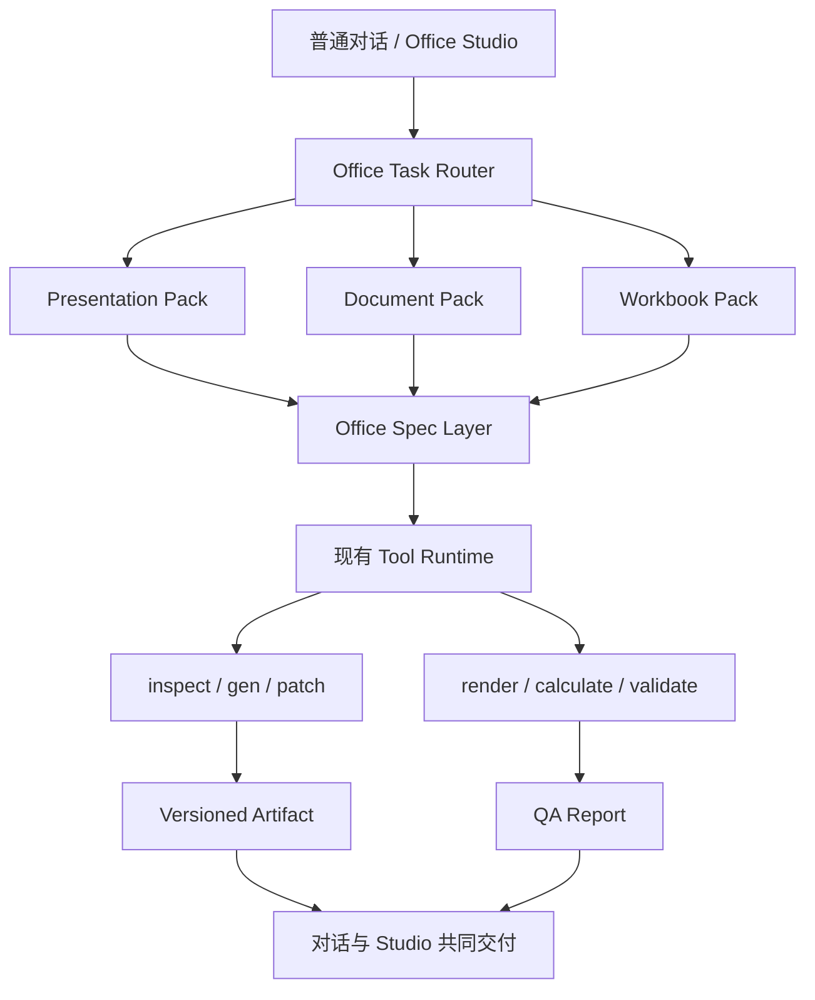

# Lunitide Office Studio 产品需求文档

> 文档版本：v1.0  
> 状态：Draft for Review  
> 更新日期：2026-09-07  
> 产品名称：Office 办公专家 / Office Studio  
> 适用里程碑：M5 能力基础、M6 专业执行增强、M7 版本化交付  
> 决策优先级：本文件定义 Office 产品方向；不得覆盖 Lunitide 已冻结的普通聊天/项目分离、统一 Runtime、安全与审计基线。

## 1. 执行摘要

Lunitide 将提供一个统一的 **Office 办公专家**，负责识别、规划和执行 PPT、Word、Excel、PDF 及跨格式办公任务；同时新增一个面向复杂办公工作的独立前台界面 **Office Studio**。

Office Studio 是现有对话能力的专业化视图，不是第二套产品平台：

- 用户可从 Office 办公专家、Office 文件卡片或新建入口进入；
- 简单任务仍可在普通对话中直接完成；
- 复杂任务可进入 Office Studio，获得任务、对话、画布、版本和质量检查的集中工作界面；
- Studio 与普通对话共享会话、附件、专家版本、Durable Run、工具权限和 Artifact；
- 用户可随时回到普通对话，任务状态和文件版本不会丢失；
- 不要求创建项目，项目不是 Office 能力开关。

产品质量的核心不是增加一张专家卡片，而是建设以下五项工程能力：

1. 结构化 Office Spec；
2. inspect + patch 局部修改；
3. 真实渲染和 Excel 重算；
4. 自动 QA、修复和阻断门；
5. 会话 Artifact 版本化、来源和跨文件数据血缘。

## 2. 背景与问题

### 2.1 用户问题

当前用户可以要求 Lunitide 生成 PPTX、DOCX、XLSX 和 PDF，但复杂办公任务仍存在以下体验断点：

- 用户需要理解并选择具体专家或工具；
- 生成过程缺少统一的任务规划和可见进度；
- 文件修改倾向于全量重做，难以保证未要求修改的区域保持不变；
- 文本提取不能替代真实渲染，无法可靠发现溢出、重叠、分页和兼容性问题；
- 聊天文件卡片缺少正式的版本链、差异和质量状态；
- 跨 Excel、Word、PPT 的数字可能失去统一来源；
- 对话适合提出要求，但不适合同时查看页面、版本、问题和任务进度。

### 2.2 当前事实基线

Lunitide 已具备可复用基础：

- Go Core Engine + Windows WebView2 Host + React/TypeScript Renderer；
- 专家目录、专家版本、六段式说明、Skill/MCP/本地大脑绑定；
- 普通聊天中的专家挂载和能力装备；
- `pptx.gen`、`docx.gen`、`excel.gen`、`excel.parse`、`pdf.gen`；
- PPT 和报告的产品侧流程约束；
- 聊天 Artifact 卡片、Artifact Inspector、评论、修改要求和接受；
- 本机打开 Office 文件；
- Durable Run、工具审批和恢复基础。

当前实现仍以 V1 生成工具和文本预览为主。本 PRD 中的 Spec、V2 patch、真实渲染、正式聊天版本链与跨制品血缘均为待建设能力，不得在上线前宣称已具备。

## 3. 产品决策

### 3.1 统一专家

新增稳定目录项：

```text
catalog key: office-expert
显示名称：Office 办公专家
```

统一专家自动路由到 presentation、document、workbook、conversion 和 bundle 工作流。原有 PPT 专家、报告编写专家和 Excel 表格制作专家先保留，后续作为统一专家的专项预设和兼容入口。

### 3.2 独立前台、共享内核

新增 Office Studio 前台视图。它可以有独立页面布局，但必须共享：

- 同一个 session / agent run；
- 同一附件与 AdHocWorkspace；
- 同一专家与 Equipment Snapshot；
- 同一工具权限、审批和审计；
- 同一 Artifact 和版本存储；
- 同一上下文压缩与 handoff 机制。

禁止建立 Office 专用的第二套 Runtime、账号、消息、权限、文件目录或版本数据库。

### 3.3 对话与 Studio 的分工

| 场景 | 默认体验 |
|---|---|
| 新建一个简单表格、短文档或少量页面 | 留在普通对话中执行并交付文件 |
| 使用模板、多个附件、跨格式输出 | 建议进入 Office Studio |
| 需要逐页/逐节/逐 Sheet 修改 | Office Studio |
| 需要查看版本、差异、QA 问题 | Office Studio |
| 用户明确要求留在对话 | 不强制跳转，右侧 Artifact Inspector 渐进展开 |

## 4. 目标与非目标

### 4.1 产品目标

- 用户只需描述业务目标，无需了解工具名；
- 复杂办公任务有明确范围、计划、进度、版本和完成定义；
- 修改尽可能局部化，并可证明未受影响区域未变化；
- 最终文件经过结构、内容、渲染、公式和兼容性检查；
- PPT、Word 和 Excel 可共享已确认的数据与来源；
- 失败后可恢复，已完成步骤不无条件重跑；
- 简单任务保持低摩擦，复杂能力按需展开。

### 4.2 非目标

- 不在首版复制 PowerPoint、Word 或 Excel 的完整编辑器；
- 不提供像素级自由画布或完整电子表格网格编辑；
- 不要求用户先创建项目；
- 不以提示词替代确定性文件结构和验证；
- 不保证所有 Office、WPS 和 LibreOffice 版本完全一致；
- 不在没有真实重算或渲染证据时宣称“已验证”；
- 不在 Phase 1 一次性实现全部 Office 高级能力。

## 5. 目标用户与核心任务

### 5.1 目标用户

1. 管理者：将经营数据转成报告和决策汇报；
2. 产品/项目人员：制作 PRD、方案、周报、复盘和汇报；
3. 销售/咨询人员：根据客户材料和品牌模板制作方案；
4. 财务/运营人员：清洗、分析、汇总并可视化表格数据；
5. 行政/研究人员：整理材料、生成规范长文档和会议交付物。

### 5.2 Jobs to be Done

- 当我有多份材料时，帮我形成结构清晰、可交付的 Office 文件；
- 当我有公司模板时，保留品牌和版式，不要生成通用模板；
- 当我只要求改一页/一节/一个 Sheet 时，不要破坏其他内容；
- 当文件包含关键数字时，让我知道它们来自哪里；
- 当系统说“完成”时，文件应能打开，并已通过明确的检查。

## 6. 成功指标

### 6.1 北极星指标

**一次任务中，用户无需离开 Lunitide 即接受最终 Office Artifact 版本的比例。**

### 6.2 核心指标

| 指标 | 定义 | 首个正式版本目标 |
|---|---|---|
| 可打开率 | 交付文件可被目标 Office/WPS 打开 | ≥ 99% |
| 阻断 QA 通过率 | 最终交付前阻断项清零 | 100% |
| 局部修改保持率 | 非目标节点结构摘要保持不变 | ≥ 99% |
| 任务恢复成功率 | 中断后从检查点继续完成 | ≥ 95% |
| 数字可追溯率 | 关键指标具备来源引用 | ≥ 95% |
| 首稿接受率 | 不经全量重做即进入局部修改或接受 | 持续提升，灰度期建立基线 |

### 6.3 体验护栏

- 简单任务不应因 Studio 引入额外必经步骤；
- 自动修复不得修改已锁定数字、法务文本或用户确认区域；
- 未通过真实渲染/重算时必须显示“未验证”或“部分验证”；
- 所有覆盖原文件、宏处理和破坏性数据变更必须显式确认。

## 7. 信息架构与入口

### 7.1 入口

1. 新对话选择“Office 办公专家”；
2. 普通对话内点击“进入 Office Studio”；
3. Office Artifact 卡片点击“在 Studio 中打开”；
4. 左侧“办公”分组中的 Office Studio；
5. 项目内可打开同一 Studio 视图，但项目仍保持独立领域和导航。

### 7.2 Studio 布局

桌面宽屏采用三栏：

```text
任务与文件栏（240px）
  ├─ 新建 Office 任务
  ├─ 最近任务
  ├─ 输入材料
  └─ 交付文件

中央工作区（弹性）
  ├─ 任务标题与状态
  ├─ 对话 / 预览 / 检查
  ├─ 画布或文档预览
  └─ 指令输入框

检查与版本栏（320px）
  ├─ 执行阶段
  ├─ QA 概览
  ├─ 问题列表
  ├─ 版本时间线
  └─ 来源与血缘
```

窄屏时右栏收进抽屉，左栏可折叠；不提供移动端完整编辑体验。

## 8. 端到端用户流程

### 8.1 新建任务

```text
选择 Office 办公专家或打开 Studio
→ 输入目标或选择快捷任务
→ 上传材料/模板
→ 系统识别任务类型、输出和风险
→ 简单任务直接执行；复杂任务显示计划
→ 用户确认高风险动作或关键口径
→ 生成 Spec 和文件
→ 渲染/重算/验证
→ 自动修复允许修复的问题
→ 交付版本化文件和 QA 报告
```

### 8.2 局部修改

```text
用户选择页面/章节/Sheet 或直接描述节点
→ 系统解析修改范围
→ 显示将创建的新版本及影响范围
→ 对 Spec 应用 patch
→ 增量生成文件
→ 对目标节点和回归范围重新验证
→ 生成新版本与差异摘要
```

### 8.3 跨格式任务

```text
输入销售明细.xlsx + 总结.docx + 公司模板.pptx
→ 建立统一 Evidence Index
→ WorkbookSpec 计算并确认指标
→ DocumentSpec 引用指标形成报告
→ PresentationSpec 引用同一指标形成汇报
→ 任一上游指标变化时标记下游节点过期
→ 用户选择同步更新或保持旧版本
```

## 9. 功能需求

### 9.1 任务路由与合同

- **OFF-RTR-001** 系统必须识别 create、revise、inspect、analyze、convert、bundle 等意图。
- **OFF-RTR-002** 路由结果必须包含 `taskType`、复杂度、输入类型、能力需求、交付物和风险级别，不能只返回工具名。
- **OFF-RTR-003** 用户可在执行前修改识别出的目标格式、页数/篇幅、受众和模板。
- **OFF-RTR-004** 输入不充分但可安全采用默认值时应继续执行并明确假设；只有关键决策无法推断时才阻塞提问。
- **OFF-RTR-005** 跨格式任务必须生成一个主任务和可追踪子任务，而不是彼此无关的三次生成。

任务合同示例：

```json
{
  "taskType": "presentation.revise",
  "complexity": "complex",
  "inputKinds": ["pptx", "xlsx"],
  "requiredCapabilities": ["pptx.inspect", "pptx.patch", "pptx.render", "pptx.validate"],
  "deliverables": ["presentation-spec", "pptx", "render-preview", "qa-report"],
  "risk": "medium"
}
```

### 9.2 通用文件能力

- **OFF-COM-001** 支持导入 DOCX、PPTX、XLSX、CSV、PDF、TXT、Markdown、图片和模板文件。
- **OFF-COM-002** inspect 必须提取可用的结构、样式、媒体、页面/工作表信息和元数据，而不只是纯文本。
- **OFF-COM-003** 模板检查必须尽可能识别字体、颜色、页边距、Logo、页眉页脚、母版、布局和数字格式。
- **OFF-COM-004** 原文件默认只读，所有修订生成新版本；覆盖导出必须审批。
- **OFF-COM-005** 文件名、路径和导出位置必须受现有 Workspace 与工具权限约束。
- **OFF-COM-006** 支持 Word→PPT、Excel→Word、Excel→PPT、Office→PDF、CSV→XLSX 和多文件交付包。

### 9.3 PPT

任务类型：

```text
presentation.create / revise / summarize / from_document /
from_workbook / apply_template / translate / validate / export
```

- **OFF-PPT-001** 支持定义受众、目标、页数、叙事结构和每页目的。
- **OFF-PPT-002** 支持封面、章节、结论、KPI、图表、表格、时间线、流程、对比、引用和结束页等语义布局。
- **OFF-PPT-003** 支持用户模板、母版、品牌色、字体、Logo 和页面比例。
- **OFF-PPT-004** 支持图片、图标、备注和来源引用。
- **OFF-PPT-005** 支持按页和元素执行 patch，并声明影响范围。
- **OFF-PPT-006** 支持逐页缩略图、单页预览、QA 问题定位和版本差异。
- **OFF-PPT-007** 验证包结构、可打开性、页数、标题、溢出、重叠、变形、字体、对比度、页面密度、图表数据和模板保持。

### 9.4 Word

任务类型：

```text
document.create / revise / from_template / summarize /
translate / compare / validate / export
```

- **OFF-DOC-001** 支持报告、方案、纪要、手册、制度、PRD、技术方案、合同草案、论文、简历和长篇内容的差异化工作流。
- **OFF-DOC-002** 支持封面、标题样式、目录、页眉页脚、页码、分节、表格、图片、题注、脚注、引用、多级编号和附录。
- **OFF-DOC-003** 支持按章节或结构节点 patch，并保留未选区域。
- **OFF-DOC-004** 支持结构差异、文字差异和样式差异的分层比较。
- **OFF-DOC-005** 验证标题层级、目录、空章节、表格宽度、图片边界、分页、页眉页脚、引用、术语、数字冲突和 TODO。
- **OFF-DOC-006** 法律或合规文本修改必须显示语义风险提示，不能承诺法律正确性。

### 9.5 Excel

任务类型：

```text
workbook.create / inspect / clean / transform / analyze /
revise / visualize / validate / export
```

- **OFF-XLS-001** inspect 支持 Sheet、表头、类型、公式、合并、命名区域、验证、隐藏项、图表、透视表、链接和格式。
- **OFF-XLS-002** 生成支持多 Sheet、公式、跨 Sheet 引用、样式、冻结、筛选、排序、条件格式、数据验证、图表、汇总和打印设置。
- **OFF-XLS-003** 清洗任务先给出变更提案；删除、覆盖、类型批量转换等高风险动作必须确认。
- **OFF-XLS-004** patch 必须支持 Sheet、范围、表格、公式或图表级修改。
- **OFF-XLS-005** 关键公式必须进行真实重算或明确标注“未重算”。
- **OFF-XLS-006** 验证 `#REF!`、`#DIV/0!`、`#VALUE!`、循环引用、空引用、外部依赖、图表源和汇总血缘。
- **OFF-XLS-007** 检测宏、外部链接、公式注入和异常资源占用；默认不执行宏。

### 9.6 Studio 工作界面

- **OFF-UI-001** 左侧显示最近任务、输入材料和交付文件，支持状态标识与格式筛选。
- **OFF-UI-002** 中央提供“对话 / 预览 / 检查”三种模式，切换不丢失当前选择。
- **OFF-UI-003** 顶部显示任务类型、当前版本、验证状态、运行状态和主要操作。
- **OFF-UI-004** 对话模式支持现有附件、专家、技能、模型、审批和停止能力。
- **OFF-UI-005** 预览模式按格式提供页面、文档页或 Sheet 画布；首版只读定位，不做完整 Office 编辑器。
- **OFF-UI-006** 检查模式显示规则、严重级别、节点定位、建议修复和修复状态。
- **OFF-UI-007** 右栏显示阶段、QA、版本、来源与数据血缘；可折叠。
- **OFF-UI-008** 用户可选定页/节/Sheet 后发起局部修改，界面必须显示预计影响范围。
- **OFF-UI-009** 简单任务可以一键隐藏任务栏和检查栏，回归对话优先体验。
- **OFF-UI-010** 原型和正式实现均需支持 1280×720；推荐 1440×900 及以上。

### 9.7 版本、差异和来源

- **OFF-VER-001** 会话 Office Artifact 必须进入正式不可变版本链，不能只依赖消息上的路径。
- **OFF-VER-002** 每个版本记录 Spec、输入摘要、模板、专家版本、Skill 版本、生成器、Renderer、QA、指令和父版本。
- **OFF-VER-003** 文件修改不得覆盖上一版本；用户可切换、比较、接受或恢复。
- **OFF-VER-004** Spec 节点使用稳定 ID，文件节点、预览节点、QA 问题和引用通过 ID 对齐。
- **OFF-VER-005** 跨制品指标必须记录来源；上游变化后，下游引用标记为 stale。

### 9.8 状态与完成语义

统一状态：

```text
draft → planned → running → generated → validating →
needs_attention → verified → accepted / failed / cancelled
```

- **OFF-STA-001** “已生成”只表示已产生文件，不等于“已验证”。
- **OFF-STA-002** 只有阻断 QA 清零且必需验证器成功后才能标记 `verified`。
- **OFF-STA-003** 缺少外部 Renderer 时可交付 `generated` 或 `partially_verified`，界面必须说明缺失检查。
- **OFF-STA-004** 用户接受只改变接受状态，不得改写文件版本内容。

## 10. Office Spec

### 10.1 共同原则

- Spec 是一等 Artifact，有 schemaVersion 和版本；
- 模型先创建或修改 Spec，确定性程序再生成 Office 文件；
- 所有可选择节点具备稳定 ID；
- 数字、引用和模板使用显式 Ref；
- patch 有明确前置版本、目标节点和预期影响范围；
- Schema 升级必须支持迁移或只读打开旧版本。

### 10.2 PresentationSpec（摘要）

```json
{
  "schemaVersion": 1,
  "documentType": "business-review",
  "audience": "board",
  "objective": "汇报年度经营结果并申请预算",
  "themeRef": "company-template-2026",
  "aspectRatio": "16:9",
  "slides": [{
    "id": "executive-summary",
    "purpose": "表达核心结论",
    "layout": "headline-metrics",
    "title": "收入保持增长，但盈利质量需要改善",
    "metrics": [{
      "label": "年度收入",
      "value": "2.3 亿元",
      "sourceRef": "evidence:annual-report#table-4"
    }],
    "speakerNotes": "先讲增长，再解释利润承压"
  }]
}
```

### 10.3 DocumentSpec（摘要）

```json
{
  "schemaVersion": 1,
  "documentType": "research-report",
  "audience": "management",
  "purpose": "支持供应商选择",
  "templateRef": "company-report-template",
  "sections": [{
    "id": "executive-summary",
    "level": 1,
    "heading": "执行摘要",
    "blocks": [{"type": "paragraph", "text": "……", "citations": ["source-01"]}]
  }],
  "pageSetup": {"paper": "A4", "orientation": "portrait"}
}
```

### 10.4 WorkbookSpec（摘要）

```json
{
  "schemaVersion": 1,
  "workbookType": "financial-analysis",
  "sheets": [{
    "id": "raw-data",
    "name": "原始数据",
    "role": "source",
    "columns": [{"key": "revenue", "label": "收入", "type": "currency"}]
  }, {
    "id": "summary",
    "name": "经营概览",
    "role": "dashboard",
    "formulas": [],
    "charts": []
  }],
  "assumptions": [],
  "validationRules": []
}
```

## 11. 工具与执行架构

### 11.1 总体架构



### 11.2 工具族

保留兼容工具：

```text
pptx.gen / docx.gen / excel.gen / excel.parse / pdf.gen
```

新增工具：

```text
office.inspect / office.template.inspect / office.compare /
office.convert / office.export

pptx.inspect / pptx.gen.v2 / pptx.patch / pptx.render / pptx.validate
docx.inspect / docx.gen.v2 / docx.patch / docx.render / docx.validate
xlsx.inspect / xlsx.gen.v2 / xlsx.patch / xlsx.calculate / xlsx.validate
```

V2 工具仍通过现有 Tool Runtime 注册、授权、执行和审计，不允许 Studio 直接调用本机应用绕过 Runtime。

### 11.3 Renderer Adapter

```text
OfficeRenderer
├── Probe()
├── RenderPPTX()
├── RenderDOCX()
├── RecalculateXLSX()
├── ExportPDF()
└── ReportCompatibility()
```

适配优先级：

1. 纯 Go Engine 负责稳定生成与基础结构验证；
2. 已安装 Microsoft Office 作为高保真渲染和 Excel 重算选项；
3. WPS 作为实际探测后启用的兼容验证器，不假定版本能力；
4. LibreOffice 可作为隔离的 headless fallback，分发许可和体积另行评估。

所有 COM/WPS/LibreOffice 调用必须在受限 Worker 中执行，具备超时、进程回收、弹窗治理、取消和崩溃恢复，禁止在主 Engine 进程直接运行。

## 12. QA 与自动修复

### 12.1 QA 分层

1. Package QA：OOXML/ZIP 结构、关系、资源和可打开性；
2. Semantic QA：结构、标题、引用、数字、公式和必填内容；
3. Render QA：溢出、重叠、分页、变形、对比度和密度；
4. Compatibility QA：目标 Office/WPS/LibreOffice 的打开、导出或重算；
5. Regression QA：patch 后非目标节点摘要和视觉差异。

### 12.2 自动修复规则

可以自动修复：

- 轻微文本框溢出；
- 安全范围内的字号、间距或换行调整；
- 无语义影响的页面拆分建议；
- 明确的样式不一致；
- 无歧义的公式引用修正建议。

必须询问用户：

- 修改已锁定数字、法律文本或已接受节点；
- 删除数据或大范围类型转换；
- 改变故事结论、业务口径或财务假设；
- 替换模板、品牌或受众；
- 执行宏或连接外部数据源。

### 12.3 QA Report

```json
{
  "state": "failed",
  "validator": "powerpoint-renderer/1.0",
  "issues": [{
    "artifactNode": "slide-07",
    "rule": "text-overflow",
    "severity": "blocking",
    "message": "右侧说明文字超出内容框",
    "suggestedFix": "缩短正文或拆页"
  }]
}
```

## 13. 权限、安全与隐私

- 继承 Lunitide 的工具权限、审批、DPAPI 凭据和 tamper-evident 审计基线；
- Office Worker 使用 `commandEnv()` 等价的最小环境，不继承无关凭据；
- 外部链接、宏、OLE、远程图片和嵌入对象默认不执行；
- 文件解析设定压缩炸弹、关系深度、媒体数量、页面、行列和公式资源限制；
- 模板、附件和渲染图片仅在授权工作区与任务生命周期内使用；
- 外部模型发送文件内容前遵循当前模型供应商和数据发送策略；
- 敏感工作簿导出或转换不能绕过路径权限；
- 每次自动修复、覆盖导出、外部应用调用和用户批准均写审计事件。

## 14. 性能与可靠性

- 任务创建到首次可见计划：P95 ≤ 5 秒（不含模型供应商延迟时单独统计）；
- 20 页 PPT 首次缩略图显示：目标 P95 ≤ 60 秒，按页渐进显示；
- 50 页 DOCX 和 20 Sheet XLSX 必须显示阶段进度，不允许无反馈等待；
- Renderer 超时不得拖死 Engine；
- Durable Run 保存主任务、子任务、当前 Spec 版本、工具调用、审批和验证状态；
- 恢复时复用已验证的输入快照和生成结果，除非依赖摘要变化；
- 大型文件超过资源限制时给出可操作的拆分或采样建议。

## 15. 可访问性与国际化

- 所有关键操作具备键盘焦点、可读标签和状态文本；
- 不能只用颜色表达 PPT/Word/Excel 类型或 QA 严重级别；
- 支持减少动态效果；
- 深色为默认，同时遵循 Lunitide 主题机制；
- 首版中文优先，所有新增字符串进入现有国际化机制；
- 预览缩放、列表选择和问题定位必须可用键盘完成。

## 16. 分阶段交付

### Phase 1：入口与界面骨架

- 新增 `office-expert`；
- Office Task Router V1；
- Office Studio 前台；
- 复用现有生成工具、附件、对话和 Artifact 卡片；
- 原专家保留为兼容入口；
- 界面明确标注 V1 文件的验证能力边界。

**验收：** 用户可在普通聊天和 Studio 之间切换并完成 V1 PPT/DOCX/XLSX 生成，状态与文件不丢失。

### Phase 2：共享 Office 制品基础

- 三种 Office Spec；
- `office.inspect` 与模板识别；
- 会话 Artifact 正式版本链；
- patch/derivation 合同；
- QA Report；
- Renderer Adapter 接口。

**验收：** 任一 Office 文件拥有 Spec、父版本、输入摘要、差异和 QA 占位/实际状态。

### Phase 3：PPT 深化

- `pptx.inspect/gen.v2/patch/render/validate`；
- 模板、图片、图表、表格、备注；
- 逐页预览和视觉 QA；
- 黄金任务集。

**验收：** 对指定页局部修改后，未修改页通过回归保持检查；阻断视觉问题不得进入 verified。

### Phase 4：Word 深化

- `docx.inspect/gen.v2/patch/render/validate`；
- 长文档、模板、目录、表格、页眉页脚、分节、引用；
- 分页 QA。

### Phase 5：Excel 深化

- `xlsx.inspect/gen.v2/patch/calculate/validate`；
- 清洗、公式、样式、图表、Dashboard、血缘；
- Office/WPS 真实重算。

### Phase 6：跨 Office 联动

- Excel→Word/PPT、Word→PPT、多文件交付包；
- Evidence Index 与 stale 传播；
- 跨文件一致性检查。

## 17. 验收测试集

正式发布前至少包含：

1. 从年度报告和公司模板生成 15 页董事会 PPT；
2. 仅修改 PPT 第 7 页并验证其他页面保持；
3. 从模板生成带目录、页眉页脚、表格和引用的 30 页报告；
4. 仅重写 Word 第三章并比较差异；
5. 清洗销售 XLSX，保留原始 Sheet，生成汇总与 Dashboard；
6. 检出并阻断 `#REF!`、外部链接和公式注入；
7. 用同一 XLSX 指标生成 DOCX 与 PPTX，并验证数值一致；
8. Renderer 崩溃后恢复，不重复生成已完成的 Spec；
9. 没安装 Office/WPS 时正确降级并披露验证范围；
10. 用户拒绝高风险数据删除后，原文件和版本链保持不变。

每个黄金任务保存：输入快照、用户目标、预期结构、机器规则、渲染图、人工评分、工具轨迹和最终文件摘要。

## 18. 依赖

- 会话 Durable Run 与上下文 handoff；
- 专家目录与 Equipment Snapshot；
- Tool Runtime、审批和审计；
- AdHocWorkspace 和安全文件访问；
- Artifact 版本模型扩展到 session / agent_run scope；
- Office 解析/生成库能力评估；
- Windows Office/WPS 探测和隔离 Worker；
- 视觉模型路由与成本治理；
- PDF 到页面图片的安全渲染链。

## 19. 风险与缓解

| 风险 | 影响 | 缓解 |
|---|---|---|
| UI 变成低质量 Office 仿制品 | 学习成本高、能力重复 | 首版只读画布 + 对话 patch，不做完整编辑器 |
| 外部 Office 自动化卡死 | 任务不可恢复 | 隔离 Worker、超时、进程回收、Durable Run |
| 跨软件渲染不一致 | 用户看到的结果不同 | 报告验证器与版本，允许目标应用优先 |
| 自动修复改变业务含义 | 严重可信度风险 | 节点锁定、风险分级、语义变更审批 |
| Spec 与最终文件漂移 | patch 和 QA 失真 | 生成后反向 inspect、摘要对齐和版本绑定 |
| 大文件成本与耗时失控 | 体验和费用恶化 | 分页/分 Sheet 处理、采样、预算和并发限制 |
| 旧专家与统一专家重复 | 用户困惑 | 标记“专项预设”，共享能力包和统一入口说明 |

## 20. 发布与灰度

1. 内部原型：独立 preview 页面验证布局和交互；
2. 开发者开关：仅显示 Office Studio 入口，后端仍使用 V1 工具；
3. 内部用户：启用 Spec/版本链和 PPT V2；
4. 小比例灰度：收集首稿接受率、失败恢复和渲染差异；
5. 扩大灰度：Word/Excel V2；
6. 正式发布：跨 Office 和完整质量状态。

每阶段必须支持关闭入口并回退到普通对话 + V1 生成工具，不迁移或删除历史文件。

## 21. 待决策项

- `[OPEN]` Office Studio 是左栏“办公”下的固定入口，还是只从专家/文件卡片进入；
- `[OPEN]` 首个正式 Renderer 以 Microsoft Office 还是 LibreOffice 为最低可用基线；
- `[OPEN]` WPS 支持的最低版本和自动化接口验证矩阵；
- `[OPEN]` Visual QA 默认模型、离线能力和单任务成本上限；
- `[OPEN]` 会话 Artifact 是扩展现有 `artifact_versions` 的 scope，还是增加绑定表但复用同一版本实体；
- `[OPEN]` 用户接受版本后，上游数据变化是否默认自动创建同步草稿。

## 22. 最终产品定义

> Lunitide Office Studio 是由统一“Office 办公专家”驱动的专业办公工作界面。它在不要求创建项目的前提下，自动编排 PPT、Word、Excel、PDF 和跨格式任务，并通过结构化 Office Spec、确定性生成、局部 patch、真实渲染/重算、自动 QA、版本化 Artifact 与来源追踪完成可信交付。Studio 提供任务、画布、检查和版本的集中体验，但继续复用 Lunitide 的统一对话、Runtime、权限、Durable Run 和 Artifact 内核。

