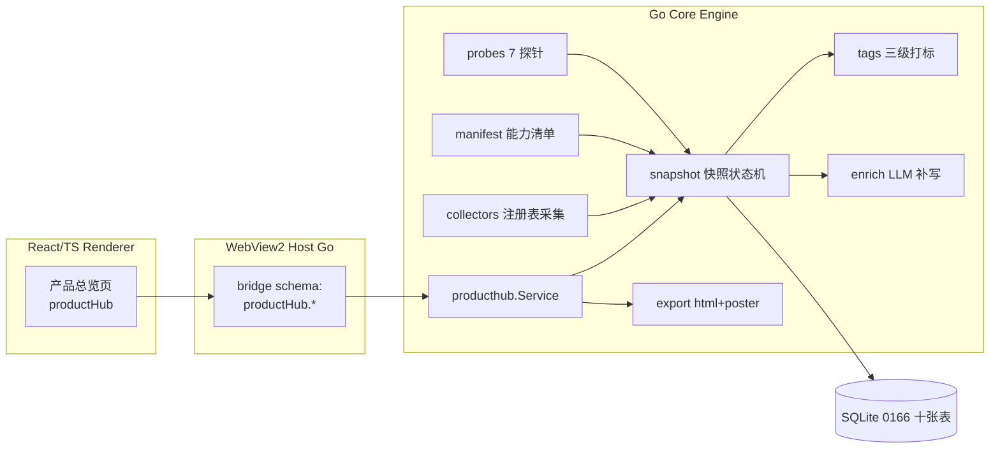

# Lunitide「产品知识中枢」PRD V3.1（功能知识卡 + 调用链路 + 自诊断版）

- 日期：2026-09-18（V3.1 增补：2026-09-19）
- 状态：待评审（V3.1 为增补「自诊断与改进建议」后的落地版）
- 版本记录：V1.0 注册表资产版 → V1.1 +功能清单/探针 → V2.0 全功能全景版（5 域 27 模块/7 探针/可视化导出）→ V3.0 功能知识卡 + 调用链路版（每功能一张深度知识卡，含简介/描述/属性/方法/调用链路图/逐步讲解；UI 设计独立成文）→ **V3.1 自诊断版（本次增补：图谱自检 → 诊断报告 + 具体改进方案 + 升级闭环；DDL 扩至 12 表、Bridge 扩至 11 方法、前端增第四标签「诊断报告」）**
- 关联代码：`internal/bridge/schema_generated.go`、`web/src/settings/settingsNav.ts`、`internal/m8app/*`、`internal/memoryapp`、`internal/mcp6`、`internal/skillapp`、`internal/command`、`internal/browserapp`、`internal/llmadapter`、`internal/tokenefficiency`、`internal/compactionapp`、`migrations/0062/0160-0165`
- 配套文档：`docs/design/UI-product-knowledge-hub-2026-09-18.md`（界面 UI 设计 V1.1）

---

## 0. V2.0 → V3.0 演进说明

### 0.1 用户确认的新维度

用户在评审 V2.0 可视化 Demo 后，明确了**每个功能的细度标准**（原话要点）：

> 把每个功能详细介绍，包含：每一块的描述、功能介绍、属性、方法、调用链路顺序流程图（包括流程描述）。每个步骤，举例：对话和语音对话当中打开音乐播放软件功能——简介：和语音对话打开播放软件；功能描述：可以通过打字对话和语音对话操作电脑，打开电脑安装的汽水音乐和网易云音乐等音乐播放软件，进行播放、暂停、搜索歌曲、下一曲、上一曲等操作；属性：电脑操作、使用 XX 工具、使用 XX MCP、使用 XX 技能；方法：打字聊天、语音对话；整体的流程链路图，每个步骤，包括成功时怎么走、失败走的是什么；然后是对整个链路流程的描述讲解。

同时确认参考视觉：DoF Embodied AI Maps 海报风格（深色、分节编号 A/B/C、顶部流程管线、底部要点总结、双语），及**每次代码变更/产品升级后自动重新匹配输出最新内容**。

### 0.2 V3.0 核心变化

| # | 变化 | 说明 |
|---|---|---|
| 1 | **新增功能知识卡（FeatureCard）** | 每个功能一张卡，六字段：`summary / description / attributes / methods / chain / steps` |
| 2 | **新增调用链路（Chain）模型** | 主干步骤 + 成功/失败/重试/降级四类分支，每步带描述；链路图 + 逐步讲解双呈现 |
| 3 | DDL 从 8 张表扩至 **10 张**（新增 `product_feature_cards`、`product_chain_steps`） | 迁移编号 **0166**（0164 已被 OCR 模型包、0165 已被媒体会话占用） |
| 4 | Bridge API 从 9 个扩至 **10 个**（新增 `featureCard`） | 返回完整卡 + 链路数据 |
| 5 | 导出格式增加 `poster`（竖版海报，DoF 风格） | 原 `html` 报告保留 |
| 6 | Manifest Schema 扩展 feature 卡字段 | 链路以声明式数据随版本演进（Docs as Code） |
| 7 | 节点本体 13 类不变，`Feature` 节点与卡 1:1 | 卡是 Feature 节点的详情投影 |
| 8 | UI 设计独立成文 | 本 PRD 只定结构与数据契约，视觉/交互见 UI 文档 |
| 9 | **V3.1 新增：自诊断与改进建议** | 图谱自检（探针/构建校验/一致性规则）→ **诊断报告**（问题 + 证据 + 根因 + 具体改进方案 + 验证方式）→ 升级后自动复核形成闭环；DDL 扩至 **12 张**、Bridge 扩至 **11 个**、前端增第四标签「诊断报告」 |

### 0.3 代码现状校验（2026-09-18）

- 迁移最新编号 **0165**（`0165_media_sessions.sql`：media_assets/media_sessions，含 SMTC 媒体验证 `verification_source IN ('none','smtc','owned_runtime')`）→ 本 PRD 使用 **0166**，且音乐播放链路卡的「窗口校验」步骤可声明 SMTC 验证依据（真实代码支撑，非虚构）。
- `internal/producthub` 不存在，待新建。
- 入口挂载点：`web/src/app/LaunchSidebar.tsx` 办公组（办公工作台/自动化/同事聊天/机务工作台/会议记录之后）。

---

## 1. 背景与目标

### 1.1 背景

用户诉求：让不懂产品的人一页看懂 Lunitide 的**全部**——所有功能（语音对话、打字聊天、办公、项目管理、记忆、模型供应商、DeepSeek/GLM 融合、省 token、开发能力、电脑控制、语音链路、设置里所有控制……），有多少资产、怎么组成、什么情境怎么工作、**每个功能点进去能看到简介/描述/属性/方法/调用链路（成功怎么走、失败走什么）**，改版后自动更新。

现状：27 个模块分散在 14 个页面 + 18 个设置分类 + 6 类注册表中，无全功能地图；功能级知识只存在于代码与用户记忆；改版无影响面提示。

### 1.2 目标（V3.1，G1-G10）

- **G1 全功能总览**：5 域 27 模块 + 10 类计数 + 健康度，一页即得。
- **G2 跨域知识图谱**：Domain/Module/Feature 与资产节点同图，`uses/calls` 显性化功能依赖。
- **G3 功能知识卡**（V3 核心）：每个功能一张深度卡——A 简介 / B 功能描述 / C 属性（操作/工具/MCP/技能/依赖能力）/ D 方法（语音/打字入口）。
- **G4 调用链路图**（V3 核心）：主干五步式流程 + 成功/失败/重试/降级分支 + 逐步讲解；点节点联动高亮讲解行。
- **G5 标签体系**：registry→rule→LLM 三级打标 + 四类受控词表。
- **G6 自动重建**：boot/registry/manifest/upgrade/manual 五触发；增量 diff + 影响面；失败保留旧 verified。
- **G7 解剖视图**：专家六段/插件 roster/设置控制组（18 分类）。
- **G8 清单防漂移**：7 探针交叉校验，漂移标红。
- **G9 可视化输出**：页面图谱 + 功能卡 + 链路图 + 单文件 HTML 报告 + **竖版海报导出**（DoF 风格，可离线分发）。
- **G10 自诊断与改进闭环**（V3.1 核心）：图谱自检发现问题（探针失败 / 链路走不通 / 引用缺失 / 明显错误）时自动生成**诊断报告**——每条问题必含证据、根因与**具体改进方案**（改哪个文件、补哪个字段、查哪个服务）；升级重建后自动复核，已解决 / 未解决 / 新引入三态跟踪，驱动产品不断自我升级。

### 1.3 非目标

不做多人协作/云端发布；不引入外部图库（自研 SVG）；不修改 M8 契约与既有页面（新增页面独立）；V1 不做 GraphRAG 问答与 Project/Phase 挂载入图（V2 预留）。

---

## 2. 用户与场景

| 角色 | 场景 | 走向 |
|---|---|---|
| 新用户/评估者 | 「这产品到底能干什么？」 | 总览页 → 域卡 → 模块行 → 功能卡 |
| 深度了解者 | 「语音打开音乐是怎么实现的？失败了怎么办？」 | 图谱/搜索定位功能 → 功能卡 → 链路图 + 逐步讲解 |
| 管理员/审计 | 「这次升级改了什么？影响哪些功能？」 | 变更时间线 → 影响面（一跳反向依赖） |
| 二开/集成方 | 「电脑控制能用哪些工具/MCP？」 | 功能卡属性区 → 资产详情 |
| 产品负责人 | 「给客户/领导一份产品全景材料」 | 导出 HTML 报告 / 竖版海报 |

---

## 3. 产品全景盘点（5 域 27 模块）

| 域 | 模块（27） | 代码锚点 |
|---|---|---|
| 对话体验 | 月伴语音对话、打字聊天对话、会话管理 | `companionSession.ts`、`SessionPage.tsx`、voice 设置 |
| 业务工作台 | 办公工作台、自动化、同事聊天、机务工作台、会议记录、Office 交付 | `officeStudio/*`、`automation.go`、`meetings` |
| 资产与智能 | 专家、技能、插件、MCP 连接器、资产管理、记忆管理、OCR 路由 | `expert.go`、`skillapp`、`harness_plugins.go`、`mcp6`、`memoryapp` |
| 执行与控制 | 命令执行、文件工作区、浏览器控制、电脑控制、消息通道、子智能体 | `command/spec.go`、`browserapp`、computer/channels/subagents 设置 |
| 底座与治理 | 模型供应商与协议、能力路由、协作门禁、诊断与更新、Token 效率 | `llmadapter`、routing/collab/diagnostics 设置、`tokenefficiency` |

设置 18 分类（`settingsNav.ts`）作为设置控制组解剖视图的数据源，与模块双向映射。

---

## 4. 核心概念模型

### 4.1 三类知识源

| 源 | 内容 | 采集方式 |
|---|---|---|
| A 注册表资产 | 专家/技能/插件/MCP/工具/自动化/记忆事实 | 采集器直读（Go 内部接口） |
| B 能力清单 Manifest | 模块/功能/功能卡（含链路声明） | `internal/producthub/manifest/manifest.json`，随版本 PR 演进 |
| C 运行时探针 | bridge 方法存在性/feature flag/设置分类/入口页面/前置条件 | 7 类探针，统一 2s 超时 |

### 4.2 节点本体（13 类，不变）

`Product / Domain / Module / Feature / Expert / Skill / Plugin / Mcp / McpTool / Chain / Step / Capability / Scenario`

- `Feature` 节点与功能知识卡 **1:1**（同 stable_key）。
- `Chain`/`Step` 节点在图谱中以轻量形式存在（链路详情在卡内渲染，图谱只挂链路入口）。

### 4.3 stable_key 规则（跨快照稳定身份）

```
product.lunitide
domain.<dialog|office|assets|execution|foundation>
module.<domain>.<name>            如 module.dialog.companion
feature.<module>.<name>           如 feature.dialog.music-player
expert.<catalog>.<name> / skill.<name> / plugin.<name>
mcp.<name> / mcp.<name>.tool.<tool>
capability.<domain>.<name>        如 capability.tts.voice
chain.<feature>                   如 chain.feature.dialog.music-player
```

标签、补写、diff 全部绑定 stable_key（非快照内 node_id），人工标注永不被重建覆盖。

### 4.4 功能知识卡 Schema（V3 核心）

```json
{
  "stable_key": "feature.dialog.music-player",
  "name": "打开音乐播放软件",
  "name_en": "Open Music Player",
  "domain": "dialog",
  "module": "module.dialog.companion",
  "summary": "和语音对话、打字对话打开电脑上的音乐播放软件。",
  "description": "可以通过打字对话和语音对话操作电脑，打开电脑安装的汽水音乐、网易云音乐等音乐播放软件，并进行播放、暂停、搜索歌曲、下一曲、上一曲等操作。支持连续语音指令，无需重复唤醒。",
  "attributes": {
    "operations": ["电脑操作"],
    "tools": ["computer.control", "process.launch", "window.find"],
    "mcps": ["mcp_windows_sysmon"],
    "skills": ["skillpack.computer-ops"],
    "capabilities": ["capability.stt.asr", "capability.llm.intent", "capability.tts.voice"]
  },
  "methods": [
    { "type": "voice", "entry": "唤醒月伴后直接说「打开网易云音乐」", "continuous": "支持连续指令：播放、暂停、下一曲" },
    { "type": "typing", "entry": "对话框输入「帮我打开汽水音乐」", "continuous": "支持 @技能引用「电脑操作」" }
  ],
  "chain": {
    "steps": [
      { "index": 1, "name": "用户输入", "detail": "语音 / 文字", "description": "月伴模式说「打开网易云音乐」，或打字直接输入；语音经 VAD 断句检测后触发" },
      { "index": 2, "name": "语音识别", "detail": "ASR 转写", "description": "本地 sherpa ASR 转写为文字；在线识别不可用时自动切换本地模型" },
      { "index": 3, "name": "意图理解", "detail": "LLM 解析意图", "description": "解析为 computer.open_app 意图，目标实体「网易云音乐」，置信度低于阈值时反问确认" },
      { "index": 4, "name": "方案生成", "detail": "工具 + 参数绑定", "description": "绑定 computer.control 工具与启动参数；FullAccess 模式免审批，其他模式弹窗授权" },
      { "index": 5, "name": "执行控制", "detail": "UI 自动化", "description": "开始菜单搜索 → 定位快捷方式 → 启动进程 → 轮询窗口句柄确认（8s 超时）" }
    ],
    "branches": [
      { "type": "success", "from_step": 5, "name": "窗口校验 · 成功", "description": "窗口句柄返回 / SMTC 媒体会话验证", "sequence": ["提示音 + TTS 播报「已为你打开网易云音乐」", "成功链路写入 product_change_log"] },
      { "type": "failure", "from_step": 5, "name": "错误诊断 · 失败", "description": "未安装 / 超时 / 权限拒绝",
        "retry": { "name": "重试 · 备用启动（注册表 App Paths 搜索）", "on_success": "汇入成功路径（提示音 + TTS 播报）", "on_fail": "降级" },
        "fallback": { "name": "降级 · 播报 + 推荐", "description": "播报失败原因，推荐已安装的替代应用（如汽水音乐），失败原因入库" } }
    ]
  },
  "probe": { "total": 6, "passed": 6 },
  "version": "v2.4.1",
  "provenance": "manifest+probe"
}
```

**字段约束**：`summary` ≤ 64 字符；`description` ≤ 512 字符；`steps` 3-8 步；`branches` 至少含 `success` 与 `failure` 各一条；`retry/fallback` 可选但失败分支必须声明最终去向（禁止悬空分支）。

**来源规则**：`attributes` 中的 stable_key 必须存在于图谱（构建期校验，孤儿引用降级为警告并计入健康度）；`summary/description/chain` 为人工维护的声明式数据（manifest），LLM 仅允许补写薄描述并标「AI 生成」徽章。

### 4.5 标签体系

四类受控词表：`场景`（办公/机务/开发/娱乐…）、`能力`（语音/自动化/检索/控制…）、`入口`（语音/打字/菜单/设置…）、`状态`（核心/增强/实验/弃用）。三级打标：registry 直映 → rule 关键词 → LLM 建议（仅限词表内，防漂移）+ manual（最高优先级）。

---

## 5. 信息架构与可视化输出（S1-S11）

| Section | 内容 | 呈现 |
|---|---|---|
| S1 入口 | 左侧栏办公组末尾「产品总览」（`page='productHub'`，图标 `◈`，双语） | 导航 |
| S2 功能全景 | 版本/快照/健康度仪表 + 5 域卡（探针堆叠条）+ 模块明细行 | 页面 |
| S3 资产计数 | 专家/技能/插件/MCP/MCP 工具/能力/链路/场景/功能卡/记忆事实 10 类 + 周变化 | 页面 |
| S4 知识图谱 | 五层 SVG：Product→Domain→Module/资产→Feature/能力；contains/uses/calls 三色边；点节点看 stable_key/溯源/探针 | 页面 |
| S5 功能知识卡 | A 简介 / B 功能描述 / C 属性（操作/工具/MCP/技能/依赖能力）/ D 方法 | 页面（从图谱/搜索/模块行钻取） |
| S6 调用链路 | 主干步骤 + 成功/失败/重试/降级分支流程图 + 图例 + 点击联动 + 逐步讲解列表 | 页面（功能卡内嵌或独立全屏） |
| S7 解剖视图 | 专家六段人格/版本链/相位挂载；插件 roster；设置控制组 18 分类 | 页面 |
| S8 标签与筛选 | 词表筛选 + 标签管理（manual 打标） | 页面 |
| S9 变更时间线 | diff（新增/变更/弃用）+ 影响面（一跳反向依赖）+ 溯源触发 | 页面 |
| S10 导出 | 单文件 HTML 报告（全量）+ 竖版海报（DoF 风格，单功能卡/单域） | 文件 |
| S11 诊断报告（V3.1） | 第四标签：问题清单（严重级排序）+ 证据 / 根因 / 改进方案 / 验证方式 + 闭环轨迹（新增 / 解决 / 未解决）+ 报告导出 | 页面 |

S1-S11 的视觉与交互细节见 UI 设计文档 §4。

---

## 6. 技术方案

### 6.1 架构



### 6.2 数据模型（迁移 `0166_product_knowledge_hub.sql`，12 张表）

```sql
-- 1) 快照
CREATE TABLE product_snapshots (
  snapshot_id TEXT PRIMARY KEY,            -- ULID
  app_version TEXT NOT NULL,
  state TEXT NOT NULL CHECK (state IN ('building','verified','retired')),
  trigger_source TEXT NOT NULL CHECK (trigger_source IN ('boot','registry','manifest','upgrade','manual')),
  graph_digest TEXT,                       -- 构建完成后回填 SHA-256
  node_count INTEGER NOT NULL DEFAULT 0,
  edge_count INTEGER NOT NULL DEFAULT 0,
  card_count INTEGER NOT NULL DEFAULT 0,
  probe_passed INTEGER NOT NULL DEFAULT 0,
  probe_total INTEGER NOT NULL DEFAULT 0,
  started_at TEXT NOT NULL,                -- UTC RFC3339
  verified_at TEXT
);

-- 2) 图节点
CREATE TABLE product_graph_nodes (
  node_id TEXT PRIMARY KEY,                -- ULID
  snapshot_id TEXT NOT NULL REFERENCES product_snapshots(snapshot_id),
  node_type TEXT NOT NULL CHECK (node_type IN
    ('product','domain','module','feature','expert','skill','plugin',
     'mcp','mcp-tool','chain','step','capability','scenario')),
  stable_key TEXT NOT NULL,
  name TEXT NOT NULL,
  name_en TEXT,
  summary TEXT,                            -- 薄描述（可 LLM 补写）
  metadata_json TEXT NOT NULL DEFAULT '{}',
  provenance TEXT NOT NULL CHECK (provenance IN ('registry','manifest','probe','manual')),
  UNIQUE (snapshot_id, stable_key)
);
CREATE INDEX ix_pgn_snapshot_type ON product_graph_nodes(snapshot_id, node_type);

-- 3) 图边
CREATE TABLE product_graph_edges (
  edge_id TEXT PRIMARY KEY,
  snapshot_id TEXT NOT NULL REFERENCES product_snapshots(snapshot_id),
  from_stable_key TEXT NOT NULL,
  to_stable_key TEXT NOT NULL,
  relation TEXT NOT NULL CHECK (length(relation) BETWEEN 1 AND 128),
  metadata_json TEXT NOT NULL DEFAULT '{}'
);
CREATE INDEX ix_pge_snapshot_from ON product_graph_edges(snapshot_id, from_stable_key);

-- 4) 功能知识卡（V3 新增）
CREATE TABLE product_feature_cards (
  card_id TEXT PRIMARY KEY,
  snapshot_id TEXT NOT NULL REFERENCES product_snapshots(snapshot_id),
  stable_key TEXT NOT NULL,                -- = feature 节点 stable_key
  name TEXT NOT NULL,
  name_en TEXT,
  summary TEXT NOT NULL CHECK (length(summary) BETWEEN 1 AND 128),
  description TEXT NOT NULL CHECK (length(description) BETWEEN 1 AND 1024),
  attributes_json TEXT NOT NULL,           -- §4.4 attributes
  methods_json TEXT NOT NULL,              -- §4.4 methods
  probe_passed INTEGER,
  probe_total INTEGER,
  provenance TEXT NOT NULL CHECK (provenance IN ('manifest','manifest+probe','manual')),
  version_tag TEXT NOT NULL,
  UNIQUE (snapshot_id, stable_key)
);

-- 5) 调用链路步骤（V3 新增）
CREATE TABLE product_chain_steps (
  step_id TEXT PRIMARY KEY,
  snapshot_id TEXT NOT NULL REFERENCES product_snapshots(snapshot_id),
  card_stable_key TEXT NOT NULL,           -- 所属功能卡
  branch_type TEXT NOT NULL CHECK (branch_type IN ('main','success','failure','retry','fallback','merge')),
  seq INTEGER NOT NULL CHECK (seq >= 1),   -- 分支内顺序；main 按 index
  name TEXT NOT NULL,
  detail TEXT,                             -- 短标注（如 ASR 转写）
  description TEXT NOT NULL,               -- 逐步讲解文案
  edge_label TEXT,                         -- 边标注（如 重试成功/仍失败）
  parent_step INTEGER,                     -- 分支挂点（main 序号）
  UNIQUE (snapshot_id, card_stable_key, branch_type, seq)
);
CREATE INDEX ix_pcs_card ON product_chain_steps(snapshot_id, card_stable_key);

-- 6) 索引版本（复用 M8 范式）
CREATE TABLE product_graph_index_versions (
  index_version_id TEXT PRIMARY KEY,
  snapshot_id TEXT NOT NULL REFERENCES product_snapshots(snapshot_id),
  index_kind TEXT NOT NULL,
  artifact_digest TEXT NOT NULL,
  built_at TEXT NOT NULL
);

-- 7/8) 标签
CREATE TABLE product_tags (
  tag_id TEXT PRIMARY KEY,
  vocabulary TEXT NOT NULL CHECK (vocabulary IN ('scenario','capability','entry','status')),
  value TEXT NOT NULL,
  UNIQUE (vocabulary, value)
);
CREATE TABLE product_node_tags (
  id TEXT PRIMARY KEY,
  snapshot_id TEXT NOT NULL,
  stable_key TEXT NOT NULL,
  tag_id TEXT NOT NULL REFERENCES product_tags(tag_id),
  assigned_by TEXT NOT NULL CHECK (assigned_by IN ('registry','rule','llm','manual')),
  UNIQUE (snapshot_id, stable_key, tag_id)
);

-- 9) LLM 补写缓存
CREATE TABLE product_enrichments (
  enrichment_id TEXT PRIMARY KEY,
  stable_key TEXT NOT NULL,
  field TEXT NOT NULL CHECK (field IN ('summary','description')),
  content TEXT NOT NULL,
  ai_generated INTEGER NOT NULL DEFAULT 1,
  input_digest TEXT NOT NULL,              -- 内容不变则跳过
  created_at TEXT NOT NULL
);

-- 10) 变更日志
CREATE TABLE product_change_log (
  change_id TEXT PRIMARY KEY,
  from_snapshot TEXT NOT NULL,
  to_snapshot TEXT NOT NULL,
  stable_key TEXT NOT NULL,
  change_kind TEXT NOT NULL CHECK (change_kind IN ('added','updated','removed')),
  impact_json TEXT NOT NULL,               -- 一跳反向影响面
  created_at TEXT NOT NULL
);

-- 11) 诊断报告（V3.1）
CREATE TABLE product_diagnostic_reports (
  report_id TEXT PRIMARY KEY,              -- ULID
  snapshot_id TEXT NOT NULL,
  app_version TEXT NOT NULL,
  health_score INTEGER NOT NULL CHECK (health_score BETWEEN 0 AND 100),
  error_count INTEGER NOT NULL DEFAULT 0,
  warn_count INTEGER NOT NULL DEFAULT 0,
  info_count INTEGER NOT NULL DEFAULT 0,
  resolved_count INTEGER NOT NULL DEFAULT 0,  -- 较上一报告新解决数
  status TEXT NOT NULL CHECK (status IN ('open','superseded')),
  created_at TEXT NOT NULL
);
CREATE INDEX ix_ph_diag_reports ON product_diagnostic_reports(created_at);

-- 12) 诊断问题条目（V3.1）
CREATE TABLE product_diagnostic_findings (
  finding_id TEXT PRIMARY KEY,             -- ULID
  report_id TEXT NOT NULL,
  severity TEXT NOT NULL CHECK (severity IN ('error','warn','info')),
  error_code TEXT NOT NULL,                -- PH-003 / PH-004 / PH-010…
  stable_key TEXT NOT NULL,                -- 问题位置（节点/功能卡/链路步骤）
  title TEXT NOT NULL CHECK (length(title) BETWEEN 1 AND 128),
  evidence_json TEXT NOT NULL,             -- 证据：探针原始输出 + 时间戳
  root_cause TEXT NOT NULL CHECK (length(root_cause) BETWEEN 1 AND 512),
  fix_json TEXT NOT NULL,                  -- 改进方案步骤数组 [{action,target,detail}]
  verify_method TEXT NOT NULL,             -- 修复后验证方式（探针/bridge 方法/页面）
  status TEXT NOT NULL CHECK (status IN ('open','fixed','wont_fix')),
  first_seen_report TEXT NOT NULL,         -- 首次出现报告（跨版本串联）
  resolved_in_version TEXT,
  created_at TEXT NOT NULL,
  updated_at TEXT NOT NULL
);
CREATE INDEX ix_ph_diag_findings ON product_diagnostic_findings(report_id, severity);
```

### 6.3 Capability Manifest（`internal/producthub/manifest/manifest.json`）

结构：`{ product, domains[5], modules[27], features[] }`；每个 feature 即 §4.4 卡 Schema。构建期校验：stable_key 唯一、attributes 引用存在、steps 3-8、分支不悬空、summary/description 长度约束。首版清单：27 模块 + **首批 20 张功能卡**（含音乐播放、会议纪要生成、机务手册检索、命令执行、记忆召回、浏览器控制、OCR 识别、模型路由等代表性功能），M3 前扩至全量。

### 6.4 采集器（collectors.go）

| 采集器 | 数据源 | 输出节点 |
|---|---|---|
| expertCollector | `m8app` ExpertTx（目录/版本/挂载/技能绑定） | Expert + edges |
| pluginCollector | `harness_plugins.go` 23 项 roster | Plugin + provides 边 |
| mcpCollector | `mcp6/registry.go`（Endpoint/ReadyToolSnapshot） | Mcp / McpTool |
| skillCollector | `skillapp/service.go` | Skill |
| automationCollector | `automation.go`（BundleID/checksum） | Chain（自动化链路） |
| memoryCollector | `memoryapp`（fact 计数） | 计数（Scenario 关联） |
| manifestCollector | manifest.json | Domain/Module/Feature/Card/Chain/Step |

每个采集器实现 `Collect(ctx, tx) error`，独立失败不影响其他源（失败记录进快照 metadata）。

### 6.5 探针（probes.go，7 类，统一 2s 超时）

| 探针 | 校验 | 锚点 |
|---|---|---|
| bridgeMethodExists | bridge schema 方法存在 | `schema_generated.go` |
| featureFlag | 开关存在且默认值一致 | feature flags 注册表 |
| settingsCategoryExists | 设置分类存在 | `settingsNav.ts`（经 bridge 暴露的 18 分类快照） |
| entryPageExists | 入口页面路由存在 | `App.tsx` Page 联合类型（生成物） |
| prerequisitesCheck | 前置服务可用（TTS/ASR/MCP ready） | 运行时状态 |
| usesAssetsResolve | attributes 引用可解析 | 图谱内 stable_key |
| settingsCoverage | 设置 18 分类 ↔ 模块双向覆盖 | 双向 diff |

超时记 `probe-timeout` 不阻塞；失败/超时计入健康度。

### 6.6 快照状态机与五触发

```
building → verified（graph_digest 回填，旧 verified → retired）
building 失败 → 丢弃，旧 verified 保留（UI 显示上次成功快照 + 失败原因）
```

触发：boot（启动 30s 后）/ registry 指纹轮询（60s，无变化跳过）/ manifest 文件变更（fsnotify + digest）/ upgrade（版本号变化）/ manual（30s 限流）。manual 与 registry 触发并发时以 manifest digest CAS 仲裁。

### 6.7 Bridge API（`productHub.*`，11 个）

| 方法 | 入参 | 出参 |
|---|---|---|
| `productHub.status` | — | 当前快照状态/健康度/触发源/构建时间 |
| `productHub.overview` | — | 域卡/计数/健康度/变更摘要 |
| `productHub.graph` | `snapshotId?, domain?, depth?` | 节点+边（分层裁剪） |
| `productHub.node` | `stableKey` | 节点详情+标签+溯源+探针 |
| `productHub.featureCard` | `stableKey` | **完整卡：summary/description/attributes/methods/chain(steps+branches)** |
| `productHub.tags` | `vocabulary?, stableKey?` | 标签与绑定 |
| `productHub.tagSet` | `stableKey, tagId, assigned='manual'` | 打标（manual 永不覆盖） |
| `productHub.changelog` | `limit?` | diff + 影响面 |
| `productHub.refresh` | — | 手动重建（30s 限流） |
| `productHub.export` | `format: 'html'\|'poster'\|'report'`（report = 诊断报告，V3.1） | 单文件 HTML / 竖版海报 / 诊断报告 HTML |
| `productHub.diagnostics` | `reportId?`（缺省取最新 open） | 诊断报告 + 问题条目（证据/根因/改进方案/闭环状态）+ 轨迹摘要 |

IPC handler 一律 `defer recover()`，panic 返回 `ENGINE_INTERNAL_ERROR`（项目既有规范）。

### 6.8 Go 包结构

```
internal/producthub/
  manifest/manifest.json   # 唯一人工维护文件（Docs as Code）
  manifest.go              # 加载+校验+digest
  collectors.go            # 7 采集器
  probes.go                # 7 探针
  graph.go                 # 节点/边构建
  cards.go                 # 功能卡+链路入库（V3 新增）
  snapshot.go              # 状态机+五触发
  diff.go                  # 快照 diff + 影响面
  tags.go                  # 三级打标
  enrich.go                # LLM 补写（离线模板降级）
  export_html.go           # HTML 报告
  export_poster.go         # 竖版海报（V3 新增）
  diagnose.go              # 自诊断器 + 改进方案生成 + 闭环复核（V3.1 新增）
  diagnose_rules.go        # 一致性规则库：孤儿引用/链路走不通/缺映射/入口缺失（V3.1 新增）
  service.go               # 对 bridge 的服务门面
  bridge.go                # productHub.* handler 注册
```

### 6.9 错误矩阵

| 码 | 场景 | UI 表现 |
|---|---|---|
| PH-001 | manifest 解析失败 | 启动跳过 manifest 源，标红 + 保留注册表源 |
| PH-002 | 采集器失败 | 该源节点缺失，快照 metadata 记录，健康度扣分 |
| PH-003 | 探针超时/失败 | 计入警告，不阻塞 verified |
| PH-004 | attributes 孤儿引用 | 警告 + 健康度计数 |
| PH-005 | 手动重建限流 | 提示「30s 内仅一次」 |
| PH-006 | 导出失败 | 错误 toast，保留旧文件 |
| PH-007 | 标签词表越界（LLM） | 拒绝该建议 |
| PH-008 | 快照 building 崩溃 | 旧 verified 保留 + 失败原因展示 |
| PH-009 | 卡片字段越界（构建期） | 构建失败并指出 feature stable_key |
| PH-010 | 链路分支悬空 | 构建失败并指出 card + branch |
| PH-011 | 诊断器运行失败（V3.1） | 跳过本报告保留上一份，UI toast 提示；不影响快照 verified |

### 6.10 性能预算

全量快照构建 ≤ 3s（27 模块 + 20 卡 + 6 注册表源 + 7 探针 2s 超时并行）；`graph` 全量 ≤ 200ms（邻接表 + 分层裁剪）；`featureCard` ≤ 50ms；导出 HTML ≤ 2s；海报 ≤ 3s。图谱数据量级 < 5k 节点，SQLite 邻接表足够，不引图库。

### 6.11 LLM 补写红线

事实（计数/关系/属性/探针）只来自注册表/清单/探针；LLM 仅补写 `summary/description` 薄文本并标「AI 生成」徽章；离线或失败时用模板降级（「该功能由 {module} 提供，使用 {tools}」）。

### 6.12 自诊断与改进建议（V3.1 新增）

**诊断器（diagnose.go）**：每次快照 verified 后自动运行，汇聚三类信号——

1. **构建期校验结果**：PH-009 字段越界、PH-010 分支悬空、PH-004 孤儿引用；
2. **7 探针结果**：PH-003 失败/超时（bridge 缺方法、feature flag 漂移、设置分类缺失、入口页面缺失、前置服务不可用、引用不可解析、设置缺映射）；
3. **图谱一致性规则库（diagnose_rules.go）**：链路步骤引用的能力/工具在图谱中不存在（**链路走不通**）、Feature 无入口方法声明、模块零功能卡、provenance=manifest 但探针锚点已在代码中移除。

**输出**：诊断报告（表 11/12）。每条 finding 必含四要素——`证据 evidence_json`（探针原始输出 + 时间戳）/ `根因 root_cause` / `改进方案 fix_json`（结构化步骤）/ `验证方式 verify_method`。

**改进方案动作集**（fix step 的 action 枚举）：

| action | 含义 | 示例 target |
|---|---|---|
| `edit_manifest` | 修改 manifest.json 字段/引用 | `features[stable_key].attributes.skills` |
| `rebuild` | 重建快照（手动刷新或等 60s 轮询） | — |
| `check_service` | 检查/重启前置服务 | TTS / ASR / MCP endpoint |
| `install_asset` | 安装或启用资产 | 技能包 / 插件 / MCP |
| `fix_code` | 代码锚点级提示（**只指路不改码**） | `settingsNav.ts#L42` |
| `wont_fix` | 人工豁免（UI 确认后留痕） | — |

**升级闭环**：新报告与上一报告按 `first_seen_report` 串联——同一问题跨版本保持 `open`；升级重建后复核通过则转 `fixed` 并记录 `resolved_in_version`；报告头汇总 `resolved_count`。UI 呈现闭环轨迹（新增 n / 解决 n / 未解决 n），形成「**自检 → 报告 → 修复 → 复核 → 升级**」的正向循环。

**红线**：诊断器只读（不自动改代码/配置/资产）；`fix_code` 仅给文件与行级锚点；`wont_fix` 需人工在 UI 确认；报告导出 HTML 与页面同源；诊断失败（PH-011）不影响快照本身。

---

## 7. 前端详设

页面路由：`page='productHub'`（App.tsx Page 联合类型新增）。组件树：

```
web/src/productHub/
  ProductHubPage.tsx       # 四标签容器：功能全景 | 知识图谱 | 解剖视图 | 诊断报告
  OverviewTab.tsx          # S2/S3：域卡/计数/模块明细
  GraphTab.tsx             # S4：五层 SVG + 详情条
  FeatureCardPage.tsx      # S5/S6：A/B/C/D 区块 + 链路图 + 逐步讲解
  ChainFlowView.tsx        # S6：SVG 流程图（主干+分支）+ 点击联动
  AnatomyTab.tsx           # S7：专家/插件/设置控制组
  ChangelogPanel.tsx       # S9
  DiagnosticsTab.tsx       # S11：诊断报告（V3.1 新增）
  productHubBridge.ts      # bridge 客户端（照 createOntologyBridge 模式）
```

导航路径：总览 → 模块行「查看功能」→ 功能卡；图谱点 Feature 节点 → 功能卡；功能卡内链路图可全屏。视觉与交互规范见 UI 设计文档。

---

## 8. 异常与边界

| 场景 | 行为 |
|---|---|
| 首次启动（无快照） | 显示骨架 + 「正在构建产品全景…」 |
| building 失败 | 保留旧 verified + 错误原因 + 重试按钮 |
| 功能卡字段缺失（旧版本数据） | 链路区显示「该版本未提供链路声明」 |
| 探针全失败 | 健康度 0%，卡片仍可看（数据只读自 manifest/registry） |
| 大图谱（未来 > 5k 节点） | depth 裁剪 + 按域懒加载（预留） |

## 9. 合规与安全

- 只读采集，不写业务表；不触碰密钥/凭据（采集器白名单字段）。
- 导出文件不含用户数据/密钥，仅产品结构与声明式清单。
- LLM 补写走既有 gateway，输入为结构化事实，无用户会话内容。
- 遵守项目红线：Renderer 不直接访问 SQL/文件系统/Shell，全部经 bridge。

## 10. 里程碑

| 阶段 | 交付 | 验收 |
|---|---|---|
| **M0 地基** | 迁移 0166（12 表）+ manifest 首版（27 模块 + 20 张功能卡含链路）+ 7 采集器 + 7 探针 + 快照状态机 + **自诊断器（规则库 + 报告生成 + 闭环复核）** + `status/refresh` bridge + 单测 | `go test ./internal/producthub/...` 全绿；手动 refresh 产出 verified 快照并生成首份诊断报告 |
| **M1 总览与卡** | 产品总览页（三标签）+ 功能卡页 + 链路图（主干+分支+联动讲解）+ `overview/graph/featureCard` bridge | 音乐播放卡完整呈现 A/B/C/D + 链路四分支 |
| **M2 治理** | 标签体系 + 变更时间线 + 健康度面板 + **诊断报告页（第四标签：问题/根因/改进方案/wont_fix）** + HTML 报告导出 + `tags/tagSet/changelog/node/diagnostics` bridge | diff 正确、manual 标签跨快照保留；**注入 1 个孤儿引用 → 诊断报告自动列出（含改进方案）→ 修复重建后自动转 fixed** |
| **M3 智能** | LLM 补写 + 竖版海报导出 + 影响面分析增强 + 全量功能卡补齐 + 诊断闭环跨版本轨迹视图 | AI 徽章/离线降级/海报可离线打开；升级后已解决问题自动标记 resolved |

## 11. 验收标准（抽查项）

1. 左侧栏办公组出现「产品总览」，点击进入，不改变任何既有页面。
2. 总览页 5 域卡 + 10 计数 + 健康度与真实注册表一致。
3. 图谱五层可点，Feature 节点进入功能卡。
4. **功能卡六区完整**：A 简介（≤64 字）/ B 描述 / C 属性五类（操作/工具/MCP/技能/依赖能力，引用可解析）/ D 方法（语音+打字）。
5. **链路图**：主干 3-8 步、成功与失败分支必有、重试/降级路径闭合不悬空；点击节点联动高亮讲解行。
6. 升级/资产变更后 60s 内快照自动重建，变更时间线出现 diff 与影响面。
7. manual 标签与人工备注跨快照保留（stable_key 绑定）。
8. 导出 HTML/海报可离线打开，含图谱 SVG + 功能卡 + 链路图。
9. 探针超时不阻塞构建；健康度公式 = 通过/总数。
10. 全部 IPC handler 带 `defer recover()`；错误码符合 PH-001~011。
11. **自诊断闭环（V3.1）**：人为制造孤儿引用 / 悬空分支 → 快照重建后诊断报告自动列出该问题（证据 + 根因 + 改进方案 + 验证方式四要素齐全）→ 按 fix 步骤修复并重建 → 问题转 `fixed`、闭环轨迹「已解决 +1」；`wont_fix` 需 UI 确认且跨快照留痕；诊断报告可导出离线 HTML。
