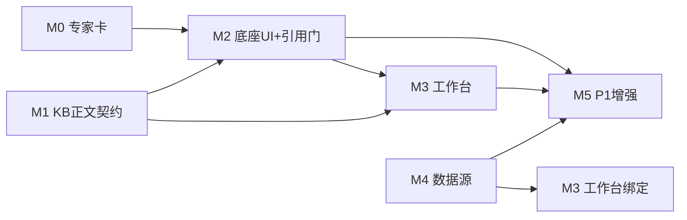

# 航空机务专家 · 权威开发计划（Master Dev Plan）

> **For agentic workers:** REQUIRED SUB-SKILL: Use superpowers:subagent-driven-development (recommended) or superpowers:executing-plans. Steps use checkbox (`- [ ]`) syntax.

**Goal:** 把「航空机务专家 + 专家知识底座 + 关系数据库连接中心」按可交付里程碑落地到月汐，不 Fork WingFix、内核保持 SQLite。

**Architecture:** 服从权威 PRD 的二次复盘修正（§0.5）。先发专家卡（M0），再做 KB 正文契约（M1，命门），再底座 UI（M2）、工作台（M3）、数据源（M4）、P1（M5）。

**Tech Stack:** Go（m8core / m8app / m7app / app / storage/sqlite）+ React/TS（web/src）+ SQLite 迁移 `0113`+ + Bridge schema。

**Spec:** [docs/superpowers/specs/2026-09-03-mro-prd-replay-ui-and-wiring.md](../specs/2026-09-03-mro-prd-replay-ui-and-wiring.md)（权威 PRD，含 §0.5 修正与 §10 分期）

**Sub-plans（任务级细节，被本文顺序统辖）:**
- [expert-knowledge-foundation](2026-09-03-expert-knowledge-foundation.md) — 被 C1/C2/C3 修正
- [mro-expert-and-workbench](2026-09-03-mro-expert-and-workbench.md) — 被 C5/C6/C8 修正
- [relational-datasource-center](2026-09-03-relational-datasource-center.md) — 被 C7 修正
- [mro-ui-backend-wiring](2026-09-03-mro-ui-backend-wiring.md) — 被 C4/C5 修正

## Global Constraints

- 内核 SQLite；禁止 PostgreSQL/本地 MySQL 当内核；禁止生产路径依赖 Python/Electron/Qdrant/Neo4j/Redis。
- 迁移从 `0113` 起（已核实最高为 `0112`），登记 `internal/storage/sqlite/store.go` 不可变清单；FTS 虚表不进 `expectedSchemaSQL`（同 `0107`）。
- Bridge `expertId` 恒为 26 位 ULID；`catalogItemId`（`mro-expert`）只用于寻址/显隐；禁止 `scope_id=expert:mro-expert`。
- `kb_chunks.embedding` 保持 NULL，向量默认关。
- 引用门 P0 不改写句子（PRD C5）：只补声明 + 挂警示芯片 + 会商附录。
- 手册出站默认只送 `locator + quote≤240`，全文 PDF 不进 prompt。
- 侧栏机务工作台仅 `mro-expert` 已启用时渲染。
- UI 只用现有 CSS 令牌与 `skill-center`/`settings-shell`/`pending-memory-banner` 模式；中英双语；页眉「辅助建议，不构成放行」。
- 每个 Task 走 TDD：先写失败测试→跑红→最小实现→跑绿→commit。既有测试必须保持绿。

---

## 依赖图

M0 与 M1 可并行起步（M0 不依赖 KB）。M4 可与 M2/M3 并行，仅「工作台绑定库存」这一步依赖 M4 完成。

---

## M0 · 专家卡最小可用（无 KB 依赖）

目标：专家中心出现航空机务专家，可打开、`@`、会商；无手册时诚实降级。这是最快可见、最低风险的一刀。

### Task M0.1 目录上架 + 身份修复

**Files:**
- Modify: `internal/m8app/catalog/conversation_experts.json`（追加 `mro-expert`，六段逐字用 PRD 附录 A）
- Modify: `internal/m8app/conversation_catalog.go`（`ConversationExpertIDs` 追加）
- Modify: `web/src/expert/conversationExperts.ts`（花名册一行；`ConversationExpertDivision` 加 `'operations'`；`conversationExpertDivision('mro-expert')→'operations'`）
- Modify: `internal/m8app/conversation_experts_test.go`（`want 13`→`14`，加 name/identity 断言、`Division=="operations"`、不含「独立智能体」）
- Modify: `web/src/expert/conversationExperts.test.ts`（长度 14；division）
- Modify: 其它写死 13 的断言（先 `rg "13 |toHaveLength\(13\)|!= 13"`）

- [x] Step 1: 写失败测试（Go + TS）
- [x] Step 2: `go test ./internal/m8app/ -run TestConversationExperts -count=1` 看红
- [x] Step 3: 追加 JSON、IDs、花名册、division 分支
- [x] Step 4: `go test ./internal/m8app/ ./internal/app/ -count=1` 与 `npm --prefix web run test -- conversationExperts` 看绿
- [ ] Step 5: Commit `feat(expert): add aviation MRO colleague expert card`

细节见 mro 子计划 Task 1，但**必须同时改 `conversationExpertDivision` 的返回类型加 `operations`**（子计划漏了）。

### Task M0.2 三技能 + 六情景

**Files:** `internal/skillapp/catalog.go`、`internal/skillapp/bundled/mro-*/SKILL.md`、`internal/m8app/mro_scenarios.go`、对应测试、bootstrap 调 `EnsureMROScenarios`。

- [x] Step 1: 技能存在断言测试（红）
- [x] Step 2: 三 builtin 技能 + 三 SKILL.md
- [x] Step 3: 六情景幂等 seed 测试（seed 两次仍 6 张 active）
- [x] Step 4: `go test ./internal/skillapp/ ./internal/m8app/ -count=1`
- [ ] Step 5: Commit `feat(expert): mro skills and six scenario cards`

细节见 mro 子计划 Task 2–3。

### M0 验收
- [x] 专家中心/市场出现「航空机务专家」，可「打开同事」「在当前会话使用」。
- [x] 六段 identity 不含「独立智能体」，含「不构成放行」。
- [x] 与产品经理专家可同会话（会商上限不变）。
- [x] 无手册时对话给出「未找到受控依据，请先导入手册」，不编件号。

---

## M1 · KB 正文契约（命门）

目标：让 KB 真正可检索。这是 §0.5 C1 指出的四层契约变更，独立里程碑。

### Task M1.1 迁移：body 列 + FTS

**Files:**
- Create: `migrations/0113_kb_chunk_body.sql`：`ALTER TABLE kb_chunks ADD COLUMN body TEXT NOT NULL DEFAULT '';`
- Create: `migrations/0114_expert_foundation.sql`：`kb_chunk_fts`（trigram，索引 body，触发器同 `0107`）、`expert_growth_paths` 表、`kb_collections.scope_id` 唯一索引（先查重再建，见 PRD H16）。
- Modify: `internal/storage/sqlite/store.go`：登记 `0113`/`0114` hash；更新 `"table:kb_chunks"` 期望 DDL 加 body 列；FTS 虚表按 `0107` 规则排除。

- [ ] Step 1: 写迁移 + store 清单测试（迁移后 `expectedSchemaSQL` 一致）
- [ ] Step 2: `go test ./internal/storage/sqlite/ -run TestSchema -count=1`
- [ ] Step 3: Commit `feat(kb): kb_chunks body column and chunk FTS`

### Task M1.2 契约变更：KBChunk 带 Body + 富 locator（核心）

**Files:**
- Modify: `internal/domain/m8core/kb.go`：`KBChunk` 加 `Body string`；新增 `BuildChunkProjectionFromChunks(doc, []KBChunk) (*ChunkProjection, error)`（保留原 `BuildChunkProjection(doc, ids)` 供旧调用）；校验 body 长度、locator JSON 合法。
- Modify: `internal/m8app/kb.go`：`KBIndexer` 保留；新增 `KBChunkProjector func(ctx, doc, raw []byte) ([]m8core.KBChunk, error)` 与 `SetChunkProjector`；`UpsertDocument` 若配置了 projector 且集合是专家/机务 scope 则走带 body 路径，否则走旧 ID 路径（向后兼容）。
- Modify: `internal/storage/sqlite/m8_kb.go`：`PutKBChunks` INSERT 增加 `body` 列。
- Modify: 既有 `TestBuildChunkProjection*` / `DefaultKBIndexer` 测试随契约更新。

- [ ] Step 1: 写失败测试：`BuildChunkProjectionFromChunks` 保留 body 与自定义 locator；旧 `BuildChunkProjection` 行为不变；`PutKBChunks` 写入的行可读回 body。
- [ ] Step 2: 跑红
- [ ] Step 3: 实现四层改动，保持旧调用签名可用
- [ ] Step 4: `go test ./internal/domain/m8core/ ./internal/m8app/ ./internal/storage/sqlite/ -count=1` 全绿（含既有测试）
- [ ] Step 5: Commit `feat(kb): chunk body and rich locator projection (backward compatible)`

**关键：这是最容易翻车的一步。** 任何既有 KB 测试变红都必须在本 Task 内修好，不得顺延。

### Task M1.3 应用层入库编排 ExpertKBIngest

**Files:**
- Create: `internal/app/expert_kb_ingest.go`：读 `content_ref` 文件 → 调 `m7app` `document.parse`（或纯文本/markdown 直切）→ 生成带 body 与 locator 的 chunks → 通过 M1.2 的 projector 路径 upsert。机务文档 locator 解析 `mro://AMM/42?ata=32&status=controlled&tail=B-1000`。
- Test: `internal/app/expert_kb_ingest_test.go`：markdown 切出多块且 body 非空；空 body 则 `index_state=failed`；超 `MaxKBChunksPerVersion` 按页拆多个 document_id（配合 M3 `mro_manual_docs`）。

- [ ] Step 1: 写失败测试
- [ ] Step 2: 实现编排（m7 在 app 层可用，零跨域领域依赖）
- [ ] Step 3: `go test ./internal/app/ -run TestExpertKBIngest -count=1`
- [ ] Step 4: Commit `feat(kb): app-layer ingest parses files into real chunks`

### Task M1.4 kb.search / kb.cite + EnsureExpertCollection

**Files:** `internal/m8app/kb_search.go`、`internal/m8app/ontologypack.go` + 包 JSON（软件包/机务包，见底座子计划 Task 1）、Bridge `kb.search`/`kb.cite`/`expert.knowledge.get`（含 `collectionId`）/`expert.growth.get`。

- [ ] Step 1: 领域包加载校验测试（底座子计划 Task 1）
- [ ] Step 2: `Search` 命中/effectivity 丢弃/空库 missing 测试（底座子计划 Task 4）
- [ ] Step 3: 实现 + Bridge schema + `npm run generate:bridge` + `npm run verify:bridge`
- [ ] Step 4: `go test ./internal/m8app/ ./internal/app/ -count=1`
- [ ] Step 5: Commit `feat(kb): expert-scoped search cite and knowledge/growth bridges`

### M1 验收
- [ ] 交一份 markdown 给某专家 collection，`kb.search` 返回带 quote 命中；空库返回 `missing`。
- [ ] `expert.knowledge.get` 返回 `collectionId` 与计数。
- [ ] 既有 m8/storage 测试全绿（无回归）。

---

## M2 · 底座 UI + 引用门 + 注入

依赖 M0（专家在册）+ M1（可检索）。

### Task M2.1 专家详情三页签 + 知识/成长面板
见接线子计划 Task 3。要点：`ExpertDetailTabs`（概览/知识/路径）独立组件，不再往 `ExpertCenterPage.tsx` 堆段落；成长标题「这位专家的成长」；空 coverage 不画假阶梯；人设卡无 `collectionId` 显示「不建知识库」。
- [ ] vitest：知识计数、人设卡空态、成长空态无「正在补」、机务概览「打开工作台」按钮
- [ ] Commit `feat(ui): expert detail knowledge and growth tabs`

### Task M2.2 引用门（按 C5，不改写）+ 对话芯片 + 注入
**Files:** `internal/app/chat_citation_gate.go`、`internal/app/chat_kb_inject.go`、`web/src/session/MroCiteList.tsx`、`SessionPage.tsx`。
- 门：缺声明补一行；高风险确定断言且零引用 → 保留原文 + 红色警示芯片；**不删句**。会商 `RestoreCouncilCitations` 附录补回。
- 注入：读会话 `mroContext`；`quote>240` 截断；默认不送全文。
- [ ] Go 测试：零引用+确定件号 → 原文保留 + 含警示（**非**整段替换）；会商丢 DocID → 附录 restored=true
- [ ] vitest：芯片显示修订/ATA/专家名；`discarded` 折叠行
- [ ] Commit `feat(chat): non-destructive citation gate and cite chips`

### M2 验收
- [ ] 知识页 ready 块数>0；提问出现引用芯片或诚实空态。
- [ ] 与产品经理会商，机务引用块仍在（附录测试通过）。

---

## M3 · 机务工作台 + 会话上下文

### Task M3.1 会话上下文 Bridge
**Files:** `session.metadata.set`/`get` schema（复用 `metadata_json`，不新建表）、handler、`web/src/mro/mroContext.ts`。
- [ ] 测试：合法 `{tailNo,asOf}` 往返；缺日期拒绝；`kb.search` 缺省读会话 tail
- [ ] Commit `feat(session): mro context in session metadata`

### Task M3.2 条件侧栏 + 工作台壳 + 手册（一对多）
**Files:** `web/src/App.tsx`（`Page` 加 `'mro'`；`mroEnabled &&` 条件按钮）、`web/src/mro/MroWorkbenchPage.tsx`、迁移 `0116_mro_workbench.sql`（`mro_aircraft`、`mro_manuals`、`mro_manual_docs`、`mro_defect_drafts`）、`internal/mroapp/service.go`、Bridge `mro.*`。
- 工作台 IA：顶栏机尾/日期/手册/问月汐 + 左轨 手册/排故/更多（PRD §8.2）。不是六平级 Tab。
- 手册库按 `manual_id` 聚合分段。
- [ ] Go 测试：重复 tail 失败；手册非法 doc_type 失败；一手册多分段聚合
- [ ] vitest：空态文案、页眉声明、`mroEnabled=false` 侧栏无入口
- [ ] Commit `feat(mro): gated workbench, fleet, manuals with sections`

### Task M3.3 问月汐 + effectivity 换机尾
**Files:** `web/src/mro/MroAskButton.tsx`、`internal/m8app/kb_search.go`（tail 富 locator 过滤，配合 M1.3）。
- [ ] 测试：Ask 建会话一次、写 mroContext、挂载 mro ULID；换 tail 后 `notAdopted` 含 `effectivity tail`
- [ ] Commit `feat(mro): ask Lunitide with tail context and effectivity`

### M3 验收
- [ ] 停用机务专家 → 侧栏入口消失。
- [ ] 换机尾同一问句 `notAdopted` 可见。

---

## M4 · 关系数据库连接中心（可与 M2/M3 并行）

见 datasource 子计划 Task 1–7，按 C7 增强验收。

### Task M4.1 storage：list/disable + state 列 + 绑定表
- 迁移 `0115_datasource_bindings.sql`：`db_connections` 加 `state`；`datasource_bindings` 表。
- [ ] 测试：List 不含 DSN 明文；Disable→state=disabled；未探测 Bind 失败
- [ ] Commit `feat(db): datasource list disable and bindings`

### Task M4.2 probe/browse + 只读保证（C7）
- probe 只 `SELECT 1`；browse 仅 metadata 命名空间；**行上限 1000 + 语句超时 5s + 错误脱敏（不回显 DSN/主机）**。
- [ ] 测试：stub ping 写 verified_at；browse 拒绝业务表全表；错误信息不含连接串
- [ ] Commit `feat(db): readonly probe browse with row cap timeout and redaction`

### Task M4.3 设置 UI + 工作台绑定
- `settingsNav` 加 `datasources`（能力组）；`DataSourcePanel.tsx`；工作台「更多→数据源」绑定库存表。
- [ ] vitest：settingsNav 搜 postgres 命中；面板 list 不回显 password/dsn
- [ ] Commit `feat(settings): readonly datasource center UI`

### M4 验收
- [ ] 未探测连接不可被 `query_stock` 调用。
- [ ] DSN 不进任何 Bridge DTO / 快照 / 日志。

---

## M5 · P1 增强

- 检查单 JSON 下载（无 cite 步骤丢弃）、未受控二次确认（复用记忆条 C4/H12）、手册解析预览与失败红字（H11）、排故页、审计诚实空态→真回放、可选「共用知识库（带专家署名）」。
- 黄金集：**先 5 条真实夹具**（空库拒答、换机尾 notAdopted），补样本手册后再扩；不造 48 条合成故障冒充命中率。

---

## 全局验收 / 回归门

- [ ] `go test ./internal/m8app/ ./internal/app/ ./internal/mroapp/ ./internal/domain/m8core/ ./internal/storage/sqlite/ -count=1`
- [ ] `npm run verify:bridge`
- [ ] `npm --prefix web run test -- conversationExperts expertIds ExpertKnowledgePanel ExpertGrowthPanel MroWorkbenchPage MroCiteList MroAskButton DataSourcePanel settingsNav`
- [ ] 手工：停用机务→侧栏无入口；人设卡知识页无「交文件」；成长空态无假阶梯；引用门保留原文只加警示。

---

## Spec coverage

- §0.5 C1 → M1.1–M1.3（KB 契约四层）
- §0.5 C2/C3 → M1.2 向后兼容 + M1.3 app 编排
- §0.5 C4 → M3.1 session.metadata
- §0.5 C5 → M2.2 不改写门
- §0.5 C6 → M3.2 `mro_manual_docs`
- §0.5 C7 → M4.2 行上限/超时/脱敏
- §0.5 C8 → 里程碑顺序 M0 先于 M1
- §0.5 C9 → 本文为权威开发计划
- FR-A/B/C/D/E → M1/M0/M3/M4/（门+页眉贯穿）

## 风险登记

| 风险 | 里程碑 | 缓解 |
|------|--------|------|
| KB 契约变更打断既有 KB 测试 | M1.2 | 保留旧签名；专家路径才强制 body；本 Task 内修绿 |
| `ExpertCenterPage` 密集单文件改崩 | M2.1 | 只加页签容器 + 独立组件；既有测试保持绿 |
| `document.parse` 对扫描件质量差 | M1.3/M5 | P0 接受文本手册；扫描件诚实 failed，不静默 stub |
| 会话 metadata 无写通道 | M3.1 | 用现成 `metadata_json` + 最小 set/get，不新建表 |
| 数据源只读被 SQL 串检查糊弄 | M4.2 | 只读账号 + 行上限 + 超时为真实边界 |
| 文档 5 份互相矛盾 | 全程 | PRD §0.5 C9 文档地图定序 |
