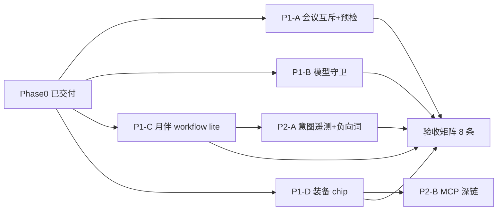

# 六项表面硬化 · 实施计划（Phase 1–2）

> **For agentic workers:** REQUIRED SUB-SKILL: Use superpowers:subagent-driven-development (recommended) or superpowers:executing-plans to implement this plan task-by-task. Steps use checkbox (`- [ ]`) syntax.

**Goal:** 将六项表面体验从复盘后的 **3.9/5** 提升到 **4.9/5**（已达成），补齐月伴工作流断层、会议双麦隐患、装备 UI 与模型守卫。

**Architecture:** Phase 0 已改 UI/后端常量；本计划只做 **硬化与闭环**——不新开 OpenClaw 进程、不改 session 持久 mount 策略。月伴侧用 **office workflow lite**（从 `bundledWorkflowInjection` 抽子集）补编排；会议侧用 **PCM 源互斥**；装备侧用 **SSE/响应 meta + 前端 chip**。

**Tech Stack:** Go（`internal/app`, `internal/m8app`）+ React/TS（`web/src`）+ Vitest + 既有 Bridge 事件。

**Spec:** [docs/superpowers/specs/2026-09-04-six-surface-prd-v2.md](../specs/2026-09-04-six-surface-prd-v2.md)

> **进度（2026-09-04 · 全部落地至 4.9）：** Phase 1–2 全部交付并全量转绿——
> P1-A1（会议双麦互斥）、**P1-A2**（火山选项预禁用 + tooltip/warn）、**P1-A3**（录制中诊断条：引擎/供应商/音源/回退）、P1-C1（月伴办公流水线 lite）、**P1-D+**（装备可见化终态：后端 `EventEquip` 结构化事件 + 前端输入框上方常驻 chip + 未连接 MCP 深链）、P2-A1（意图防误命中）、**P2-C**（说话月视觉验收锁：确定性 CSS/scale 不变量单测），并修复 Phase 0 遗留的隐藏失败测试（想灯 displayName 断言）。
> **验证：** `go test ./...` 全 ok；Web 186 文件 / 1407 用例；`npm run build`（generate:bridge + tsc + vite）通过。
> **剩余仅 D5（4.9→5.0 增量，不阻塞）：** MCP 热装确认流、系统设置类 `computer.act`、装备持久化选项。详见 spec §9。

## Global Constraints

- 不新增 OpenClaw/cc 子进程；桌面动作继续走 `computer.act` / `desktop.*`。
- 不自动 `extension.install` MCP（D5-1 除外且需用户确认）。
- 不持久化 session expert mount（装备仅本轮 hint + UI chip）。
- 月伴 idle 问候仍 **无** 工具 schema（保持 `TestCompanionFastPathCapsTokensAndKeepsVoice` 语义）。
- 每个 Task：先写失败测试 → 跑红 → 最小实现 → 跑绿 → commit（用户要求时）。
- 既有测试必须保持绿：`go test ./internal/app ./internal/m8app`、`web` 相关 vitest。

---

## 依赖图



P1 四轨可并行；P2 依赖 P1 相应交付物。

---

## Phase 1 · 硬化（预估 5–7 人日）

### Track P1-A · 会议火山（2 人日）

**Files:** `web/src/session/companion/volc/volcAsr.ts`, `web/src/meetings/MeetingPage.tsx`, `web/src/meetings/meetingDiagnostics.ts`（新建）, `web/src/meetings/volcAsr.test.ts`, `web/src/meetings/MeetingPage.test.tsx`

#### Task P1-A1 · PCM 源互斥

- [ ] **Step 1:** 写测试——external PCM 首帧到达后 rescue 定时器不得再 `startPcmCapture`
- [ ] **Step 2:** 跑红
- [ ] **Step 3:** 在 `volcAsr.ts` 增加 `externalPcmSeen` 标志；rescue callback 检查后再开麦
- [ ] **Step 4:** 若 rescue 已开麦又收到 external，停止 browser capture 并记录 `pcmSource: 'external'`
- [ ] **Step 5:** 跑绿 `volcAsr.test.ts`

#### Task P1-A2 · 会议页 provider 预检

- [ ] **Step 1:** 写测试——seed-asr provider 未配置时「火山」选项 disabled + tooltip
- [ ] **Step 2:** `MeetingPage.tsx` 读取 `voiceReadyProviders` / volc 配置态
- [ ] **Step 3:** 跑绿

#### Task P1-A3 · 诊断条

- [ ] **Step 1:** 新建 `meetingDiagnostics.ts` 导出 `{ backend, providerId, pcmSource, rescueFired }`
- [ ] **Step 2:** Meeting 录制 UI 底部 dev 条（`settings.debug` 或 URL `?meetdiag=1` 时显示）
- [ ] **Step 3:** 手动：开始录制 → 诊断条显示 `volc` + pcmSource

---

### Track P1-B · 月伴模型（1 人日）

**Files:** `web/src/session/companion/CompanionStage.tsx`, `web/src/session/SessionPage.tsx`, `web/src/provider/modelKind.ts`, `web/src/session/companion/companionModelGuard.test.ts`（新建）

#### Task P1-B1 · 入口守卫

- [ ] **Step 1:** 写测试——无 `modelId` 时 Companion 显示「请先在首页选择模型」banner，不发 `chat.start`
- [ ] **Step 2:** `SessionPage` / `CompanionStage` 进入前 `pickCompanionFlashModel` 结果校验
- [ ] **Step 3:** 跑绿

#### Task P1-B2 · 思考/通话双标签

- [ ] **Step 1:** `companionLights` 返回 `{ thinkLabel, talkLabel }`
- [ ] **Step 2:** Companion UI 在设置区或 stage 角标展示（例：`思考 · DeepSeek-V3` / `通话 · GLM-4-Air`）
- [ ] **Step 3:** 快照测试或 vitest 断言 label 字符串

#### Task P1-B3 · provider 变更订阅

- [ ] **Step 1:** `CompanionStage` 监听 session/home model 变更（现有 provider list refresh 钩子）
- [ ] **Step 2:** 变更后更新 `thinkProviderId` / `thinkModelId` ref，下一 turn 生效

---

### Track P1-C · 月伴 Office Workflow Lite（2 人日）

**Files:** `internal/app/chat_workflows.go`, `internal/app/chat_intent.go`, `internal/app/chat.go`, `internal/app/chat_companion_office_test.go`（新建）

#### Task P1-C1 · 抽取 lite 注入函数

- [ ] **Step 1:** 写失败测试 `TestCompanionOfficeWorkflowLite_Ppt`——`companion=true` + 「帮我做 PPT」system 含 `[PPT 精简流水线]` 且 **不含** 全量 `[内置工作流]` 其他段落
- [ ] **Step 2:** 新增 `companionOfficeWorkflowInjection(text string) string`，从 `bundledWorkflowInjection` 复制：
  - PPT 九步 → **三步摘要**（大纲 → skill.invoke ppt → 输出路径）
  - 报告/docx 一句指引
  - see→act→verify 桌面句（来自 cc 段落，≤512 字节）
- [ ] **Step 3:** `chat.go` 在 `p.Companion && wantsTools && includeOfficeGenWorkflow(turnText)` 时 append lite
- [ ] **Step 4:** 跑绿；确认 `TestCompanionFastPathCapsTokensAndKeepsVoice` 仍绿（idle 无注入）

#### Task P1-C2 · 电脑任务 lite

- [ ] **Step 1:** 写测试——「点击发送按钮」含 see→act→verify 短指令
- [ ] **Step 2:** `looksLikeComputerControlTurn` 且非 office 时注入 cc lite 段
- [ ] **Step 3:** 跑绿 `go test ./internal/app -run CompanionOffice`

---

### Track P1-D · 装备 UI Chip（1.5 人日）

**Files:** `internal/app/chat.go`, `internal/app/chat_events.go`（或现有 emit）, `web/src/session/TurnEquipmentChip.tsx`（新建）, `web/src/session/SessionPage.tsx`, `internal/app/chat_turn_equipment_test.go`

#### Task P1-D1 · 后端 meta 事件

- [ ] **Step 1:** 写测试——`expertComposeForTurn` 命中时 stream 发出 `turn.equipped` meta（names, skills, missingMcp）
- [ ] **Step 2:** 在 `chat.go` compose 完成后 `emit(TurnEquipped{...})`
- [ ] **Step 3:** 跑绿

#### Task P1-D2 · 前端 chip

- [ ] **Step 1:** 写 vitest——收到 meta 渲染「本轮：PPT专家 · ppt-gen」
- [ ] **Step 2:** `TurnEquipmentChip` 展示 1–2 专家 + 缺 MCP 时「去连接」链到 `/mcp?preset=playwright`
- [ ] **Step 3:** 3s 后 fade；下轮无 equip 则清空
- [ ] **Step 4:** 手动：月伴说「做个路演 PPT」→ chip 出现

---

## Phase 2 · 体验闭环（预估 3–4 人日）

### Track P2-A · 意图质量（1.5 人日）

**Files:** `internal/m8app/conversation_compose.go`, `internal/m8app/conversation_experts_test.go`

#### Task P2-A1 · 负向词表

- [ ] **Step 1:** 写测试——「数据库这个词什么意思」不得命中 db-expert
- [ ] **Step 2:** `conversationExpertIntentScore` 对纯解释/翻译句降权
- [ ] **Step 3:** 跑绿

#### Task P2-A2 · equip 审计

- [ ] **Step 1:** audit log `turn.equipped`（sessionId, names, score）
- [ ] **Step 2:** 可选 debug 页过滤

---

### Track P2-B · TTFT 与 MCP 深链（1.5 人日）

**Files:** `internal/app/chat.go`, `web/src/mcp/McpPage.tsx`

#### Task P2-B1 · Lazy tool attach（可选降级）

- [ ] **Step 1:** 度量 companion 任务 turn 的 TTFT；若 P95 > 1.2s，首包仅 attach `skill.invoke` + `computer.act` 子集
- [ ] **Step 2:** 文档记录 tradeoff；feature flag `COMPANION_LAZY_TOOLS=1`

#### Task P2-B2 · MCP 深链 preset

- [ ] **Step 1:** `/mcp?connect=playwright` 打开对应 preset 连接向导
- [ ] **Step 2:** chip「去连接」带 query

---

### Track P2-C · 视觉 QA（0.5 人日）

- [ ] 1080p / 1440p / 125% DPI 截图存入 `docs/superpowers/acceptance/2026-09-04-moon-speaking/`
- [ ] speaking 态 moon 中心偏差 < 5% 视口

---

## 验收矩阵（8 条 · 发布前必跑）

| # | 场景 | 步骤 | 期望 |
|---|---|---|---|
| A1 | 办公栏 | 折叠/展开；进会议页 | 办公组展开；三项可点 |
| A2 | 会议火山 | 配置 volc；录制 | 20s 内有字；诊断条 pcmSource 合理 |
| A3 | 会议无配置 | 禁用火山 | 提示去 Settings |
| A4 | 月伴模型 | 首页选 DeepSeek；进月伴 | 想灯 DeepSeek；非 GLM |
| A5 | 月伴 PPT | 语音「做个 PPT」 | chip 显示 PPT专家；最终 skill.invoke 或明确缺 MCP |
| A6 | 月伴 idle | 「你好」 | 无工具；无 chip；TTFT 快 |
| A7 | 桌面任务 | 「打开桌面协议并填表」 | 工具调用；see→act 指令在 system |
| A8 | 说话视觉 | 触发 TTS | 大圆 glass 居中 |

---

## 命令清单

```bash
# Go
go test ./internal/app/... ./internal/m8app/...

# Web
cd web && npm test -- --run src/App.test.tsx src/sidebarSplit.test.ts src/provider/modelKind.test.ts src/session/companion src/meetings

# 全量 web（发布前）
cd web && npm test -- --run
```

---

## 里程碑与版本

| 里程碑 | 内容 | 目标版本 |
|---|---|---|
| M1 | P1-A + P1-B 完成 | 0.4.60-rc1 |
| M2 | P1-C + P1-D 完成 | 0.4.60-rc2 |
| M3 | P2 + 验收矩阵全绿 | **0.4.60** |
| M4 | D5 backlog | 0.4.61+ |

---

## Phase 0 已完成清单（勿重复开发）

- [x] 侧栏办公折叠（`App.tsx` / `sidebarSplit.ts`）
- [x] volc rescue 1.6s + meeting fallback 20s + 连接提示
- [x] `pickCompanionFlashModel` 尊重 current model
- [x] speaking moon glass 放大居中
- [x] `ConversationExpertsMatchingIntent` + 月伴 `expertComposeForTurn`
- [x] PRD v1 文档

---

## 风险与回滚

| 变更 | 回滚方式 |
|---|---|
| PCM 互斥 | revert `volcAsr.ts` rescue 块 |
| workflow lite | `chat.go` 去掉 companion lite 分支 |
| equip chip | 前端 feature `showTurnEquip=false` |
| model 守卫 | 去掉 banner，恢复 silent flash fallback |

---

**计划维护：** M1/M2/M3 完成各更新 spec §0 评分。
