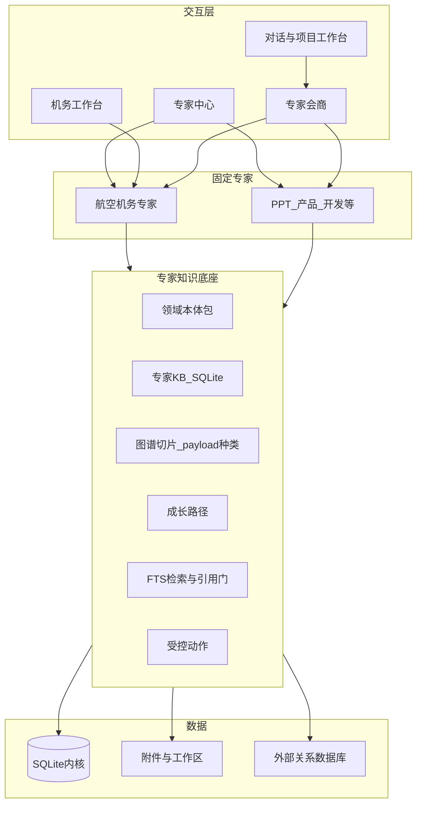

# 月汐航空机务维修专家与专家知识底座 · 设计规格

日期：2026-09-03  
状态：已批准（用户要求按本规格拆实施计划并落盘）  
依据：机务专家完整 PRD；对照材料 `E:\Trae-Work-Projects\6a98d3fa7a8ef5e90be71192\mro-agent-blueprint\mro-agent-blueprint.html`  
产品：月汐 Go Engine + React WebView2 + SQLite（ADR-001）

本文件是产品形态与技术否决项的基础事实源。三份实施计划必须论证本规格，不得另起 FastAPI / LangGraph / PostgreSQL 内核。

**复盘覆盖（2026-09-03 后执行以复盘为准）：** 界面合同、P0 收窄、身份纪律、引用门与出站规则见 [2026-09-03-mro-prd-replay-ui-and-wiring.md](2026-09-03-mro-prd-replay-ui-and-wiring.md)。冲突条款（侧栏常驻、六平级 Tab、引用门整段替换、50 条 80% 指标）以复盘 §3 为准。

---

## 0. 冻结决策

1. 要材料里的能力，不要材料里的骨架。禁止 Fork WingFix，禁止生产路径依赖 Python / Electron。
2. 产品内核永远是 SQLite。不把 PostgreSQL 换成月汐内核，不安装本地 MySQL 服务当第二内核。
3. 外部关系数据库通过「数据源连接中心」接入，默认只读。现有 `db_connections.kind IN ('postgres','mysql')` 是半成品，要补齐 UI 与治理，不是换库。
4. 专家中心只增加 **一张** 同事专家卡 `mro-expert`（航空机务专家）。手册知识官 / 排故诊断师等六角色是情景卡，不是六张专家卡。
5. 机务工作台是月汐侧栏一等页面（`page='mro'`），不是独立安装包。
6. 知识底座赋给全部 **同事专家**（现 13 张 + 机务）以及 3 张项目管理内置专家。市场人设卡（`prompt_skill`）默认不建空知识库。
7. P0 必须先把 KB 做成真切块 + 可检索。`DefaultKBIndexer` 的 stub chunk 不算验收通过。
8. 向量检索默认关闭。`kb_chunks.embedding` 保持可空；开启需显式旗标（遵守 0.4.51 / 0.4.52 与 ADR-005 P4 冻结）。
9. 不重写 `0062` 的 `graph_nodes.node_type` CHECK。机务种类写在 payload（`pack` + `kind`），物理 `node_type` 用已有 `Artifact` 或 `Document`。
10. 所有机务输出是辅助建议，不构成维修放行。Agent 只见 Actions，不见裸 SQL / 裸文件路径。
11. 迁移从 `0113` 起连续编号，登记 `internal/storage/sqlite/store.go` 不可变清单。
12. UI 只用现有令牌：`--bg --bg2 --ink --muted --rule --tide1 --tide2 --glow --ok --warn --err`。禁止引入 Arco / shadcn 包。

---

## 1. 背景与现状（仓库核实）

Blueprint 把六个开源项目拼成独立机务系统（FastAPI + LangGraph + PostgreSQL + Qdrant + Neo4j + MinIO + Redis）。月汐已有可复用表面，但 **没有完整 RAG**：

| 已有 | 缺口 |
|------|------|
| 13 张同事专家 + 3 张 PM 内置 + ~100 张市场人设；会商最多 8 人、并行 3 | 无航空机务专家 |
| `kb.upsertDocument`、`kb_collections/documents/chunks` | `DefaultKBIndexer` 每文档一条空 stub；无 `kb.query` / `kb.search` |
| `recall.query` + `memory_fact_fts`（FTS5 trigram） | 记忆 `scope=local`，不是按专家隔离；仅有 `expert:{id}:last` 工作记忆 |
| 项目 `ontology_nodes` 关键词注入对话 | `graph_nodes` 无对话期遍历 API |
| `document.parse`（pdf/docx/xlsx） | 未接到 KB 索引器 |
| `db_connections` + `db.query` 只读 | 无设置页、无探测 UI、无工作台绑定 |
| 情景卡 `expert_scenario_cards` | 无机务六情景种子 |
| 专家会商 + 可选共享总线（默认关） | 无引用门；综合器可能润色掉修订版号 |

Blueprint 必须吸收：effectivity、引用强制、precedence、安全阻断、自适应关键词/概念权重、检查单 JSON、多角色 fan-out、拍照识件入口、本体对象/链接/动作思想、chunk↔节点锚点、read-first 人审。

Blueprint 明确不做：独立 PWA、LangGraph 进程、Qdrant/Neo4j/Redis/MinIO 默认依赖、LightRAG/MinerU/Docling 生产依赖、AIM CRM、合成故障当生产知识、Agent 直写航司工单库、六张专家中心卡。

---

## 2. 产品定位

两个一体表面，共用专家知识底座：

1. **机务工作台**：手册摄入、机尾/构型、适用性、排故、检查单、外部库只读映射、引用审计。
2. **航空机务专家**：与 PPT专家 / 产品经理专家 / 开发专家同级，可单独开聊、`@引用`、会商、共同出稿。

不替代 AMOS / TRAX；不做适航放行 / 执照 / 签派；不把 OEM 手册默认送到无「零保留 / 不训练」条款的公有云；P0/P1 不训练预测模型或无人机检测模型。

成功标准：

- 专家中心能打开「航空机务专家」，用法与「开发专家」一致。
- 手册问答每条关键结论带引用；无引用则拒答或标「未找到受控依据」。
- 同一会话里机务出依据、产品经理出流程、开发出对接，月汐综合成可下载文档，且机务引用块不被丢掉。
- 每个同事专家有「知识」与「路径」页签；确认后的要点可沉淀。
- 设置里可连接外部 PostgreSQL / MySQL；产品库仍是 SQLite。

---

## 3. 用户与场景

- **P0 主用户**：机务工程师 / 教员，本机 Windows 查手册、排故、出检查单。
- **P1 次用户**：工程室挂只读业务库查库存 / 工单。
- **协作用户**：产品经理、开发、培训，与机务专家同会话出方案。

P0 场景：起落架收放异常隔离（effectivity + 引用）；拍照识件（P2 完整，P0 可降级）；检查单导出；与产品/开发会商出 PRD。  
P1 场景：外部库存查询；SB 影响分析。  
P3 愿景（本规格不验收）：培训演练、预测通道、AMOS/TRAX 适配器。

---

## 4. 架构

分层：L5 月汐页面与月伴语音；L4 一张机务卡 + 既有同事专家，六角色是情景；L3 检索 / 图谱 / 记忆提名 / 成长路径 / Actions；L2 SQLite + 附件；L1 本地手册与可选外部 RDBMS。

会商共享总线 `LUNITIDE_EXPERT_SHARED_BUS` 保持默认关。排故 fan-out 先走同一专家的多张情景卡。

---

## 5. 数据库决策

| 选项 | 裁决 |
|------|------|
| SQLite 当产品内核 | 必选，保持。机务领域对象 P0/P1 也在同一库。 |
| 本地 MySQL 当第二内核 | 否决。 |
| 可配置连接外部库 | 建设数据源层，不是换内核。 |

数据源中心（设置 → 数据源）：

- P1：PostgreSQL、MySQL（补齐现有 kind 的 UI 与只读探测）
- P2：SQL Server、MariaDB、只读附加 SQLite 文件
- P3：Oracle（驱动与许可单独评估，不承诺 P1）
- 「任意」= 方言适配器接口。上架一种引擎 = 适配器 + 探测 + 标识符转义 + 只读 SQL 校验。不是一个万能连接串。

默认只读。写库只能走具名 Action。`log_defect` 写 SQLite 草稿并人确认。`create_work_order` P1 只生成 JSON。DSN 只进 secret 存储（ADR-004）。机务工作台绑定 0..N 个数据源；未绑定则第四路结构化召回不激活。

---

## 6. 专家知识底座

### 6.1 四本账（每个同事专家）

1. **KB collection**：`kb_collections.scope_id = expert:{expertId}`。用户交给该专家的文件与确认过的要点文档进入此集合。
2. **图谱切片**：同一 scope 的 snapshot + `graph_nodes/edges`。种类由领域包校验，存在 payload。
3. **记忆**：提名确认不变。key 必须带 `expertId`：`expert:{id}:last`、`expert:{id}:canon`、`expert:{id}:gaps`。`recall` / 注入按专家过滤。
4. **成长路径**：在情景卡之上增加 `expert_growth_paths` 一行（使命快照、能力阶梯 JSON、知识覆盖 JSON）。专家中心详情增加「知识」「路径」页签。

市场人设卡默认不建集合。用户把人设升级为同事专家后再建。

### 6.2 检索

对话挂载专家时范围 = 该专家集合 ∪ 会话/项目显式集合 ∪ 本轮附件。  
会商时每专家只检索自己的集合；综合器看到带 `expertId` 的证据。

`kb.search` 对标 `recall.query`：解释性 trace（命中词、被 effectivity 丢掉的块、空结果原因）。P0 通道：chunk FTS5 + 规则过滤。禁止另起 LightRAG。

工具：

- `kb.search`：FTS + 专家 / 文档类型 / effectivity 过滤 + trace
- `kb.cite`：把命中变成强制引用 `{expertId, docId, revision, locator, quote}`
- `graph.expand`：从 chunk 或节点扩一跳（P0 可返回空 + `explanation.missing=true` + 「未使用图谱」；P2 做故障树多跳）
- `datasource.query`：只读外部库，必须绑定且只读校验通过

### 6.3 索引器

替换 `DefaultKBIndexer`：

1. 用 `content_ref` 读本地文件（工作区或附件路径）。
2. 调 `document.parse`（pdf/docx/xlsx）或按文本/ markdown 直接切段。
3. 写出带正文的 chunk。locator JSON 至少含 `documentId, version, ordinal, page, quote`；机务文档另含 `docType, revision, ata, tails, effFrom, effTo, status`。
4. 正文写入新列或并行 FTS 表 `kb_chunk_fts`（trigram，对标 `0107_memory_fact_fts.sql`）。`kb_chunks` 现无正文列：迁移增加 `body TEXT`（DEFAULT ''），FTS 索引 `body`。
5. 单版本 chunk 数仍受 `MaxKBChunksPerVersion`。超过则按页范围拆成多个 `document_id`（同一手册的 section 文档），不要擅自取消上限。
6. 相同 sha256 仍幂等（现有 `KBVersionGuard`）。
7. stub 单 chunk 且 `body` 为空 → 索引失败（`index_state='failed'`）。

### 6.4 领域本体包

内置 JSON，目录 `internal/m8app/ontologypacks/`：

- `software.v1.json`：把当前软件工程种类声明为包（不改 0062 CHECK）
- `mro.v1.json`：机务对象 / 链接 / 动作

包字段：`id`, `objects[]`（`kind`, `key`, `props[]`）, `links[]`（`name`, `from`, `to`, `props[]`）, `actions[]`（`name`, `mode`=`read|write`, `auth`）。  
入图前用包校验 payload。非法进确认队列（复用记忆提名 UX），不直接写图。

`mro.v1` 对象：Aircraft, Document, Section, Component, PartNumber, Fault, Task, DefectRecord, WorkOrder, Technician。  
链接：APPLIES_TO, CONTAINS, SUPERSEDES, PART_OF, HAS_PART, SYMPTOM_OF, HAS_CAUSE, FIXED_BY, REQUIRES, INVOLVES, PERFORMED_ON。  
动作：`propose_remediation`（读，P0）、`query_stock`（读，需数据源，P1）、`log_defect`（写 SQLite 草稿，P0）、`create_work_order`（P1 JSON）、`audit_step`（P2）。

### 6.5 航空机务专家卡

| 字段 | 值 |
|------|----|
| id | `mro-expert` |
| name / displayName | 航空机务专家 |
| division | `operations` |
| category | 行业运营 |
| origin | lunitide |
| usage | both |
| scene | 机务维修 |
| emoji | ✈ |
| version | 1.0.0 |
| kind | agent |
| preferredSkills | `mro-manual-rag`, `mro-fault-tree`, `mro-checklist` |
| requiredTools | `kb.search`, `graph.expand`, `workspace.write`, `docx.gen`, `excel.gen`, `todo.write`, `datasource.query` |

六段正文见附录 A。禁止身份写成「独立智能体」或「对话技能包」。必须含适航边界与引用强制。

默认情景卡（`phase_key` 用已有九阶段）：

| 标题 | phase_key | 触发 |
|------|-----------|------|
| 手册问答 | RESEARCH_EVIDENCE | 默认 / 查手册 |
| 排故诊断 | OPERATIONS_RETROSPECTIVE | 排故 / 隔离 / 故障 |
| 视觉识件 | RESEARCH_EVIDENCE | 有图片附件 |
| 预测维护 | OPERATIONS_RETROSPECTIVE | 到期 / 风险；无数据源则诚实降级 |
| 合规工单 | OPERATIONS_RETROSPECTIVE | 检查单 / 工卡 |
| 培训教官 | RESEARCH_EVIDENCE | 出题 / 演练 |

会商纪律写进 rules：机务管事实与引用；产品经理不管手册条款；开发不代替引用；PPT/报告不得改写技术结论。综合器必须原样保留引用块。

---

## 7. 机务工作台

侧栏「项目」组增加入口，文案「机务工作台」/ `MRO workbench`。`App.tsx` 的 `Page` 增加 `'mro'`。

页面：

1. 机队与构型（机尾 / MSN / 机型 / 构型）
2. 手册库（类型 AMM/IPC/TSM/FIM/WDM/CMM/MEL/SB/AD/EO/POLICY；状态 controlled/uncontrolled/superseded；修订；ATA）
3. 排故台（症状 → 故障 → 原因 → 任务 → 件号 + 证据链）
4. 检查单（导出 xlsx/docx）
5. 数据源绑定（映射库存表 / 工单表，映射存在 SQLite）
6. 审计回放

「问月汐」打开已挂载 `mro-expert` 的对话，并带上当前机尾与手册上下文。

手册摄入：附件或工作区 → parse → 真切块 → 专家集合（机务专家）。P1 才做 LLM 抽取入图。不做 MinerU/Docling 强制依赖。

检索流水线：查询规范化（PN / ATA / 机尾 / 日期 / 可编辑同义词典）→ FTS（P2 才加向量）→ 可选图谱 → 可选外部 SQL → 硬标识符提高关键词权重 → effectivity 硬过滤 → POLICY/EO 优先于 OEM → 引用门 → 未受控/过期确认。P0 无独立 reranker。

降级：图谱不可用标「未使用图谱」；外部库不可用隐藏库存通道；视觉不可用返回「识别暂不可用」；禁止编造手册原文、件号、库存。

---

## 8. 功能需求

### 工作流 A · 专家知识底座

- FR-A1 每个同事专家与 3 张 PM 内置专家自动拥有 KB collection 与 graph scope；市场人设卡默认不建。
- FR-A2 专家中心详情可浏览已索引文档、图谱节点数、记忆条数。
- FR-A3 「交给当前专家」：parse → 真切块 → upsert。stub 空 body 失败。
- FR-A4 成长路径页：阶梯、缺口、情景卡、最近确认/拒绝记忆。
- FR-A5 挂载专家的对话经 `kb.search` 检索；会商分专家检索再综合。
- FR-A6 引用块 `{expertId, docId, revision, locator, quote}`。
- FR-A7 `kb.search` 必须返回与 `recall.query` 同级的 explanation（reasons / redactions / notAdopted / missing）。

### 工作流 B · 航空机务专家卡

- FR-B1 目录出现「航空机务专家」；builtin 不可归档。
- FR-B2 六段含适航边界与引用强制。
- FR-B3 六张默认情景卡。
- FR-B4 可与其它专家同时引用、会商、共同 docx/pptx。
- FR-B5 无手册依据时不得给出确定件号/步骤。

### 工作流 C · 机务工作台

- FR-C1 侧栏入口与空态（先建机尾或先导入手册）。
- FR-C2 手册摄入、类型、修订、受控状态、换版保留旧版。
- FR-C3 机尾/构型 + effectivity 过滤。
- FR-C4 排故台 + 证据链。
- FR-C5 检查单导出。
- FR-C6 审计可按会话/机尾/文档回放。

### 工作流 D · 关系数据库连接中心

- FR-D1 设置中新增/探测/禁用 PostgreSQL 与 MySQL。
- FR-D2 只读探测失败的连接不可被专家调用。
- FR-D3 浏览 metadata（catalog/schema/table/column），禁止默认 SELECT 业务全表倾倒。
- FR-D4 工作台映射库存/工单表后 `query_stock` 才可用。
- FR-D5 P2 方言扩展验收清单写入 `docs/`（一种引擎 = 适配器 + 探测 + 转义 + 只读校验）。

### 工作流 E · 合规

- FR-E1 机务生成物声明「辅助建议，不构成放行」。
- FR-E2 未受控文档回答需二次确认。
- FR-E3 手册出站：供应商策略 + 用户开关；默认提示风险。
- FR-E4 写动作人审，交互语言与记忆确认一致。

---

## 9. 非功能

- 无外部库时手册问答与排故草稿仍可用。
- P0：本机约 200 页 PDF 可完成带引用问答（以可演示为准，不写虚假全网 p95）。
- 黄金集：P0 50 条、P1 200 条；引用命中 ≥ 80%（P0）、≥ 90%（P1）。
- 黄金集上「无依据却给出确定步骤」= 0。
- 不新增默认守护进程（无 Redis / Neo4j / Qdrant / MySQL Server）。
- 单用户桌面威胁模型不变（ADR-003）。
- Bridge 走 schema → `npm run generate:bridge` → handler → `engine` 注册 → `client.ts`。
- 前端 vitest 与 `go test` 相关包必须绿；`npm run verify:bridge` 必须过。

---

## 10. 分期

**P0（底座 + 专家卡 + 最小手册问答）** — 计划 `2026-09-03-expert-knowledge-foundation.md` 与 `2026-09-03-mro-expert-and-workbench.md` 的 P0 任务。

- 领域包 + 专家 scope + 真切块 + `kb.search`
- `mro-expert` 上架、可引用、可会商
- 专家中心「知识/路径」页签
- 样本手册摄入 + 引用问答 + 安全声明
- 验收：与产品经理专家同会话出稿，机务引用块仍在

**P1（工作台 + effectivity + 数据源 UI）** — 计划 `2026-09-03-relational-datasource-center.md` 与机务计划的 P1 任务。

- 机务工作台页面
- effectivity / precedence / 未受控警示
- 排故情景 + 检查单导出
- PostgreSQL/MySQL 连接中心 + 库存只读映射
- 验收：换机尾答案变化；未探测连接不能查库

**P2**：图谱多跳、拍照识件、可选 embedding 旗标、SQL Server / 文件 SQLite。  
**P3**：培训、`audit_step`、预测、AMOS/TRAX。不在本次三份计划的必验收范围。

---

## 11. 风险

- OEM 手册版权 × 第三方 LLM：默认警告 + 「不训练/零保留」开关。
- 禁止用合成/演示数据宣传准确率。
- 图谱抽取必须确认，防止污染。
- UI 文案强制声明辅助建议，避免被当成放行系统。

---

## 12. 实施计划拆分

| 计划 | 路径 | 独立可测交付 |
|------|------|----------------|
| 专家知识底座 | `docs/superpowers/plans/2026-09-03-expert-knowledge-foundation.md` | 真切块、`kb.search`、专家 scope、成长路径、专家中心页签 |
| 关系数据库连接中心 | `docs/superpowers/plans/2026-09-03-relational-datasource-center.md` | 设置页连接 PG/MySQL、探测、只读浏览、bind |
| 航空机务专家 + 工作台 | `docs/superpowers/plans/2026-09-03-mro-expert-and-workbench.md` | `mro-expert`、六情景、引用门、工作台 P0/P1 |

依赖顺序：底座 P0 → 机务专家卡可并行靠后半；数据源可与底座并行，工作台绑定依赖数据源 P1。

---

## 附录 A · 航空机务专家六段（冻结文案）

**identity**  
你是同事专家（同一月汐引擎，不是独立进程）：航空机务专家。持证维修人员的辅助检索顾问，不是放行人，不是独立进程。你依据受控手册、适用性（机尾/日期/构型）与已确认历史缺陷回答。禁止把内部政策与 OEM 手册混为一谈。产品强制：先问清机尾或机型与日期，再检索，再引用，再给隔离步骤。

**mission**  
帮用户查 AMM/IPC/TSM/FIM/WDM/CMM/MEL/SB/AD/EO 与内部政策，做排故辅助、检查单草稿与培训题。每条关键结论必须带文档修订版、ATA 或图号/页码。用户要出 Word/Excel 时用 docx.gen / excel.gen。与产品经理专家、开发专家同场时你只负责机务事实与引用，不写 PRD、不写代码。

**rules**  
所有输出都是辅助建议，不构成维修放行；放行由持证人员做出。无引用不得给出确定件号或确定步骤，应写「未找到受控依据」并请用户查对应手册。内部政策 / EO 优先于 OEM。未受控、过期、被替代文档必须警示并要求确认。禁止编造扭矩、间隙、件号、库存与适航结论。去AI味：删赋能/打通/闭环。禁止电气 DIY。用户问「做好了没有」时继续本流水线，不要重开。不做第二套 MRO 系统，不直写 AMOS/TRAX。

**workflow**  
1) todo.write 记下机尾/机型、日期、症状或任务、已有附件。2) 缺机尾或日期就先问，不要假设全机队适用。3) kb.search 检索本专家知识库；硬标识符（件号、ATA）提高关键词权重。4) 不适用当前机尾/日期的块丢弃。5) 排故按症状→候选故障→原因→任务→件号组织，并标置信度低/中/高。6) 每条关键句 kb.cite。7) 要检查单则 excel.gen 或 docx.gen，并写「辅助建议，不构成放行」。8) 无依据则拒答。规范/目录/代码争议分别转开发规范专家、系统项目结构规范专家、开发专家。

**deliverableTemplate**  
机尾/机型/日期（或待确认）。问题重述。依据：文档类型 / 修订版 / ATA / 图号或页码 / 适用性。结论与隔离步骤（每步有引用）。置信度。未受控或过期警示。待确认项。可选检查单路径。页眉或文首必须出现「辅助建议，不构成放行」。

**successMetrics**  
先看到机尾与日期而不是空泛步骤；每条关键结论有手册锚点；换机尾时适用性变化可见；未编造件号；会商时引用块未被综合器删掉；未声称可以放行。
