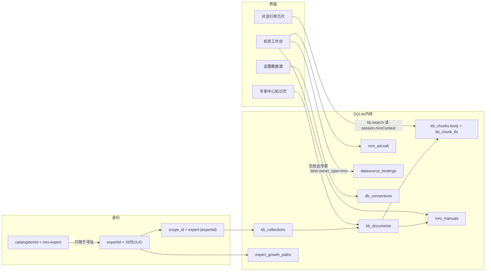
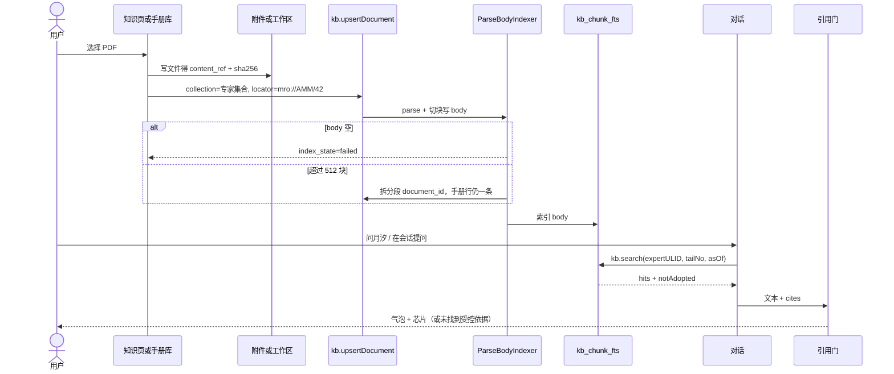

# 月汐机务专家 PRD 复盘 · UI 与后台关联设计

日期：2026-09-03  
状态：待用户批准后执行（本文件覆盖原 PRD / 原规格的冲突条款）  
上游：`docs/superpowers/specs/2026-09-03-mro-expert-and-expert-foundation-design.md`  
对照：原 PRD、三份实施计划、仓库实码（专家中心 / 侧栏 / 设置 / KB / 记忆确认）

本文件做三件事：复盘原 PRD 的漏洞与隐患；按你的真实需求校正产品合同；把每一块界面画到可实现，并钉死后台对象、Bridge、状态机怎么连。

**未批准前不改产品代码。** 三份旧实施计划仍然有效，但必须服从本文 §3 冻结补丁。

---

## 0. 一句话复盘

原 PRD 的骨架判断是对的（要能力、不要 WingFix 骨架；SQLite 内核；一张专家卡 + 工作台；底座赋给全部同事专家）。  
它还不能直接开工的原因是：**把三个产品（专家卡、领域工作台、外部库中心）写成了同一迭代的验收清单，又几乎没有界面合同。** 按原文做，会做出一个侧栏永远挂着「机务工作台」的通用桌面产品，专家中心详情栏会被知识/路径撑爆，引用门会在用户看不见原因的情况下改掉回答，手册全文会默认进云端模型。

校正后的可执行形态：

1. **先让第 14 张专家卡在现有专家中心 / `@` / 会商里像开发专家一样能用。**
2. **每个同事专家都有「知识 / 这位专家的成长」两个页签**（底座），机务只是第一个有内容的领域包。
3. **机务工作台是这张专家卡的领域表面，不是第四个中心。** 侧栏入口仅在机务专家已启用时出现。
4. **设置 → 数据源是独立能力**，工作台只做绑定，不画 DSN。

---

## 0.5 二次复盘修正（最高优先级，覆盖本文其余章节与全部旧计划）

第一轮复盘把「界面 / 范围 / 身份」讲清楚了，但对**知识底座的工程量**判断过于乐观。第二轮直接读了 `internal/m8app/kb.go`、`internal/domain/m8core/kb.go`、`internal/storage/sqlite/m8_kb.go`、`cmd/engine/main.go`，坐实以下九点。凡与本文其它章节或三份旧计划冲突，以本节为准。

### C1 · 真切块是「契约变更」，不是「换个索引器」（命门）

实码事实（已验证）：

- `KBIndexer` 签名是 `func(ctx, doc m8core.KBDocument) ([]string, error)`——**只返回 chunk ID**，没有正文通道。
- `m8core.KBChunk` 结构体字段：`ChunkID / DocumentID / DocumentVersion / Ordinal / ContentDigest / LocatorJSON / CreatedAt`——**没有 Body**。
- `kb_chunks` 写入列 `(chunk_id,document_id,document_version,ordinal,content_digest,locator_json,embedding,created_at)`——**没有 body 列**。
- `BuildChunkProjection` 把 locator **写死**成 `{documentId,version,ordinal}`——机务计划假设的 `revision/ata/tails/status` 富 locator **注不进去**。
- 索引器只拿到 `doc.ContentRef`（文件路径）与 `SourceLocator`，**拿不到文本**；`DefaultKBIndexer` 现在只 `ulid.Make()` 返回一个空桩，从不读文件。

结论：要能检索的正文 + 富 locator，必须动**四层**：`m8core.KBChunk`（加 Body）、投影函数（携带 body 与自定义 locator）、`PutKBChunks`（写 body 列）、迁移（body 列 + FTS）。旧底座计划「replace DefaultKBIndexer」把它写成一步，实际是本项目**最大的单点工程**，必须单列为一个里程碑（见 §10 M1）。

**落地决策：**
1. `KBIndexer` 改为返回 `[]m8core.KBChunk`（带 Body 与 LocatorJSON），或新增并存的 `KBChunkProjector`。为不破坏既有调用方，`DefaultKBIndexer` 保持「一个空 body 块」行为；**只有专家/机务入库路径**强制非空 body。
2. 富 locator 由投影层携带，不再被 `BuildChunkProjection` 覆盖；旧调用仍得到 `{documentId,version,ordinal}`。
3. 所有既有 `DefaultKBIndexer` / `BuildChunkProjection` 的测试随契约更新，必须保持绿。

### C2 · KBService 是全局单例，改默认索引器会波及所有 KB

`cmd/engine/main.go:249` 只 `NewKBService(...)` 一次，默认 `DefaultKBIndexer`。若全局 `SetIndexer` 成解析器，项目本体等所有 KB 消费者行为一起变。  
**决策：** 解析入库走**应用层编排**（新 `ExpertKBIngest`），不改全局默认索引器；非专家集合保持旧行为。

### C3 · 解析不放进 domain 索引器，放进 app 编排

`document.parse` 在 `internal/m7app/toolgap.go`（返回带页码的 `ParseBlock`）。让 m8 domain 调 m7 会造成领域耦合。  
**决策：** 入库编排在 app 层完成——读文件 → `document.parse` → 切块带 body 与 locator → 走「带 chunks 的入库」storage 方法。m7 在 app 层本就可用，零新增跨域依赖。

### C4 · 会话上下文用现成 `metadata_json`，只补一个小 Bridge

`sessions.metadata_json`（2..16384）已存在；但 app 层没有写任意 metadata 的 handler（已 grep 确认）。  
**决策：** 加最小 `session.metadata.set/get`（或复用既有会话更新通道），把 `mroContext` 作为 `metadata_json` 里的一个键。**不新建 mroContext 表**。禁止只写 localStorage——引擎检索必须读得到机尾。

### C5 · 引用门 P0 不做「句子级改写」

中文里区分「确定件号 / 扭矩」与「ATA 章节号 / 用户自提件号」用正则极不稳，句子级改写会误伤。  
**决策（收窄 §2 H3）：** P0 引用门只做两件：① 文首缺声明则补一行「辅助建议，不构成放行」；② 命中「高风险确定断言且零引用」时，**保留模型原文**并在气泡下挂红色警示芯片「未找到受控依据，勿据此操作」。**不删句、不整段替换。** 句子级改写降到 P2。会商丢引用仍走「附录补回」。

### C6 · 手册拆分需要一对多 schema

`mro_manuals` 单 `document_id` 无法表达「一本 AMM 超 512 块拆成多个 kb 文档」。  
**决策：** 加连接 `mro_manual_docs(manual_id, document_id, part_no)`；手册库按 `manual_id` 聚合显示「12 个分段 · 480 块」。

### C7 · 数据源「只读」的真实保证是账号，不是 SQL 串检查

`db.query` 的 SQL 字符串校验是尽力而为，不是安全边界。  
**决策：** 只读保证 = 探测通过 + **建议用户用只读数据库账号** + 行数上限（默认 1000）+ 语句超时（默认 5s）+ 错误信息脱敏（不回显 DSN / 主机）。这些写进数据源计划验收。

### C8 · 切片顺序：先发「专家卡」，再啃底座

底座（C1 契约变更）是最难的一块。但「专家中心有一张能对话的机务专家」不依赖底座——无 KB 时诚实回答「未找到受控依据，请先导入手册」正是正确的降级。  
**决策：** M0 只上专家卡（无 KB，honest 降级），一天可交、风险最低、立即可见；之后再做 M1 底座契约。详见 §10。

### C9 · 收敛文档，指定唯一事实源

现在有 5 份文档（本文 + 原规格 + 三份旧计划 + 接线计划）。执行者会困惑谁为准。  
**文档地图（本表即事实源顺序）：**

| 文档 | 角色 | 冲突时 |
|------|------|--------|
| 本文（`2026-09-03-mro-prd-replay-ui-and-wiring.md`） | **权威 PRD**：产品形态、范围、界面、身份、安全 | 最高 |
| `2026-09-03-mro-master-dev-plan.md` | **权威开发计划**：里程碑、顺序、验收 | 次高，服从本文 |
| `2026-09-03-expert-knowledge-foundation.md` | 底座任务细节 | 被 C1/C2/C3 修正 |
| `2026-09-03-mro-expert-and-workbench.md` | 机务卡/工作台任务细节 | 被 C5/C6/C8 修正 |
| `2026-09-03-relational-datasource-center.md` | 数据源任务细节 | 被 C7 修正 |
| `2026-09-03-mro-ui-backend-wiring.md` | UI 接线任务细节 | 被 C4/C5 修正 |
| `2026-09-03-mro-expert-and-expert-foundation-design.md`（原规格） | 背景与冻结决策 | 被本文覆盖处以本文为准 |

---

## 1. 需求再解读（你要的四件事分别是什么）

| 你的原话 | 正确产品解释 | 错误解释（原 PRD 差点滑过去） |
|---|---|---|
| 要材料里的功能和能力 | effectivity、引用强制、precedence、安全阻断、检查单、会商、识件入口 | 把 FastAPI / LangGraph / PG / Qdrant / Neo4j 搬进月汐 |
| 专家中心有一张航空机务专家，能引用、对话、会商出稿 | 与 PPT / 产品 / 开发同级的一张同事卡 | 六张岗位卡，或一个独立机务 App |
| 底座赋予每个固定专家，持续积累，规划路径更清晰 | **同一套 API**（KB / 图 / 记忆 / 路径）赋给每张同事卡；账本按专家隔离 | 所有专家共用同一本手册库（会污染开发专家）；或「用户个人职业规划」 |
| 关系数据库能不能用轻量库代替 | 内核继续 SQLite；航司业务库走连接中心只读 | 换内核，或再装本地 MySQL |

「个人规划路径」的主语是**专家**，不是用户简历。界面文案必须写成 **「这位专家的成长」**，禁止「你的规划 / 职业路径」。

「底座都赋予每个专家」指 **基础设施**，不是把 AMM 自动灌进 PPT 专家。P0：文件只进被交给的那位专家。P2 才做可选「共用知识库」（带专家署名引用）。

---

## 2. 问题、隐患、漏洞（按严重度）

### P0 · 不做会直接做错产品

**H1 侧栏永远挂「机务工作台」**  
原 PRD §9 / 原规格 §7 把 `page='mro'` 放进「项目」组，与技能中心、专家中心同级。月汐主用户是软件协作，不是航司。这和「不要六张机务卡污染目录」是同一类污染。  
**补丁：** 侧栏按钮仅当已安装且 `state=enabled` 的同事专家 `catalogItemId=mro-expert` 时渲染。专家详情增加「打开工作台」。未启用则工作台路由仍可深链，但显示「先启用航空机务专家」。

**H2 专家 ID 三种写法会串台**  
实码里一张卡有三个身份：

- `catalogItemId`：稳定名，如 `mro-expert`（`0108` + `backfillConversationCatalogIDs`）
- `expertId`：26 位 ULID（所有写库、Bridge、成长路径主键）
- `scope_id`：`expert:{expertId}`

原计划把 `kb.search` 的 `expertId` 写成 ULID，目录 JSON 却是 `mro-expert`。`conversationExpertDivision()` 的返回类型甚至没有 `operations`，`mro-expert` 会被错判成 `product`。  
**补丁：** UI 只展示中文名。所有 Bridge 用 ULID。用 `catalogItemId` 找人。禁止 `scope_id=expert:mro-expert`。

**H3 引用门会静默改答案**  
原计划：无引用且「确定件号」时，用固定拒答**整段替换**模型输出。用户看到的是「系统吞了回答」，会商综合器被改了也不知道。正则会把 ATA 章节号、用户自己提的件号、中文「必须按步骤」误杀。  
**补丁：** 门只做两件事：① 在气泡下挂原因芯片；② 无 cite 的确定件号/扭矩/间隙改写成「未找到受控依据」并保留其余叙述。会商丢掉引用时，把引用块**附录**回文末，并亮「已补回机务引用」。禁止整段替换成功回答。

**H4 手册全文默认进云端模型**  
原 PRD 只写「默认提示风险」。月汐默认 BYOK 云模型。把 AMM 正文注入 prompt 就是出站。  
**补丁：** 机务检索注入默认只送 `locator + quote≤240`。工作台有开关「允许把手册摘录发给当前模型」（默认关）。关时只送文档类型 / 修订 / ATA / 页码。开时仍不送 PDF 全文。供应商「零保留」只是第二道提示，不是许可。

**H5 P0 验收胖到不可交付**  
原文「约 1 个迭代」包含：真切块、FTS、14 张专家集合、成长路径、专家卡、六情景、引用门、样本手册、会商保引用、工作台六区、effectivity、数据源 UI。这是 4–6 周的量，被写成一周。黄金集「50 条 ≥80%」没有语料，会逼出合成数据——这正是原 PRD 自己禁止的。  
**补丁：** P0 只验收「专家卡能聊 + 知识页能入库 + 对话能出现引用芯片或诚实空态」。工作台六区改成 P1，且首屏只有机队上下文 + 手册。黄金集 P0 只跑 5 条夹具，删除 80% 宣传指标。

**H6 专家中心详情已经是一页说明书**  
`ExpertCenterPage.tsx` 单文件已包含市场、列表、六段、技能、MCP、大脑、挂载、情景 JSON 编辑。再往下堆「知识 / 路径」会变成不可用长卷。  
**补丁：** 详情栏改成三页签：**概览 / 知识 / 路径**。知识与路径独立组件，禁止继续往 223 行文件里叠段落。

### P1 · 做错会在真机务场景翻车

**H7 适用性没有会话上下文总线**  
工作台选了机尾，对话里专家仍会再问，或用错机尾。`kb.search` 的 `tailNo` 不会自动带上。  
**补丁：** 会话元数据 `mroContext = {tailNo, asOf, manualIds[], pack:'mro.v1'}`。「问月汐」写入。`kb.search` 缺省从会话读。换机尾必须让同一问句的 `notAdopted` 可见。

**H8 手册换版 / 超 512 块的用户模型是碎的**  
`MaxKBChunksPerVersion=512`。200 页 AMM 若按段切会超限，计划改成「拆成多个 document_id」。用户在手册库看到的应是**一本手册**，不是 12 个内部文档。  
**补丁：** `mro_manuals` 是用户手册行；`document_id` 可指向「主文档」；超限分页是内部投影，列表按 `manual_id` 聚合，显示「12 个分段 · 480 块」。

**H9 `db.query` 与 `datasource.query` 双门**  
专家 `requiredTools` 同时出现新工具，旧 `db.query` 仍在。未探测连接可能被旧工具打穿。  
**补丁：** 同事专家工具白名单只放 `datasource.query`。`db.query` 保留给诊断/工具缝，且必须 `readonly_verified_at` 非空。未绑定 purpose 的连接，机务 `query_stock` 不可用。

**H10 图谱 payload 混装**  
不改 `0062` CHECK、机务节点物理类型用 `Artifact`/`Document` 是对的，但列表/检索若不滤 `payload.pack`，开发专家图谱会冒出 Fault。  
**补丁：** 所有 graph 读写带 `pack`。UI 知识页「图谱节点」只数本专家 scope + 本包。

**H11 PDF 解析质量被当成已解决**  
`document.parse` 对多栏、扫描件、IPC 爆炸图经常只出乱序文本。原 PRD 说「表格不够就让用户标规格表」，但 UI 没有标注入口。  
**补丁：** 导入后显示解析预览（前 3 块）。`index_state=failed` 必须红字原因，禁止静默 stub。P0 接受「可检索的文本手册」；扫描件诚实失败。标注入口 P1。

**H12 未受控 / 写动作确认没有复用现有语言**  
月汐已有 `PendingMemoryBanner`：「待确认偏好（确认后才进长期记忆）」。机务另做一套「安全门」会让用户学两种确认。  
**补丁：** 同一条幅句式。未受控：「待确认：将使用未受控手册回答」。缺陷草稿：「待确认：写入本机缺陷草稿（不写航司库）」。按钮：确认沉淀 / 以后再说。

### P2 · 体验与范围陷阱

**H13 六情景卡对用户不可见**  
情景卡现在是专家详情底部的 JSON 表单，对话不会出现「当前走排故」。用户不知道为什么有时出检查单、有时出故障树。  
**补丁：** 工作台排故页和对话输入条上方用静默标签显示「本轮：手册问答 / 排故…」。不做成六个专家。

**H14 成长路径会变成空仪表盘**  
`GetOrInit` 默认 `知识积累/next`。14 张专家同时出现空洞阶梯，用户会觉得功能假。  
**补丁：** 无文档时路径页只显示使命一句话 +「把文件交给此专家后，这里会列出已覆盖的类型」。禁止画假进度条。机务在导入 AMM 后才出现「会：手册检索 / 缺：MEL」。

**H15 设置分类已 16 个**  
再加「数据源」必须进「能力」组，文案「数据源 / Data sources」，关键词含 postgres mysql 只读。DSN 输入用 password 型，探测后永远显示「已保存 · 不回显」。

**H16 UNIQUE `kb_collections.scope_id`**  
现表没有该唯一索引。若历史有重复 scope，`0114` 会迁移失败。  
**补丁：** 迁移先查重，重复则保留最早一行，其余标 orphan 并写审计；再加唯一索引。

**H17 FTS trigram 对中文政策够用、对概念问答不够**  
与记忆层一致，P0 可接受。概念题弱必须在空态写「未命中关键词；可改用 ATA / 件号再问」。不要承诺语义检索。

**H18 会商综合器润色**  
规则写在六段里不够。必须有测试：综合稿丢掉 `DocID` 或 quote 前 40 字 → 附录恢复。UI 显示「综合时保留了机务引用」。

---

## 3. 冻结补丁（覆盖原规格）

1. 侧栏「机务工作台」**默认不出现**；仅 `mro-expert` 已启用时出现。专家详情「打开工作台」是第一入口。
2. 工作台信息架构：**顶栏上下文（机尾/日期/现行手册）+ 左轨（手册、排故、更多）**。不是六个平级 Tab。P0 可点：手册、机队（在顶栏编辑）、问月汐。检查单 / 数据源 / 审计 P1，更多里给诚实空态。
3. 专家中心详情三页签：概览 / 知识 / 路径。路径标题「这位专家的成长」。
4. Bridge 一律 `expertId` ULID；用 `catalogItemId` 寻址。`conversationExpertDivision` 必须认识 `mro-expert → operations`。
5. 引用门不整段吞答；芯片 + 附录。确定件号无 cite 才改写该句。
6. 手册出站：默认只送 locator 与 ≤240 字摘录；开关默认关则只送元数据。
7. 专家工具用 `datasource.query`；未探测、未绑定不可查库存。
8. P0 不验收 50 条黄金集命中率、不验收六区工作台、不做向量、不做识件模型、不写外部库。
9. 确认条复用记忆确认句式。
10. UI 只用 `--bg --bg2 --bg3 --ink --muted --rule --line --tide1 --tide2 --glow --ok --warn --err` 与现有 `skill-center` / `settings-shell` 模式。禁止新组件库。
11. 中英双语：中文主文案，英文 `small`。页眉永久：「辅助建议，不构成放行」/ `Advisory only. Not a release to service.`
12. 市场人设卡不建 KB。无 `collectionId` 时知识页只显示「此人设还没有知识库」。

---

## 4. 信息架构

```
月汐
├─ 对话 / 同事聊天 / 会商          ← 机务专家作为第 14 张卡被 @、挂载、会商
├─ 项目组
│   ├─ 项目管理 / 技能中心 / 专家中心 / MCP / 能力包 / 资产
│   └─ 机务工作台                 ← 条件渲染
├─ 设置
│   └─ 能力 → 数据源              ← PG/MySQL，永不出现在工作台明文框
└─ 专家中心 · 某专家详情
    ├─ 概览（人设、运行时、六段、情景）
    ├─ 知识（文档、块、交给此专家）
    └─ 这位专家的成长
```

机务工作台不是「第五中心」。它是 `mro-expert` 的领域表面，和 PPT 专家没有对等页（PPT 继续用对话 + 知识页即可）。

---

## 5. 后台对象与 ID 纪律



| 对象 | 主键 | 谁写 | 谁读 | 界面 |
|---|---|---|---|---|
| 同事专家行 | `expert_id` ULID | bootstrap / install | 全表面 | 专家中心列表 |
| 目录身份 | `catalog_item_id` | bootstrap backfill | 门闸、侧栏显隐 | 不展示 |
| KB 集合 | `collection_id`；`scope_id` 唯一 | `EnsureExpertCollection` | search / 知识页 | 知识页计数 |
| 手册用户行 | `manual_id` | 工作台导入 | 手册库、effectivity | 工作台手册 |
| 机尾 | `aircraft_id` / `tail_no` 唯一 | 顶栏或机队表单 | search `tailNo` | 顶栏选择器 |
| 成长路径 | `expert_id` ULID | GetOrInit / RefreshCoverage | 路径页 | 路径页 |
| 连接 | `db_connections.id` | 设置页 | probe/browse/bind | 设置；工作台只读绑定 |
| 绑定 | `binding_id` | 工作台数据源 P1 | `query_stock` | 工作台更多 |
| 会话上下文 | `session.mroContext` JSON | 问月汐 / 顶栏变更 | `kb.search` 缺省 | 对话顶微条 |
| 引用块 | `{expertId,docId,revision,locator,quote}` | `kb.cite` | 门、气泡、检查单 | 引用芯片 |
| 缺陷草稿 | `mro_defect_drafts` | `log_defect` | 确认条 | 记忆同款条幅 |

Agent **只见 Actions**（`kb.search` / `kb.cite` / `graph.expand` / `datasource.query` / `propose_remediation` / `log_defect`）。不见 DSN、不见文件绝对路径、不见裸 SQL。

---

## 6. 屏幕 × API 对照

| 屏幕 | 用户动作 | Bridge / 内部 | 成功 UI | 失败 UI |
|---|---|---|---|---|
| 专家中心 · 知识 | 打开页签 | `expert.knowledge.get` | 五个数字 + 文档表 | 人设卡：「还没有知识库」 |
| 专家中心 · 知识 | 把文件交给此专家 | 附件/工作区写入 → `kb.upsertDocument` | 行变 pending→ready | failed 红字；stub 空 body 不准 ready |
| 专家中心 · 路径 | 打开页签 | `expert.growth.get` | 使命 + 覆盖类型 | 无文档时不画假阶梯 |
| 专家中心 · 概览 | 打开工作台 | 仅 `catalogItemId=mro-expert` | `setPage('mro')` | 其它专家不渲染按钮 |
| 侧栏 | 点机务工作台 | `expert.list` 过滤 | 进入工作台 | 专家停用则按钮消失 |
| 工作台顶栏 | 选机尾 / 日期 | `mro.aircraft.list`；写入本地 + 当前会话 context | 顶栏更新 | 无飞机：引导「先记一个机尾」 |
| 工作台 · 手册 | 导入 PDF/Word | parse → upsert → `mro.manual.register` | 一本手册一行 | 解析失败原因；未受控确认条 |
| 工作台 · 问月汐 | 主按钮 | `session.create` + 挂载 mro-expert + `mroContext` + 可选症状 | 进对话 | 无模型：去设置 |
| 对话 | 挂载机务后提问 | `kb.search`（带 context）注入 + 引用门 | 气泡下引用芯片 | 未命中：关键词提示，不编件号 |
| 会商 | 综合 | Gate 检查 DocID/quote | 附录补回 + 芯片 | 测试失败即产品失败 |
| 设置 · 数据源 | 新建 / 探测 / 禁用 | `datasource.create/probe/browse/disable` | 「已探测 · 只读」 | 失败保持未验证，专家不可用 |
| 工作台 · 数据源 P1 | 绑定库存表 | `datasource.bind` | `query_stock` 可用 | 未探测拒绝绑定 |

---

## 7. 设计系统（简约，沿用月汐，不新造皮肤）

沿用技能中心 / 专家中心已经成立的语言：深底、细线、小标题、青强调极少用。

| 角色 | 令牌 | 用法 |
|---|---|---|
| 页面底 | `--bg` / 现有 `#080d16`（`.skill-center`） | 全页 |
| 列表/详情底 | `--bg2` / `#0d1420` | 表、详情、顶栏 |
| 主文字 | `--ink` | 标题、行名 |
| 辅助 | `--muted` | 计数、英文、说明 |
| 分割 | `--rule` / `--line` | 1px |
| 唯一强调 | `--tide1` | 当前页签、主按钮、引用边 |
| 成功 / 警告 / 危险 | `--ok --warn --err` | ready / 未受控 / failed |
| 主按钮 | 现有 `.primary` | 每屏最多一个 |
| 页签 | 现有 `.skill-status-tabs` | 专家详情、工作台左轨 |
| 空态 | 现有 `.empty`：`<b>` + `<span>` | 禁止插画、禁止假数据 |
| 确认条 | 现有 `.pending-memory-banner` | 未受控、缺陷草稿 |
| 圆角 | 8–10px（已有 skill-status-tabs） | 不要 16px 大卡片墙 |
| 密度 | 详情栏保持可滚动；工作台左轨固定 200px | 一屏只做一件事 |

禁止：新渐变皮肤、Emoji 当图标系统（专家卡已有 ✈ 可保留，工作台用现有几何符号 ▧ ✈ 之一）、阴影堆叠、每个区块套彩色描边。

字号：页标题 23px（`.view-title` / `.skill-center-header h1`）；区标题 13–14px；表 12px；合规页眉 11px `--muted`，不要大红警告条。

---

## 8. 逐屏详细设计

### 8.1 专家中心 · 详情三页签

详情栏顶部保持名片 + 主操作，**主操作最多四个**：打开同事、在当前会话使用、打开工作台（仅机务）、挂载。停用/归档进 `⋯`。

页签条（`.skill-status-tabs`，`aria-label=专家详情`）：

- 概览：现有运行时 / 六段 / 版本 / 挂载 / 情景（情景表单折进「添加情景」disclosure，默认收起）
- 知识
- 路径（标签「路径」，`small`：这位专家的成长）

**知识页（`ExpertKnowledgePanel`）**

```
知识
12 份文档 · 10 已就绪 · 480 块 · 图谱 0 · 记忆 3

[ 把文件交给此专家 ]

手册名                 类型    修订    状态      块
AMM 32 Landing Gear    AMM     42      就绪      86
MEL 液压               MEL     12      未受控    14
IPC 32-00              IPC     40      失败      —

未受控行用 --warn 小字「回答前会再确认」。
失败行用 --err + 原因（「无法抽出正文」）。
```

空态（同事专家、尚无文件）：

```
还没有交给这位专家的文件
把 PDF / Word / Markdown 交给他之后，对话会只在这个库里检索。
[把文件交给此专家]
```

人设卡：无按钮，一句「人设卡不建知识库。升级为同事专家后再说。」

**路径页（`ExpertGrowthPanel`）**

有覆盖时：

```
这位专家的成长
使命：持证人员的辅助检索顾问……

已覆盖    AMM  MEL
还缺      IPC  FIM   （仅 mro 包且对应类型 0 文档时才列）

情景
手册问答 · 排故诊断 · …
```

无覆盖时只显示使命 +「交文件后这里会出现覆盖类型」。不要三条灰色「能力阶梯」假进度。

### 8.2 机务工作台

整页 class：`skill-center mro-workbench-page`（复用技能中心壳，不新造 layout 体系）。

```
┌ 机务工作台                              辅助建议，不构成放行 ┐
│ 机尾 [B-0000 ▾]  日期 [2026-09-03]  手册 [AMM Rev42 ▾]  [问月汐] │
├ 手册 │                                                         │
│ 排故 │  手册库                          [导入手册]              │
│ 更多 │  空态或表格                                              │
└──────┴─────────────────────────────────────────────────────────┘
```

- 顶栏高度 48px，背景 `--bg2`，底边 `--rule`。合规句在标题行右侧，`--muted`，不占警告色。
- **问月汐** 是本页唯一 `.primary`。
- 左轨宽 168–200px，三项：「手册」「排故」「更多」。更多展开：检查单、机队、数据源、审计。P0 点检查单/数据源/审计 → 诚实空态（一句话 + 指向对话或设置）。
- 机队不单独做主 Tab：在顶栏「机尾」选择器底部「登记机尾…」打开与现有 `Dialog` 相同的小表（tail / MSN / 机型 / 构型）。

**手册主区**

空态（无手册且无机尾）：

```
从一本手册或一个机尾开始
工作台只做适用性与引用。放行仍由持证人员做出。
[导入手册]   [登记机尾]
```

有数据：表格列 = 名称、类型、修订、受控、ATA、分段、状态。行点击右侧滑出预览（前 3 个 chunk quote）。导入走系统文件框，接受 pdf/docx/md。

导入未受控：先出 `ConfirmDialog`（现有），确认后才 register。随后对话若用到，再出记忆同款条幅。

**排故主区（P0 极简）**

```
症状
[多行]  起落架收放异常……

当前机尾 B-0000 · 2026-09-03
[问月汐]  会打开已挂载航空机务专家的对话，并带上机尾与症状。
```

不做本地故障树画布（那是 P2 图谱）。P0 的排故 = 带上下文的对话。

### 8.3 对话（机务挂载时）

在 `SessionPage` 消息列，**不改首页作曲家皮肤**。只加：

1. 顶微条（有 `mroContext` 时）：`机务 · B-0000 · 2026-09-03 · 本轮：手册问答`，12px。
2. 助手气泡文首若缺声明，渲染层补一行 muted：「辅助建议，不构成放行」（门也会检查）。
3. 引用芯片组（`.mro-cite-list`）：每条一块，左边 2px `--tide1`，内容「AMM · 修订 42 · ATA 32-11 · p.14」+ quote 两行。署名「航空机务专家」。
4. `notAdopted` 折叠一行：「3 块因机尾不适用已丢弃」。
5. 门触发时芯片 `tone=warn`：「未找到受控依据，未给出确定件号」。
6. 会商附录：「已补回机务引用」。

引用芯片可点：打开工作台手册预览（深链 `page=mro&manual=`）。无手册行则只展开 quote。

### 8.4 设置 · 数据源

`SettingsCategory` 增加 `datasources`。导航组「能力」，插在「安全与治理」后。

```
数据源
月汐自己的库仍是本机 SQLite。这里只连接外部 PostgreSQL / MySQL，默认只读。

[ 添加 PostgreSQL ]  [ 添加 MySQL ]

名称           引擎        状态
航司只读副本    PostgreSQL   已探测 · 只读     [浏览] [禁用]
实验库          MySQL        未探测            [探测] [禁用]
```

添加 Dialog：名称、主机、端口、库名、用户、密码、SSL 开关。提交后只回 `id` 与「密钥已保存」。密码框 `type=password`，探测成功后输入清空。  
浏览：只渲染 schema / table / column 名，三层 disclosure。禁止「预览 100 行」。  
禁用：`ConfirmDialog`。

工作台「数据源」P1：列出已探测连接，映射库存表字段（下拉，不手写 SQL）。

### 8.5 首页 / `@` / 会商

不新做选择器。`CONVERSATION_EXPERTS` 增加一项后，现有「选专家」和市场「对话专家」货架自动出现。会商人数上限不变（8 / 并行 3）。

机务卡在市场分类「行业运营」，条线芯片「运维」。名片 scene 小字「机务维修」，避免用户以为是 IT 运维岗。

---

## 9. 关键用户流（后台时序）

### 9.1 把 AMM 交给机务专家并提问



### 9.2 换机尾

顶栏改机尾 → 写 `mroContext.tailNo` → 已打开的对话若同源则更新微条。下一轮 `kb.search` 带新 tail。原适用块进 `notAdopted`，芯片出现「因机尾不适用已丢弃」。禁止缓存上一机尾的确定步骤。

### 9.3 与产品经理会商出 PRD

用户挂载 航空机务专家 + 产品经理专家。机务只出带 cite 的依据；产品经理出范围。综合器输出后 Gate 扫 `DocID`/quote；缺失则附录。PPT/报告专家若在场，禁止改引用块（规则 + 附录，不靠自觉）。

---

## 10. 修正后的分期（可执行，已按二次复盘重排）

顺序变化（对比第一轮）：**先发专家卡（M0），再啃底座契约（M1）**。理由见 §0.5 C8——卡不依赖 KB，无 KB 时诚实降级即是正确行为，风险最低、当天可见价值；底座（C1 四层契约变更）是最难一块，独立成里程碑。

**M0 · 专家卡最小可用（约 1–2 天，无 KB 依赖）**  
目录上架 `mro-expert`、六段、`operations` 条线修复、ID 解析、三技能、六情景种子、市场/选专家/会商可见。  
验收：专家中心能打开航空机务专家，用法与开发专家一致；无手册时回答「未找到受控依据，请先导入手册」；与产品经理会商能同场。**此时不承诺引用命中。**

**M1 · KB 正文契约（约 1 周，命门）**  
`m8core.KBChunk` 加 Body；投影层携带 body 与富 locator；`PutKBChunks` 写 body；迁移 `0113` body 列 + `0114` FTS；应用层 `ExpertKBIngest`（读文件 → `document.parse` → 切块）；`EnsureExpertCollection`；`kb.search`/`kb.cite`（解释性 trace）。既有 `DefaultKBIndexer`/`BuildChunkProjection` 测试随契约更新保持绿。  
验收：把一份文本手册交给机务专家，`kb.search` 返回带 quote 的命中；空库返回 `missing`；`go test ./internal/m8app/ ./internal/domain/m8core/ ./internal/storage/sqlite/` 全绿。

**M2 · 底座 UI + 引用门 + 注入（约 1 周）**  
专家详情三页签（概览/知识/路径）、知识页「交给此专家」入库、成长页、对话注入（≤240 字摘录、默认不送全文）、引用芯片、引用门（按 C5：不改写、只警示 + 附录）。  
验收：知识页 ready 且块数>0；提问出现引用芯片或诚实空态；会商丢引用被附录补回（有测试）。

**M3 · 机务工作台最小表面（约 1 周）**  
条件侧栏（仅机务启用时）、顶栏机尾/日期、手册导入（一对多 `mro_manual_docs`）、问月汐（`session.metadata.set` 写 `mroContext`）、effectivity 换机尾可见。  
验收：换机尾 `notAdopted` 出现；停用专家侧栏入口消失。

**M4 · 数据源中心（约 3–5 天，可与 M3 并行）**  
设置「能力→数据源」、create/probe/browse/disable、只读账号建议 + 行上限 + 超时 + 错误脱敏（C7）、工作台绑定库存表后 `query_stock` 才可用。  
验收：未探测不可查；DSN 不进任何 Bridge DTO / 日志。

**M5 · P1 增强**  
检查单 JSON 下载、未受控二次确认（复用记忆条）、手册解析预览与失败红字、排故页、审计诚实空态→真回放、可选「共用知识库（带专家署名）」。

**本次不做：** 向量检索、拍照识件模型、AMOS/TRAX 直写、预测通道、培训真题库、六区一次做完、50 条命中率宣传、句子级引用改写、本地 MySQL 服务、Fork WingFix。

---

## 11. 与三份旧计划的关系

| 旧计划 | 仍然做 | 必须改 |
|---|---|---|
| `2026-09-03-expert-knowledge-foundation.md` | 包、body、FTS、search、growth、bootstrap 集合 | 知识/路径 UI 按本文 §8.1，不要往 ExpertCenterPage 堆段落；`knowledge.get` 必须回 `collectionId` |
| `2026-09-03-relational-datasource-center.md` | list/probe/browse/bind | 设置进「能力」组；禁止工作台画 DSN；专家工具用 `datasource.query` |
| `2026-09-03-mro-expert-and-workbench.md` | 上架卡、技能、情景、表、locator tails | 侧栏条件渲染；工作台 IA 按 §8.2；引用门按 H3；P0 不做六 Tab；`conversationExpertDivision` 补 operations |

实施顺序：切片 1 → 2 → 3；切片 4 可与 3 并行（绑定只在 3 之后点亮）。

---

## 12. 自检

- 无 TBD。冲突条款以本文为准。
- 范围：本文是合同；代码按切片 1–3 开工，4–5 不混进 P0。
- 「打开工作台」只对机务出现，不会被读成「每个专家都有工作台」。
- 「路径」不会被读成用户职业规划。
- 手册出站默认不送全文。
