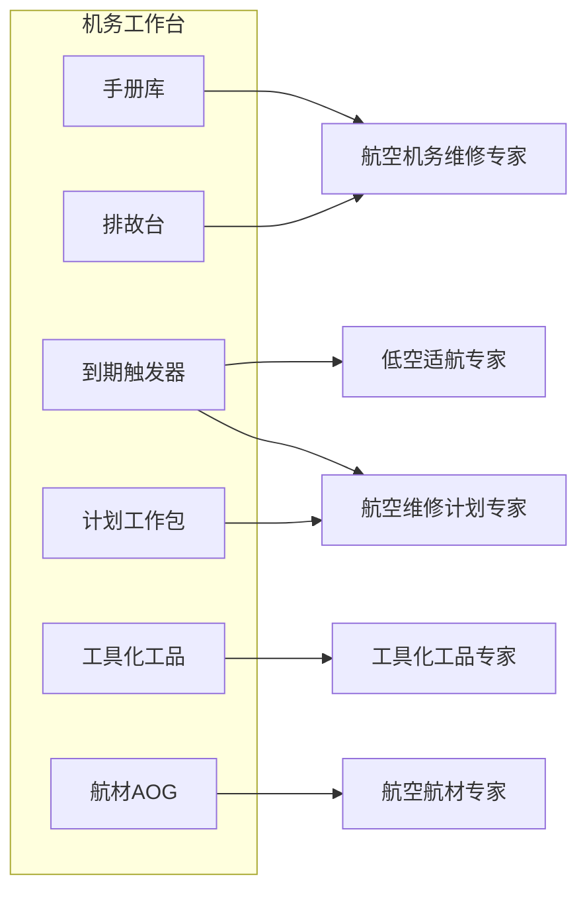

# 四专家机务扩展 · 完整可落地 PRD

日期：2026-09-04  
状态：已批准（对照材料吸收领域能力，拒绝独立平台骨架）  
产品：月汐（Lunitide）Go Engine + React WebView2 + SQLite  
对照材料：`E:\Trae-Work-Projects\6a98d3fa7a8ef5e90be71192\three-expert-agents`（v2.0 三专家卷）与 `four-expert-agents`（计划域增补卷）  
既有规格：[2026-09-03-mro-expert-and-expert-foundation-design.md](2026-09-03-mro-expert-and-expert-foundation-design.md)  
实施计划：[2026-09-04-four-ops-experts.md](../plans/2026-09-04-four-ops-experts.md)

本文件是四张运营同事卡 + 机务工作台轨扩展的产品与技术基础事实源。沿用 2026-09-03 已冻结的原则：**要材料里的能力，不要材料里的骨架。**

---

## 0. 材料总评：合不合理、要不要改

**结论：领域切分与若干机制值得吸收；技术骨架与交付形态必须重写。** 两份 HTML 是「独立机务 SaaS 蓝图」，不是月汐增量规格。

### 0.1 合理、应吸收

- 四条垂直链（低空适航履历 → 现场工具/化工品 → 航材供应 → 维修计划）互补，不是原 v1 六情景（手册/排故/视觉/预测/工单/培训）的重复。六情景继续挂在 `mro-expert` 上，不当四张新卡。
- 确定性引擎 + LLM 只解释：到期/校准/货架期/库存数字禁止模型编造。
- 写操作人审；单据模板填充（件号/数量/价格不经 LLM）。
- 化学品母/子批次 → 机尾追溯；校准过期拒绝借出；替代件须认证 × 构型 × 库存同时满足。
- 计划侧：到期引擎与低空触发器共享实现；间隔调整永不自动生效；必须双源引用（MPD/AMP 条款 + 本队数据）。
- 协同故事：质量通报串查、计划发布触发套件备妥与长周期件备料——在月汐里用会商 + 结构化事件，不用 LangGraph 子图。

### 0.2 不合理、必须否决（改进点）

- **独立四产品 / 四仪表盘 / LangGraph 子图 / WingFix / PostgreSQL+Qdrant+Neo4j+Redis**：与 ADR-001 和已落地机务规格冲突。月汐内核永远 SQLite；外部库只走现有数据源中心只读。
- **`sign_rts` / RII 双签放行**：与「所有输出是辅助建议，不构成放行」冲突。月汐只出 PIREP/RTS **草稿** 与检查单，签字权不进产品。
- **飞控 API ETL、邮件 AOG 管线、供应商发信、frePPLe/PuLP、NL→SQL、AMOShub 适配器**：P0/P1 不做。到期数字先手录或 CSV 导入；AOG 先结构化草稿；排程 P1 用手排 + 硬约束检查，P2 再考虑本机启发式，永不把商业 AMOS「42% 停机减少」写成验收指标。
- **十专家矩阵**：材料把 v1 六角色也算专家卡，会把专家中心做成岗位花名册。月汐保持：`航空机务维修专家` 一张卡 + 六情景；本 PRD 只新增四张 **领域** 同事卡。
- **人设复用错误**：低空卡不应整份拷贝 `aircraft-maintenance-engineer`（运输航空 AME）。应新做 CCAR-92 人设；计划卡新做计划员人设，禁止输出间隔数字除非来自 `interval_rules`。
- **工作台形态**：材料要四套独立 UI。用户要求 1 是「在现有机务工作台里加能力」——只扩展 [web/src/mro/MroWorkbenchPage.tsx](../../../web/src/mro/MroWorkbenchPage.tsx) 的轨，不新开四个 page。

### 0.3 相对 2026-09-03 规格的一条产品修订

原冻结第 4 条：「专家中心只增加一张 `mro-expert`」。本 PRD **修订为**：手册问答/排故/识件/工单/培训仍是 `mro-expert` 的情景卡；**低空 / 工具化工品 / 航材 / 维修计划** 因知识边界、责任边界、会商角色都不同，升为与 PPT/产品/开发同级的四张同事专家卡。这不是把六情景拆成六张卡。

2026-09-03 规格第 4 条其余冻结（SQLite 内核、不做放行、向量默认关、UI 令牌）仍然有效。

---

## 1. 目标与非目标

### 1.1 目标（用户三条原话落地）

1. 现有机务工作台增加：到期/触发器、工具与化工品台账、航材/AOG 草稿、计划/工作包。与机尾上下文、手册库、排故台、检查单、数据源、审计共用一页。
2. 专家中心出现四张 builtin 同事卡，行为对齐 PPT/产品/开发：打开对话、`@引用`、会商（最多 8、并行 3）、共同 `docx.gen`/`excel.gen`/`pptx.gen`，综合器不得丢掉引用块。
3. 每张卡走同一专家底座：独立 KB collection（`scope=expert:{id}`）、图谱切片、带 `expertId` 的记忆、成长路径、「知识/路径」页签、`kb.search` + 引用门、写动作人审。市场人设卡仍不建空库。

### 1.2 非目标

- 不做适航放行、执照、签派、AMOS/TRAX 直写。
- 不新增守护进程，不引入 Python 求解器/邮件机器人作为生产依赖。
- 不训练预测模型；不用合成数据宣传准确率。
- 不把 OEM 手册默认送到无「零保留/不训练」条款的公有云。
- 不把四专家做成独立安装包或独立 page。

### 1.3 成功标准（可演示）

- 专家中心能打开四张新卡，用法与「开发专家」一致；builtin 不可归档。
- 「问月汐」可按当前工作台轨挂载对应专家（手册/排故仍挂 `mro-expert`；到期/低空挂低空卡；工具轨挂工具卡；航材轨挂航材卡；计划轨挂计划卡）。
- 法规/SDS/MPD/IPC 问答：关键句 100% 带引用；无依据则「未找到受控依据」。
- 会商：机务修专家出手册依据，航材出库存/替代（或「未绑定库存」），计划出到期/窗口草稿，产品经理出流程，综合稿保留全部 cite。
- 校准过期工具不能登记借出；间隔调整只能生成审批草稿，`interval_rules` 不自动改。

---

## 2. 领域切分（防止和机务维修专家抢活）

- **航空机务维修专家 `mro-expert`**：运输航空/通航有人机。AMM/IPC/TSM/FIM/MEL/SB/AD。排故隔离、检查单、培训题。不管工具借还、采购单、机队排程、CCAR-92 运行分类。
- **低空适航专家**：无人机/eVTOL。CCAR-92 / CCAR-21-R5 / AP-21-71 / 持续适航文件。部件履历（履历跟件不跟机）、五类触发器解释、PIREP 草稿、运行分类判定。不写运输航空 AMM 排故，不签 RTS。
- **工具化工品专家**：工具档案/借还/校准门；化学品批次与 SDS；套件备妥清单。不答 AMM 隔离步骤，不创建采购订单。
- **航空航材专家**：库存只读（数据源或本机台账）、替代件三重过滤、AOG 案件草稿、PO/询价 **模板草稿**。不排程、不借工具。
- **航空维修计划专家**：到期全景、工作包四源组装草稿、手排窗口 + 硬约束检查、对话问数（受控查询不是 NL→SQL）、间隔复审 **草案**。不执行维修、不放行。

会商纪律（写入各卡 `rules`）：

- 机务修：事实与手册引用。
- 低空：法规条款 + 履历/触发器状态。
- 工具：校准/货架期/套件缺件。
- 航材：库存/替代/交期草稿。
- 计划：到期数字与窗口，数字只来自引擎表。
- 产品/开发/PPT：不改技术结论与引用块。

---

## 3. 专家中心合同（与 PPT/开发同一套）

### 3.1 目录字段（写入 `conversation_experts.json` + `conversationExperts.ts`）

四张卡共用：`category=行业运营`，`division=operations`，`origin=lunitide`，`usage=both`，`kind=agent`，`version=1.0.0`。

| id | 显示名 | scene | preferredSkills | requiredTools | 意图别名 |
|---|---|---|---|---|---|
| `uas-airworthiness-expert` | 低空适航专家 | 低空适航 | `uas-airworthiness-advisor`, `mro-manual-rag` | `kb.search`, `graph.expand`, `workspace.write`, `docx.gen`, `excel.gen`, `todo.write` | 低空、无人机、eVTOL、适航证、CCAR-92、实名登记 |
| `tooling-chemical-expert` | 航空工具化工品专家（ByName 短名：工具化工品专家） | 工具化工品 | `tooling-chemical-advisor` | `kb.search`, `graph.expand`, `workspace.write`, `excel.gen`, `todo.write` | 扭矩扳手、校准、SDS、密封剂、货架期、套件备妥 |
| `parts-expert` | 航空航材专家 | 航材供应 | `parts-supply-advisor` | 上表 + `datasource.query` | 航材、AOG、替代件、8130、库存、采购 |
| `mx-planning-expert` | 航空维修计划专家 | 维修计划 | `mx-planning-advisor` | `kb.search`, `workspace.write`, `excel.gen`, `docx.gen`, `todo.write` | 维修计划、定检窗口、C检、工作包、MPD、MSG-3 |

`ConversationExpertByName` 与前端 `conversationExpertByNameOrID` 必须认显示名 + 短名 + id。`intentEquipMaxNames=2` 保持：例如「C 检缺密封剂」可同时装备计划 + 工具，不一次装备四张。`mro-expert` 继续认「机务 / 维修手册 / amm / 飞机维修」，新卡不得抢走这些别名。

### 3.2 六段文案纪律

每张卡 `sixSection` 必须含：

- identity 固定句式：「你是同事专家（同一月汐引擎，不是独立进程）：{姓名}。」禁止「独立智能体 / LangGraph / 子图」。
- 适航边界：「辅助建议，不构成放行 / 不构成局方批准 / 不构成采购承诺」。
- 引用强制：无依据不得给出确定件号、间隔、扭矩、库存、到期日。
- 会商边界：只答本域，转交其他专家而不是越权编造。
- workflow 强制：先问上下文（机尾/日期/件号/批次/窗口）→ 检索本专家 KB → 读本机台账/引擎 → cite → 草稿 → 写动作等人审。
- deliverable 文首必须出现辅助建议声明。

冻结身份摘要：

**低空适航专家**  
你是同事专家（同一月汐引擎，不是独立进程）：低空适航专家。无人机/eVTOL 机队的适航检索与履历顾问，不是放行人或局方审定代理。依据 CCAR-92 / CCAR-21-R5 / AP-21-71 / 用户导入的持续适航文件与已确认部件履历回答。产品强制：先问清机型/登记号/运行分类与日期，再检索，再引用，再给建议。禁止签发 RTS。

**航空工具化工品专家**  
你是同事专家（同一月汐引擎，不是独立进程）：航空工具化工品专家。工具、化学品、套件的台账与工艺顾问，不是库房系统管理员。依据 SDS/工艺规范/校准记录与本机台账回答「能不能用、在谁手上、何时过期」。校准过期禁止建议借出。发放/借还只生成待确认草稿。

**航空航材专家**  
你是同事专家（同一月汐引擎，不是独立进程）：航空航材专家。库存与供应顾问，不是采购签字人。库存数字只来自已探测数据源或本机台账；替代件必须同时满足认证有效、适用当前构型、库存可用，否则降级为询价建议。PO/报价用模板填充，禁止 LLM 填写件号数量价格。

**航空维修计划专家**  
你是同事专家（同一月汐引擎，不是独立进程）：航空维修计划专家。机队计划检索与窗口顾问，不是生产控制批准人。到期日、间隔、可用架数只来自到期引擎与 `interval_rules`。禁止凭记忆报 A/C/D 检间隔。排程方案与间隔调整只出草稿，发布与生效必须人审。

### 3.3 情景卡（每专家 3 张，不是新专家）

沿用 `EnsureMROScenarios` 模式，新增 `EnsureOpsExpertScenarios`：

- 低空：法规问答（RESEARCH_EVIDENCE）；履历与触发器（OPERATIONS_RETROSPECTIVE）；PIREP 草稿（OPERATIONS_RETROSPECTIVE）
- 工具：工艺/SDS 问答；校准与借还；套件备妥
- 航材：库存与适用性；AOG 草稿；采购模板草稿
- 计划：到期全景；工作包组装；间隔复审草案

### 3.4 专家中心 UX（不新造交互）

沿用现有：打开同事、在当前会话使用、`@姓名`、会商勾选、知识/路径页签、「交给当前专家」摄入。工作台「问月汐」扩展为按轨选默认专家，允许用户改挂载。四卡均 `builtin` 不可归档，与 `mro-expert` 相同。

五张运营卡（含 `mro-expert`）在专家中心详情都显示「打开工作台」，并带入对应 `initialRail`（机务修→手册；低空/计划→到期；工具→工具；航材→航材）。侧栏仍只有一个 `page='mro'`。

---

## 4. 机务工作台扩展（一条页面，多轨）

现有轨：`manuals` | `fault` | more（checklist / fleet / datasource / audit）。  
新增轨进 **more 抽屉**（不把顶栏做成六平级 Tab）：

- `due` 到期与触发器：按机尾列出 CAL/FH/FC/BC/LLP 与 A/B/C/D/AD/MEL 倒计时；手录利用率；CSV 导入飞行小时；超限标红。问月汐 → 低空或计划（有人机默认计划，UAS 机型默认低空）。
- `tools` 工具化工品：工具表（号/SN/位置/借用人/校准到期/状态）；化学品批次（母/子、数量、有效期、SDS 文档）；套件内容与缺件比对。问月汐 → 工具卡。
- `parts` 航材：本机件号台账或数据源库存映射；替代件表；AOG 案件列表（草稿）。问月汐 → 航材卡。
- `plan` 计划：间隔规则表；工作包草稿；窗口指派表（机尾×检查×起止）；硬约束检查结果。问月汐 → 计划卡。

UI 约束：只用现有 CSS 令牌；不引入 Arco/shadcn。

「问月汐」继续走 `MroAskButton` / `openMroChat`，入参增加按轨解析的专家 ULID 与轨上下文（toolId / lot / pn / window）。`mroContext.scenario` 扩展为 `manual | fault | checklist | due | tools | parts | plan`。

---

## 5. 底座对齐（四本账 + 引用门）

每张新同事卡 bootstrap 时与 `mro-expert` 一样：

- KB：`kb_collections.scope_id = expert:{expertId}`。低空默认文档类型 CCAR/AC/持续适航/飞手手册；工具默认 SDS/校准规范/工艺；航材默认 IPC/CMM/8130 说明/供应商目录（用户导入）；计划默认 MPD/AMP/MRB。
- 图谱：新种类进 `mro.v1` 扩展，非法 payload 进确认队列。
- 记忆 key：`expert:{id}:last|canon|gaps`。
- 成长路径一行。
- 检索：挂载谁只搜谁的集合 ∪ 会话附件 ∪ 工作台当前机尾过滤。
- 引用块沿用 `{expertId, docId, revision, locator, quote}`；工作台检查单导出必须带 expertName。
- 向量检索默认关。

摄入：复用 `expert.knowledge.ingest` + `document.parse`。法规/SDS/MPD 与 AMM 同一套未受控确认门。P0 不把同一本手册广播到四本 KB；摄入进**当前打开**的专家。

### 5.1 引用门与工作台识别必须一次泛化

今日这些判断硬编码 `mro-expert` / `航空机务维修专家` / `航空机务专家`。四张新卡若不泛化，会看起来像 PPT 专家（无引用门、无工作台入口）：

- `isMROColleague`（`internal/app/chat_kb_inject.go`）
- `turnHasMROName` / `GateMROAnswer` / `<!--mro-cite:...-->`（`internal/app/chat_citation_gate.go`）
- `RestoreCouncilCitations`（会商综合稿必须保留 cite）
- 前端 `isEnabledMroExpert` / `isMroColleague` / `openMroChat` 只认一张卡

实施必须新增 `m8app.IsOpsColleague(name, catalogID)`，覆盖五张运营卡的 id + 显示名 + 短名（含 `航空机务专家`、`工具化工品专家`）。前端镜像为 `isOpsColleague` / `OPS_COLLEAGUE_IDS`。侧栏「机务工作台」在五张卡任一启用时可见。问月汐按轨挂载对应 ULID，不再写死 `mro-expert`。

---

## 6. 数据与动作（SQLite，Agent 只见 Actions）

迁移从当前 store 清单连续编号：**0118**（0117 已是数据源绑定）。领域表在同一产品库，不新开 PG。

### 6.1 共享

- `mro_due_items`：scope（aircraftId 或 componentId）、kind（CAL/FH/FC/BC/LLP/CHECK/AD/MEL）、limit_value、used_value、due_at、source、updated_at
- `mro_utilization_events`：手录或 CSV：hours/cycles/battery_cycles，写入后重算 due
- 到期引擎（Go 纯函数，低空与计划共享）：`used/limit` 与 `due_date-today`；无数据标 `missing`，禁止估算，缺利用率显示「未录入」不是 0

### 6.2 低空

- `mro_components`：sn、pn、life 计数
- `mro_life_events`：install/remove/transfer/repair/scrap + 时间窗（履历跟件）
- `mro_pirep_drafts`：结构化草稿，人确认后才转缺陷记录

Actions：`genealogy_query`、`trigger_status`、`reg_qa`（= kb.search 法规集合）、`file_pirep`（写草稿+人审）、`record_life_event`（人审）。**无 `sign_rts`。** 无飞控同步 P0/P1。

### 6.3 工具化工品

- `mro_tools`、`mro_tool_loans`、`mro_chem_lots`（parent_lot_id）、`mro_chem_uses`、`mro_kits`、`mro_kit_items`
- 校准硬门：`checkout_tool` 若 `calib_due < today` 拒绝
- `issue_chemical`：人审后拆子批次，写使用记录（wo/tail/tech）

Actions：`tool_status`、`checkout_tool`/`return_tool`、`lot_query`、`issue_chemical`、`kit_staging`、`expiry_report`、`sds_query`。扫码识别 P2。

### 6.4 航材

- `mro_parts_stock`（本机台账）或复用数据源 `query_stock`
- `mro_alternates`：pn_from/pn_to + cert_ok + effectivity
- `mro_aog_cases`、`mro_po_drafts`（模板字段，非 LLM 自由文本当正式单）

Actions：`check_stock`、`find_alternates`（三重过滤）、`aog_intake`（从用户粘贴文本抽字段，一击确认）、`create_po_draft`/`create_quote_draft`（模板）。不发真邮件。周转件池/关键路径算法 P2 用 Go 实现简化版，不嵌 Python。

### 6.5 计划

- `mro_interval_rules`（task_key、interval、unit、version、effective_from、source_cite）
- `mro_task_card_templates`、`mro_work_packages`、`mro_wp_tasks`
- `mro_schedule_assignments`、`mro_capacity_slots`（机位/技能组工时，手录）
- `mro_interval_change_drafts`

Actions：`due_forecast`、`build_work_package`（四源：标准卡+AD/SB due+MEL 时限+未关闭项）、`capacity_check`、`schedule_propose`（P1：用户指定窗口，引擎只做 C1–C7 **检查** 并列出违反项；P2：本机启发式错峰，仍人审发布）、`publish_schedule`（人审后写事件，工作台套件/航材轨出现待办）、`propose_interval_change`（强制双源引用）、`fleet_availability_update`（AOG/停场标记，供约束）。  
**无 `bi_query` NL→SQL。** P1 用固定报表：到期清单、工作包工时、航材草稿金额（若有）。P2 可加白名单参数化查询，仍不是任意 SQL。

### 6.6 本体包增量

在 `mro.v1.json` 增加 kinds：`LifeEvent`、`TriggerRule`、`Tool`、`ChemicalLot`、`Kit`、`Alternate`、`AOGCase`、`IntervalRule`、`WorkPackage`、`Schedule`。  
links：`INSTALLED_ON`、`PARENT_LOT`、`USED_ON`、`ALTERNATE_OF`、`DUE_FOR`、`PACKED_IN`。  
actions 与上表 mode/auth 对齐。不重写 `graph_nodes.node_type` CHECK。

### 6.7 工作台待办（P2）

- `mro_ops_todos`：`publish_schedule` 与质量通报串查产生的 `kit_staging` / `parts_request` / `due_recompute` 待办。不自动写生产库。

---

## 7. 协同（会商，不是编排器）

不实现 LangGraph 路由。三种产品机制：

1. **用户会商**：专家中心多选四卡 + 机务修 + 产品/开发，综合器按 cite 保留。
2. **工作台事件**：`publish_schedule` 后在 tools/parts 轨生成 `kit_staging` / `parts_request` 待办；质量通报在 tools 轨一键「串查」打开会商并预填批次号。
3. **自动装备**：意图别名命中 1–2 张卡，发已有 `EventEquip` chip。

质量通报黄金路径（P2 验收）：工具卡出机尾清单（cite 批次使用记录）→ 低空或机务修评估适航影响（cite 法规/手册）→ 航材冻结草稿 + 询价模板 → 计划重算受影响窗口（cite due 引擎）。全程无自动写生产库。

---

## 8. 功能需求清单（开发验收用）

### 工作流 F · 四张专家卡

- FR-F1 目录 14→18 张同事卡；测试 `CONVERSATION_EXPERTS.length` 与 Go catalog 同步。
- FR-F2 四卡 builtin、可打开、可 `@`、可会商、可出 docx/xlsx。
- FR-F3 六段含边界与引用强制；身份不含独立进程。
- FR-F4 每卡 3 情景种子幂等。
- FR-F5 每卡 bundled SKILL.md（四份新人设，不复用 AME 原文到低空/计划）。
- FR-F6 `MergeExpertSkillKeys` 给已装机合并新技能键。
- FR-F7 意图别名 + 释义句守卫仍生效（「CCAR-92 是什么意思」不装备）。

### 工作流 G · 工作台新轨

- FR-G1 `due/tools/parts/plan` 空态：无数据时说明先导入/手录，并提供问月汐。
- FR-G2 到期表与引擎数字一致；缺利用率显示「未录入」不是 0。
- FR-G3 校准过期借出按钮 disabled + 原因。
- FR-G4 批次追溯：lot → 子批 → 使用记录 → 机尾。
- FR-G5 套件备妥：模板需求 vs 套件内容 → 缺件列表，可转航材待办。
- FR-G6 AOG 草稿一击确认字段；PO 草稿字段来自台账。
- FR-G7 工作包四源可见；发布需确认框。
- FR-G8 审计轨能回放新写动作。

### 工作流 H · 底座与合规

- FR-H1 四卡自动建 KB/图谱/记忆/路径。
- FR-H2 法规/SDS/MPD 摄入走未受控门。
- FR-H3 文首辅助建议声明。
- FR-H4 写 Actions 人审文案与记忆确认一致。
- FR-H5 间隔草案缺 MPD cite 或本队数据则拒绝生成。

---

## 9. 分期与验收

**P0（约 5–7 人日）——四卡可对话，与开发专家同级**  
目录 + 前端镜像 + 四份 SKILL + 情景种子 + 意图别名 + §5.1 引用门/工作台泛化 + 工作台问月汐按轨挂载 + 每专家黄金问答（法规/SDS/IPC/MPD 引用纪律写入六段与 SKILL）。  
验收：专家中心打开四卡；与产品经理会商出稿 cite 仍在；`go test` / 相关 vitest / `verify:bridge` 绿。

**P1（约 8–12 人日）——本机台账 + 确定性引擎 + 工作台轨**  
§6 表 + 到期引擎 + 校准门 + 批次谱系 + 库存/替代只读 + 工作包组装 + 窗口约束 **检查** + 固定报表。  
验收：换机尾 due 变化；过期工具借出失败测试；lot→机尾查询测试；无数据源时航材诚实降级。

**P2**  
会商串查待办、`publish_schedule` 联动、AOG 粘贴抽取、简化错峰启发式、参数化问数、图谱多跳履历。

**D5 / 不做**  
RTS 签字、真邮件、飞控 ETL、frePPLe、NL→SQL、AMOS 适配、预测模型。

---

## 10. 将改文件

- 目录与六段：`internal/m8app/catalog/conversation_experts.json`、`conversation_catalog.go`、`conversation_compose.go`、`conversation_experts_test.go`
- 前端镜像与中心：`web/src/expert/conversationExperts.ts` 及测试、`ExpertCenterPage.tsx`、`expertIds.ts`、`App.tsx`
- Bootstrap 情景：`ops_scenarios.go` + `cmd/engine/main.go`
- 技能：`internal/skillapp/bundled/` 四目录 SKILL.md + `catalog.go`
- 本体：`ontologypacks/mro.v1.json`
- 存储：`migrations/0118_mro_ops_ledgers.sql` + `store.go` + `mro_ops.go`
- 领域服务：`internal/mroapp/` due/tools/parts/plan/collab
- Bridge：`mro.due.*` / `mro.tool.*` / `mro.lot.*` / `mro.kit.staging` / `mro.parts.*` / `mro.plan.*`（与现有 `mro.*` 对齐）→ `generate:bridge`
- 工作台：`MroWorkbenchPage.tsx`、`MroAskButton.tsx`、`mroContext.ts`
- 规格落盘：本文件；计划 → `docs/superpowers/plans/2026-09-04-four-ops-experts.md`

测试纪律：先红后绿；catalog 长度、ByName 别名、校准硬门、due 缺数据、引用门、会商 cite、bridge `--check`。

---

## 11. 风险

- 四卡 + 机务修同时装备导致提示过长：保持最多 2 张自动装备，其余用户会商勾选。
- 台账变成「第二套 MRO」：P1 只做本机草稿/台账，文案写明不替代 AMOS；数据源仍只读。
- 低空与机务修抢答「能不能飞」：按机型家族分流（UAS/eVTOL → 低空；有人机 → 机务修）；都不确定则先问。
- 手册版权 × 公有云 LLM：沿用现有出站警告。
- 材料里的商业数字不可写入发布说明当效果承诺。
