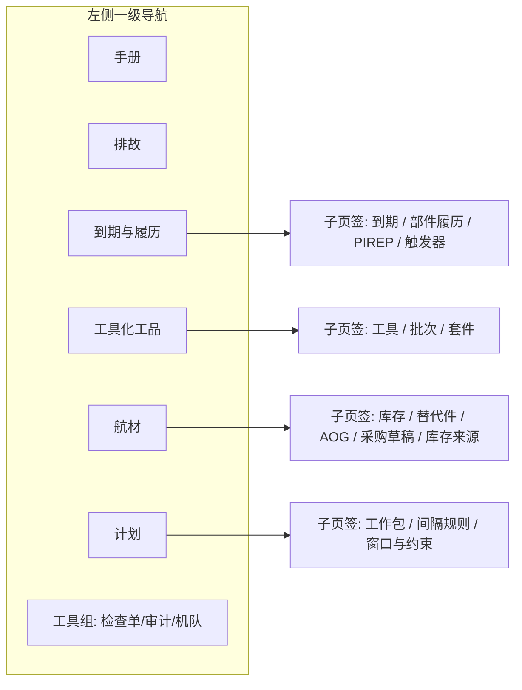
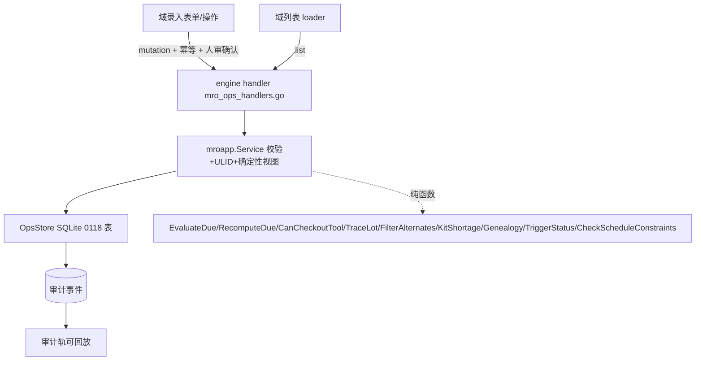

# 四专家机务工作台 · 复盘与 UI/后台落地 PRD

日期：2026-09-04
状态：已批准（复盘已落地的四专家机务扩展，补齐可用性闭环 + UI 重构）
产品：月汐（Lunitide）Go Engine + React WebView2 + SQLite
前序规格：[2026-09-04-four-ops-experts-prd.md](2026-09-04-four-ops-experts-prd.md)、[2026-09-03-mro-expert-and-expert-foundation-design.md](2026-09-03-mro-expert-and-expert-foundation-design.md)
实施计划：[2026-09-04-four-ops-workbench-ui.md](../plans/2026-09-04-four-ops-workbench-ui.md)

本文件是"四专家机务工作台"复盘后的产品与技术事实源。沿用冻结原则：**要能力，不要独立平台骨架；内核永远 SQLite；所有机务输出是辅助建议，不构成放行。**

---

## 0. 复盘：已落地版本的问题 / 隐患 / 漏洞

上一期（four-ops-experts）交付了四张运营同事卡 + 六域只读工作台 + 确定性引擎 + 会商联动，`go test` / vitest / `verify:bridge` 全绿。但把它当"能日常使用的机务工作台"来验收，暴露以下问题：

### 0.1 致命：工作台无法从产品内录入数据

- Bridge 只暴露 4 个写方法：`mro.aircraft.upsert` / `mro.manual.register` / `mro.tool.checkout` / `mro.plan.publish`。其余全是只读 list。
- 而 [internal/mroapp/ops_service.go](../../../internal/mroapp/ops_service.go) 已实现 `UpsertDueItem` / `UpsertTool` / `UpsertChemLot` / `InsertChemUse` / `UpsertKit` / `UpsertPartsStock` / `UpsertAlternate` / `BuildWorkPackage` / `ProposeIntervalChangeDraft` / `BulletinChain`——却没有 bridge 方法、没有 UI 表单调用它们。
- 结果：每个域的空态（"先手录利用率 / 工具号 / 批次 / 工作包"）都是死路，用户无法把任何数据放进台账，确定性引擎无米下锅。

### 0.2 孤儿表

[migrations/0118_mro_ops_ledgers.sql](../../../migrations/0118_mro_ops_ledgers.sql) 建了但 `OpsStore` 完全没有读写方法的表：

- `mro_components`、`mro_life_events`（低空部件履历）
- `mro_pirep_drafts`（PIREP）
- `mro_po_drafts`（采购草稿）
- `mro_utilization_events`（利用率，本应驱动到期重算）
- `mro_task_card_templates`、`mro_wp_tasks`（工作包任务分解）

### 0.3 低空专家无工作台落点

低空适航专家（`uas-airworthiness-expert`）拿了卡、有 SKILL、能会商，但它要"引用的确定性引擎"——部件履历（履历跟件）、五类触发器、PIREP 草稿（PRD §6.2）——**完全没有实现**。它唯一的轨 `due` 与计划共享，且无法录入数据。

### 0.4 死代码能力

- `ParseAOGPaste` 有纯函数与测试，但无落库路径（`mro_aog_cases` 仅被 `ListAOGTails` 读）。`aog_intake` 端到端未实现。
- `mro_po_drafts` 无任何读写。`create_po_draft` 未实现。
- 利用率→到期重算（§6.1"写入后重算 due"）不存在：`EvaluateDue` 只在读时从 `mro_due_items` 计算。

### 0.5 审计只覆盖 KB

`mro.audit.list` 走 `e.m8kb.ListRecentKBAudit`（[internal/app/mro_handlers.go](../../../internal/app/mro_handlers.go)）。台账写动作（借出/到期/航材/发布）不会进审计轨——FR-G8"审计轨能回放新写动作"只满足手册摄入这一半。

### 0.6 信息架构失衡

due / tools / parts / plan 四个"拿到专家卡"的域，被埋进"更多"内联抽屉（连同 checklist / fleet / datasource / audit 共 8 项）。只有手册 / 排故是一级。四张卡在 UI 里是二等公民。

### 0.7 无样式 / 不精致

- `.mro-ops-rail`、`.mro-datasource`、`.mro-import-preview`、`.mro-import-hint` 在 [web/src/styles.css](../../../web/src/styles.css) 无任何规则。
- 航材轨用裸 `
` 行渲染；批次追溯用 `<ul>`；套件用 `
`。
- 无详情面板；context bar 的机尾/日期不过滤 due/tools/parts/plan；无 loading/error 态；超期红标（`--err` 令牌）闲置未用。

### 0.8 功能 bug

- 质量通报串查按钮恒用 `lotRows[0]`（硬编码首个批次）。
- 套件"转航材待办"只写本地 React state（`id: kit-${kit.id}`），刷新即失，从不落库。
- `CheckScheduleConstraints` 调用方 `CheckConstraints` 有死代码：`hasCite := true; if len(rules)==0 { hasCite = true }`。

---

## 1. 需求再定义（深度分析）

用户要把"四张专家卡 + 六域能力"变成**真正能日常录入、追溯、协同的机务工作台**，界面美观简约、UI 与后台关系清晰。两条主线：

1. **可用性闭环**：每个域从"空态 → 录入 → 计算 → 追溯 → 人审写动作 → 审计可回放"完整跑通。确定性数字只来自引擎与台账，LLM 从不填件号/数量/价格/间隔。
2. **信息架构与视觉**：六域升为一级左导航；统一"域头 + 子页签 + 列表/详情 + 录入对话框 + 状态徽章"范式；只用现有 Moon&Tide 令牌与 `Dialog`/`usePanelResize`，零新依赖。

### 1.1 非目标（沿用冻结边界）

- 不做 RTS 签字、真邮件、飞控 ETL、frePPLe/PuLP、NL→SQL、AMOS/TRAX 直写、预测模型。
- 顶栏虽升为六域，仍不做求解器/自动放行；排程只做 C1–C7 检查并列违反项。
- 不新增守护进程、不引入外部数据库；外部库仅走现有数据源中心只读。

### 1.2 成功标准（可演示）

- 打开工作台，六域是一级导航；每域空态的主按钮直接打开录入表单。
- 录入到期项 + 利用率 → 到期表数字随之重算；缺利用率显示"未录入"而非 0。
- 校准过期工具借出按钮 disabled 且给出原因；登记/归还可用。
- 批次发放拆子批次并写使用记录；按 SN 谱系可追溯到机尾。
- 航材可录库存/替代件；AOG 粘贴一击入案；PO 出模板草稿。
- 计划可组装工作包（四源）、发布出跨轨待办、间隔缺双源引用则拒绝。
- 低空部件履历/触发器/PIREP 可用。
- 审计轨能回放上述新写动作。

---

## 2. 目标信息架构

- 顶部保留 `mro-context-bar`（机尾 / 日期 / 手册 + 问月汐），并让**机尾/日期真正过滤** due/tools/parts/plan 的 scope。
- 数据源绑定表单并入 航材→库存来源子页签；checklist / audit / fleet 收进"工具组"次级分区。
- 左导航激活态用 `--tide1` 内嵌强调条（借 `org-nav button.on` 观感）。

---

## 3. 设计语言（只复用现有令牌/组件）

- 壳层 `skill-center mro-workbench-page` + `view-title`；主按钮 `button.primary`；对话框 `ui/Dialog` 的 `Dialog`/`ConfirmDialog` + `.dialog-actions`。
- 列表/详情双栏复用 `usePanelResize` + `.split-resizer`（同专家中心 `skill-center-layout`）。
- 子页签复用 `skill-status-tabs` 分段观感。
- 表格扩展 `.mro-manual-table`；新增徽章 `.mro-badge.is-ok/.is-warn/.is-err` 映射 `--ok/--warn/--err`。
- 新增/补齐 CSS：`.mro-ops-rail`、`.mro-domain`、`.mro-domain-head`、`.mro-subtabs`、`.mro-split`、`.mro-badge*`、`.mro-datasource`、`.mro-import-preview`、`.mro-import-hint`。
- 所有新文案 zh/en 成对（`useZh()`），沿用测试范式 `<LanguageProvider>`。

---

## 4. 各域 UI 设计（列表 / 状态 / 录入 / 徽章）

统一范式：`域头(标题 + 计数 pill + 主操作) → 可选子页签 → 列表 或 (列表 | 详情) 双栏`。空态 `mro-empty` 的主按钮直接打开录入表单（不再是死句子）。每域含 loading(`role=status`) / error(`role=alert`)。

### 4.1 到期与履历

- **到期**：表 种类 | 范围 | 已用 | 限制 | 到期日 | 剩余 | 状态(徽章)。缺利用率显示 `未录入`(warn)，绝不为 0。操作：`录入到期项`(scope/kind/limit/due_at/source)、`录入利用率`(hours/cycles/battery + CSV 粘贴) → 重算。
- **部件履历**（低空）：部件列表(SN/PN/life) + 履历时间线；`登记部件`、`记录履历事件`(install/remove/transfer/repair/scrap)；按 SN 谱系追溯。
- **PIREP**：草稿列表(机尾/状态)；`生成 PIREP 草稿`(结构化)；`确认→转缺陷` / `驳回`。
- **触发器**：五类触发器状态(登记到期 / LLP 剩余 / AD 到期 / 电池循环 / 日历)徽章，只读、引用法规。

### 4.2 工具化工品（子页签 工具 / 批次 / 套件）

- **工具**：表 工具号 | SN | 位置 | 借用人 | 校准到期 | 状态；`借出`(校准过期 disabled + title 原因)、`归还`；`登记工具`。
- **批次**：母/子树，数量 / 有效期 / SDS；`登记批次`、`发放`(拆子批次 + 使用记录 wo/tail/tech)；有效期徽章。
- **套件**：模板需求 vs 在库 → 缺件列表；`定义套件`(含条目)；`转航材待办`(落库)；每批次 `质量通报串查`(修复硬编码)。

### 4.3 航材（子页签 库存 / 替代件 / AOG / 采购草稿 / 库存来源）

- **库存**：表 PN | 数量 | 来源；`录入库存`；数据源绑定行只读、来源标 datasource。
- **替代件**：pnFrom→pnTo + 认证 / 构型 / 数量；通过 vs `降级询价`徽章；`登记替代件`。
- **AOG**：粘贴 → `ParseAOGPaste` 预览 → `一击确认` 落 `mro_aog_cases`；案件列表带状态。
- **采购草稿**：由库存/AOG 生成 PO 草稿(PN/数量/价格模板字段，非 LLM 自由文本)；列表 + 确认/驳回。
- **库存来源**：迁入现有数据源绑定表单。

### 4.4 计划（子页签 工作包 / 间隔规则 / 窗口与约束）

- **工作包**：列表 标题 + 四源 chips + 工时；`组装工作包`(选 标准卡 / AD-SB / MEL / 未关闭 → 写 `mro_wp_tasks`)；`发布`(确认框) → 套件/航材待办跨轨出现。
- **间隔规则**：表 task_key | 间隔 | 单位 | 版本 | source_cite(缺引用 warn 徽章)；`间隔复审草案`(强制双源，缺则拒绝)。
- **窗口与约束**：录入机位工时(`capacity_slots`) 与窗口指派(`schedule_assignments`)；`运行约束检查` → C1–C7 违反项带徽章。

---

## 5. 后台逻辑关联（数据流 + 边界）

- **确定性边界**：到期 / 校准 / 库存 / 间隔 / 触发器数字只来自引擎与台账，LLM 从不填件号/数量/价格/间隔。
- **人审**：所有写方法要求 `requireIdempotency` + 前端确认；发放 / 借还 / 发布 / PIREP / 间隔均出草稿或需确认。
- **审计**：新增 MRO 台账写动作要落审计并在审计轨可见（当前 `mro.audit.list` 仅 KB，需扩为 KB ∪ MRO ops 审计）。
- **引用门**：会商 / 回答沿用现有 `IsOpsColleague` cite 门，综合稿保留 cite 块。

---

## 6. 后端补全清单（无新迁移；0118 表已够）

### 6.1 OpsStore 新方法

`InsertUtilizationEvent` / `ListUtilizationEvents`；`CloseToolLoan`(归还)；`InsertAOGCase` / `ListAOGCases` / `UpdateAOGState`；`UpsertPODraft` / `ListPODrafts` / `UpdatePOState`；`UpsertIntervalRule`；`UpsertScheduleAssignment`；`UpsertCapacitySlot`；`UpsertTaskCardTemplate` / `ListTaskCardTemplates`；`InsertWPTask` / `ListWPTasks`；`UpsertComponent` / `ListComponents`；`InsertLifeEvent` / `ListLifeEvents`；`InsertPirepDraft` / `ListPirepDrafts` / `UpdatePirepState`。

### 6.2 Service 新方法

`RecordUtilization`(+纯函数 `RecomputeDue`)；`ReturnTool`；`IssueChemical`(拆子批次 + 使用记录)；`AddPartsTodo`；`IntakeAOG` / `CreatePODraft` / `ListAOG` / `ListPODrafts` / 状态流转；`UpsertIntervalRule` / `UpsertScheduleAssignment` / `UpsertCapacitySlot`；`BuildWorkPackage`(扩展写 wp_tasks)；低空 `UpsertComponent` / `RecordLifeEvent` / `QueryGenealogy`(纯) / `TriggerStatus`(纯) / `FilePirep` / `ConfirmPirep`。

### 6.3 Bridge 新方法

`generate:bridge` + envelope enum + `RuntimeHandlers` + 契约测试。

- **P1 写**：`mro.due.upsert`、`mro.util.record`、`mro.tool.upsert`、`mro.tool.return`、`mro.lot.upsert`、`mro.chem.issue`、`mro.kit.upsert`、`mro.ops.todo.add`、`mro.parts.stock.upsert`、`mro.parts.alternate.upsert`、`mro.plan.build`、`mro.interval.upsert`、`mro.interval.propose`、`mro.schedule.assign`、`mro.capacity.upsert`、`mro.bulletin.chain`。
- **P2**：`mro.aog.intake` / `mro.aog.list`、`mro.po.draft.create` / `mro.po.draft.list`、`mro.component.upsert` / `mro.component.list`、`mro.life.record` / `mro.life.list`、`mro.genealogy`、`mro.trigger.status`、`mro.pirep.file` / `mro.pirep.list` / `mro.pirep.confirm`。

### 6.4 审计

扩展 `mro.audit.list` 或写入路径，使 MRO ops 写动作进入审计流（新增 ops 审计源，或复用统一审计表）。

---

## 7. 功能需求清单（验收用）

### 工作流 U · UI 重构（R0）

- FR-U1 六域一级左导航；checklist/audit/fleet 归入工具组；顶栏保留 context bar。
- FR-U2 每域统一域头 + 子页签 + 列表/详情范式；补齐缺失 CSS 与徽章。
- FR-U3 机尾/日期过滤 due/tools/parts/plan scope。
- FR-U4 每域 loading/error/空态；空态主按钮直开录入表单。
- FR-U5 修复串查按批次、套件待办落库占位、约束死代码。

### 工作流 W · 写路径闭环（P1）

- FR-W1 六域录入表单调用对应 bridge 写方法，均幂等 + 人审。
- FR-W2 录入利用率触发到期重算；缺利用率仍"未录入"。
- FR-W3 工具登记/借出/归还；校准过期硬门。
- FR-W4 批次登记/发放拆子批次 + 使用记录。
- FR-W5 套件定义 + 缺件转航材待办落库。
- FR-W6 航材库存/替代件录入；替代三重过滤。
- FR-W7 工作包组装(四源, 写 wp_tasks) + 发布跨轨待办。
- FR-W8 间隔复审强制双源，缺则拒绝。
- FR-W9 机位/窗口录入 + 约束检查 C1–C7。
- FR-W10 上述写动作进审计轨。

### 工作流 L · 低空与航材缺失域（P2）

- FR-L1 部件登记 + 履历事件；按 SN 谱系追溯。
- FR-L2 触发器五类状态只读、引用法规。
- FR-L3 PIREP 草稿生成 + 确认/驳回。
- FR-L4 AOG 粘贴抽取一击入案。
- FR-L5 PO 模板草稿（字段来自台账，非 LLM）。

### 工作流 C · 协同收尾（P3）

- FR-C1 质量通报黄金路径：工具→(低空/机务修)→航材→计划，全程 cite、不写生产库。
- FR-C2 发布联动：套件/航材待办跨轨可见。
- FR-C3 C1–C7 徽章化展示；会商预填批次挂载 ≤2 卡。

---

## 8. 分期与验收

- **R0 UI 重构骨架（前端 + CSS 为主，零新后端）**：六域一级左导航 + 工具组；把 due/tools/parts/plan 移出"更多"；补 CSS/子页签/双栏/徽章；机尾/日期过滤；loading/error；接现有 list；修 bug。验收：IA 与各域渲染 vitest 绿；`App.test.tsx` 绿。
- **P1 打通已有写路径**：§6 的 P1 bridge/handlers + 各域录入对话框 + 利用率/间隔/窗口/机位/wp_tasks store 方法 + 审计落地。验收：录入到期→重算；工具超期借出失败；批次发放落使用记录；套件待办落库并跨轨；工作包发布出待办；间隔缺双源拒绝；审计轨见新写动作；`go test ./internal/...`、`verify:bridge`、相关 vitest 绿。
- **P2 补全缺失域**：低空(部件/履历/谱系/触发器/PIREP) + AOG 入案 + PO 草稿；对应 store/service/bridge/UI 子页签。验收：SN 谱系追溯；PIREP 需确认；AOG 一击入案；PO 模板字段；触发器五类状态。
- **P3 协同与约束收尾**：质量通报黄金路径、发布联动跨轨、C1–C7 徽章化、会商预填批次；清理约束死代码。验收：串查打开会商挂载 ≤2 卡并预填批次；约束项徽章展示。

---

## 9. 将改文件

- 前端：[web/src/mro/MroWorkbenchPage.tsx](../../../web/src/mro/MroWorkbenchPage.tsx)、`MroWorkbenchPage.test.tsx`、[web/src/mro/mroContext.ts](../../../web/src/mro/mroContext.ts)、[web/src/expert/expertIds.ts](../../../web/src/expert/expertIds.ts)、[web/src/App.tsx](../../../web/src/App.tsx)、[web/src/bridge/client.ts](../../../web/src/bridge/client.ts)、[web/src/styles.css](../../../web/src/styles.css)。
- Bridge：`api/bridge/v1/mro.*.schema.json` 新增 + `api/bridge/v1/envelope.schema.json` + [web/scripts/generate-bridge.mjs](../../../web/scripts/generate-bridge.mjs) → `generate:bridge`。
- 后端：[internal/app/mro_ops_handlers.go](../../../internal/app/mro_ops_handlers.go) + [internal/app/handlers_registry.go](../../../internal/app/handlers_registry.go)、[internal/mroapp/service.go](../../../internal/mroapp/service.go)、[internal/mroapp/ops_service.go](../../../internal/mroapp/ops_service.go)、新增 `internal/mroapp/ops_uas.go` / `ops_parts.go`(扩) / `ops_due.go`(重算)、[internal/storage/sqlite/mro_ops.go](../../../internal/storage/sqlite/mro_ops.go)、审计源。

---

## 10. 测试纪律

先红后绿：bridge `--check`；契约测试(每个 enabled 方法在 `RuntimeHandlers`)；store 往返(util 重算 / 归还 / AOG 入案 / PO / 谱系 / PIREP)；service 校验(间隔双源拒绝 / 校准硬门 / 替代三重过滤)；vitest(六域渲染 / 录入表单 / 徽章 / 空态主操作 / 串查按批次)；审计轨回放新写动作。

---

## 11. 风险与不做

- 不新增迁移（复用 0118；若某字段确缺再单列 0119，避免 schema-hash 变更风险）。
- 不做 RTS 签字、真邮件、飞控 ETL、frePPLe、NL→SQL、AMOS 适配、预测模型。
- 顶栏虽升为六域，仍不做求解器/自动放行；排程只做 C1–C7 检查。
- 台账文案标注"辅助建议，不构成放行 / 采购承诺"，不替代 AMOS；数据源只读。
