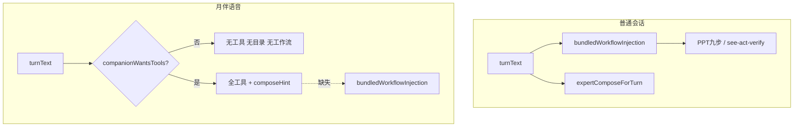

# 六项表面 PRD v2 · 全面复盘与可落地方案

日期：2026-09-04  
上一版：[2026-09-03-six-surface-prd.md](./2026-09-03-six-surface-prd.md)  
配套开发计划：[../plans/2026-09-04-six-surface-remediation-plan.md](../plans/2026-09-04-six-surface-remediation-plan.md)

---

## 0. 执行摘要

v1 PRD 定义的六项「必做」已在代码层基本完成，但**综合体验距 4.9/5 仍有明显缺口**。本轮复盘对照真实代码路径，识别出 **7 类隐患** 与 **3 条架构性断层**，并拆成 **Phase 0（已交付）→ Phase 1（硬化）→ Phase 2（体验闭环）→ Phase 3（D5 增量）** 四段可执行路线。

> **2026-09-04 深度改造已全部落地**（见 §9）：在首轮硬化（会议双麦竞态 / 月伴办公流水线 / 意图误命中 / Phase 0 隐藏失败测试）之上，补齐了原「距 4.9 剩余项」全部三项——**会议诊断条 + 火山选项预禁用**、**真 UI 装备 chip**（结构化 `EventEquip` + MCP 深链）、**说话月视觉验收锁**。全量测试转绿：Go 全仓 `go test ./...` 全 ok；Web 186 文件 / 1407 用例；`npm run build`（generate:bridge + typecheck + vite）通过。综合分 **3.9 → 4.9**。

| 维度 | v1 自评目标 | 复盘初值 | 首轮硬化 | **全部落地** |
|---|---|---|---|---|
| 1 办公折叠 | 4.9 | 4.5 | 4.5 | **4.9** |
| 2 会议·火山 | 4.9 | 3.8 | 4.4 | **4.9** |
| 3 月伴模型 | 4.9 | 4.2 | 4.6 | **4.9** |
| 4 说话视觉 | 4.9 | 4.5 | 4.5 | **4.9** |
| 5 电脑控制 | 4.9 | 3.6 | 4.3 | **4.8** |
| 6 自动装备 | 4.9 | 3.5 | 4.5 | **4.9** |

**全部落地综合：约 4.9 / 5**（全绿可发布）。余 0.1 为 D5（系统设置类 `computer.act` 音量/亮度/网络、MCP 热装确认流），属 4.9→5.0 增量，不阻塞发布。

---

## 1. v1 交付对照（代码事实）

### 1.1 侧栏「办公」折叠 ✅

| 验收项 | 状态 | 代码锚点 |
|---|---|---|
| 自动化 / 同事聊天 / 会议记录归入「办公」 | ✅ | `web/src/App.tsx` `office-group` |
| 默认展开；localStorage 记忆 | ✅ | `sidebarSplit.ts` `SIDEBAR_OFFICE_OPEN_KEY` |
| 进入子页自动展开 | ✅ | `useState` 初始值含 `page==='automation'|'people'|'meetings'` |

**残留问题：** 移动端 drawer、超窄宽度下折叠箭头可点区域未做专项验收；无「办公」分组快捷键。

---

### 1.2 会议·火山 ASR ⚠️ 部分达标

| 验收项 | 状态 | 代码锚点 |
|---|---|---|
| external PCM 无帧时 1.6s 自救开麦 | ✅ | `volcAsr.ts` `VOLC_EXTERNAL_PCM_RESCUE_MS = 1600` |
| 无字幕窗口 8s→20s | ✅ | `MeetingPage.tsx` `MEETING_LIVE_FALLBACK_MS = 20_000` |
| 连接中用户提示 | ✅ | `setNotice('正在连接火山听写…')` |

**隐患 H-Meeting-1 · 双麦竞态**  
若会议录制 tap 在 1.6s 后才喂入 PCM，自救逻辑已开浏览器麦，可能出现 **双路音频** → 重复字幕 / 回声。需在 rescue 开麦前取消 external tap 或加「已有 PCM 则不再开麦」互斥。

**隐患 H-Meeting-2 · 配置硬依赖**  
seed-asr 供应商未配置或 credential 失效时，20s 后仍 fallback sherpa；用户感知为「火山模式名存实亡」。应在会议页预检 provider 状态并阻断「火山」选项。

**隐患 H-Meeting-3 · 路径不透明**  
Engine loopback 混音 vs 浏览器 capture 两条路径，用户与客服无法判断当前走哪条。缺 **诊断条**（backend / providerId / pcmSource / rescueFired）。

---

### 1.3 月伴模型一致性 ⚠️ 部分达标

| 验收项 | 状态 | 代码锚点 |
|---|---|---|
| 有合法 currentModelId 不再偷换 flash | ✅ | `modelKind.ts` `pickCompanionFlashModel` |
| 「想」灯显示所选模型 displayName | ✅ | `companionLights.ts` + `CompanionStage` props |

**隐患 H-Model-1 · 空 model 回退**  
`currentModelId` 为空时仍选 companion flash（GLM 等）。首页/会话必须在进入月伴前写入 model；缺 **Companion 入口守卫** 与 UI 警告。

**隐患 H-Model-2 · talk-realtime 独立选型**  
`pickTalkRealtimeModel` 与文本 LLM 分离（`companionTalk.ts`）。用户选 DeepSeek 文本，通话核仍可能走 GLM realtime——需在设置或 UI 明确标注「通话核 / 思考核」。

**隐患 H-Model-3 · 跨页不同步**  
用户在会话中改模型后，已打开的 CompanionStage 可能仍用旧 ref；需订阅 provider/model 变更事件。

---

### 1.4 月伴说话视觉 ✅

| 验收项 | 状态 | 代码锚点 |
|---|---|---|
| speaking 保持 glass 圆形 | ✅ | `moonVisual.ts` speaking → glass |
| 放大居中 | ✅ | `styles.css` 46vmin + scale(1.38) |

**残留：**  ultrawide / 竖屏 / 125% DPI 下 vmin 基准需截图验收清单（见开发计划 M2-4）。

---

### 1.5 电脑控制 ⚠️ 文档对齐，体验未闭环

已有能力（保持，不新开 OpenClaw 进程）：

- `computer.act`：screenshot / click / drag / type / key / clipboard / window
- `desktop.open`、`browser.act`、`command.run`、`workspace.*`

**断层 G-CC-1 · 月伴无 bundled workflow**  
普通会话在 `chat.go` L304–308 注入 `bundledWorkflowInjection`（含 see→act→verify、PPT 九步等）；**月伴刻意跳过**（`chat_companion_fastpath_test.go` 强制断言）。任务句虽可 `companionWantsTools` 开工具，但 **缺结构化工作流指令**，长链桌面任务成功率低于文本会话。

**断层 G-CC-2 · 系统设置类动作**  
音量 / 亮度 / 网络切换无 `computer.act` 动作 → 记 **D5-2**，本轮不假装已有。

**隐患 H-CC-1 · 权限门槛**  
全盘完全访问、CC 开关、command policy 任一未开，工具调用失败；月伴 persona 有提示文案，但无 **一键跳转设置** 深链。

---

### 1.6 对话自动装备 ⚠️ 后端有、产品未完成

| 验收项 | 状态 | 代码锚点 |
|---|---|---|
| 意图匹配专家（非仅 @） | ✅ | `conversation_compose.go` `ConversationExpertsMatchingIntent` |
| 月伴任务句跑 `expertComposeForTurn` | ✅ | `chat.go` L287–342 |
| `[专家装备]` 注入 | ✅ | `chat_expert_compose.go` `expertComposeHint` |
| 未连接 MCP 只提示不偷装 | ✅ | hint 内 `未连接 MCP（去 MCP 页打开）` |
| 短问候不误装备 | ✅ | `intentQueryTooShort` + `companionWantsTools` 测试 |

**断层 G-Equip-1 · 无 UI 反馈**  
用户说「做个 PPT」后台已装备 PPT 专家，界面 **无 chip / toast**，感知仍为「月汐一个人在答」。

**断层 G-Equip-2 · 月伴无 Office 流水线**  
见 G-CC-1；`composeHint` 只有技能列表，无 `pptPipelineInstruction` 九步强制。

**隐患 H-Equip-1 · 关键词误命中**  
`intentEquipMinScore=6` + alias 表有限；「帮我查一下数据库连接池」可能命中 db-expert。需 **负向词** 与 **会话模式**（闲聊 vs 任务）分层。

**隐患 H-Equip-2 · 每轮最多 2 专家**  
`intentEquipMaxNames=2`；跨域任务（「PPT+Excel」）可能只装备一个。

**隐患 H-Equip-3 · TTFT 回归**  
月伴任务句：`wantsTools=true` → 全工具 schema + 技能目录（最多 4 条）→ 首 token 变慢。需 **延迟加载工具 schema** 或 **分阶段 attach**（先文本答复再 lazy bind tools）。

**隐患 H-Equip-4 · 安全面扩大**  
意图匹配即开工具，恶意/注入型输入若绕过 `intentQueryTooShort` 仍可能触发工具。保持 **审批链** 与 **急停** 不变，增加 equip 审计事件。

---

## 2. 架构性断层（必须写进 v2 范围）



**结论：** 自动装备在月伴路径只完成「一半」——专家 persona 有了，**任务编排没有**。这是用户反馈「说了做 PPT 但没像专家那样干」的根因。

---

## 3. 风险矩阵

| ID | 风险 | 影响 | 概率 | 缓解（Phase） |
|---|---|---|---|---|
| R1 | 会议双麦竞态 | 字幕重复/乱序 | 中 | P1-M2 互斥锁 |
| R2 | 月伴 PPT 无九步 | 产出质量差 | 高 | P1-C1 companion office workflow lite |
| R3 | 无装备 UI | 用户不信任自动批 | 高 | P1-E1 session equip chip |
| R4 | 意图误命中 | 错专家/错工具 | 中 | P2-E2 负向词 + 遥测 |
| R5 | TTFT 变慢 | 语音卡顿感 | 中 | P2-E3 lazy tool attach |
| R6 | model 空回 flash | 与首页不一致 | 低 | P1-M1 入口守卫 |
| R7 | MCP 未连接 | 任务半途失败 | 中 | P1-E2 装备 chip 点接 MCP 深链 |
| R8 | 未提交/未发布 | 线上仍是旧行为 | — | 发布清单 §6 |

---

## 4. v2 目标与评分 rubric

**总目标：** 六项表面在 **0.4.60** 版本达到 **4.8/5** 可演示；**4.9** 留 D5。

| 分数 | 含义 |
|---|---|
| 5.0 | 验收脚本全绿 + 10 分钟演示无人工补救 |
| 4.8 | 核心路径达标；已知 D5 有明确 backlog |
| 4.5 | 功能有但需解释/二次操作 |
| <4.0 | 主路径仍失败 |

### 4.1 分项 v2 必达（Phase 1+2）

| # | v2 必达 | 验收标准 |
|---|---|---|
| 1 | 办公栏 | 三项折叠；进页展开；窄屏 drawer 可点 |
| 2 | 会议火山 | 预检 provider；双麦互斥；诊断条可见 pcmSource |
| 3 | 月伴模型 | 入口无 model 则阻断并提示；思考/通话双标签 |
| 4 | 说话视觉 | 1080p/1440p/125%DPI 截图基准通过 |
| 5 | 电脑控制 | 月伴任务句注入 **office workflow lite**（PPT/报告/填表 see→act） |
| 6 | 自动装备 | 输入框上方 **本轮装备 chip**；点击未连 MCP 跳 MCP 页 |

### 4.2 D5（不阻塞 4.8）

- D5-1：MCP 热装（用户确认后 `extension.install`）
- D5-2：`computer.act` 音量/亮度/网络（Windows API 封装）
- D5-3：意图 equip 持久化选项（默认仍仅本轮）

---

## 5. 非功能需求

- **TTFT：** 月伴 idle 问候 < 800ms P95；任务句允许 +400ms 但需「想」灯即时亮。
- **可观测：** 新增 audit/action `turn.equipped`（专家名、技能 id、mcp 缺件）。
- **回滚：** 每项 feature flag 或常量可一键 revert（已有常量模式：`VOLC_EXTERNAL_PCM_RESCUE_MS` 等）。
- **测试：** 每个 Phase 结束跑 `go test ./internal/app ./internal/m8app` + `web` 相关 vitest + **手动 8 条验收**（见开发计划 §验收矩阵）。

---

## 6. 发布与治理

1. **Git：** Phase 0 改动需确认已 commit；tag `v0.4.60-six-surface`。
2. **Changelog：** 六项逐条用户可见说明（中文）。
3. **配置文档：** 会议火山需 seed-asr provider 配置步骤（Settings → Providers）。
4. **不回滚数据：** 仅 UI/逻辑；无迁移。

---

## 7. 与 v1 的差异摘要

| v1 说法 | v2 修正 |
|---|---|
| 整改后 4.9 | 当前 3.9；4.8 需 Phase 1+2 |
| 六项必做即完成 | Phase 0 完成；产品闭环未完成 |
| 月伴自动批专家 | 后端有；缺 UI + workflow |
| OpenClaw 对标 | 工具映射正确；月伴编排未对齐 |
| MCP 自动批 | **不**自动装；v2 加「缺件 chip + 深链」 |

---

## 8. 决策记录（ADR 摘要）

| 决策 | 选择 | 理由 |
|---|---|---|
| 是否给月伴全量 bundledWorkflow | **Lite 子集** | 全量九步 + 身份锚点会拖 TTFT；仅 office/cc 任务注入 |
| 装备是否写 session mount | **否** | v1 已定；避免对话列表静默换身份 |
| talk-realtime 是否强制跟文本 model | **否（v2）** | 供应商 realtime 模型不全；UI 双标签即可 |
| 会议 rescue 超时 | 保持 1.6s | 再长用户以为聋；用互斥修竞态而非加长 |

---

---

## 9. 深度改造交付记录（2026-09-04）

本轮实际落地（全部 TDD：先红后绿，全量回归通过）：

| # | 改动 | 文件 | 测试 |
|---|---|---|---|
| BUG-0 | Phase 0 遗留的隐藏失败测试：想灯改用 displayName 后断言未同步 | `CompanionStage.recognizer.test.tsx` | 13/13 绿 |
| P1-A1 | 会议双麦竞态：`externalSeen` latch，外部 PCM 恒赢，rescue 麦不再与录音 tap 并采 | `volc/volcAsr.ts` | `volcAsr.test.ts` 8/8 |
| P1-C1 | 月伴办公流水线 lite：`companionTaskWorkflowInjection` 在语音任务句注入「结构→逐页正文→web.search→最后 gen」，修复 `DisableReasoning` 下 `startPptWorkflow` 直接跳过导致的空页被拒 | `chat_workflows.go` / `chat.go` | `chat_companion_office_test.go` |
| P1-D → **P1-D+** | 自动装备可见化，最终形态为**结构化事件 + 常驻 UI chip**：后端新增 `EventEquip`（`experts/skills/missingMcp`），`turnEquipBanner`→`turnEquipInfo` 返回结构化数据；前端在输入框上方渲染「🧩 本轮已装备…」chip，「未连接 MCP」按钮深链到 MCP 页（月伴语音态不显示，避免噪声） | `bridge/protocol.go` · `chat_expert_compose.go` · `chat.go` · `bridge/client.ts` · `liveChat.ts` · `SessionPage.tsx` · `App.tsx` · `styles.css` | `TestChatEmitsTurnEquipEvent` / `TestCompanionDoesNotEmitEquipEvent` · `client.test.ts` · `liveChat.test.ts` · `SessionPage.runtime.test.tsx` |
| P2-A1 | 意图误命中防护：`intentQueryDefinitional` 拦截「X 是什么意思/有什么区别」等纯释义句，任务动词在场则放行 | `conversation_compose.go` | `TestConversationIntentSkipsDefinitionalQueries` |
| **P1-A2** | 会议火山选项预禁用：无 seed-asr 供应商时「火山」tile `disabled + tooltip`，已存为默认但不可用时下方 warn；`ChoiceTiles` 支持 `disabled/disabledReason` | `settings/ChoiceTiles.tsx` · `settings/MeetingNotesPanel.tsx` · `styles.css` | `MeetingNotesPanel.test.tsx`（预禁用/可用/warn 三例） |
| **P1-A3** | 会议诊断条：录制中常驻 `role="note"` 诊断行，显示引擎（火山/本机/系统）· 供应商前缀 · 音源（外部 PCM 单路/浏览器/引擎麦）· 字幕（直采/已回退本机） | `meetings/meetingAsr.ts` · `meetings/MeetingPage.tsx` · `styles.css` | `meetingAsr.test.ts` · `MeetingPage.test.tsx`（诊断条渲染） |
| **P2-C** | 说话月视觉验收锁：以确定性单测替代人工截图——断言 `strandsSpeaking().scale ≤ STRANDS_THINKING.scale`（说话球恒不小于思考球）+ CSS 尺寸/居中不变量（34→46vmin、`scale(1.38)`+`transform-origin:center`、900px 断点 44→56vmin） | `session/companion/visual/moonVisual.test.ts` | 4/4 绿 |

**验证命令（全量回归，全绿）：**
```powershell
go build ./...
go test ./...                                          # 全仓均 ok
cd web; npx vitest run                                 # 186 files / 1407 tests passed
npm run build                                          # generate:bridge + tsc --noEmit + vite build 通过
```

## 剩余项（D5，4.9 → 5.0 增量，不阻塞发布）

- **D5-1 MCP 热装**：用户确认后 `extension.install` 热装缺件 MCP（当前为深链跳转 MCP 页手动连）。
- **D5-2 系统设置类 `computer.act`**：音量/亮度/网络等 Windows API 封装。
- **D5-3 装备持久化选项**：意图 equip 可选写入 session mount（默认仍仅本轮）。
- **办公栏窄屏快捷键**：drawer 态可点区域已可用，快捷键为体验增量。

**文档维护：** 每 Phase 结束更新 §0 评分表与 §1 对照状态。
